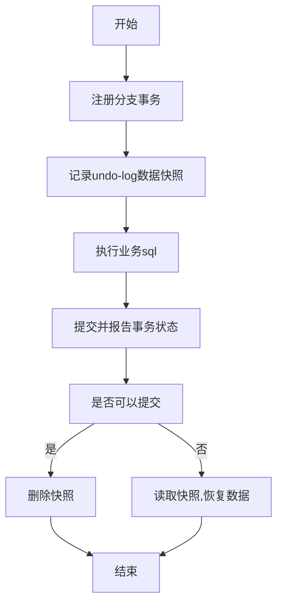
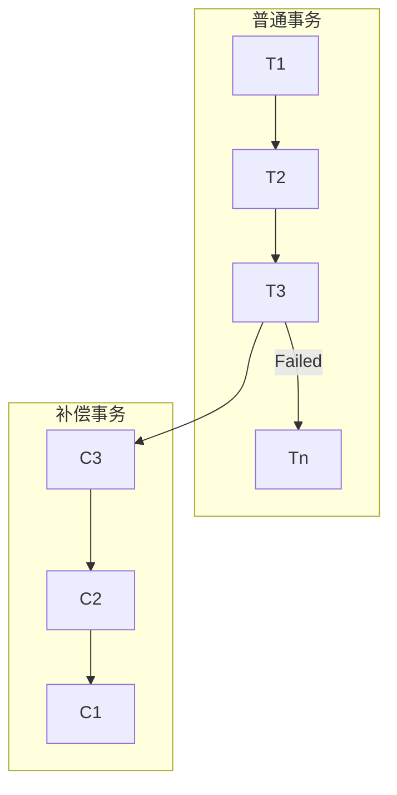

:::tip
Seata 是一款开源的分布式事务解决方案，支持 TCC、XA 和 AT 模式。<br/>
事务的ACID原则如下

| 属性     | 含义                                |
|:-------|:----------------------------------|
| 原子性  A | 事务是不可分割的最小工作单元，要么全部提交成功，要么全部失败回滚。 |
| 一致性  C | 数据库总是从一个一致性的状态转换到另一个一致性的状态。       |
| 隔离性  I | 一个事务的执行不能被其他事务干扰。                 |
| 持久性  D | 一旦事务提交，则其所做的修改就会永久保存到数据库中。        |

文中所有的代码都上传到[gitCode](https://gitcode.com/qq_42059717/seata_demo)了
:::
# 1. 分布式事务简介
> 在分布式系统下，一个业务跨越多个服务或数据源，每个服务都是一个分支事务，要保证所有分支事务最终状态一致，这样的事务就是分布式事务。

## 1. CAP原理
> CAP原理是分布式系统设计中的一个重要理论，它描述了在分布式系统中，只能同时满足一致性（Consistency）、可用性（Availability）和分区容错性（Partition Tolerance）中的两个。

| 特性     | 含义                                |
|:-------|:----------------------------------|
| 一致性  C | 分布式系统中的所有节点在同一时间具有相同的数据状态。 |
| 可用性  A | 分布式系统在面对故障时，能够继续提供服务，即系统始终可用。 |
| 分区容错性  P | 分布式系统在遇到网络分区（网络断开）时，仍然能够继续提供服务。 |

## 2. BASE理论
> BASE 理论是对CAP的一种解决思路，它认为分布式系统中，一致性和可用性是不可兼得的，因此可以通过牺牲一致性来换取可用性。

| 特性     | 含义                                |
|:-------|:----------------------------------|
| 基本可用  Basically Available | 分布式系统在出现故障时，允许损失部分可用性，保证核心可用。 |
| 软状态  Soft State | 分布式系统中的数据存在中间状态，允许数据在不同节点之间存在不一致。 |
| 最终一致性  Eventually Consistent | 分布式系统中的数据最终会达到一致状态，但中间过程可能存在延迟。 |

## 3. 如何选择CP和AP
> 分布式事务最大的问题就是各个子事务之间的一致性问题，因此可以借鉴CAP和BASE理论，通过牺牲一致性来换取可用性，从而实现分布式事务的最终一致性。

| 模式   | 含义 |
|:-----|:---|
| AP模式| 各子事务分别执行和提交，允许出现结果不一致，然后采用弥补措施恢复数据即可，实现最终一致。   |
| CP模式| 各个子事务执行后互相等待，同时提交，同时回滚，达成强一致。但事务等待过程中，处于弱可用状态，   |

# 2. Seata
## 1. 简介
> 在Seata中有三个重要的概念

| 概念                                | 含义                                |
|:----------------------------------|:----------------------------------|
| TC 事务协调器(Transaction Coordinator) | 管理全局事务的状态，协调各个分支事务的提交或回滚。 |
| TM 事务管理器(Transaction Manager)     | 管理本地事务，负责开启、提交、回滚本地事务。 |
| RM 资源管理器(Resource Manager)        | 管理分支事务的资源，负责提交、回滚分支事务。 |

> Seata提供了四种不同的分布式事务解决方案

| 模式            | 描述                       |
|:--------------|:-------------------------|
| AT模式(Seata默认） | 最终一致的分阶段事务模式，无业务侵入       |
| XA模式          | 强一致性分阶段事务，牺牲一定的可用性，无业务侵入 |
| TCC模式         | 最终一致的分阶段事务内模式，有业务侵入      |
| SAGA模式        | 长事务，有业务侵入                |

## 2. 部署TC
1. [下载 Seata的 TcServer 服务](https://seata.apache.org/zh-cn/download/seata-server)
2. 修改配置文件`seata-server\conf\application.yml`, 完整配置在 `application.example.yml`
```yaml
server:
  port: 7091

spring:
  application:
    name: seata-server

logging:
  config: classpath:logback-spring.xml
  file:
    path: ${log.home:${user.home}/logs/seata}
  extend:
    logstash-appender:
      destination: 127.0.0.1:4560
    kafka-appender:
      bootstrap-servers: 127.0.0.1:9092
      topic: logback_to_logstash

console:
  user:
    username: seata
    password: seata
seata:
  config:
    # support: nacos, consul, apollo, zk, etcd3
    type: nacos
    nacos:
      server-addr: localhost:8848
      namespace: ""
      group: SEATA_GROUP
      username: nacos
      password: nacos
      data-id: "seataTcServer.yaml"
  registry:
    # support: nacos, eureka, redis, zk, consul, etcd3, sofa
    type: nacos
    nacos:
      server-addr: localhost:8848
      namespace: ""
      group: SEATA_GROUP
      application: seata-tc-server
      username: nacos
      password: nacos
    #store:
    # support: file 、 db 、 redis 、 raft
    #mode: file
  #  server:
  #    service-port: 8091 #If not configured, the default is '${server.port} + 1000'
  security:
    secretKey: SeataSecretKey0c382ef121d778043159209298fd40bf3850a017
    tokenValidityInMilliseconds: 1800000
    csrf-ignore-urls: /metadata/v1/**
    ignore:
      urls: /,/**/*.css,/**/*.js,/**/*.html,/**/*.map,/**/*.svg,/**/*.png,/**/*.jpeg,/**/*.ico,/api/v1/auth/login,/version.json,/health,/error,/vgroup/v1/** 
```
3. 在Nacos创建配置 `seataTcServer.yaml`
```yaml
seata:
  mode: db
  db:
    datasource: druid
    db-type: mysql
    driver-class-name: com.mysql.jdbc.Driver
    url: jdbc:mysql://127.0.0.1:3306/seata?rewriteBatchedStatements=true
    user: mysql
    password: mysql
    min-conn: 10
    max-conn: 100
    global-table: global_table
    branch-table: branch_table
    lock-table: lock_table
    distributed-lock-table: distributed_lock
    vgroup-table: vgroup_table
    query-limit: 1000
    max-wait: 5000
server:
  recovery:
    committingRetryPeriod: 1000
    asyncCommittingRetryPeriod: 1000
    rollbackingRetryPeriod: 1000
    timeoutRetryPeriod: 1000
  maxCommitRetryTimeout: -1
  maxRollbackRetryTimeout: -1
  rollbackRetryTimeoutUnlockEnable: false
  undo:
    logSaveDays: 7
    logDeletePeriod: 86400000
```
4. 将`\seata-server\script\server\mysql.sql`导入到自己的数据库中
5. 启动`seata-server\bin\seata-server.bat`
6. 访问 [管理页面 http://127.0.0.1:7091](http://127.0.0.1:7091)
7. 默认账号密码 seata / seata


## 3. 微服务集成Seata
1. 引入依赖
```xml
<dependency>
    <groupId>com.alibaba.cloud</groupId>
    <artifactId>spring-cloud-starter-alibaba-seata</artifactId>
    <exclusions>
        <exclusion>
            <groupId>io.seata</groupId>
            <artifactId>seata-spring-boot-starter</artifactId>
        </exclusion>
    </exclusions>
</dependency>
<!-- 这里我之前用了一下 org.apache.seata 这个groupId的包，改了俩小时BUG -->
<dependency>
    <groupId>io.seata</groupId>
    <artifactId>seata-spring-boot-starter</artifactId>
    <version>${seata.version}</version>
</dependency>
```
2. 添加配置，<font color=red>这种公用的直接放到 shared共享的配置中即可</font>
```yaml
seata:
  registry:
    type: nacos
    nacos:
      server-addr: localhost:8848
      namespace: ""
      group: SEATA_GROUP
      # seata TC 在 nacos中的名字
      application: seata-tc-server
  # 事务组，根据这个获取 TC 服务的 cluster 名称
  tx-service-group: seata-demo
  service:
    vgroup-mapping:
      # TC 的 cluster 名称
      seata-demo: default 
```
3. 查看TC服务器日志, 出现如下信息`RM register success`表示注册成功
```text
RM register success,message:RegisterRMRequest{resourceIds='jdbc:mysql:///seata_demo', version='2.3.0', applicationId='storage-service', transactionServiceGroup='seata-demo', extraData='null'},channel:[id: 0x358177c9, L:/192.168.159.1:8091 - R:/192.168.159.1:57047],client version:2.3.0
```

## x. 错误排查
1. Caused by: java.lang.IllegalStateException: in AT mode, undo_log table not exist
> 在 AT 模式下，undo_log 表不存在。
```sql
CREATE TABLE undo_log (
  id bigint(20) NOT NULL AUTO_INCREMENT,
  branch_id bigint(20) NOT NULL,
  xid varchar(100) NOT NULL,
  context varchar(128) NOT NULL,
  rollback_info longblob NOT NULL,
  log_status int(11) NOT NULL,
  log_created datetime NOT NULL,
  log_modified datetime NOT NULL,
  ext varchar(100) DEFAULT NULL,
  PRIMARY KEY (id),
  UNIQUE KEY ux_undo_log (xid,branch_id)
) ENGINE=InnoDB AUTO_INCREMENT=1 DEFAULT CHARSET=utf8;
```
2. 出现报错也会有一个微服务提交成功，另一个微服务回滚成功的情况
> 看看依赖的`groupId`是不是用成 `org.apache.seata` 了，换成 `io.seata` 就好了
```xml
<!-- 这里我之前用了一下 org.apache.seata 这个groupId的包-->
<!-- 就这一个问题改了两小时， 最终用的事2.0.0版本的-->
<dependency>
    <groupId>io.seata</groupId>
    <artifactId>seata-spring-boot-starter</artifactId>
    <version>${seata.version}</version>
</dependency>
```

# 3. 四种模式

|      | XA              | AT                     | TCC                                 | SAGA                                                   |
|:-----|:----------------|:-----------------------|:------------------------------------|:-------------------------------------------------------|
| 一致性  | 强一致             | 弱一致                    | 弱一致                                 | 最终一致                                                   |
| 隔离性  | 完全隔离            | 给予全局锁隔离                | 基于资源预留隔离                            | 无隔离                                                    |
| 代码侵入 | 无               | 无                      | 有，需要编写三个接口                          | 有，要编写状态机和补偿业务                                          |
| 性能   | 差               | 好                      | 非常好                                 | 非常好                                                    |
| 使用场景 | 对一致性，隔离性有高要求的业务 | 给予关系型数据库的大多数分布式事务场景都可以 | 1. 对性能要求较高的事务<br/> 2. 有非关系型数据库参与的事务 | 1. 业务流程长，业务流程多 <br/> 2.  参与者包含其他公司或遗留的接口，无法提供TCC要求的接口的 | 

## 1. XA模式
### 1. 简介
> XA规范是X/Open组织定义的分布式事务处理(DTP，Distributed Transaction processing)标准，XA规范 描述了全局的TM与局部的RM之间的接口，几乎所有主流的数据库都对XA规范 提供了支持<br/>

| 优点                                                        | 缺点                                               |
|:----------------------------------------------------------|:-------------------------------------------------|
| **<font color=red>强一致性，满足ACID原则，常见数据库都支持，且没有代码侵入</font>** | 一阶段要锁定数据库资源，等待二阶段结束才能能够释放，性能较差。<br/>依赖关系型数据库实现事务 |

**当前模式下，将事务分为两个阶段**

1. 第一阶段：准备阶段
   - 事务管理器(TC)向所有资源管理器(RM)发送准备请求(prepare)，资源管理器执行本地事务，并记录本地事务的状态。
2. 第二阶段：提交或回滚阶段 
   - 如果所有资源管理器都准备成功(ready)，则事务管理器向所有资源管理器发送提交请求，资源管理器提交(Commit)本地事务。
   - 如果任何一个资源管理器准备失败(fail)，则事务管理器向所有资源管理器发送回滚请求，资源管理器回滚(Fallback)本地事务。

**成功的情况**


**需要回滚的情况**    


**Seat做出了一些调整**
- RM 一阶段
  1. 注册分支事务到TC
  2. 执行分支业务Sql但不提交
  3. 报告执行状态到TC
- TC 二阶段
  1. 检查各个分支的事务执行状态
  2. 如果都成功，则通知所有的RM提交
  3. 如果有失败，则通知所有的RM回滚
- RM 二阶段
  1. 提交或回滚本地事务
  
### 2. Seata实现XA模式
1. 修改每个微服务的配置文件
```yaml
seata:
  data-source-proxy-mode: XA
```
2. 给发起全局事务的入口方法添加 `@GlobalTransactional` 注解
```java
@GlobalTransactional
public Long create(Order order) {
    // 1. 扣减库存
    // 2. 扣减余额
    // 3. 扣减优惠券
    // 4. 创建订单
    return null;
}
```
3. 重启服务，测试
## 2. AT 模式

### 1. 简介

> AT模式同样是分阶段提交的事务模型，不过弥补了XA模型中自愿锁定周期过长的缺陷
- RM 一阶段
  1. 注册分支事务
  2. 记录undo-log数据快照
  3. 执行业务sql并提交
  4. 报告事务状态
- RM 二阶段
  1. 提交时：删除undo-log
  2. 回滚时：根据undo-log数据快照进行回滚

   


### 2. AT模式存在的脏写问题
> 假设原有数据为 `{id: 1, money: 100}`

1. 事务A 获取DB锁，保存了数据快照 `{id: 1, money: 100}`
2. 事务A 执行 `set money = 90`，提交事务。
3. 事务A 提交事务，释放DB锁。
4. 事务B 获取DB锁，读取数据 `{id: 1, money: 90}`。
5. 事务B 执行 `set money = 80`，提交事务。
6. 事务B 提交事务，释放DB锁。
7. **<font color=red>事务A 回滚事务，根据快照数据 `{id: 1, money: 100}` 回滚。</font>**

> 为了解决这个问题，所以Seata就弄出了全局锁


### 3. XA模式和AT模式的区别

| 特性 | XA模式          | AT模式          |
|:-------|:--------------|:--------------|
| 资源 | 一阶段不提交事务，锁定资源 | 一阶段直接提交，不锁定资源 |
| 机制 | 依赖数据库机制回滚     | 利用数据快照回滚      |
|一致性| 强一致性          | 最终一致性         |

AT模式的优点:
1. 一阶段完成直接提交事务，释放数据库资源，性能比较好
2. 利用全局锁实现读写隔离
3. 没有代码侵入，框架自动完成回滚和提交

AT模式的缺点:
1. 两阶段之间属于软状态，属于最终一致
2. 框架的快照功能会影响性能，但比XA模式要好很多

### 4. 实现AT模式
> AT模式的快照生成，回滚动作都是由框架自动完成的，没有任何的代码侵入。

1. AT模式涉及了两张表， 其中`undo_log`表导入到微服务关联的数据库中， `lock_table`表导入到TC的数据库中。
```sql
DROP TABLE IF EXISTS lock_table;
CREATE TABLE lock table(
  row_key varchar(128)  NOT NULL,
  xid varchar(96)  DEFAULT NULL,
  transaction_id bigint(20) DEFAULT NULL,
  branch_id bigint(20) NOT NULL, 
  resource_id varchar(256)  DEFAULT NULL,
  table_name varchar(32)  DEFAULT NULL,
  pk varchar(36)  DEFAULT NULL,
  gmt_create datetime DEFAULT NULL,
  gmt_modified datetime NULL DEFAULT NULL,
  PRIMARY KEY(row_key'USING BTREE,
  INDEX idx_branch_id(branch_id) USING BTREEENGINE
)

drop table if exists undo_log;
create table undo_log(
  branch_id bigint(20) NOT NULL comment 'branch transaction id',
  xid varchar(100) not null comment 'global transaction id',
  context varchar(128)  not null comment 'undo_log context,such as serialization',
  rollback_info longblob not null comment 'rollback info',
  log_status int(11) not null comment '0:normal status,1:defense status',
  log_created datetime not null comment 'create datetime',
  log_modified datetime not null comment 'modify datetime',
  unique index ux_undo_log(xid,branch_id) using btree
) comment =  'AT transaction mode undo table' 
```
2. 修改配置文件
```yaml
seata:
  data-source-proxy-mode: AT 
```
3. 重启服务，测试


## 3. TCC 模式

### 1. 简介
> TCC模式与AT模式类似，每个阶段都是独立事务，不同的是TCC通过人工编码来实现数据恢复，需要实现三个方法。

1. Try: 资源的检查和预留
2. Confirm: 完成资源操作业务； 要求 Try 成功 Confirm 必须成功
3. Cancel: 释放资源，Try的反向操作


| 优点                            | 缺点                                |
|:------------------------------|:----------------------------------|
| 一阶段完成直接提交事务，释放数据库资源，性能较好      | 需要手动编写代码，增加开发成本                   |
| 相比AT模式，无需生成快照，也不要用全局锁，性能更好    | 软状态，事务是最终一致的。                     |
| 不依赖数据库事务，而是依赖补偿操作，可以用于非关系型数据库 | 需要考虑 Confirm 和 Cancel失败的情况，做好幂等处理 |

### 2. TCC 实现
> 针对当前的 order account storage三个微服务，对account服务进行TCC改造。 需要实现以下的需求

1. 修改account-service，编写try、confirm、cancel逻辑
2. try业务:添加冻结金额，扣减可用金额
3. confirm业务:删除冻结金额
4. cancel业务:删除冻结金额，回滚可用金额
5. 保证Confirm 和 Cancel 方法的<font color=red>幂等性</font>
6. 允许<font color=red>空回滚</font>
7. 拒绝<font color=red>业务悬挂</font>

**空回滚**

> 当某个分支事务的try阶段阻塞时，可能导致全局事务超时而出发二阶段的Cancel操作在未执行try操作时先执行了cancel操作，
> 这时cancel不能做回滚，就是<font color=red>空回滚</font>


**业务悬挂**

> 对于已经 空回滚 的业务，如果以后继续执行 try操作， 就永远不可能 Confirm 和 Cancel ，这就是<font color=red>业务悬挂</font>,
> 所以应当阻止执行空回滚后的try 避免业务悬挂

基于此，必须在数据库记录冻结金额的时候，记录当前事务的id和执行状态。因此设计了一张表

```sql
create table account_freeze_tbl(
  xid varchar(128) not null,
  user_id varchar(255) default null comment '用户id',
  freeze_money decimal(10,2) default 0 comment '冻结金额',
  state int(1) default null comment '事务状态 0 try 1 confirm 2cancel',
  primary key (xid) using btree
)
```

### 3. 代码实现
> TCC 的 try confirm cancel都需要在接口中基于注解赖声明

- 通用范本

```java
@LocalTCC
public interface TCCService{

    /**
    * Try逻辑, @TwoPhaseBusinessAction 中的 name 要跟 当前方法名一致，用于指定try逻辑的对应方法
    */
    @TwoPhaseBusinessAction(name = "prepare", commitMethod = "confirm", rollbackMethod = "cancel")
    void prepare(@BusinessActionContextParameter(paramName = "param") String param);
    
    /**
    * Confirm逻辑
    * 而极端 confirm确认方法，跟主街上的方法名一样就行，
    * @param context 上下文参数, 用来传递 try 方法中的参数
    */
    boolean confirm(BusinessActionContext context);
    boolean cancel(BusinessActionContext context);
}
```

- 针对本项目的具体实现

```java
@Service
@Slf4j
@LocalTCC
@RequiredArgsConstructor
public class AccountTccService {
    private final AccountMapper accountMapper;
    private final AccountFreezeMapper freezeMapper;

    @TwoPhaseBusinessAction(name = "deduct", commitMethod = "confirm", rollbackMethod = "cancel")
    @Transactional
    public void deduct(@BusinessActionContextParameter(paramName = "userId") String userId,
                       @BusinessActionContextParameter(paramName = "money") BigDecimal money) {
        AccountFreeze freeze = freezeMapper.selectById(RootContext.getXID());
        if (freeze != null) {
            // 如果根据xid能够查询出来数据，则表明已经执行过CANCEL了 拒绝执行代码
            return;
        }
        // 1. 扣件可用余额
        accountMapper.deduct(userId, money);
        // 2. 记录冻结余额，事务状态
        freeze = new AccountFreeze()
                .setFreezeMoney(money)
                .setUserId(userId)
                .setState(AccountFreeze.State.TRY.ordinal())
                .setXid(RootContext.getXID())
                ;
        freezeMapper.insert(freeze);
    }

    public boolean confirm(BusinessActionContext context) {
        // 获取事务id 根据id删除冻结记录
        return freezeMapper.deleteById(context.getXid()) > 0;
    }

    public boolean cancel(BusinessActionContext context) {
        // 恢复可用余额
        String userId = context.getActionContext("userId", String.class);
        BigDecimal money = context.getActionContext("money", BigDecimal.class);
        // 空回滚判断
        AccountFreeze freeze = freezeMapper.selectById(context.getXid());
        // 冻结数据为空，则没有执行过 try
        if (freeze == null) {
            // 执行空回滚，记录 CANCEL 状态
            freeze = new AccountFreeze()
                    .setFreezeMoney(BigDecimal.ZERO)
                    .setUserId(userId)
                    .setState(AccountFreeze.State.CANCEL.ordinal())
                    .setXid(context.getXid())
            ;
            freezeMapper.insert(freeze);
            return true;
        }
        // 幂等操作， 如果已经是 CANCEL 状态，则直接返回
        if (freeze.getState() == AccountFreeze.State.CONFIRM.ordinal()) {
            return true;
        }

        accountMapper.refund(userId, money);


        freeze = new AccountFreeze()
                .setFreezeMoney(BigDecimal.ZERO)
                .setUserId(userId)
                .setState(AccountFreeze.State.CANCEL.ordinal())
                .setXid(context.getXid())
        ;
        freezeMapper.updateById(freeze);
        return true;
    }
}
```

## 4. Saga 模式
### 1. 简介
> Sage模式是Seata提供的长事务解决方案， 也氛围两个阶段

1. 直接提交本地事务（一阶段）
2. 成功则什么都不做，失败则通过补偿业务来回滚（二阶段）



| 优点                      | 缺点              |
|:------------------------|:----------------|
| 事务参与者可以基于事件驱动实现异步调用，吞吐高 | 软状态持续时间不确定，时效性差 |
| 一阶段直接提交事务，无锁，性能好        | 没有锁，没有事务隔离，会有脏写 |
| 不用编写TCC中的三个阶段，实现简单      |                 |
# 4. 高可用
> TC 服务作为Saata的核心服务，一定要保证高可用，否则会影响整个分布式事务的正常运行。就需要部署多个TC集群

## 1. 部署TC集群
1. 部署两个不同的TC，模拟多个TC集群

| node   | ip        | port | cluster |
|:-------|:----------|:-----|:--------|
| seata  | 127.0.0.1 | 8091 | SH      |
| seata2 | 127.0.0.1 | 8092 | SZ      |

2. 启动的时候指定一下端口号
```shell
seata-server.bat -p 8092
```
## 2. 将事务组映射到NACOS
1. 新增配置 `client.yaml`
```yaml
# 事务的映射关系
service:
  # 服务组映射配置，seata-demo 服务组映射到 SZ 和 SH 两个区域
  vgroupMapping:
    seata-demo: SZ,SH
  # 是否启用降级，设置为 false 表示不启用降级
  enableDegrade: false
  # 是否禁用全局事务，设置为 false 表示不禁用全局事务
  disableGlobalTransaction: false

# 与 TC 服务的通信配置
transport:
  # 传输协议类型，使用 TCP 协议
  type: TCP
  # 服务器端使用的网络模型，NIO 是非阻塞 I/O 模型
  server: NIO
  # 是否开启心跳机制，开启后客户端和服务器会定期发送心跳包以保持连接
  heartbeat: true
  # 是否允许客户端批量发送请求，设置为 false 表示不允许
  enableClientBatchSendRequest: false
  # 线程工厂配置，用于创建不同类型的线程
  threadFactory:
    # 用于创建 Netty 的 boss 线程的前缀
    bossThreadPrefix: NettyBoss
    # 用于创建 Netty 的服务器端 NIO 工作线程的前缀
    workerThreadPrefix: NettyServerNIOWorker
    # 用于创建 Netty 服务器业务处理线程的前缀
    serverExecutorThreadPrefix: NettyServerBizHandler
    # 是否共享 boss 和 worker 线程池，设置为 false 表示不共享
    shareBossWorker: false
    # 用于创建 Netty 客户端选择器线程的前缀
    clientSelectorThreadPrefix: NettyClientSelector
    # 客户端选择器线程的数量
    clientSelectorThreadSize: 1
    # 用于创建 Netty 客户端工作线程的前缀
    clientWorkerThreadPrefix: NettyClientWorkerThread
    # boss 线程的数量
    bossThreadSize: 1
    # worker 线程的数量，default 表示使用默认值
    workerThreadSize: default
  # 关闭时的等待配置
  shutdown:
    # 关闭时等待的时间，单位为秒
    wait: 3

client:
  # RM（资源管理器）配置
  rm:
    # 资源管理器向 TC 报告事务状态的重试次数
    reportRetryCount: 5
    # 锁相关配置
    lock:
      # 锁重试的间隔时间，单位为毫秒
      retryInternal: 10
      # 锁重试的最大次数
      retryTimes: 30
      # 当分支事务发生锁冲突时，是否回滚该分支事务
      retryPolicyBranchRollbackOnConflict: true
    # 异步提交缓冲区的最大容量
    asyncCommitBufferLimit: 1000
    # 是否开启表元数据检查
    tableMetaCheckEnable: false
    # 表元数据检查的间隔时间，单位为毫秒
    tableMetaCheckInterval: 60000
    # SQL 解析器的类型，使用 druid 解析器
    sqlParserType: druid
    # 是否向 TC 报告事务成功状态
    reportSuccessEnable: false
    # 是否开启 Saga 模式下的分支事务注册
    sagaBranchRegisterEnable: false
  # TM（事务管理器）配置
  tm:
    # 全局事务提交的重试次数
    commitRetryCount: 5
    # 全局事务回滚的重试次数
    rollbackRetryCount: 5
    # 全局事务的默认超时时间，单位为毫秒
    defaultGlobalTransactionTimeout: 60000
    # 是否开启降级检查
    degradeCheck: false
    # 降级检查允许的次数
    degradeCheckAllowTimes: 10
    # 降级检查的周期，单位为毫秒
    degradeCheckPeriod: 2000
  # undo 日志的配置
  undo:
    # 是否进行数据验证
    dataValidation: true
    # undo 日志的序列化方式，使用 jackson 序列化
    logSerialization: jackson
    # 是否只关注更新的列
    onlyCareUpdateColumns: true
    # undo 日志存储的表名
    logTable: undo_log
    # 压缩配置
    compress:
      # 是否开启压缩
      enable: false
      # 压缩的阈值，超过该大小的数据才会进行压缩
      threshold: 64k
      # 压缩的类型，使用 zip 压缩
      type: zip
  log:
    # 异常日志的记录比例，这里表示 100% 记录异常日志
    exceptionRate: 100
```

2. 修改微服务的配置文件，让其读取 NACOS 中的配置, 我们直接配置在 `seata-common.yaml`行了
```yaml
seata:
  config:
    type: nacos
    nacos:
      server-addr: localhost:8848
      namespace: ""
      username: nacos
      password: nacos
      group: SEATA_GROUP
      data-id: client.yaml
```
