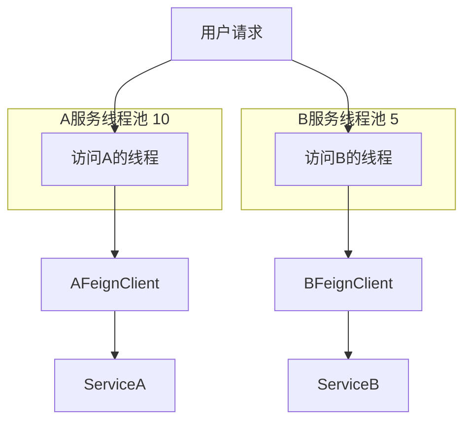
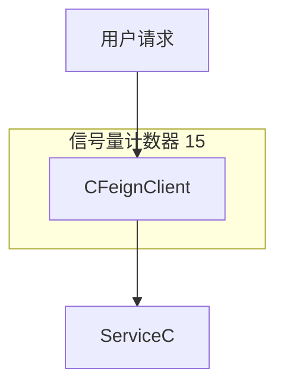

:::tip
Sentinel

| 维度      | Sentinel                          | Hystrix                      |
|---------|-----------------------------------|------------------------------|
| 隔离策略    | 信号量隔离                             | 线程池隔离/信号量隔离                  |
| 熔断策略    | 慢调用比例或异常比例                        | 失败比例                         |
| 实时指标实现  | 滑动窗口                              | 滑动窗口（基于RxJava)               |
| 规则配置    | 支持多种数据源                           | 支持多种数据源                      |
| 扩展性     | 多个扩展点                             | 插件的形式                        |
| 基于注解的支持 | 支持                                | 支持                           |
| 限流      | 基于 QPS，支持基于调用关系的限流                | 有限的支持                        |
| 流量整形    | 支持慢启动、匀速排队模式                      | 不支持                          |
| 系统自适应保护 | 支持                                | 不支持                          |
| 控制台     | 开箱即用，可配置规则、查看秒级监控、机器发现等           | 不完善                          |
| 常见框架的适配 | Servlet、Spring Cloud、Dubbo、gRPC 等 | Servlet、Spring Cloud Netflix |

:::

# 0. 简介

1. 什么是雪崩问题?

> 微服务之间相互调用，因为调用链中的一个服务故障，引起整个链路都无法访问的情况。

2. 如何避免因瞬间高并发流量而导致服务故障?

> 流量控制

3. 如何避免因服务故障引起的雪崩问题?

> 超时处理 、 线程隔离、熔断机制

## 1. 安装

> [地址](https://github.com/alibaba/Sentinel/releases)
> `使用 java -jar sentinel-dashboard-1.8.8.jar 启动`, 默认的账号密码都是sentinel

## 2. 引入依赖

1. 在想要被监控的服务中引入依赖

> 不知道是不是我写代码的问题，除了这个版本之外，其他的在dashboard都监控不了

```xml

<dependency>
    <groupId>com.alibaba.cloud</groupId>
    <artifactId>spring-cloud-starter-alibaba-sentinel</artifactId>
    <version>2.2.2.RELEASE</version>
</dependency>
```

2. 在配置文件中配置

```yaml
spring:
  cloud:
    sentinel:
      transport:
        dashboard: localhost:8080 
```

## 3. 父pom如下

```xml
<?xml version="1.0" encoding="UTF-8"?>
<project xmlns="http://maven.apache.org/POM/4.0.0"
         xmlns:xsi="http://www.w3.org/2001/XMLSchema-instance"
         xsi:schemaLocation="http://maven.apache.org/POM/4.0.0 http://maven.apache.org/xsd/maven-4.0.0.xsd">
    <modelVersion>4.0.0</modelVersion>

    <groupId>net.lesscoding</groupId>
    <artifactId>sentinel_demo</artifactId>
    <version>1.0</version>
    <modules>
        <module>user-service</module>
        <module>order-service</module>
        <module>eureka-server</module>
        <module>feign-api</module>
        <module>gateway</module>
    </modules>

    <packaging>pom</packaging>

    <parent>
        <groupId>org.springframework.boot</groupId>
        <artifactId>spring-boot-starter-parent</artifactId>
        <version>2.3.9.RELEASE</version>
        <relativePath/>
    </parent>

    <properties>
        <project.build.sourceEncoding>UTF-8</project.build.sourceEncoding>
        <project.reporting.outputEncoding>UTF-8</project.reporting.outputEncoding>
        <java.version>11</java.version>
        <spring-cloud.version>Hoxton.SR8</spring-cloud.version>
        <mysql.version>5.1.47</mysql.version>
        <mybatis.version>2.1.1</mybatis.version>
    </properties>

    <dependencyManagement>
        <dependencies>
            <!-- springCloud -->
            <dependency>
                <groupId>org.springframework.cloud</groupId>
                <artifactId>spring-cloud-dependencies</artifactId>
                <version>${spring-cloud.version}</version>
                <type>pom</type>
                <scope>import</scope>
            </dependency>
            <!--nacos的管理依赖-->
            <dependency>
                <groupId>com.alibaba.cloud</groupId>
                <artifactId>spring-cloud-alibaba-dependencies</artifactId>
                <version>2.2.5.RELEASE</version>
                <type>pom</type>
                <scope>import</scope>
            </dependency>
            <!-- mysql驱动 -->
            <dependency>
                <groupId>mysql</groupId>
                <artifactId>mysql-connector-java</artifactId>
                <version>${mysql.version}</version>
            </dependency>
            <!--mybatis-->
            <dependency>
                <groupId>org.mybatis.spring.boot</groupId>
                <artifactId>mybatis-spring-boot-starter</artifactId>
                <version>${mybatis.version}</version>
            </dependency>
        </dependencies>
    </dependencyManagement>
    <dependencies>
        <dependency>
            <groupId>org.projectlombok</groupId>
            <artifactId>lombok</artifactId>
        </dependency>
    </dependencies>
</project>
```

## x. 报错

1. 启动项目失败

```plantext
Description:

The Bean Validation API is on the classpath but no implementation could be found

Action:

Add an implementation, such as Hibernate Validator, to the classpath
```

> 因为没有指定 @Valid注解的以来项目，所以报错了，不知道为啥。引入下边的依赖就行了

```xml
 <!-- 其他依赖 -->
<dependency>
    <groupId>org.hibernate.validator</groupId>
    <artifactId>hibernate-validator</artifactId>
    <version>6.2.5.Final</version>
</dependency> 
```

# 1. 限流

## 1. 簇点链路

> 簇点链路:就是项目内的调用链路，链路中被监控的每个接口就是一个资源。默认情况下sentinel会监控SpringMVC的每一个端点(
> Endpoint)，因此SpringMVC的每一个端点(Endpoint)就是调用链路中的一个资源。
>
>   流控、熔断等都是针对簇点链路中的资源来设置的，因此我们可以点击对应资源后面的按钮来设置规则:

## 2. 流控模式

> 在 `Sentinel` 中,有三种流控模式，分别是:

### 1. 直接模式

> 统计当前资源的请求，触发阈值时对当前资源直接限流，也是默认的模式

### 2. 关联模式

> 统计与当前资源相关的另一个资源，触发阈值时，对当前资源限流
>
> 使用场景: 比如用户支付时需要修改订单状态，同时用户要查询订单。查询和修改操作会争抢数据库锁，产生竞争。

**<font color=red>配置规则: 当前这个规则是对 `/read` 接口进行限流，当`/write` 接口的请求达到阈值时，对 `/read`
接口限流。</font>**

|  维度  |   值    |
|:----:|:------:|
| 资源名  | /read  |
| 流控模式 |   关联   |
| 关联资源 | /write |
| 流控效果 |  快速失败  |

**当满足下列条件时，可以考虑使用关联模式**

1. 两个资源争抢同一个资源，
2. 一个优先级较高，一个优先级较低。

此时优先级高的触发阈值之后，对优先级低的进行限流。

### 3. 链路模式

> 统计从指定链路访问到本资源的请求，触发阈值时，对指定链路限流

下例中 创建了两个接口分别为 `order/query` 和 `order/save`, 两个接口都会调用 `orderService.queryOrder()` 方法，
<font color=red>但是因为 Sentinel 只会监听 Controller的请求，</font>
因此 OrderService.queryOrder() 方法不会被监控。所以需要给需要监控的方法添加 `@SentinelResource` 注解。

1. 创建`OrderController`代码

```java
@RestController
@RequestMapping("/order")
public class OrderController {

    @Autowired
    private OrderService orderService;

    @GetMapping("/query")
    public Result queryOrder() {
        orderService.queryOrder();
        System.out.println("查询订单");
        return Result.success("查询订单成功");
    }

    @GetMapping("/save")
    public Result saveOrder() {
        orderService.queryOrder();
        System.out.println("保存订单");
        return Result.success("保存订单成功");
    }
}
```

2. 创建`OrderService`代码

```java
@Service
public class OrderService {
    public void queryOrder() {
        System.out.println("查询订单");
    }
}
```

3. 修改配置文件

> <font color=red> Sentinel默认会将Controller方法做context整合，导致链路模式的流控失效，需要修改application.yml，添加配置</font>

```yaml
spring:
  cloud:
    sentinel:
      web-context-unify: false
```

### 4. 流控效果

> 流控效果: 当触发阈值时，对资源的处理方式

|   效果    |                             描述                             |
|:-------:|:----------------------------------------------------------:|
|  快速失败   |        达到阈值后，新的请求会被立即拒绝并抛出FlowException异常。是默认的处理方式         |
| Warm Up | 预热模式，对超出阈值的请求同样是拒绝并抛出异常。<br/>但这种模式阈值会动态变化，从一个较小值逐渐增加到最大阈值。 |
|  排队等待   |              让所有的请求按照先后次序排队执行，两个请求的间隔不能小于指定时长              |

**Warm Up**

warm up也叫预热模式，是应对服务冷启动的一种方案。
请求阈值初始值是threshold/coldFactor，持续指定时长后，逐渐提高到threshold值。而coldFactor的默认值是3.

例如，我设置QPs的threshold为10，预热时间为5秒，那么初始闽值就是 10/3，也就是3，然后在5秒后逐渐增长到10

**排队等待**

当请求超过QPS阈值时，快速失败和warmup会拒绝新的请求并抛出异常。
而排队等待则是让所有请求进入一个队列中然后按照阈值允许的时间间隔依次执行。
后来的请求必须等待前面执行完成，如果请求预期的等待时间超出最大时长则会被拒绝。

> 不管请求有多大，每秒钟放过的请求数都是固定的。

### 5. 热点参数限流

> 热点参数限流: 针对某个资源的某个参数进行限流，例如针对 `/goods/{id}` 这个资源的 `id` 参数进行限流。
>
> 从左侧的菜单中选择 `热点参数限流` ，然后点击 `添加` 按钮，添加规则。这个比较全面
>
> **<font color=red>需要注意的是，热点参数限流对于默认的SpringMvc资源无效，需要使用@SentinelResource标注才行</font>**

```java
@GetMapping("/goods/{id}")
@SentinelResource("hotGoods")
public Result getGoods(@PathVariable("id") Long id) {
    return Result.success(id);
}
```

# 2. 隔离和降级

## 1. Feign整合Sentinel


> 虽然限流可以尽量避免因高并发而引起的服务故障，但服务还会因为其它原因而故障。而要将这些故障控制在一定范围避免雪崩，就要靠线程隔离(舱壁模式)和熔断降级手段了。
>
> 不管是线程隔离还是熔断降级，都是对客户端(调用方)的保护。在SpringCloud中，微服务的调用都是通过Feign来实现的，因此客户端保护**<font color=blue>必须要整合Feign和Sentinel</font>**


1. 修改Feign的配置

```yml
feign:
  sentinel:
    enabled: true 
```

2. 给FeignClient编写失败后的降级逻辑
   - FallbackClass: 无法对远程调用的异常处理
   - FallbackFactory: 可以对远程调用的异常处理

> UserClientFallbackFactory 实现了 FallbackFactory 接口，并重写了 create 方法。

``` java
@Slf4j
@Component
public class UserClientFallbackFactory implements FallbackFactory<UserClient> {
    @Override
    public UserClient create(Throwable throwable) {
        return new UserClient() {
            @Override
            public Result<User> getUserById(Long id) {
                log.error("调用用户服务失败", throwable);
                return Result.success(new User());
            }
        };
    }
}
```

> UserClient 接口定义了 getUserById 方法，用于根据用户ID获取用户信息。

```java
@FeignClient(name = "userService",url = "http://localhost:8081", fallbackFactory = UserClientFallbackFactory.class)
public interface UserClient {

    @GetMapping("/user/{id}")
    Result<User> getUserById(@PathVariable Long id);
}
```

> OrderApp 类是一个Spring Boot应用程序的入口点，它使用 @EnableDiscoveryClient 注解启用服务发现功能。

```java
@SpringBootApplication
@EnableFeignClients(clients = { UserClient.class })
@ComponentScan(basePackages = { "net.lesscoding.order", "net.lesscoding.feign" })
public class OrderServiceApp {
    public static void main(String[] args) {
        SpringApplication.run(OrderServiceApp.class, args);
    }
}
```

## 2. 线程隔离

| 方式                     | 优点                          | 缺点                              | 适用场景         |
| ------------------------ | ----------------------------- | --------------------------------- | ---------------- |
| 信号量隔离(Sentinel默认) | 轻量级，无额外开销            | 不支持主动超时<br/>不支持异步调用 | 高频调用，高扇出 |
| 线程池隔离               | 支持主动超时<br/>支持异步调用 | 线程的额外开销较大                | 低扇出           |

### 1. 线程池隔离



### 2. 信号量隔离



