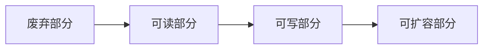
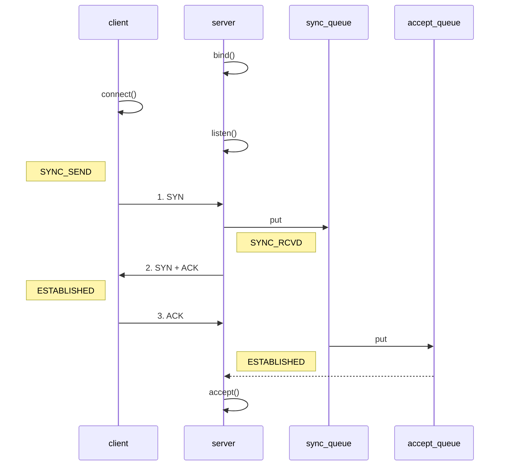

# 1. 概述

> [当前进度 130/157](https://www.bilibili.com/video/BV1py4y1E7oA?vd_source=d9d3eb78433e98d94cd75ddf5ac0382b&spm_id_from=333.788.player.switch&p=130)
>
> Netty是一个异步的，基于事件驱动的网络应用框架，用于速开发可维护、高性能的网络服务器和客户端。

## 1. 实现客户端

> 首先需要添加maven依赖
>
> ```xml
> <dependency>
>  <groupId>io.netty</groupId>
>  <artifactId>netty-all</artifactId>
>  <version>4.1.96.Final</version>
> </dependency>
> ```
>
> 使用`CountDownLatch`来实现阻塞等待。在服务启动后，主线程会等待，直到`latch`的计数器减为 0。这样可以确保服务有足够的时间运行并接受连接。
>
> <font color=red>如果用的是 main 方法 就不用这么操作了。</font>

> 
>
> - 把 `channel` 理解为数据的通道
> - 把 `msg` 理解为流动的数据，最开始输入是 `ByteBuf`，但经过 `pipeline(流水线)` 的加工，会变成其它类型对象，最后输出又变成 `ByteBuf`
> - 把 `handler` 理解为数据的处理工序
>
>   - 工席有多道，合在一起就是` pipeline`，`pipeline` 负责发布事件(读、读取完成..)传播`handler`， `handler`对自己感兴趣的事件进行处理(重写了相应事件处理方法)
>
>   - `handler` 分 `Inbound` 和 `Outbound` 两类
> - 把 `eventLoop` 理解为处理数据的工人
>     - 工人可以管理多个 `channel` 的 IO 操作，并且一旦工人负责了某个 `channel`，就要负责到底(绑定)。
>     - 工人既可以执行 IO 操作，也可以进行任务处理，每位工人有任务队列，队列里可以堆放多个channel 的待处理任务，任务分为普通任务、定时任务
>     -  工人按照 pipeline 顺序，依次按照 handler 的规划(代码)处理数据，可以为每道工序指定不同的工人

```java
@Slf4j
public class ServerTest {

    @Test
    public void simpleServerTest() throws InterruptedException {
        CountDownLatch latch = new CountDownLatch(1);
        // 1. 启动器，负责组装netty组件，启动服务
        new ServerBootstrap()
                // 2. 添加事件循环组   BossEventLoop, WorkerEventLoop(selector, thread)
                .group(new NioEventLoopGroup())
                // 3. 选择服务器的ServerSocketChannel的实现类
                .channel(NioServerSocketChannel.class)
                // 4. boss处理链接请求 worker处理读写操作,
                // 4.1 ChannelInitializer 是一个特殊的handler，用于初始化channel 添加别的handler
                .childHandler(new ChannelInitializer<NioSocketChannel>() {
                    @Override
                    protected void initChannel(NioSocketChannel channel) throws Exception {
                        channel.pipeline()
                                // 将 ByteBuf 转换成字符串
                                .addLast(new StringDecoder())
                                // 自定义handler, 处理业务逻辑
                                .addLast(new ChannelInboundHandlerAdapter() {
                                    @Override
                                    public void channelRead(ChannelHandlerContext ctx, Object msg) throws Exception {
                                        log.debug("channel Read : {}", msg);
                                        super.channelRead(ctx, msg);
                                    }
                                })
                        ;
                    }
                })
                // 5. 绑定端口
                .bind(8080)
                .sync()
        ;
        latch.await();
    }
}
```

## 2. 实现客户端

```java
@Slf4j
public class ClientTest {

    @Test
    public void simpleClientTest() throws InterruptedException {
        CountDownLatch latch = new CountDownLatch(1);
        // 1. 启动器，负责组装netty组件，启动服务
        new Bootstrap()
                // 2. 添加事件循环组   BossEventLoop, WorkerEventLoop(selector, thread)
                .group(new NioEventLoopGroup())
                // 3. 选择服务器的ServerSocketChannel的实现类
                .channel(NioSocketChannel.class)
                // 4. 添加处理器
                .handler(new ChannelInitializer<NioSocketChannel>() {
                    // 5. 在连接建立后被调用
                    @Override
                    protected void initChannel(NioSocketChannel channel) throws Exception {
                        channel.pipeline()
                                .addLast(new StringEncoder());
                    }
                })
                // 6. 连接服务器
                .connect(new InetSocketAddress("localhost", 8080))
                // 7. 阻塞等待连接建立
                .sync()
                // 8. 获取channel
                .channel()
                // 9. 向服务器发送数据
                .writeAndFlush("hello, chat")
        ;
        latch.await();
    }

}
```

# 2. 组件

## 1. EventLoop

### 1. 简介

**事件循环对象**

`EventLoop` 本质是一个单线程执行器(同时维护了一个`Selector`)，里面有 `run` 方法处理 `Channel` 上源源不断的IO 事件。
	它的继承关系比较复杂

- 一条线是继承自`j.u.c.ScheduledExecutorService` 因此包含了线程池中所有的方法。

- 另一条线是继承自 `netty`自己的 `OrderedEventExecutor`
  - 提供了 `boolean inEventLoop(Thread thread)`方法判断一个线程是否属于此 `EventLoop`。
  - 提供了 `parent`方法来看看自己属于哪个 `EventLoopGroup`
  

**时间循环组**

`EventLoopGroup`是一组 `EventLoop`，`Channel` 一股会调用 `EventLoopGroup`的`register` 方法来绑定其中一个`EventLoop`，后续这个 `Channel` 上的 IO 事件都由此 `EventLoop` 来处理(保证了 IO 事件处理时的线程全)

继承自 `netty` 自己的 `EventExecutorGroup`

- 实现了 `lterable` 接口提供遍历 `EventLoop` 的能力
- 另有 `next` 方法获取集合中下一个 `EventLoop `

### 2. 代码示例

```java
@Test
public void eventLoopTest() throws InterruptedException {
    // 1. 创建EventLoopGroup IO事件，普通任务和定时任务
    EventLoopGroup group = new NioEventLoopGroup(2);
    // 默认的是EventLoopGroup
    //EventLoopGroup defaultGroup = new DefaultEventLoopGroup();
    // 2. 获取下一个EventLoop
    System.out.println(group.next());
    System.out.println(group.next());
    System.out.println(group.next());

    // 普通任务
    group.next().submit(() -> log.info("Sub Thread run"));
    // 定时任务 一秒后执行
    group.next().scheduleAtFixedRate(() -> log.info(" Schedule Sub Thread run"), 0, 1, TimeUnit.SECONDS);
    log.info("Main Thread run ");
    CountDownLatch countDownLatch = new CountDownLatch(1);
    countDownLatch.await();
}
```

- 细分时间组，bossGroup只处理accept workerGroup只处理SocketChannel读写，耗时长的channel使用单独的group处理

```java
@Slf4j
public class EventLoopServerTest {
    /**
     * 事件循环组服务端测试
     *
     * 1. 在添加 group 的时候 细分 两个 EventLoopGroup
     *        bossGroup 只负责 Accept
     *        workerGroup 只负责 SocketChannel 的读写
     * 2. 如果有某些操作耗时眼中，可以再细分一个 专门负责耗时操作的 DefaultEventLoop
     *      在last方法指定这个耗时长的group执行， 这样可以避免耗时操作阻塞整个线程组
     *      通过 ctx.fireChannelRead 方法 可以将数据传递给下一个handler处理
     *
     * @param args
     * @throws InterruptedException
     */
    public static void main(String[] args) throws InterruptedException {
        // 1. 创建EventLoopGroup
        EventLoopGroup bossGroup = new NioEventLoopGroup();
        EventLoopGroup workerGroup = new NioEventLoopGroup();
        EventLoopGroup slowlyGroup = new DefaultEventLoopGroup();
        new ServerBootstrap()
                // bossGroup只负责Accept , workerGroup(默认CPU核心数*2)只负责SocketChannel的读写
                .group(bossGroup, workerGroup)
                .channel(NioServerSocketChannel.class)
                .childHandler(new ChannelInitializer<NioSocketChannel>() {
                    @Override
                    protected void initChannel(NioSocketChannel channel) throws Exception {
                        channel.pipeline()
                                .addLast("WorkerGroup",new ChannelInboundHandlerAdapter() {
                                    @Override
                                    public void channelRead(ChannelHandlerContext ctx, Object msg) throws Exception {
                                        ByteBuf byteBuf = (ByteBuf) msg;
                                        log.debug("{}",byteBuf.toString(StandardCharsets.UTF_8));
                                        super.channelRead(ctx, msg);
                                        ctx.fireChannelRead(msg);
                                    }
                                })
                                .addLast(slowlyGroup, "SlowlyGroup", new ChannelInboundHandlerAdapter() {
                                    @Override
                                    public void channelRead(ChannelHandlerContext ctx, Object msg) throws Exception {
                                        log.debug("耗时操作");
                                        ByteBuf byteBuf = (ByteBuf) msg;
                                        log.debug("Slowly Group : {}",byteBuf.toString(StandardCharsets.UTF_8));
                                        super.channelRead(ctx, msg);
                                    }
                                });
                    }
                })
                .bind(1024)
        ;
        //new CountDownLatch(1).await();
    }
}
```

### 3. handler执行过程中切换Worker

> 关键代码 `io.netty.channel.AbstractChannelHandlerContext#invokeChannelRead()`

```java
static void invokeChannelRead(final AbstractChannelHandlerContext next, Object msg) {
    final Object m = next.pipeline.touch(ObjectUtil.checkNotNull(msg, "msg"), next);
    // 下一个handler的事件循环是否与当前事件循环是同一个线程
    EventExecutor executor = next.executor();
    // 是的话直接调用
    if (executor.inEventLoop()) {
        next.invokeChannelRead(m);
    } else {
        // 不是 将要执行的代码作为任务提交给下一个事件循环处理
        executor.execute(new Runnable() {
            public void run() {
                next.invokeChannelRead(m);
            }
        });
    }

}
```

## 2. channel

### 1.  常用方法

| 方法名            | 作用                                                         |
| ----------------- | ------------------------------------------------------------ |
| `close()`         | 关闭`channel`                                                |
| `closeFutuer()`   | 处理`channel`的关闭 <br>`sync`方法同步等待`channel`关闭<br>`addListener`是一步等待关闭 |
| `pipeline()`      | 添加处理器                                                   |
| `write()`         | 写入数据                                                     |
| `writeAndFlush()` | 写入并刷出                                                   |

```java
@Test
public void listenerTest() {
    NioEventLoopGroup group = new NioEventLoopGroup();
    ChannelFuture channelFuture = new Bootstrap()
            // 2. 添加事件循环组   BossEventLoop, WorkerEventLoop(selector, thread)
            .group(group)
            // 3. 选择服务器的ServerSocketChannel的实现类
            .channel(NioSocketChannel.class)
            // 4. 添加处理器
            .handler(new ChannelInitializer<NioSocketChannel>() {
                // 5. 在连接建立后被调用
                @Override
                protected void initChannel(NioSocketChannel channel) throws Exception {
                    channel.pipeline()
                            .addLast(new StringEncoder());
                }
            })
            // 6. 连接服务器
            /**
             * 异步非阻塞， main发起调用， 真正执行 connect 的是 nio 线程
             * 连接后返回 ChannelFuture， 
             * 可以使用 sync() 阻塞线程获取channel 
             * 或者添加监听器， 连接建立后执行回调方法
             */
            .connect(new InetSocketAddress("localhost", 1024));
    // 添加监听器，实现方法里的ChannelFuture就是调用的这个channelFuture
    channelFuture.addListener(new ChannelFutureListener() {
        @Override
        public void operationComplete(ChannelFuture future) throws Exception {
            Channel channel = future.channel();
            channel.writeAndFlush("hello, chat!看看支不支持中文啊");
        }
    });
    // 使用lambda的简化写法
    channelFuture.addListener((ChannelFutureListener) future -> {
        Channel channel = future.channel();
        channel.writeAndFlush("hello, chat!看看支不支持中文啊");
    });
}
```

### 2. 关闭ChannelFutuer

1. 使用sync同步关闭

```java
Channel channel = channelFuture.sync().channel();
ChannelFuture closeFuture = channel.closeFuture();
log.info("waiting close....");
closeFuture.sync();
log.info("后续处理");
```

2. 添加监听器关闭

```java
closeFuture.addListener(new ChannelFutureListener() {
    @Override
    public void operationComplete(ChannelFuture future) throws Exception {
        log.info("关闭后续处理");
        // 关闭channel之后关闭主线程，会在处理完所有请求之后才关闭主线程
        group.shutdownGracefully();
    }
});
// lambda操作
closeFuture.addListener((ChannelFutureListener) future -> log.info("关闭后执行"));
```

## 3.  Future 和 Promise

> 在一步处理的时候，经常需要使用这两个接口。
>
> Netty中的 Future 继承自 jdk 的  Future ，Promise对Future做了增强

**三种接口描述**

| 接口    | 来源  | 描述                                                         |
| ------- | ----- | ------------------------------------------------------------ |
| Future  | jdk   | 只能同步等待任务结束，成功或者失败之后才能得到结果           |
| Future  | netty | 可以同步等待任务结束拿到结果，也可以通过异步拿到，但是都要等任务结束 |
| Promise | netty | 不仅有 netty Future 的功能，而且脱离了任务独立存在，只作为两个线程间传递结果的容器 |

**部分方法描述**

| 方法             | `jdk Future`                   | `netty Future`                                              | `netty Promise` |
| ---------------- | ------------------------------ | ----------------------------------------------------------- | --------------- |
| `cancel()`       | 取消任务                       | -                                                           | -               |
| `isCancel()`     | 任务是否取消                   | -                                                           | -               |
| `isDone()`       | 任务是否完成，不能区分成功失败 | -                                                           | -               |
| `get()`          | 获取任务结果，阻塞等待         | -                                                           | -               |
| `getNow()`       | -                              | 获取任务结果，非阻塞，没有结果返回null                      | -               |
| `await()`        | -                              | 等待任务结束，失败不会抛出异常，而是通过`isSuccess()`来判断 | -               |
| `sync()`         | -                              | 等待任务结束，失败抛出异常                                  | -               |
| `isSuccess()`    | -                              | 是否执行成功                                                | -               |
| `cause()`        | -                              | 获取失败信息非阻塞，没有失败则返回null                      | -               |
| `addListener(0)` | -                              | 添加回调异步接受结果                                        | -               |
| `setSuccess()`   | -                              | -                                                           | 设置成功结果    |
| `setFailure()`   | -                              | -                                                           | 设置失败结果    |

1. JDK FUTURE

```java
@Slf4j
public class JDKFutureTest {
    @Test
    public void futureTest() throws Exception {
        ExecutorService service = Executors.newFixedThreadPool(2);
        Future<Integer> future = service.submit(() -> {
            log.info("开始执行");
            Thread.sleep(1000);
            return new Random().nextInt(100);
        });
        log.info("等待执行结果");
        log.info("执行结果 {}", future.get() );
    }
}
```

2. Netty Future

```java
@Slf4j
public class NettyFutureTest {

    public static void main(String[] args) {
        NioEventLoopGroup group = new NioEventLoopGroup();
        EventLoop eventLoop = group.next();
        Future<Integer> future = eventLoop.submit(() -> {
            log.info("执行任务");
            Thread.sleep(1000);
            return new Random().nextInt();
        });
        //log.info("当前结果 {}", future.getNow());
        //log.info("等待结果");
        //log.info("结果是：{}", future.get());

        future.addListener(new GenericFutureListener<Future<? super Integer>>() {
            @Override
            public void operationComplete(Future<? super Integer> future) throws Exception {
                log.info("接受结果 {}", future.getNow());
            }
        });
    }
}
```

3. Netty Promise

```java
@Slf4j
public class NettyPromiseTest {
    public static void main(String[] args) throws ExecutionException, InterruptedException {
        // 1. 准备 eventLoop 对象
        NioEventLoopGroup group = new NioEventLoopGroup();
        EventLoop eventLoop = group.next();
        // 2. 主动创建 Promise 对象
        DefaultPromise<Integer> promise = new DefaultPromise<>(eventLoop);

        new Thread(() -> {
            try {
                Thread.sleep(1000);
            } catch (InterruptedException e) {
                throw new RuntimeException(e);
            }
            int result = new Random().nextInt();
            log.info("随机生成结果: {}", result);
            if (result % 2 == 0) {
                promise.setSuccess(result);
            } else {
                // 如果出现异常了，也要即时设置错误
                promise.setFailure(new RuntimeException("计算失败"));
            }
        }).start();

        log.info("等待结果");
        log.info("结果是 {}", promise.get());

    }
}
```

## 4. Handler 和 Pipeline

> ChannelHandler 用来处理 Channel 上的各种事件，分为入站、出站两种。所有 `ChannelHandler` 被连成一串就是 Pipeline
>
> 入站处理器通常是 `ChannelinboundHandlerAdapter` 的子类，主要用来读取客户端数据，写回结果出站处理器通常是 `ChannelOutboundHandlerAdapter` 的子类，主要对写回结果进行加工打个比喻，每个 Channel 是一个产品的加工车间，Pipeline 是车间中的流水线，`ChannelHandler` 就是流水线上的各道工序，而后面要讲的 `ByteBuf`是原材料，经过很多工序的加工:先经过一道道入站工序，再经过一道道出站工序最终变成产品。


> 入栈的时候从前往后执行，`h1 --> h2 --> h3`
>
> 但是调用`channel.writeAndFlush()`方法会跳转到`tail`，然后从后往前找出栈的 `h5 --> h4`
>
> <font color=red>调用`ctx.writeAndFlush`也能写出数据，但是会从当前位置往前找出栈的处理器</font>，具体操作可以把h3的`channel.writeAndFlush`换成`ctx.writeAndFlush`，想要看有h4打印数据，则需要将h4添加在H3的前边。

```java
@Slf4j
public class PipelineTest {
    public static void main(String[] args) throws InterruptedException {
        new ServerBootstrap()
                .group(new NioEventLoopGroup())
                .channel(NioServerSocketChannel.class)
                .childHandler(new ChannelInitializer<NioSocketChannel>() {
                    @Override
                    protected void initChannel(NioSocketChannel channel) throws Exception {
                        ChannelPipeline pipeline = channel.pipeline();
                        pipeline.addLast(new StringDecoder());
                        pipeline.addLast("h1", new ChannelInboundHandlerAdapter() {
                            @Override
                            public void channelRead(ChannelHandlerContext ctx, Object msg) throws Exception {
                                log.info("--------------h1 msg : {}--------------", msg);
                                super.channelRead(ctx, msg);
                            }
                        });
                        pipeline.addLast("h2", new ChannelInboundHandlerAdapter() {
                            @Override
                            public void channelRead(ChannelHandlerContext ctx, Object msg) throws Exception {
                                log.info("--------------h2 msg : {}--------------", msg);
                                super.channelRead(ctx, msg);
                            }
                        });

                        pipeline.addLast("h3", new ChannelInboundHandlerAdapter() {
                            @Override
                            public void channelRead(ChannelHandlerContext ctx, Object msg) throws Exception {
                                log.info("--------------h3 msg : {}--------------", msg);
                                channel.writeAndFlush("Hello, World!");
                                super.channelRead(ctx, msg);
                            }
                        });
                        pipeline.addLast("h4", new ChannelOutboundHandlerAdapter() {
                            @Override
                            public void write(ChannelHandlerContext ctx, Object msg, ChannelPromise promise) throws Exception {
                                log.info("----------------h4 : msg {}", msg);
                                super.write(ctx, msg, promise);
                            }
                        });
                        pipeline.addLast("h5", new ChannelOutboundHandlerAdapter() {
                            @Override
                            public void write(ChannelHandlerContext ctx, Object msg, ChannelPromise promise) throws Exception {
                                log.info("----------------h5 : msg {}", msg);
                                super.write(ctx, msg, promise);
                            }
                        });
                    }
                })
                .bind(Const.PORT);
    }
}
```

## 5. EmbeddedChannel

> 专门用来测试的Channel，不用频繁的启动服务端和客户端了

```java
@Slf4j
public class EmbeddedChannelTest {
    public static void main(String[] args) {
        ChannelInboundHandlerAdapter h1 = new ChannelInboundHandlerAdapter() {
            @Override
            public void channelRead(ChannelHandlerContext ctx, Object msg) throws Exception {
                log.info("h1");
                super.channelRead(ctx, msg);
            }
        };
        ChannelInboundHandlerAdapter h2 = new ChannelInboundHandlerAdapter() {
            @Override
            public void channelRead(ChannelHandlerContext ctx, Object msg) throws Exception {
                log.info("h2");
                super.channelRead(ctx, msg);
            }
        };
        ChannelOutboundHandlerAdapter h3 = new ChannelOutboundHandlerAdapter() {
            @Override
            public void write(ChannelHandlerContext ctx, Object msg, ChannelPromise promise) throws Exception {
                log.info("h3");
                super.write(ctx, msg, promise);
            }
        };
        ChannelOutboundHandlerAdapter h4 = new ChannelOutboundHandlerAdapter() {
            @Override
            public void write(ChannelHandlerContext ctx, Object msg, ChannelPromise promise) throws Exception {
                log.info("h4");
                super.write(ctx, msg, promise);
            }
        };
        EmbeddedChannel channel = new EmbeddedChannel(h1, h2, h3, h4);
        // 模拟入栈
        channel.writeInbound(ByteBufAllocator.DEFAULT.buffer().writeBytes("HelloWorld".getBytes()));
        // 模拟出栈
        channel.writeOutbound(ByteBufAllocator.DEFAULT.buffer().writeBytes("HelloWorld".getBytes()));
    }
}
```

## 6. ByteBuf

> 使用`ByteBuf`的优势有
>
> - 池化，可以重用池中的 `ByteBuf`实例，更节约内存，减少内存溢出的可能
> - 读写指针分离，不需要像`ByteBuffer`一样切换读写模式
> - 可以自动扩容。
> - 支持链式调用，使用更流畅
> - 使用零拷贝，如 `slice` `duplicate` `compositeByteBuf`等

### 1. 创建

```java
import static io.netty.buffer.ByteBufUtil.appendPrettyHexDump;
import static io.netty.util.internal.StringUtil.NEWLINE;

@Slf4j
public class ByteBufTest {
    @Test
    public void byteBufTest() {
        // 1. 创建一个ByteBuf
        ByteBuf buffer = ByteBufAllocator.DEFAULT.buffer();
        printBuf(buffer);
        int capacity = 100;
        StringBuilder stringBuilder = new StringBuilder(capacity);
        for (int i = 0; i < capacity; i++) {
            stringBuilder.append("0" + i);
        }
        buffer.writeBytes(stringBuilder.toString().getBytes());
        printBuf(buffer);
    }

    /**
     * 使用 netty工具类打印 ByteBuf 内容
     * @param byteBuf     ByteBuf
     */
    private static void printBuf(ByteBuf byteBuf) {
        int length = byteBuf.readableBytes();
        int rows = length / 16 + (length % 15 == 0? 0 : 1) + 4;
        StringBuilder sb = new StringBuilder(rows * 80 * 2)
                .append("read index: ").append(byteBuf.readerIndex())
                .append("write index: ").append(byteBuf.writerIndex())
                .append("capacity:").append(byteBuf.capacity())
                .append(NEWLINE);
        appendPrettyHexDump(sb, byteBuf);
        System.out.println(sb);
    }
}
```

### 2. 直接内存和堆内存

可以使用下面的代码来创建池化基于堆的 ByteBuf

```java
ByteBuf buffer = ByteBufA1locator .DEFAULT.heapBuffer(10);
```

也可以使用下面的代码来创建池化基于直接内存的 ByteBuf

```java
ByteBuf buffer = ByteBufA1locator.DEFAULT.directBuffer(10);。
```

- 直接内存创建和销毁的代价昂贵，但读写性能高(少一次内存复制)，适合配合池化功能一起用
- 直接内存对 GC压力小，因为这部分内存不受 JVM 垃圾回收的管理，但也要注意及时主动释放

### 3. 池化和非池化

池化的最大意义在于可以重用 `ByteBuf`，优点有下列几点

- 没有池化，则每次都得创建新的 `ByteBuf`实例，这个操作对直接内存代价昂贵，就算是堆内存，也会增加 GC压力

- 有了池化，则可以重用池中 `ByteBuf`实例，并且采用了与`jemalloc` 类似的内存分配算法提升分配效率。

- 高并发时，池化功能更节约内存，减少内存溢出的可能

**池化功能是否开启，可以通过下面的系统环境变量来设置**

```shell
-Dio.netty.allocator.type={unpooled|pooled}
```

- 4.1以后，非android平台默认启用池化实现，android启用非池化实现
- 4.1之前，池化功能不成熟，默认非池化

### 4. 组成

> 相较于NIO的Buffer来说，不用来回使用`flip()`方法切换读写模式，而且可以自动扩容。

| 属性        | 说明                                                        |
| ----------- | ----------------------------------------------------------- |
| 读指针      | 读指针之前的就是已经读过的，废弃部分                        |
| 写指针      | 读写中间的是可读部分                                        |
| capacity    | 容量，和写指针中间的是可写部分                              |
| maxCapacity | 最大容量，默认Integer最大值<br>两者之间的差距就是可扩容容量 |



### 5. 写入

| 方法                                                     | 含义                | 备注                                            |
| -------------------------------------------------------- | ------------------- | ----------------------------------------------- |
| writeBoolean                                             | 写入boolean值       | 0 false 1true                                   |
| writeByte                                                | 写入byte            |                                                 |
| writeShort                                               |                     |                                                 |
| writeInt                                                 | 写入int             | Big Endian即0x250 <br>写入后 00 00 02 50        |
| writeIntLE                                               | 写入int             | Little Endian <br>写入后50 02 00 00<br>小端写入 |
| writeBytes(ByteBuffer src)                               | 写入到NIO的buffer中 |                                                 |
| int writeCharSequence(CharSeqience seq, Charset charSet) | 写入字符串          |                                                 |

扩容规则是

- 如果写入后数据大小未超过 512，则选择下一个 16 的整数倍，例如写入后大小为 12，则扩容后 capacity 是16
- 如果写入后数据大小超过 512，则选择下一个 2^n，例如写入后大小为513，则扩容后 capacity 是2^10^=1024   2^9^=512 已经不够了)
- 扩容不能超过 max capacity 会报错

### 6. 读取

已经读取过的数据就是废弃了，再读取只能读未读取的部分。

想要重复读取，需要使用`mark`和`reset`方法，和NIO的差不多

### 7. retain 和 release

netty中有堆外内存的ByteBuf实现，堆外内存最好手动释放，而不是等GC回收

- `UnpooledHeapByteBuf` 使用的是JVM 内存，只需等 GC回收内存即可
- `UnpooledDirectByteBuf` 使用的就是直接内存了，需要特殊的方法来回收内存
- `PooledByteBuf`和它的子类使用了池化机制，需要更复杂的规则来回收内存

```java
// 具体的回收实现
protected abstract void deallocate();
```

Netty这里采用了引用计数法来控制回收内存，每个 ByteBuf都实现了 `ReferenceCounted` 接口

- 每个 ByteBuf 对象的初始计数为 1。

- 调用 release 方法计数减1，如果计数为 0，ByteBuf内存被回收
- 调用 retain 方法计数加1，表示调用者没用完之前，其它 handler 即使调用了 release 也不会造成回收
- 当计数为0时，底层内存会被回收，这时即使 ByteBuf对象还在，其各个方法均无法正常使用

### 8. slice

【零拷贝】的体现之一，对原始 ByteBuf进行切片成多个 ByteBuf，切片后的 ByteBuf并没有发生内存复制，还是使用原始 ByteBuf的内存，切片后的 ByteBuf维护独立的 read，write 指针

> **<font color=red>切片后不允许往切片后插入新值。</font>**
>
> 如果使用了relaese释放内存之后，再访问切片会出现错误，所以需要先retain再release

```java
@Test
public void testSlice() {
    ByteBuf buffer = ByteBufAllocator.DEFAULT.buffer();
    buffer.writeBytes(new byte[]{1, 2, 3, 4, 5, 6, 7, 8, 9, 10});
    printBuf(buffer);
    ByteBuf slice1 = buffer.slice(0, 5);
    ByteBuf slice2 = buffer.slice(5, 10);
    printBuf(slice1);
    printBuf(slice2);


    System.out.println("===========替换下标内容========");
    buffer.retain();
    slice1.setByte(0, 'A');
    printBuf(slice1);
    buffer.release();
    printBuf(slice1);
}
```

### 9. duplicate

【零拷贝】的体现之一，就好比截取了原始 ByteBuf所有内容，并且没有 max capacity 的限制，也是与原始ByteBuf 使用同一块底层内存，只是读写指针是独立的

### 10 copy

会将底层内存数据进行深拷贝，因此无论读写，都与原始 ByteBuf无关

### 11. Composite

将两个`bytebuf`组合到一个`byteBuf`中

```java
@Test
public void compositeTest() {
    ByteBuf buffer = ByteBufAllocator.DEFAULT.buffer();
    buffer.writeBytes(new byte[]{1, 2, 3, 4, 5, 6, 7, 8, 9, 10});

    ByteBuf buffer2 = ByteBufAllocator.DEFAULT.buffer();
    buffer.writeBytes(new byte[]{'A', 'B', 'C', 'D', 'E', 'F', 'G', 'H', 'I', 'J'});

    CompositeByteBuf compositeBuffer = ByteBufAllocator.DEFAULT.compositeBuffer();
    compositeBuffer.addComponents( true, buffer, buffer2);

    printBuf(compositeBuffer);
}
```

### 12. Unpooled

`Unpooled`是一个工具类，提供了非池化的ByteBuf创建，组合，复制等操作。

```java
@Test
public void unpooledTest() {
    ByteBuf buf1 = ByteBufAllocator.DEFAULT.buffer(5);
    buf1.writeBytes(new byte[]{1,2,3,4,5});
    ByteBuf buf2 = ByteBufAllocator.DEFAULT.buffer(5);
    buf2.writeBytes(new byte[]{6,7,8,9,10});
    // 当包装 ByteBuf 个数超过一个时,底层使用了 CompositeByteBuf
    ByteBuf buf3 = Unpooled.wrappedBuffer(buf1, buf2);
    System.out.println(ByteBufUtil.prettyHexDump(buf3));

    // 也可以用来包装普通字节数组,底层也不会有拷贝操作
    ByteBuf buf4 = Unpooled.wrappedBuffer(new byte[]{1,2,3}, new byte[]{4,5, 6});
    System.out.println(buf4.getClass());
    System.out.println(ByteBufUtil.prettyHexDump(buf4));
}
```

# 3. 双向通信

> java Socket 是全双工的:在任意时刻，线路上存在A 到 B和 B到 A 的双向信号传输。即使是阻基 10，读和写是可以同时进行的，只要分别采用读线程和写线程即可，读不会阻写、写也

```java
public class EchoServer {
    public static void main(String[] args) {
        new ServerBootstrap()
                .channel(NioServerSocketChannel.class)
                .group(new NioEventLoopGroup())
                .childHandler(new ChannelInitializer<NioSocketChannel>() {
                    @Override
                    protected void initChannel(NioSocketChannel channel) throws Exception {
                        channel.pipeline()
                                .addLast(new StringDecoder())
                                .addLast(new ChannelInboundHandlerAdapter(){
                                    @Override
                                    public void channelRead(ChannelHandlerContext ctx, Object msg) throws Exception {
                                        System.out.println(msg);
                                        // 网客户端写入数据
                                        ByteBuf response = ctx.alloc().buffer();
                                        response.writeBytes("hello world client".getBytes(StandardCharsets.UTF_8));
                                        ctx.writeAndFlush(response);
                                        System.out.println("写出数据 :" + response);
                                        super.channelRead(ctx, msg);
                                        response.release();
                                    }
                                });
                    }
                })
                .bind(Const.PORT)
        ;
    }
}
```

```java
public class ClientDemo {
    public static void main(String[] args) {
        new Bootstrap()
                .channel(NioSocketChannel.class)
                .group(new NioEventLoopGroup())
                .handler(new ChannelInitializer<NioSocketChannel>() {

                    @Override
                    protected void initChannel(NioSocketChannel channel) throws Exception {
                        channel.pipeline()
                                .addLast(new StringEncoder())
                                .addLast(new ChannelInboundHandlerAdapter() {
                                    // 连接建立的时候触发
                                    @Override
                                    public void channelActive(io.netty.channel.ChannelHandlerContext ctx) throws Exception {
                                        System.out.println("连接成功");
                                        ByteBuf buffer = ctx.alloc().buffer();
                                        ctx.writeAndFlush(buffer.writeBytes("hello world".getBytes()));
                                        super.channelActive(ctx);
                                    }

                                    @Override
                                    public void channelRead(io.netty.channel.ChannelHandlerContext ctx, Object msg) throws Exception {
                                        System.out.println(msg);
                                    }
                                });
                    }
                })
                .connect(Const.HOST, Const.PORT)
        ;
    }
}
```

# 4. Netty进阶

## 1. 粘包和半包

**粘包**

> 现象 发送`abc `,`def`接收`abcdef`。产生的原因如下
>
> - 应用层接收方的`ByteBuf`设置的太大，（Netty默认1024）
> - TCP 滑动窗口:假设发送方 256 bytes 表示一个完整报文，但由于接收方处理不及时且窗口大小足够大，这256 bytes 字节就会缓冲在接收方的滑动窗口中，当滑动窗口中缓冲了多个报文就会粘包
> - TCP Nagle 算法:会造成粘包

**半包**

> 发送`abcdef`，接收`abc` `def` 原因如下
>
> - 应用层:接收方 ByteBuf小于实际发送数据量
> - 滑动窗口:假设接收方的窗口只剩了 128 bytes，发送方的报文大小是 256 bytes，这时放不下了，只能先发送前 128 bytes，等待 ack 后才能发送剩余部分，这就造成了半包
> - MSS 限制:当发送的数据超过 MSS 限制后，会将数据切分发送，就会造成半包

**<font color=red>本质是因为TCP是流式协议，消息没有边界，需要自己找边界</font>**

## 2. Netty解决办法

### 1. 发完数据断开连接

> 断开连接之后，服务端读到的结果是-1,可以视作消息发送完毕

- 客户端修改

```java
@Override
public void channelActive(io.netty.channel.ChannelHandlerContext ctx) throws Exception {
    log.info("客户端连接成功");
    ByteBuf buffer = ctx.alloc().buffer(16)
            .writeBytes(new byte[]{1, 2, 3, 4, 5, 6, 7, 8, 9, 10, 11, 12, 13, 14, 15});
    ctx.writeAndFlush(buffer);
    ctx.channel().close();
}
```

- 服务端

> 可以考虑设置缓冲区大小

```java
// 调整系统的接收缓冲区（滑动窗口）
serverBootstrap.option(ChannelOption.SO_RCVBUF, 16);
// 调整netty的缓冲区大小 16
serverBootstrap.childOption(ChannelOption.RCVBUF_ALLOCATOR, new AdaptiveRecvByteBufAllocator(16, 16, 16));
```

### 2. 消息定长解码

> 客户端和服务端约定好消息的长度，服务端使用固定长度的解码器`FixedLengthFrameDecoder`来接收。
>
> **<font color=red>需要设置在最前边来解码，按着设定好的字节数来解码</font>**
>
> 如果设置的定长字节太难，会造成网络资源的浪费

```java
// 服务器端代码
@Override
protected void initChannel(NioSocketChannel channel) throws Exception {
    channel.pipeline()
        // 按照10个字符为一条消息
        .addLast(new FixedLengthFrameDecoder(10))
        .addLast(new LoggingHandler(LogLevel.DEBUG));
}
```

### 3. 分隔符

> 使用特定的分隔符来界定消息是否发送完成，Netty存在两种实现。
>
> | 实现                         | 描述                                     |
> | ---------------------------- | ---------------------------------------- |
> | `LineBasedFrameDecoder`      | 换行符表示消息结束，`\n`或者`\r\n`都可以 |
> | `DelimiterBasedFrameDecoder` | 自定义字符                               |
>
> 这两个都需要设定一个最大的长度限制，防止一直找不到结束标识出现错误。

#### 1. LineBasedFrameDecoder

- 客户端

```java
channel.pipeline()
    .addLast(new ChannelInboundHandlerAdapter() {
        @Override
        public void channelActive(io.netty.channel.ChannelHandlerContext ctx) throws Exception {
            log.info("客户端连接成功");
            String str = "";
            for (int i = 0; i < 5; i++) {
                str += RandomUtil.randomString(RandomUtil.BASE_CHAR, RandomUtil.randomInt(10, 40))
                        + "\n";
            }
            ByteBuf buffer = ctx.alloc().buffer().writeBytes(str.getBytes());
            ctx.writeAndFlush(buffer);

        }
    });
```

- 服务端

```java
channel.pipeline()
    .addLast(new LineBasedFrameDecoder(1024 * 1024))
    .addLast(new LoggingHandler(LogLevel.DEBUG));
```

> LineBasedFrameDecoder

#### 2. DelimiterBasedFrameDecoder

> 用法一样，只不过创建的时候需要指定分隔符

```java
// 第一个参数指定最大的消息长度，第二个参数自定义分隔符
new DelimiterBasedFrameDecoder(1024 * 1024, Unpooled.copiedBuffer("_".getBytes()))
```

### 4.  自带长度属性

> 使用`LengthFieldBasedFrameDecoder`, 在消息的 头部指定几个字节来存储消息的长度。消息格式如下：
>
> ```txt
>   BEFORE DECODE (14 bytes)         AFTER DECODE (14 bytes)
>   +--------+----------------+      +--------+----------------+
>   | Length | Actual Content |----->  | Length | Actual Content |
>   | 0x000E | "HELLO, WORLD" |      | 0x000E | "HELLO, WORLD" |
>   +--------+----------------+      +--------+----------------+
> ```
>
> 
>
> | 参数                    | 描述                               |
> | ----------------------- | ---------------------------------- |
> | int maxFrameLength      | 消息最大长度                       |
> | int lengthFieldOffset   | 长度字段偏移量                     |
> | int lengthFieldLength   | 长度字段长度                       |
> | int lengthAdjustment    | 长度字段为基准，还有几个字节是内容 |
> | int initialBytesToStrip | 从头剥离几个字节                   |

```java
public class LengthFieldDecoderTest {
    public static void main(String[] args) {
        EmbeddedChannel channel = new EmbeddedChannel(
	            /**
                 * maxFrameLength 1024: 消息最大长度为1024
                 * lengthFieldOffset 0: 从头开始读取
                 * lengthFieldLength 4: 长度属性的长度 int类型为4字节
                 * lengthAdjustment 0: 长度字节后排除几个非内容字节
                 * initialBytesToStrip 4: 读取内度排除几个长度字节
                 */
                new LengthFieldBasedFrameDecoder(1024, 0, 4, 0, 4),
                new LoggingHandler(LogLevel.DEBUG)
        );
        ByteBuf buffer = ByteBufAllocator.DEFAULT.buffer();
        sendMsg(buffer, "This is a test records, Has some words and symbols,you can read it in you channel buffers or log, let's try it!");
        sendMsg(buffer, "HelloWorld!");
        channel.writeInbound(buffer);
    }

    private static void sendMsg(ByteBuf buffer, String content) {
        byte[] bytes = content.getBytes();
        int length = bytes.length;
        // 先写入长度在写入内容
        buffer.writeInt(length)
                .writeBytes(bytes);
    }

}
```

## 3. 协议设计与解析

### 1. Redis客户端demo

> 下边的例子写了一个赋值的命令,使用`$num` 标记后边的这个字符的长度
>
> ```shell
> set name zhangsan
> ```

```java
public class RedisWriteTest {
    public static void main(String[] args) {
        NioEventLoopGroup worker = new NioEventLoopGroup();
        // 换行
        final byte[] LINE = {13, 10};
        try {
            Bootstrap bootstrap = new Bootstrap()
                    .group(worker)
                    .channel(NioSocketChannel.class)
                    .handler(new ChannelInitializer<NioSocketChannel>() {
                        @Override
                        protected void initChannel(NioSocketChannel channel) throws Exception {
                            channel.pipeline()
                                    .addLast(new LoggingHandler())
                                    .addLast(new ChannelInboundHandlerAdapter() {
                                        @Override
                                        public void channelActive(ChannelHandlerContext ctx) throws Exception {
                                            ByteBuf buffer = ctx.alloc().buffer();
                                            buffer.writeBytes("*3".getBytes())
                                                    .writeBytes(LINE)
                                                    .writeBytes("$3".getBytes())
                                                    .writeBytes(LINE)
                                                    .writeBytes("set".getBytes())
                                                    .writeBytes(LINE)
                                                    .writeBytes("$4".getBytes())
                                                    .writeBytes(LINE)
                                                    .writeBytes("name".getBytes())
                                                    .writeBytes(LINE)
                                                    .writeBytes("$8".getBytes())
                                                    .writeBytes(LINE)
                                                    .writeBytes("zhangsan".getBytes())
                                                    .writeBytes(LINE)
                                            ;
                                            ctx.writeAndFlush(buffer);
                                            super.channelActive(ctx);
                                        }

                                        @Override
                                        public void channelRead(ChannelHandlerContext ctx, Object msg) throws Exception {
                                            ByteBuf byteBuf = (ByteBuf) msg;
                                            System.out.println("接收数据 " + byteBuf.toString(StandardCharsets.UTF_8));
                                            super.channelRead(ctx, msg);
                                        }
                                    })
                            ;
                        }
                    });
            ChannelFuture future = bootstrap.connect(Const.HOST, 6379).sync();
            future.channel().closeFuture().sync();
        } catch (Exception e) {
            throw new RuntimeException(e);
        }
    }
}
```

### 2. Http协议

> 如果使用`ChannelInboundHandlerAdapter`,解析出来的msg将会有两种类型，一种是`HttpContent`一种是`HttpRequest`.
>
> 可以使用`SimpleChannelInboundHandler`后边添加泛型来处理特定类型的消息。
>
> **<font color=red>HttpServerCodec</font>**是Http写的编解码器，带`Codec`的都是既可以编码又可以解码

```java
@Slf4j
public class HttpTest {
    public static void main(String[] args) {
        NioEventLoopGroup bossGroup = new NioEventLoopGroup();
        NioEventLoopGroup workerGroup = new NioEventLoopGroup();
        try {
            ServerBootstrap serverBootstrap = new ServerBootstrap()
                    .group(bossGroup, workerGroup)
                    .channel(NioServerSocketChannel.class)
                    .childHandler(new ChannelInitializer<SocketChannel>() {
                        @Override
                        protected void initChannel(SocketChannel channel) throws Exception {
                            channel.pipeline()
                                    .addLast(new LoggingHandler(LogLevel.DEBUG))
                                    .addLast(new HttpServerCodec())
                                    .addLast(new SimpleChannelInboundHandler<HttpRequest>() {
                                        @Override
                                        protected void channelRead0(ChannelHandlerContext channelHandlerContext, HttpRequest httpRequest) throws Exception {
                                            // 获取请求
                                            log.debug("响应URL： {}", httpRequest.uri());
                                            // 返回响应数据
                                            DefaultFullHttpResponse response = new DefaultFullHttpResponse(
                                                    httpRequest.protocolVersion(),
                                                    HttpResponseStatus.OK);
                                            // 添加响应的长度，防止 浏览器 一直转圈等待响应结束
                                            byte[] bytes = StrUtil.format("<h1>{}Hello,World!</h1>", RandomUtil.randomInt()).getBytes();
                                            response.headers().set("Content-Type", "text/html;charset=utf-8");
                                            response.headers().set("Content-Length", bytes.length);
                                            response.content().writeBytes(bytes);
                                            channelHandlerContext.writeAndFlush(response);
                                        }
                                    })
                                    /**
                                     *  这里可以用使用 HttpObjectAggregator 来聚合请求体 ，
                                     *  addLast(new HttpObjectAggregator(65536))
                                     *  但是这里需要注意， HttpObjectAggregator 会将请求体聚合为一个 ByteBuf ，
                                     *  所以需要注意， HttpObjectAggregator 的聚合大小，
                                     *   如果请求体过大，会导致内存溢出，
                                     *  或者不使用ChannelInboundHandlerAdapter 而是使用 上边的SimpleChannelInboundHandler 来处理请求体，
                                     *  .addLast(new SimpleChannelInboundHandler<HttpRequest>(){})
                                     *  这样可以让这个处理器只关注后边泛型的消息，过滤掉其他消息
                                     */
                                   /* .addLast(new ChannelInboundHandlerAdapter() {

                                        @Override
                                        public void channelRead(io.netty.channel.ChannelHandlerContext ctx, Object msg) throws Exception {
                                            log.debug("msg Class : {}", msg.getClass());
                                            // 请求行
                                            if (msg instanceof HttpRequest) {

                                            }
                                            // 请求体
                                            if (msg instanceof HttpContent) {

                                            }
                                            super.channelRead(ctx, msg);
                                        }
                                    })*/
                            ;
                        }
                    });
            ChannelFuture future = serverBootstrap.bind(Const.PORT)
                    .sync();
            future.channel().closeFuture().sync();
        } catch (Exception e) {
            e.printStackTrace();
        }
    }
}

```

### 3. 自定义协议

> 自定义协议的要素一般包括以下几点。
>
> 1. 魔数，用来第一时间判断是否是无效数据包
> 2. 版本号,可以支持协议升级 例如 `Http` -> `WebSocket`
> 3. 序列化算法，消息正文采用哪种序列化和反序列化方式，例如`json`,`protobuf`,`hesslan`,`jdk`
> 4. 指令类型，如：登录，注册，等业务属性
> 5. 请求需要，为了双工通信提供异步能力
> 6. 正文长度
> 7. 消息正文

1. 定义消息类

```java
@Data
public abstract class Message implements Serializable {
    public static Class<?> getMessageClass(int messageType) {
        return messageClasses.get(messageType);
    }

    private int sequenceId;

    private int messageType;

    public abstract int getMessageType();

    public static final int LOGIN_REQUEST = 1;
    public static final int LOGIN_RESPONSE = 2;
    public static final int CHAT_REQUEST = 3;
    public static final int CHAT_RESPONSE = 4;
    public static final int GROUP_CREATE_REQUEST = 5;
    public static final int GROUP_CREATE_RESPONSE = 6;
    public static final int GROUP_JOIN_REQUEST = 7;
    public static final int GROUP_JOIN_RESPONSE = 8;
    public static final int GROUP_QUIT_REQUEST = 9;
    public static final int GROUP_QUIT_RESPONSE = 10;
    public static final int GROUP_CHAT_REQUEST = 11;
    public static final int GROUP_CHAT_RESPONSE = 12;
    public static final int GROUP_MEMBERS_REQUEST = 13;
    public static final int GROUP_MEMBERS_RESPONSE = 14;
    private static final List<Class> messageClasses = new ArrayList<>();
}
```

```java
@Data
@NoArgsConstructor
@AllArgsConstructor
@ToString(callSuper = true)
public class LoginRequestMessage extends Message{

    private String username;

    private String password;

    private String nickname;


    @Override
    public int getMessageType() {
        return LOGIN_REQUEST;
    }
}
```

2. 实现消息编解码器

> 这里用了`JDK`的序列化和反序列化方式，`Message`是一个抽象类，没办法创建对象所用用`Gson`反序列化的时候会报错。

```java
@Slf4j
public class MessageCodec extends ByteToMessageCodec<Message> {

    private Gson gson = new Gson();

    /**
     * 0. JDK 的序列化方式
     * ByteArrayOutputStream baos = new ByteArrayOutputStream();
     * ObjectOutputStream oos = new ObjectOutputStream(baos);
     * oos.writeObject(msg);
     * byte[] byteArray = baos.toByteArray();
     *
     * @param ctx channel上下文
     * @param msg 消息
     * @param out 缓冲区
     */
    @Override
    protected void encode(ChannelHandlerContext ctx, Message msg, ByteBuf out) throws Exception {
        // 1. 8 字节的魔数
        out.writeBytes("AreYouOk".getBytes());
        // 2. 1 字节的版本
        out.writeByte(1);
        // 3. 1 字节的序列化方式 0jdk 1json 2protobuf 3kryo
        out.writeByte(0);
        // 4. 1 字节的指令类型
        out.writeByte(msg.getMessageType());
        // 5. 4 个字节的请求序号
        out.writeInt(msg.getSequenceId());
        // 5.1 无意义字节，让内容前的字节数对接2的整数倍
        out.writeByte(0xff);
        // 6. 正文的长度
        ByteArrayOutputStream baos = new ByteArrayOutputStream();
        ObjectOutputStream oos = new ObjectOutputStream(baos);
        oos.writeObject(msg);
        byte[] bytes = baos.toByteArray();
        //String msgJson = gson.toJson(msg);
        //byte[] bytes = msgJson.getBytes();
        out.writeInt(bytes.length);
        // 7. 正文
        out.writeBytes(bytes);

    }

    /**
     * @param ctx
     * @param in
     * @param out
     * @throws Exception
     */

    @Override
    protected void decode(ChannelHandlerContext ctx, ByteBuf in, List<Object> out) throws Exception {
        // 1. 从头读取八个字节魔数
        byte[] magicByte = new byte[8];
        String magicStr = in.readBytes(magicByte).toString(StandardCharsets.UTF_8);
        // 2. 读取版本
        byte version = in.readByte();
        // 3. 读取序列化方式
        byte serializerType = in.readByte();
        // 4. 读取指令类型
        byte messageType = in.readByte();
        // 5. 读取请求序号
        int sequenceId = in.readInt();
        // 6. 读取无意义字节
        in.readByte();
        // 7. 读取正文长度
        int length = in.readInt();
        // 8. 读取正文
        byte[] bytes = new byte[length];
        in.readBytes(bytes);
        // 9. 反序列化
        Message message = null;
        if (serializerType == 0) {
            // JDK 反序列化
            ObjectInputStream ois = new ObjectInputStream(new ByteArrayInputStream(bytes));
            message = (Message) ois.readObject();
        }
        if (serializerType == 1) {
            message = gson.fromJson(new String(bytes), Message.class);
        }
        // 10. 加入到 out 中
        out.add(message);
        // 打印数据
        log.debug("{},{},{},{},{},{}",
                magicStr, version, serializerType, messageType, sequenceId, length);
        log.debug("{}", message);
    }
}
```

3. 测试

> 注意这个`MessageCodec.encode()`方法是`protected`的，当前类需要和`MessageCodec`在同一个包下。
>
> 然后为了解决半包和粘包的问题，使用了`LengthFieldBasedFrameDecoder`定长处理器来处理。
>
> <font color=red>**其中内容长度前边有16个字节，长度字节为4，长度后紧跟着内容所有第三个参数为0，因为自定义了解码器所以不需要除去前边的内容，最后一个参数为0**</font>

```java
public class MessageCodecTest {
    /**
     * 如果是无状态的handler就可以提取出公共变量，供给多个eventLoopGroup使用。
     * 但是 LengthFieldBasedFrameDecoder 这种需要区分每个channel的有状态的就不能抽离出来，否则就是线程不安全的。
     * 如果handler实现类上有 @Sharable {@link  io.netty.channel.ChannelHandler.Sharable} 注解就是可以共享使用的
     *
     */
    public static void main(String[] args) throws Exception {

        LoggingHandler loggingHandler = new LoggingHandler(LogLevel.DEBUG);
        EmbeddedChannel channel = new EmbeddedChannel(
                loggingHandler,
                new LengthFieldBasedFrameDecoder(1024, 16, 4, 0, 0),
                new MessageCodec()
        );
        // encode
        LoginRequestMessage loginRequestMessage = new LoginRequestMessage("username", "password", "nickname");
        channel.writeOutbound(loginRequestMessage);
        // decode
        ByteBuf buffer = ByteBufAllocator.DEFAULT.buffer();
        new MessageCodec().encode(null, loginRequestMessage, buffer);
        ByteBuf slice1 = buffer.slice(0, 60);
        ByteBuf slice2 = buffer.slice(60, buffer.readableBytes() - 60);
        // channel.writeInbound之后会调用release,这就会导致slice1写完之后slice2直接报错了。需要retain
        buffer.retain();
        channel.writeInbound(slice1);
        channel.writeInbound(slice2);
    }
}
```

> 上述代码中的`MessageCodec`接收的数据都是由定长处理器处理好的，也就不存在粘包和半包的问题，可不可以单独提出来标注`@Sharable`呢？
>
> 答案是**<font color=red>不可以！</font>**

因为父类`ByteToMessageCodec`上有这么一段注释，这个类及其子类必须都是不可共享的。

```java
/**
 * A Codec for on-the-fly encoding/decoding of bytes to messages and vise-versa.
 *
 * This can be thought of as a combination of {@link ByteToMessageDecoder} and {@link MessageToByteEncoder}.
 *
 * Be aware that sub-classes of {@link ByteToMessageCodec} <strong>MUST NOT</strong>
 * annotated with {@link @Sharable}.
 */
```

具体代码如下

```java
protected ByteToMessageCodec(boolean preferDirect) {
    // 确保不被共享
    ensureNotSharable();
    outboundMsgMatcher = TypeParameterMatcher.find(this, ByteToMessageCodec.class, "I");
    encoder = new Encoder(preferDirect);
}
protected void ensureNotSharable() {
    if (this.isSharable()) {
        throw new IllegalStateException("ChannelHandler " + this.getClass().getName() + " is not allowed to be shared");
    }
}

public boolean isSharable() {
    Class<?> clazz = this.getClass();
    Map<Class<?>, Boolean> cache = InternalThreadLocalMap.get().handlerSharableCache();
    Boolean sharable = (Boolean)cache.get(clazz);
    if (sharable == null) {
        sharable = clazz.isAnnotationPresent(ChannelHandler.Sharable.class);
        cache.put(clazz, sharable);
    }

    return sharable;
}
```

### 4. 共享的编解码器

> 上边的代码中实现了`ByteToMessageCodec`的解码器不支持共享，但是可以通过实现另外一个处理器`MessageToMessageCodec`来实现共享。

```java
/**
 * @author eleven
 * @date 2024/10/31 10:56
 * @apiNote 
 *  <strong>必须和 LengthFieldBaseFrameDecoder一起使用</strong>，确保接收到的ByteBuf消息是完整的
 *  <br>没有验证过，视频说的，等会我试试
 * 
 */
@Slf4j
@ChannelHandler.Sharable
public class SharedMessageCodec extends MessageToMessageCodec<ByteBuf, Message> {
    private Gson gson = new Gson();
    @Override
    protected void encode(ChannelHandlerContext ctx, Message msg, List<Object> outList) throws Exception {
        ByteBuf out = ctx.alloc().buffer();
        // 1. 8 字节的魔数
        out.writeBytes("AreYouOk".getBytes());
        // 2. 1 字节的版本
        out.writeByte(1);
        // 3. 1 字节的序列化方式 0jdk 1json 2protobuf 3kryo
        out.writeByte(0);
        // 4. 1 字节的指令类型
        out.writeByte(msg.getMessageType());
        // 5. 4 个字节的请求序号
        out.writeInt(msg.getSequenceId());
        // 5.1 无意义字节，让内容前的字节数对接2的整数倍
        out.writeByte(0xff);
        // 6. 正文的长度 JDK序列化
        ByteArrayOutputStream baos = new ByteArrayOutputStream();
        ObjectOutputStream oos = new ObjectOutputStream(baos);
        oos.writeObject(msg);
        byte[] bytes = baos.toByteArray();
        //String msgJson = gson.toJson(msg);
        //byte[] bytes = msgJson.getBytes();
        out.writeInt(bytes.length);
        // 7. 正文
        out.writeBytes(bytes);
        outList.add(out);
    }

    @Override
    protected void decode(ChannelHandlerContext ctx, ByteBuf in, List<Object> out) throws Exception {
        // 1. 从头读取八个字节魔数
        byte[] magicByte = new byte[8];
        String magicStr = in.readBytes(magicByte).toString(StandardCharsets.UTF_8);
        // 2. 读取版本
        byte version = in.readByte();
        // 3. 读取序列化方式
        byte serializerType = in.readByte();
        // 4. 读取指令类型
        byte messageType = in.readByte();
        // 5. 读取请求序号
        int sequenceId = in.readInt();
        // 6. 读取无意义字节
        in.readByte();
        // 7. 读取正文长度
        int length = in.readInt();
        // 8. 读取正文
        byte[] bytes = new byte[length];
        in.readBytes(bytes);
        // 9. 反序列化
        Message message = null;
        if (serializerType == 0) {
            // JDK 反序列化
            ObjectInputStream ois = new ObjectInputStream(new ByteArrayInputStream(bytes));
            message = (Message) ois.readObject();
        }
        if (serializerType == 1) {
            message = gson.fromJson(new String(bytes), Message.class);
        }
        // 10. 加入到 out 中
        out.add(message);
        // 打印数据
        log.debug("{},{},{},{},{},{}",
                magicStr, version, serializerType, messageType, sequenceId, length);
        log.debug("{}", message);
    }
}
```

### 5. 自定义序列化方式

1. 实现序列化接口

```java
public interface Serializer {

    <T> T deserialize(Class<T> clazz, byte[] bytes);

    <T> byte[] serialize(T object);

    enum Algorithm implements Serializer {
        JAVA{
            @Override
            public <T> T deserialize(Class<T> clazz, byte[] bytes) {
                try {
                    ObjectInputStream ois = new ObjectInputStream(new ByteArrayInputStream(bytes));
                    return  (T) ois.readObject();
                } catch (Exception e) {
                    throw  new RuntimeException("反序列化失败", e);
                }

            }

            @Override
            public <T> byte[] serialize(T object) {
                try {
                    ByteArrayOutputStream baos = new ByteArrayOutputStream();
                    ObjectOutputStream oos = new ObjectOutputStream(baos);
                    oos.writeObject(object);
                    return baos.toByteArray();
                } catch (Exception e) {
                    throw new RuntimeException("序列化失败", e);
                }
            }
        },
        JSON{
            private Gson gson = new Gson();
            @Override
            public <T> T deserialize(Class<T> clazz, byte[] bytes) {
                return gson.fromJson(new String(bytes, StandardCharsets.UTF_8), clazz);
            }

            @Override
            public <T> byte[] serialize(T object) {
                return gson.toJson(object).getBytes(StandardCharsets.UTF_8);
            }
        }
        ;
    }
}
```

2. 创建配置文件和读取配置类

```java
public abstract class Config {
    static Properties properties;

    static {
        try(InputStream in = Config.class.getClassLoader().getResourceAsStream("application.properties")) {
            properties = new Properties();
            properties.load(in);
        } catch (Exception e) {
            throw new ExceptionInInitializerError(e);
        }
    }

    public static int getServerPort() {
        String port = properties.getProperty("server.port");
        if (StrUtil.isBlank(port)) {
            return 1024;
        } else {
            return Integer.parseInt(port);
        }
    }

    public static Serializer.Algorithm getSerializerAlgorithm() {
        String property = properties.getProperty("serializer.algorithm");
        if (StrUtil.isBlank(property)) {
            return Serializer.Algorithm.JAVA;
        }
        return Serializer.Algorithm.valueOf(property);
    }
}
```

```properties
server.port=1024
serializer.algorithm=JSON
```

3. 修改编解码器

```java
@Slf4j
@ChannelHandler.Sharable
public class SharedMessageCodec extends MessageToMessageCodec<ByteBuf, Message> {
    private Gson gson = new Gson();
    @Override
    protected void encode(ChannelHandlerContext ctx, Message msg, List<Object> outList) throws Exception {
        ByteBuf out = ctx.alloc().buffer();
        // 1. 8 字节的魔数
        out.writeBytes("AreYouOk".getBytes());
        // 2. 1 字节的版本
        out.writeByte(1);
        // 3. 1 字节的序列化方式 0jdk 1json 2protobuf 3kryo
        Serializer.Algorithm serializerAlgorithm = Config.getSerializerAlgorithm();
        out.writeByte(serializerAlgorithm.ordinal());
        // 4. 1 字节的指令类型
        out.writeByte(msg.getMessageType());
        // 5. 4 个字节的请求序号
        out.writeInt(msg.getSequenceId());
        // 5.1 无意义字节，让内容前的字节数对接2的整数倍
        out.writeByte(0xff);
        // 6. 正文的长度 JDK序列化
        byte[] bytes = serializerAlgorithm.serialize(msg);
        out.writeInt(bytes.length);
        // 7. 正文
        out.writeBytes(bytes);
        outList.add(out);
    }

    @Override
    protected void decode(ChannelHandlerContext ctx, ByteBuf in, List<Object> out) throws Exception {
        // 1. 从头读取八个字节魔数
        byte[] magicByte = new byte[8];
        String magicStr = in.readBytes(magicByte).toString(StandardCharsets.UTF_8);
        // 2. 读取版本
        byte version = in.readByte();
        // 3. 读取序列化方式
        byte serializerType = in.readByte();
        // 4. 读取指令类型
        byte messageType = in.readByte();
        // 5. 读取请求序号
        int sequenceId = in.readInt();
        // 6. 读取无意义字节
        in.readByte();
        // 7. 读取正文长度
        int length = in.readInt();
        // 8. 读取正文
        byte[] bytes = new byte[length];
        in.readBytes(bytes);
        // 获取反序列化算法
        Serializer.Algorithm algorithm = Serializer.Algorithm.values()[serializerType];
        // 确定具体的消息类型
        Object message = algorithm.deserialize(Message.getMessageClass(messageType), bytes);
        // 10. 加入到 out 中
        out.add(message);
        // 打印数据
        log.debug("{},{},{},{},{},{}",
                magicStr, version, serializerType, messageType, sequenceId, length);
        log.debug("{}", message);
    }
}
```

4. 测试收发消息

```java
package net.lesscoding;

import io.netty.buffer.ByteBuf;
import io.netty.buffer.ByteBufAllocator;
import io.netty.channel.embedded.EmbeddedChannel;
import io.netty.handler.logging.LogLevel;
import io.netty.handler.logging.LoggingHandler;
import lombok.extern.slf4j.Slf4j;
import net.lesscoding.common.Config;
import net.lesscoding.message.LoginRequestMessage;
import net.lesscoding.message.Message;
import net.lesscoding.protocol.Serializer;
import net.lesscoding.protocol.SharedMessageCodec;
import org.junit.Test;

/**
 * @author eleven
 * @date 2024/12/3 11:14
 * @apiNote
 */
@Slf4j
public class SerializerTest {
    @Test
    public void serializerTest() {
        LoggingHandler debugLogger = new LoggingHandler(LogLevel.DEBUG);
        SharedMessageCodec messageCodec = new SharedMessageCodec();
        EmbeddedChannel channel = new EmbeddedChannel(debugLogger, messageCodec, debugLogger);
        LoginRequestMessage loginRequestMessage = new LoginRequestMessage("zhangsan", "123");
        //channel.writeOutbound(loginRequestMessage);
        channel.writeInbound(messageToBytes(loginRequestMessage));
    }

    public static ByteBuf messageToBytes(Message msg) {
        int ordinal = Config.getSerializerAlgorithm().ordinal();
        ByteBuf buffer = ByteBufAllocator.DEFAULT.buffer();
        buffer.writeBytes("AreYouOk".getBytes())
                .writeByte(1)
                .writeByte(ordinal)
                .writeByte(msg.getMessageType())
                .writeInt(msg.getSequenceId())
                .writeByte(0xff);
        byte[] bytes = Serializer.Algorithm.values()[ordinal].serialize(msg);
        buffer.writeInt(bytes.length);
        buffer.writeBytes(bytes);
        return buffer;
    }
}
```

# 5. 优化与源码

> [源码详解链接](https://www.bilibili.com/video/BV1py4y1E7oA?vd_source=d9d3eb78433e98d94cd75ddf5ac0382b&spm_id_from=333.788.player.switch&p=126)

## 1. 参数调优

### 1. CONNECT_TIMEOUT_MILLIS

- 属于 `SocketChannal` 参数
- <font color=red>用在客户端建立连接时，如果在指定毫秒内无法连接，会抛出timeout异常</font>
- SO_TIMEOUT 主要用在阻塞 10，阻塞 10 中 accept，read 等都是无限等待的，如果不希望永远阻塞使用用它调整超时时间

```java
@Slf4j
public class ConnectionTimeoutTest {
    @Test
    public void timeoutTest() {
        //new ServerBootstrap().option() 是给ServerSocketChannel设置参数的
        //new ServerSocketChannel().childOption() 是给SocketChannel设置参数的
        NioEventLoopGroup group = new NioEventLoopGroup();
        try {
            Bootstrap bootstrap = new Bootstrap()
                    .group(group)
                    .channel(NioSocketChannel.class)
                    .option(ChannelOption.CONNECT_TIMEOUT_MILLIS, 5000)
                    .handler(new LoggingHandler());
            ChannelFuture future = bootstrap.connect(Const.HOST, Const.PORT).sync();
            future.channel().closeFuture().sync();
        } catch (Exception e) {
            log.error("连接超时", e);
        } finally {
            group.shutdownGracefully();
        }
    }
}
```

### 2. SO_BACKLOG

- 属于`ServerSocketChannel`参数

> `sync_queue`：半连接队列，还没有完成三次握手的放到这里
>
> `accept_queue`: 全连接队列，完成三次握手的放这里



1. 第一次握手，client 发送 SYN 到 server，状态修改为SYN_SEND，server 收到，状态改变为 SYN_REVD，并将该请求放入 sync queue 队列

2. 第二次握手，server 回复 SYN+ACK给 client，client 收到，状态改变为 ESTABLISHED，并发送 ACK给server

3. 3.第三次握手，server 收到 ACK，状态改变为 ESTABLISHED，将该请求从 sync queue 放入 accept queue

**其中**

- 在 linux 2.2 之前，backlog 大小包括了两个队列的大小，在 2.2 之后，分别用下面两个参数来控制

- sync queue-半连接队列

  > 大小通过`/proc/sys/net/ipv4/tcp_max_syn_backlog`指定，在 `syncookies` 启用的情况下，逻辑上没有最大值限制，这个设置便被忽略

- accept queue-全连接队列。
    
    > ​	其大小通过`/proc/sys/net/core/somnaxconn` 指定，在使用 listen 函数时，内核会根据传入的 backlog 参数与系统参数，取二者的较小值.
    > ​	如果 accpet queue 队列满了，server 将发送一个拒绝连接的错误信息到 client。

**Netty中，可以通过 option(ChannelOption.SO_BACKLOG)来设置大小**

```java
@Test
public void backlogServerTest() throws InterruptedException {
    /**
     * 只有在accept处理不过来的时候，才会放到全连接队列里。
     * 测试的时候需要再 {@link NioEventLoop#processSelectedKey(SelectionKey, AbstractNioChannel)}这个类的 696行打断点
     *
     * if ((readyOps & (SelectionKey.OP_READ | SelectionKey.OP_ACCEPT)) != 0 || readyOps == 0) {
     *     unsafe.read();
     * }
     *
     */

    new ServerBootstrap()
            .group(new NioEventLoopGroup())
            .option(ChannelOption.SO_BACKLOG, 1024)
            .channel(NioServerSocketChannel.class)
            .childHandler(new ChannelInitializer<NioSocketChannel>() {
                @Override
                protected void initChannel(NioSocketChannel ch) throws Exception {
                    ch.pipeline().addLast(new LoggingHandler());
                }
            })
            .bind(Const.PORT);
    new CountDownLatch(1).await();
}
```

> SO_BACKLOG的默认值如下, Windows NT 4.0+ 默认200， Linux和Mac 128
>
> 1. 这个值是在bind方法中被调用的， 所以先找到`ServerSocketChannel`的bind方法，查到调用这个方法的类
> 2. 找到`io.netty.channel.socket.nio.NioServerSocketChannel#doBind`方法，可以看到用的是`config.getBacklog()`
> 3. 查找上一步的实现，最终定位到`DefaultServerSocketChannelConfig`中， 
>
> ```java
> private volatile int backlog = NetUtil.SOMAXCONN;
> ```
>
> 4. 查看具体代码如下

```java
// - Windows NT Server 4.0+: 200
// - Linux and Mac OS X: 128
int somaxconn = PlatformDependent.isWindows() ? 200 : 128;
File file = new File("/proc/sys/net/core/somaxconn");
BufferedReader in = null;
try {
    // file.exists() may throw a SecurityException if a SecurityManager is used, so execute it in the
    // try / catch block.
    // See https://github.com/netty/netty/issues/4936
    if (file.exists()) {
        in = new BufferedReader(new FileReader(file));
        somaxconn = Integer.parseInt(in.readLine());
        if (logger.isDebugEnabled()) {
            logger.debug("{}: {}", file, somaxconn);
        }
    } else {}
}
```

### 3. ulimit -n

>  操作系统参数，限制进程同时打开的最大文件描述符的数量。
>
> Linux系统中普通文件或者是Socket都是通过文件描述符`FD`,当文件描述符到达上限，再想打开文件就会报错 Too many open file，也就是再想创建连接就连接不了了。
>
> 这个上限是为了保护系统不会崩溃而设置的，防止每个进程打开的文件或者socket太多了。
>
> 如果服务器想要应对高并发的场景，就需要改变这个`ulimit -n`的值，这个属于是临时调整，建议放到启动脚本里边。
>
> ```shell
> ulimit -n 65535
> ```

### 4. TCP_NODELAY

> `SocketChannel`参数, `netty`中默认设置为 false , 开启了`nagle`算法，攒够一定数据量才发送。
>
> 服务器端建议设置为true，每次都直接发出去
>
> ```java
> new ServerBootstrap().childOption(ChannelOption.TCP_NODELAY, true)
> ```

### 5. SO_SENDBUF & SO_RCVBUF

- SO_SNDBUF 属于 SocketChannal 参数
- SO_RCVBUF 既可用于 SocketChannal参数，也可以用于 ServerSocketChannal 参数(建议设置到ServerSocketChannal上)

> 决定TCP滑动窗口的上限，不需要管让操作系统自己管就行了、

### 6. ALLOCATOR

> SocketChannel参数，用来分配`ByteBuf`， `ctx.alloc()`.
>
> 在`ByteBufUtil`中可以看到是通过系统变量`io.netty.allocator.type`来设置使用那种ByteBuf的
>
> ```java
> String allocType = SystemPropertyUtil.get(
>         "io.netty.allocator.type", PlatformDependent.isAndroid() ? "unpooled" : "pooled");
> ```
>
> 在`PlatformDependent`中可以看到通过系统变量`io.netty.noPreferDirect`来控制使用堆内存还是直接内存
>
> ```java
> DIRECT_BUFFER_PREFERRED = CLEANER != NOOP && 
>     !SystemPropertyUtil.getBoolean("io.netty.noPreferDirect", false);
> ```
>
> <font color=red>从网络上读取数据的时候，直接内存要比堆内存效率更高。所哟netty默认IO操作是直接内存</font>

- 服务器代码

```java
@Test
public void byteBufServerTest() throws InterruptedException {
    new ServerBootstrap()
            .group(new NioEventLoopGroup())
            .channel(NioServerSocketChannel.class)
            .childHandler(new ChannelInitializer<NioSocketChannel>() {
                @Override
                protected void initChannel(NioSocketChannel ch) throws Exception {
                    ch.pipeline()
                            .addLast(new LoggingHandler())
                            .addLast(new ChannelInboundHandlerAdapter() {
                                @Override
                                public void channelRead(ChannelHandlerContext ctx, Object msg) throws Exception {
                                    ByteBufAllocator alloc = ctx.alloc();
                                    log.info("alloc buffer: {}", alloc);
                                    super.channelRead(ctx, msg);
                                }
                            });

                }
            })
            .bind(Const.PORT);
    new CountDownLatch(1).await();
}
```

- 客户端代码

```java
@Test
public void backlogClientTest() throws InterruptedException {
    NioEventLoopGroup group = new NioEventLoopGroup();
    Bootstrap bootstrap = new Bootstrap()
            .group(group)
            .channel(NioSocketChannel.class)
            .handler(new ChannelInitializer<NioSocketChannel>() {
                @Override
                protected void initChannel(NioSocketChannel ch) throws Exception {
                    ch.pipeline()
                            .addLast(new LoggingHandler())
                            .addLast(new ChannelInboundHandlerAdapter() {
                                @Override
                                public void channelActive(ChannelHandlerContext ctx) throws Exception {
                                    ctx.writeAndFlush(ctx.alloc().buffer().writeBytes("Hello World".getBytes()));
                                    super.channelActive(ctx);
                                }
                            });
                }
            });
    ChannelFuture future = bootstrap.connect(Const.HOST, Const.PORT).sync();
    future.channel().closeFuture().sync();
}
```

### 7. RCVBUF_ALLOCATOR

> 属于`SocketChannel`参数，负责入站数据的分配，决定入站缓冲区的大小(并可动态调整)，统一采用 direct 直接内存，具体池化还是非池化由 allocator 决定。
>
> <font color=red>控制 netty 接受缓冲区的大小</font>
>
> 1. 在 `AbstractNioByteChannel$NioByteUnsafe`的`read`方法中，可以看到由`allocHandle`创建了`byteBuf`。
>
> 2. `io.netty.channel.AbstractChannel.AbstractUnsafe#recvBufAllocHandle`创建的`allocHandle`
>
> 3. `io.netty.channel.DefaultChannelConfig#DefaultChannelConfig(io.netty.channel.Channel)`后边的参数决定了缓冲区大小
>
> ```java
> // 最小64 默认 2048 最大65536
> public AdaptiveRecvByteBufAllocator() {
>     // 64 2048 65536
>     this(DEFAULT_MINIMUM, DEFAULT_INITIAL, DEFAULT_MAXIMUM);
> }
> ```


```java
@Override
public final void read() {
    final ChannelConfig config = config();
    if (shouldBreakReadReady(config)) {
        clearReadPending();
        return;
    }
    final ChannelPipeline pipeline = pipeline();
    // byteBuf的分配器，决定是使用池化还是非池化的byteBuf
    final ByteBufAllocator allocator = config.getAllocator();
    final RecvByteBufAllocator.Handle allocHandle = recvBufAllocHandle();
    allocHandle.reset(config);

    ByteBuf byteBuf = null;
    boolean close = false;
    try {
        do {
            // 是RecvByteBufAllocator的内部类，是否使用直接内存还是堆内存等由这个控制
            byteBuf = allocHandle.allocate(allocator);
            allocHandle.lastBytesRead(doReadBytes(byteBuf));
        }
        ///...
    }
}
```

## 2. RPC框架

> 为了简化起见，在原来的联调项目上新增RPC请求和响应消息
