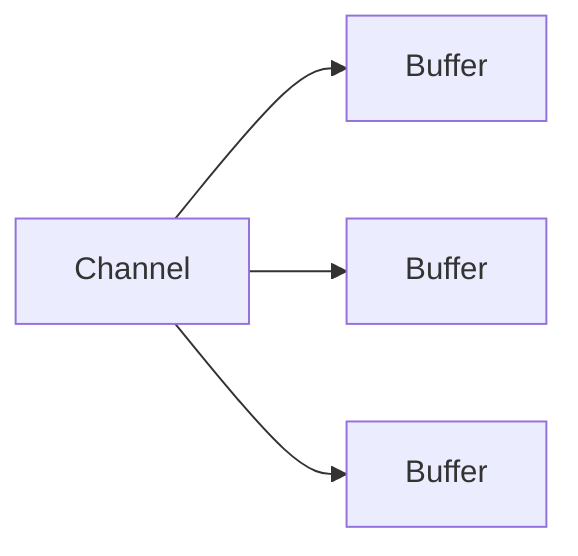
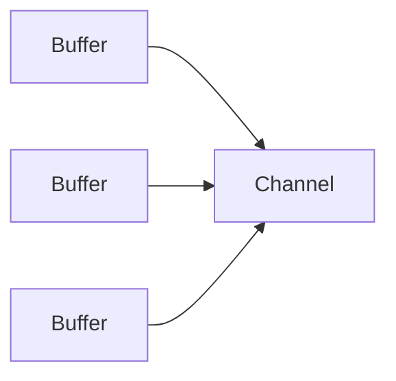
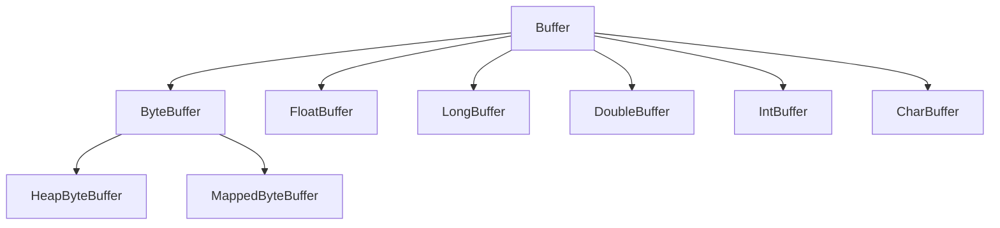
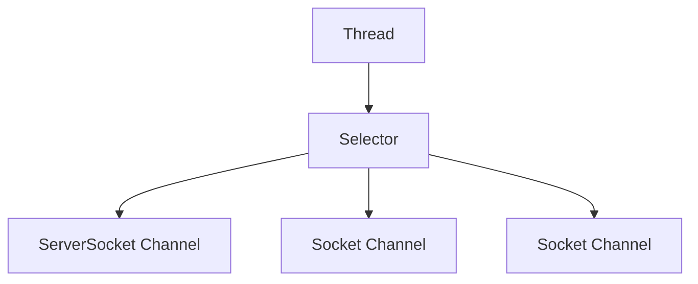
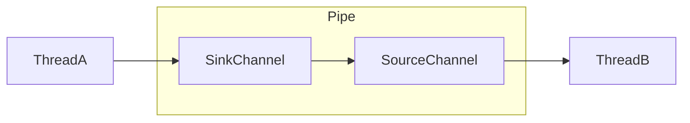

# 0. 简介
> 还是从[B站尚硅谷](https://www.bilibili.com/video/BV1E64y1h7Z4)看的视频 

# 1. 概述

> Java NIO(NewlO或 Non Blocking lO)是从 Java 1.4 版本开始引入的一个新的IO API，可以替代标准的 Java IO API。NIO 支持面向缓冲区的、基于通道的 IO 操作。NIO 将以更加高效的方式进行文件的读写操作。

## 1阻塞IO

通常在进行同步 I/O操作时，如果读取数据，代码会阻塞直至有可供读取的数据。同样，写入调用将会阻塞直至数据能够写入。

传统的Server/Client模式会基于TPR(Thread per Request),服务器会为每个客户端请求建立一个线程，由该线程单独负责处理一个客户请求。

这种模式带来的一个问题就是线程数量的剧增，大量的线程会增大服务器的开销。

大多数的实现为了避免这个问题，都采用了线程池模型，并设置线程池线程的最大数量，这由带来了新的问题.

如果线程池中有100个线程，而有100 个用户都在进行大文件下载，会导致第101个用户的请求无法及时处理，即便第101个用户只想请求一个几 KB 大小的页面。

## 2 非阻塞IO （NIO）

NIO 中非阻塞 I/O 采用了基于 Reactor 模式的工作方式，I/O 调用不会被阻塞，相反是注册感兴趣的特定 I/O 事件，如可读数据到达，新的套接字连接等等，在发生特定事件时，系统再通知我们。NIO 中实现非阻塞I/O的核心对象就是Selector。

非阻塞指的是 IO 事件本身不阻塞,但是获取 IO 事件的 select()方法是需要阻塞等待的区别是阻塞的 IO 会阻塞在 IO 操作上, NIO 阻塞在事件获取上,没有事件就没有 IO,从高层次看 IO 就不阻塞了.也就是说只有 IO 已经发生那么我们才评估 IO 是否阻塞,但是select()阻塞的时候 IO 还没有发生,何谈 IO 的阻塞呢?NIO 的本质是延迟 IO 操作到真正发生 IO 的时候,而不是以前的只要 IO 流打开了就一直等待 IO 操作。

| IO                      | NIO                         |
| ----------------------- | --------------------------- |
| 面向流(Stream oriented) | 面向缓冲区(Buffer Oriented) |
| 阻塞IO                  | 非阻塞                      |
|                         | 选择器 Selectors            |

## 3 NIO 概述

NIO由三个核心组成`Channels`,`Buffers`,`Selectors`

虽然 Java NIO 中除此之外还有很多类和组件，但 Channel，Buffer 和 Selector 构成了核心的 API。其它组件，如 Ppe和 FileLock，只不过是与三个核心组件共同使用的工具类。

### 1. Channels

Channel，可以翻译成“通道”。Channel和IO中的 Stream(流)是差不多一个等级的。只不过 Stream是单向的，譬如:InputStream,OutputStream.而Channel是双向的，既可以用来进行读操作，又可以用来进行写操作。
NI0 中的 Channel 的主要实现有:FileChannel、DatagramChannel.SocketChannel和 ServerSocketChannel，这里看名字就可以猜出个所以然来:分别可以对应文件10、UDP和TCP(Server和Client)。

### 2. Buffer

NIO 中的关键 Buffer 实现有:ByteBuffer, CharBuffer, DoubleBuffer, FloatBufferIntBuffer, LongBuffer, ShortBuffer，分别对应基本数据类型: byte, char, double,float, int, long, short。

### 3. Selector

Selector 运行单线程处理多个 ChannelT如果你的应用打开了多个通道，但每个连接的流量都很低，使用 Selector就会很方便。例如在一个聊天服务器中。要使用Selector, 得向 Selector 注册 Channel，然后调用它的 select()方法。这个方法会一直阻塞到某个注册的通道有事件就绪。一旦这个方法返回，线程就可以处理这些事件事件的例子有如新的连接进来、数据接收等

# 2. Channel

## 1. 概述

Channel是一个通道，可以通过它读取和写入数据，它就像水管一样，网络数据通过Channel读取和写入。通道与流的不同之处在于通道是双向的，流只是在一个方向上移动(一个流必须是InputStream 或者 OutputStream 的子类)，而且通道可以用于读、写或者同时用于读写。因为 Channel是全双工的，所以它可以比流更好地映射底层操作系统的 API。

NIO 中通过 channel 封装了对数据源的操作，通过 channel 我们可以操作数据源，又不必关心数据源的具体物理结构。这个数据源可能是多种的。比如，可以是文件也可以是网络 socket。在大多数应用中，channel与文件描述符或者 socket是--对应的。Channel用于在字节缓冲区和位于通道另一侧的实体(通常是一个文件或套接字)之间有效地传输数据。

与缓冲区不同，通道 API主要由接口指定。不同的操作系统上通道实现(ChannelImplementation)会有根本性的差异，所以通道 AP仅仅描述了可以做什么。因此很自然地，通道实现经常使用操作系统的本地代码。通道接口允许您以一种受控且可移植的方式来访问底层的 I/O 服务。

Channel是一个对象，可以通过它读取和写入数据。拿 NIO与原来的 I/O做个比较，通道就像是流。所有数据都通过 Buffer 对象来处理。您永远不会将字节直接写入通道中，相反，您是将数据写入包含一个或者多个字节的缓冲区。同样，您不会直接从通道中读取字节，而是将数据从通道读入缓冲区，再从缓冲区获取这个字节。

NIO中的通道类似流但是又有所不同

1. 既可以从通道中读取数据，又可以写数据到通道。但流的读写通常是单向的
2. 通道可以异步地读写
3. 通道中的数据总是要先读到一个 Buffer，或者总是要从一个 Buffer 中写入

## 2.  实现

> 通道覆盖了UDP TCP 网络IO 和文件IO

| Channel实现         | 描述                                                         |
| ------------------- | ------------------------------------------------------------ |
| FileChannel         | 从文件中读写数据                                             |
| DatagramChannel     | 通过UDP读写网络数据                                          |
| SocketChannel       | 通过TCP读写网络数据                                          |
| ServerSocketChannel | 监听新的TCP链接，像WEB服务器那样<br/>对每一个新链接创建一个SocketChannel |

## 3. FileChannel

> FileChannel类可以实现常用的 read，write 以及 scatter/gather 操作，同时它也提供了很多专用于文件的新方法。这些方法中的许多都是我们所熟悉的文件操作。

| 方法                         | 描述                                         |
| ---------------------------- | -------------------------------------------- |
| int read(ByteBuffer dst)     | 从 Channel 中读取数据到 ByteBuffer           |
| long read(ByteBuffer[] dsts) | 将Channel 中的数据“分散”到 ByteBuffer[]      |
| int write(ByteBuffer src)    | 将 ByteBuffer 中的数据写入到 Channel         |
| long write(ByteBuffer,srcs)  | 将 ByteBuffer[]中的数据“聚集”到 Channel      |
| long position()              | 返回此通道的文件位置                         |
| FileChannel position(long p) | 设置此通道的文件位置                         |
| long size()                  | 返回此通道的文件的当前大小                   |
| FileChannel truncate(long s) | 将此通道的文件截取为给定大小                 |
| void force(boolean metalata) | 强制将所有对此通道的文件更新写入到存储设备中 |

### 1. 使用FileChannel读取数据到Buffer的示例

> `RandomAccessFile`是 Java 中用于随机访问文件的类，支持以下四种模式操作文件
>
> | 模式 | 描述                                           | 特点                                                         | 使用场景                                                     |
> | ---- | ---------------------------------------------- | ------------------------------------------------------------ | ------------------------------------------------------------ |
> | r    | 只读模式                                       | 以只读方式打开文件。只能进行读取操作，不能进行写入操作。如果试图进行写操作，会抛出异常。<br/>文件必须存在，否则会抛出异常 | 当只需要读取文件内容而不进行任何修改时使用。比如读取配置文件、文本文件进行分析等 |
> | rw   | 读写模式                                       | 以读写方式打开文件。如果文件不存在，会尝试创建新文件。 <br/>可以进行读取和写入操作，允许在文件的任意位置进行数据的读取和修改。 | 适用于需要对文件进行随机读写操作的情况。例如，数据库文件的更新、日志文件的追加和修改等。 |
> | rws  | 读写模式，同步文件内容和元数据的更新到存储设备 | 也可进行读写操作。<br/>不仅同步文件内容的修改，还同步文件的元数据（如文件大小、修改时间等）的更新到存储设备。同样，这种同步操作可能会对性能产生较大影响 | 在对文件的完整性和一致性要求非常高的情况下可以使用。但通常情况下，“rws” 模式的性能开销较大，只有在确实需要这种高可靠性时才考虑使用。 |
> | rwd  | 读写模式，同步文件内容的更新到存储设备         | 与 “rw” 模式类似，可以进行读写操作。<br/>对文件内容的任何修改都会立即同步到存储设备，确保数据的持久性。这种同步操作可能会影响性能 | 对于关键数据文件，需要确保数据在发生系统故障时不会丢失，可以使用这个模式。但由于同步操作可能会降低性能，所以应谨慎使用 |

- 示例代码

```java
package net.lesscoding.test.nio.channel;

import lombok.extern.slf4j.Slf4j;
import org.junit.Test;

import java.io.RandomAccessFile;
import java.nio.ByteBuffer;
import java.nio.channels.FileChannel;
import java.nio.charset.StandardCharsets;

/**
 * @author eleven
 * @date 2024/9/18 13:19
 * @apiNote
 */
@Slf4j
public class FileChannelTest {

    private final String filePath = "D:/raf.txt";

    @Test
    public void readFile() {
        // 1. 创建FileChannel
        try (RandomAccessFile randomAccessFile = new RandomAccessFile(filePath, "rw");
             FileChannel channel = randomAccessFile.getChannel()) {
            // 2. 创建Buffer
            ByteBuffer byteBuffer = ByteBuffer.allocate(1024);
            // 3. 读取数据到Buffer中
            int read = channel.read(byteBuffer);
            while (read != -1) {
                log.info("读取了: {}", (char) read);
                byteBuffer.flip();
                // 判断buffer的缓冲区是否有数据
                while (byteBuffer.hasRemaining()) {
                    log.info("当前数据 {}", byteBuffer.get());
                }
                // 使用clear或者compact方法清除缓冲区内容
                byteBuffer.clear();
                read = channel.read(byteBuffer);
            }
        } catch (Exception e) {
            log.info("读取文件失败 {}", e.getMessage());
        }
    }

    @Test
    public void chineseTest() {
        String content = "";
        try (RandomAccessFile randomAccessFile = new RandomAccessFile("D:/raf.txt", "rw");
             FileChannel channel = randomAccessFile.getChannel()) {
            ByteBuffer byteBuffer = ByteBuffer.allocate(1024);
            int read;
            while ((read = channel.read(byteBuffer)) != -1) {
                byteBuffer.flip();
                byte[] bytes = new byte[byteBuffer.remaining()];
                byteBuffer.get(bytes);
                byteBuffer.clear();
                content = new String(bytes, StandardCharsets.UTF_8);
            }
        } catch (Exception e) {
            log.info("读取文件失败 {}", e.getMessage());
        }
        // 读取完所有数据后打印字符串内容
        log.info("文件内容：{}", content);
    }
}
```

### 2. FileChannel详解

1. 打开FileChannel

> 使用FileChannel之前必须先打开，无法直接打开FileChannel。
>
> 必须使用`InputStream`,`OutputStream`,`RandomAccessFile`来打开一个FileChannel

```java
try (RandomAccessFile randomAccessFile = new RandomAccessFile("D:/raf.txt", "rw");
             FileChannel channel = randomAccessFile.getChannel()) {
    
} catch (Exception e) {
    
}
```

```java
try(FileInputStream fis = new FileInputStream(filePath);
    FileChannel channel = fis.getChannel()) {

}catch (IOException e) {

}
```

2. 从FileChannel读取数据

> 首先，分配一个 Buffer。从 FileChannel中读取的数据将被读到 Buffer 中。然后，调用 FileChannel.read()方法。该方法将数据从 FileChannel读取到 Buffer 中。read()方法返回的 int 值表示了有多少字节被读到了 Buffer 中。如果返回-1，表示到了文件末尾。
>
> 有多个重载的read方法，这只是其中一个

```java
ByteBuffer buf = ByteBuffer.allocate(512);
int bytesRead = channel.read(buf);
```

3. 向FileChannel写入数据

> 注意 FileChannel.write()是在 while 循环中调用的。因为无法保证 write()方法一次能向 FileChannel写入多少字节，因此需要重复调用 write()方法，直到 Buffer 中已经没有尚未写入通道的字节。

```java
@Test
public void writeTest() {
    try (RandomAccessFile accessFile = new RandomAccessFile(filePath, "rw");
         FileChannel channel = accessFile.getChannel()){
        ByteBuffer byteBuffer = ByteBuffer.allocate(1024);
        String newData = "测试新写入的数据";
        byteBuffer.clear();
        byteBuffer.put(newData.getBytes(StandardCharsets.UTF_8));
        byteBuffer.flip();
        while (byteBuffer.hasRemaining()) {
            channel.write(byteBuffer);
        }
    } catch (IOException e) {
        throw new RuntimeException(e);
    }
}

/**
 * 追加写入
 */
@Test
public void appendWriteTest() {
    try (RandomAccessFile accessFile = new RandomAccessFile(filePath, "rw");
         FileChannel channel = accessFile.getChannel()){
        ByteBuffer byteBuffer = ByteBuffer.allocate(1024);
        String newData = "测试追加写入的数据";
        byteBuffer.clear();
        byteBuffer.put(newData.getBytes(StandardCharsets.UTF_8));
        byteBuffer.flip();
        while (byteBuffer.hasRemaining()) {
            channel.position(channel.size());
            channel.write(byteBuffer);
        }

    } catch (IOException e) {
        throw new RuntimeException(e);
    }
}
```

4. 关闭FileChannel

> FileChannel是继承了AutoCloseable接口的，直接在twr语句里写不用手动关闭

5. position方法

> 有时可能需要在 FileChannel 的某个特定位置进行数据的读/写操作。可以通过调用position()方法获取 FileChannel的当前位置。也可以通过调用 position(long pos)方法设置 FileChannel 的当前位置.
>
> 如果将位置设置在文件结束符之后，然后试图从文件通道中读取数据，读方法将返回
> 1(文件结束标志)。
>
> 如果将位置设置在文件结束符之后，然后向通道中写数据，文件将撑大到当前位置并写入数据。这可能导致“文件空洞“磁盘上物理文件中写入的数据间有空隙。“

6. truncate

> 可以使用 FileChannel.truncate()方法截取一个文件。截取文件时，文件将中指定长度后面的部分将被删除。这个例子截取文件的前 1024 个字节。
>
> ```java
> channel.truncate(1024);
> ```

7. force

> FileChannel.force()方法将通道里尚未写入磁盘的数据强制写到磁盘上。出于性能方面的考虑，操作系统会将数据缓存在内存中，所以无法保证写入到 FileChannel里的数据一定会即时写到磁盘上。要保证这一点，需要调用force()方法。force()方法有一个 boolean 类型的参数，指明是否同时将文件元数据(权限信息等)写到磁盘上。

8. transferFrom

> 如果有两个通道中有一个是FileChannel,则可以直接将数据从一个channel传输到另外一个Channel。
>
> FileChannel 的 transferFrom()方法可以将数据从源通道传输到 FileChannel中(译者注:这个方法在 JDK文档中的解释为将字节从给定的可读取字节通道传输到此通道的文件中)。

```java
@Test
public void transferFormTest() {
    try(FileChannel fromChannel = new RandomAccessFile(filePath, "rw").getChannel();
    FileChannel toChannel = new RandomAccessFile(filePath2, "rw").getChannel()) {
        // 从from传输到to
        long position = 0;
        long size = fromChannel.size();
        toChannel.transferFrom(fromChannel, position, size);
    } catch (IOException e) {
        throw new RuntimeException(e);
    }
}
```

9. transferTo

```java
@Test
public void transferToTest() {
    try(FileChannel fromChannel = new RandomAccessFile(filePath, "rw").getChannel();
        FileChannel toChannel = new RandomAccessFile(filePath2, "rw").getChannel()) {
        // 从from传输到to
        long position = 0;
        long size = fromChannel.size();
        fromChannel.transferTo(position, size, toChannel);
    } catch (IOException e) {
        throw new RuntimeException(e);
    }
}
```

## 4. SocketChannel

### 1. 简介

1. 新的 socket 通道类可以运行非阻塞模式并且是可选择的，可以激活大程序(如网络服务器和中间件组件)巨大的可伸缩性和灵活性。避免了管理大量线程所需的上下文交换开销。借助新的 NIO 类，一个或几个线程就可以管理成百上千的活动 socket 连接了并且只有很少甚至可能没有性能损失。所有的 socket通道类(DatagramChannel、SocketChannel和ServerSocketChannel)都继承了位于java.nio.channels.spi包中的 AbstractSelectableChannel。这意味着我们可以用一个Selector 对象来执行socket通道的就绪选择(readiness selection)。

2. 注意 DatagramChannel和 SocketChannel 实现定义读和写功能的接口而ServerSocketChanne!不实现。ServerSocketChannel负责监听传入的连接和创建新的 SocketChanne!对象，它本身从不传输数据。

3. 通道是一个连接 I/O服务导管并提供与该服务交互的方法。就某个 socket 而言，它不会再次实现与之对应的 socket 通道类中的 socket 协议 API，而java.net 中已经存在的 socket 通道都可以被大多数协议操作重复使用。
   全部 socket通道类(DatagramChannel、SocketChannel和ServerSocketChannel)在被实例化时都会创建一个对等socket 对象。这些是我们所熟悉的来自java.net的类(Socket、ServerSocket和DatagramSocket)，它们已经被更新以识别通道。对等 socket 可以通过调用socket( )方法从一个通道上获取。此外，这三个java.net 类现在都有 getChannel()方法。

4. 要把一个 socket 通道置于非阻塞模式，我们要依靠所有 socket通道类的公有超级类:`SelectableChannel`。就绪选择(readiness selection)是一种可以用来查询通道的机制，该查询可以判断通道是否准备好执行一个目标操作，如读或写。非阻塞 I/O 和可选择性是紧密相连的，那也正是管理阻塞模式的 API代码要在SelectableChannel超级类中定义的原因。

   设置或重新设置一个通道的阻塞模式是很简单的，只要调用configureBlocking()方法即可，传递参数值为 true 则设为阻塞模式，参数值为 false 值设为非阻塞模式。可以通过调用 isBlocking()方法来判断某个 socket 通道当前处于哪种模式


### 2.  ServerSocketChannel

> ServerSocketChannel是一个基于通道的 socket 监听器。它同我们所熟悉的java.net.ServerSocket执行相同的任务，不过它增加了通道语义，因此能够在非阻塞模式下运行
>
> 由于 ServerSocketChannel没有 bind()方法，因此有必要取出对等的 socket 并使用它来绑定到一个端口以开始监听连接。我们也是使用对等 ServerSocket的 API 来根据需要设置其他的 socket 选项
>
> 同java.net.ServerSocket一样，ServerSocketChannel 也有 accept( )方法。一旦创建了一个 ServerSocketChannel 并用对等 socket 绑定了它，然后就可以在其中一个上调用 accept()。如果选择在 ServerSocket 上调用 accept( )方法，那么它会同任何其他的 ServerSocket 表现一样的行为:总是阻塞并返回一个java.net.Socket 对象。如果您选择在 ServerSocketChannel上调用 accept()方法则会返回SocketChannel类型的对象，返回的对象能够在非阻塞模式下运行。

> - ServerSocketChannel的accept()方法会返回SocketChannel类型对象
> - SocketChannel可以在非阻塞模式下运行。
> - 其它 Socket的 accept()方法会阻塞返回一个 Socket 对象。如果ServerSocketChannel以非阻塞模式被调用，当没有传入连接在等待时ServerSocketChannel.accept()会立即返回 null。正是这种检查连接而不阻塞的能力实现了可伸缩性并降低了复杂性。可选择性也因此得到实现。可以使用一个选择器实例来注册 ServerSocketChannel对象以实现新连接到达时自动通知的功能

```java
package net.lesscoding.test.nio.channel;

import lombok.extern.slf4j.Slf4j;
import org.junit.Test;

import java.io.IOException;
import java.net.InetSocketAddress;
import java.nio.ByteBuffer;
import java.nio.channels.ServerSocketChannel;
import java.nio.channels.SocketChannel;
import java.nio.charset.StandardCharsets;

/**
 * @author eleven
 * @date 2024/9/18 17:06
 * @apiNote
 */
@Slf4j
public class ServerSocketChannelTest {
    int port = 888;
	 //  启动后打开浏览器访问localhost:888就能看到有链接了
    @Test
    public void createTes() {
        ByteBuffer buffer = ByteBuffer.wrap("124".getBytes(StandardCharsets.UTF_8));
        try (ServerSocketChannel serverSocketChannel = ServerSocketChannel.open()) {
            // 绑定端口号
            serverSocketChannel.bind(new InetSocketAddress(port));
            // 非阻塞模式
            serverSocketChannel.configureBlocking(false);
            // 监听是否有新的
            while (true) {
                log.info("Waiting for new connections...");
                SocketChannel socketChannel = serverSocketChannel.accept();
                if (socketChannel == null) {
                    log.info("没有新的连接");
                    Thread.sleep(2000);
                } else {
                    log.info("有新的连接 {}", socketChannel.getRemoteAddress());
                    buffer.rewind();
                    socketChannel.write(buffer);
                    socketChannel.close();
                }

            }
        } catch (IOException e) {
            log.error("error", e);
        } catch (InterruptedException e) {
            throw new RuntimeException(e);
        }
    }

}
```

### 3. SocketChannel

> 1. 对于已经存在的 socket 不能创建 SocketChannel
> 2. SocketChannel中提供的 open 接口创建的 Channel并没有进行网络级联，需要使用 connect 接口连接到指定地址
> 3. 未进行连接的 SocketChannle.执行 I/O 操作时，会抛出NotYetConnectedException
> 4. SocketChannel 支持两种 I/O 模式:阻塞式和非阻塞式
> 5. SocketChannel支持异步关闭。如果SocketChanne!在一个线程上read 阻塞，另一个线程对该 SocketChanne!调用 shutdownlnput，则读阻塞的线程将返回-1 表示没有读取任何数据;如果 SocketChanne!在一个线程上 write 阻塞，另一个线程对该SocketChannel 调用 shutdownWrite，则写阻塞的线程将抛出AsynchronousCloseException

==可设置的参数==

| 参数         | 描述                                                 |
| ------------ | ---------------------------------------------------- |
| SO_SNDBUF    | 套接字发送缓冲区大小                                 |
| SO_RCVBUF    | 套接字接收缓冲区大小                                 |
| SO_KEEPALIVE | 保活连接                                             |
| O_REUSEADDR  | 复用地址                                             |
| SO_LINGER    | 有数据传输时延缓关闭 Channel(只有在非阻塞模式下有用) |
| TCP_NODELAY  | 禁用 Nagle 算法                                      |


```java
package net.lesscoding.test.nio.channel;

import lombok.extern.slf4j.Slf4j;
import org.junit.Test;

import java.net.InetSocketAddress;
import java.nio.channels.SocketChannel;

/**
 * @author eleven
 * @date 2024/9/18 17:17
 * @apiNote
 */
@Slf4j
public class SocketChannelTest {
    @Test
    public void createTest() {
        InetSocketAddress remote = new InetSocketAddress("www.baidu.com", 443);
        try (SocketChannel socketChannel = SocketChannel.open(remote)){
            socketChannel.configureBlocking(false);
            log.info("SocketChannel 是否正在进行链接 {}", socketChannel.isConnectionPending());
            log.info("SocketChannel open {}", socketChannel.isOpen());
            log.info("SocketChannel 是否已被链接 {}", socketChannel.isConnected());
            log.info("SocketChannel 是否已经完成连接 {}", socketChannel.finishConnect());
        } catch (Exception e) {
            log.error("error {}", e.getMessage());
        }
        /**
         * 先打开通道在连接
         */
        try (SocketChannel socketChannel = SocketChannel.open()){
            socketChannel.connect(remote);
        } catch (Exception e) {

        }
    }
}
```

### 4. DatagramChannel

> 正如SocketChannel对应Socket,ServerSocketChannel对应ServerSocket，
> 每一个 DatagramChannel对象也有一个关联的 DatagrmSocket 对象。
> 正如SocketChannel模拟连接导向的流协议(如TCP/IP)，DatagramChannel则模拟包导向的无连接协议(如 UDP/IP)。DatagramChannel是无连接的，每个数据报(datagram)都是一个自包含的实体，拥有它自己的目的地址及不依赖其他数据报的数据负载。与面向流的的 socket不同，DatagramChannel可以发送单独的数据报给不同的目的地址。同样，DatagramChannel对象也可以接收来自任意地址的数据包。每个到达的数据报都含有关于它来自何处的信息(源地址)“
- 代码示例
```java
package net.lesscoding.nio.channel;

import lombok.extern.slf4j.Slf4j;
import org.junit.Test;

import java.net.InetSocketAddress;
import java.net.SocketAddress;
import java.nio.ByteBuffer;
import java.nio.channels.DatagramChannel;
import java.nio.charset.StandardCharsets;

/**
 * @author eleven
 * @date 2024/9/20 8:55
 * @apiNote
 */
@Slf4j
public class DatagramChannelTest {

    @Test
    public void sendTest() {
        try (DatagramChannel sendChannel = DatagramChannel.open()) {
            InetSocketAddress sendAddress = new InetSocketAddress("127.0.0.1", 9999);
            while (true) {
                ByteBuffer buffer = ByteBuffer.wrap("发送测试数据".getBytes(StandardCharsets.UTF_8));
                sendChannel.send(buffer, sendAddress);
                log.info("发送数据成功");
                Thread.sleep(1000);
            }
        } catch (Exception e) {
            log.error("打开通道失败 {}", e.getMessage());
        }
    }

    @Test
    public void receiveTest() {
        try (DatagramChannel receiveChannel = DatagramChannel.open()) {
            InetSocketAddress receiveAddress = new InetSocketAddress("127.0.0.1", 9999);
            // 绑定地址
            receiveChannel.bind(receiveAddress);
            ByteBuffer buffer = ByteBuffer.allocate(1024);
            while (true) {
                buffer.clear();
                SocketAddress socketAddress = receiveChannel.receive(buffer);
                log.info("socketAddress：{}", socketAddress);
                buffer.flip();
                log.info("接收到数据：{}", StandardCharsets.UTF_8.decode(buffer));
            }
        } catch (Exception e) {
            log.error("打开通道失败 {}", e.getMessage());
        }
    }

    @Test
    public void testConnect() {
        try (DatagramChannel connChannel = DatagramChannel.open()) {
            connChannel.bind(new InetSocketAddress(9999));
            connChannel.connect(new InetSocketAddress("127.0.0.1", 9999));
            connChannel.write(ByteBuffer.wrap("连接测试数据".getBytes(StandardCharsets.UTF_8)));
            ByteBuffer buffer = ByteBuffer.allocate(1024);
            while (true) {
                buffer.clear();
                connChannel.read(buffer);
                buffer.flip();
                log.info("接收到数据：{}", StandardCharsets.UTF_8.decode(buffer));
            }
        } catch (Exception e) {
            log.error("打开通道失败 {}", e.getMessage());
        }
    }

}
```
## 5. Scatter 和 Gather

> Java NIO 开始支持 scatter/gather，scatter/gather 用于描述从 Channel 中读取或者写入到 Channel的操作
>
> **分散(scatter)**从 Channel 中读取是指在读操作时将读取的数据写入多个 buffer中。因此，Channel将从 Channel中读取的数据“分散(scatter)”到多个Buffer中。
>
> **聚集(gather)**写入 Channel是指在写操作时将多个 buffer 的数据写入同一个Channel，因此，Channel将多个Buffer中的数据“聚集(gather)”后发送到Channel。
>
> scatter/gather 经常用于需要将传输的数据分开处理的场合，例如传输一个由消息头和消息体组成的消息，你可能会将消息体和消息头分散到不同的 buffer 中，这样你可以方便的处理消息头和消息体。“

### 1. Scattering Reades

> Scattering Reades是指数据从一个channel读取到多个buffer中.
>
> 注意 buffer 首先被插入到数组，然后再将数组作为 channel.read( 的输入参数。read()方法按照 buffer 在数组中的顺序将从 channel 中读取的数据写入到 buffer，当-个 buffer 被写满后，channel 紧接着向另一个 buffer 中写
>
> Scattering Reads 在移动下一个 buffer 前，必须填满当前的 buffer，这也意味着它不适用于动态消息(译者注:消息大小不固定)。换句话说，如果存在消息头和消息体消息头必须完成填充(例如128byte)，Scattering Reads才能正常工作。



```java
@Test
public void scatteringReadsTest() {
    try(FileChannel fileChannel = new RandomAccessFile(filePath, "rw").getChannel()) {
        ByteBuffer buffer1 = ByteBuffer.allocate(12);
        ByteBuffer buffer2 = ByteBuffer.allocate(16);
        ByteBuffer[] buffers = {buffer1, buffer2};
        long read;
        while ((read = fileChannel.read(buffers)) != -1) {
            fileChannel.read(buffers);
            buffer1.flip();
            buffer2.flip();
            log.info("buffer1 {}", StandardCharsets.UTF_8.decode(buffer1));
            log.info("buffer2 {}", StandardCharsets.UTF_8.decode(buffer2));
            buffer1.clear();
            buffer2.clear();
        }
    } catch (Exception e) {
        log.error("读取文件失败 {}", e.getMessage());
    }
}
```


### 2. Gathering Writes

> Gathering Writes是指将多个Buffer的数据写入到一个Channel中.
>
> buffers 数组是 write()方法的入参，write()方法会按照 buffer 在数组中的顺序，将数据写入到 channel，注意只有 position 和 limit 之间的数据才会被写入。因此，如果-个 buffer 的容量为 128byte，但是仅仅包含 58byte 的数据，那么这 58byte 的数据将被写入到 channel中。因此与 Scattering Reads相反，Gathering Writes 能较好的处理动态消息.



````java
@Test
public void gatheringWritesTest() {
    try(FileChannel fileChannel = new RandomAccessFile(filePath, "rw").getChannel()) {
        ByteBuffer buffer1 = ByteBuffer.wrap("Buffer1写入了一些数据11".getBytes(StandardCharsets.UTF_8));
        ByteBuffer buffer2 = ByteBuffer.wrap("Buffer2写入了一些数据2222".getBytes(StandardCharsets.UTF_8));
        ByteBuffer[] buffers = {buffer1, buffer2};
        fileChannel.write(buffers);
    } catch (Exception e) {
        log.error("读取文件失败 {}", e.getMessage());
    }
}
````


# 3. Buffer

> Java NIO 中的 Buffer 用于和 NIO 通道进行交互。数据是从通道读入缓冲区，从缓冲区写入到通道中的。
>
> 缓冲区本质上是一块可以写入数据，然后可以从中读取数据的内存。这块内存被包装成 NIO Buffer 对象，并提供了一组方法，用来方便的访问该块内存。缓冲区实际上是一个容器对象，更直接的说，其实就是一个数组，在 NIO 库中，所有数据都是用缓冲区处理的。在读取数据时，它是直接读到缓冲区中的;在写入数据时，它也是写入到缓冲区中的;任何时候访问 NIO 中的数据，都是将它放到缓冲区中。而在面向流1/0系统中，所有数据都是直接写入或者直接将数据读取到 Stream 对象中。
>
> 在 NIO 中，所有的缓冲区类型都继承于抽象类 Buffer，最常用的就是 ByteBuffer对于 Java 中的基本类型，基本都有一个具体 Buffer 类型与之相对应。




## 1. 基本用法

> 一般分为四个步骤
>
> 1. 写入数据到`Buffer`
> 2. 调用`flip()`方法
> 3. 从`Buffer`读取数据
> 4. 调用`clear()`或者`compact()`方法

当向 buffer 写入数据时，`buffer` 会记录下写了多少数据。一旦要读取数据，需要通过`flip()`方法将 `Buffer` 从写模式切换到读模式。在读模式下，可以读取之前写入到 `buffer`的所有数据。一旦读完了所有的数据，就需要清空缓冲区，让它可以再次被写入。有两种方式能清空缓冲区:调用 `clear()`或 `compact()`方法。`clear()`方法会清空整个缓冲区。`compact()`方法只会清除已经读过的数据。任何未读的数据都被移到缓冲区的起始处，新写入的数据将放到缓冲区未读数据的后面。

```java
@Test
public void bufferReadTest () {
    StringBuilder content = new StringBuilder();
    try (RandomAccessFile randomAccessFile = new RandomAccessFile(filePath, "rw");
         FileChannel channel = randomAccessFile.getChannel()) {
        ByteBuffer byteBuffer = ByteBuffer.allocate(128);
        int read;
        while ((read = channel.read(byteBuffer)) != -1) {
            byteBuffer.flip();
            while (byteBuffer.hasRemaining()) {
                byte[] bytes = new byte[byteBuffer.remaining()];
                byteBuffer.get(bytes);
                String str = new String(bytes, StandardCharsets.UTF_8);
                log.info("读取到数据: {}", str);
                //content.append(str);
            }
            byteBuffer.clear();
        }
    } catch (Exception e) {
        log.info("读取文件失败 {}", e.getMessage());
    }
    // 读取完所有数据后打印字符串内容
    log.info("文件内容：{}", content);
}
```

```java
@Test
public void intBufferTest() {
    IntBuffer buffer = IntBuffer.allocate(8);

    for (int i = 0; i < buffer.capacity(); i++) {
        buffer.put(2 * (i + 1));
    }
    buffer.flip();
    while (buffer.hasRemaining()) {
        log.info("{}", buffer.get());
    }
}
```

## 2. 重要属性 capacity position limit

>position 和 limit 的含义取决于 Buffer 处在读模式还是写模式。不管 Buffer 处在什么模式，capacity 的含义总是一样的。


### 1. Capacity

作为一个内存块，Buffer有一个固定的大小值，也叫“capacity”.你只能往里写capacity 个byte、long，char 等类型。一旦 Buffer 满了，需要将其清空(通过读数据或者清除数据)才能继续写数据往里写数据。

### 2. position

1. <font color=red>写数据到 Buffer时</font>，position 表示写入数据的当前位置，position 的初始值为0。当一个 byte、long 等数据写到 Buffer后， position 会向下移动到下一个可插入数据的 Buffer 单元。position 最大可为 capacity-1(因为 position 的初始值为0）
2. <font color=red>读数据到 Buffer时</font>，position 表示读入数据的当前位置，如 position=2 时表示已开始读入了3个byte，或从第3个byte 开始读取。通过 ByteBuffer.flip()切换到读模式时 position 会被重置为 0，当 Buffer 从 position 读入数据后，position 会下移到下一个可读入的数据 Buffer 单元。

### 3. limit

1. <font color=red>写数据时</font>，limit 表示可对 Buffer 最多写入多少个数据。写模式下，limit 等于Buffer的 capacity。

2. <font color=red>读数据时</font>，limit 表示 Buffer 里有多少可读数据(not nul 的数据)，因此能读到之前写入的所有数据(limit 被设置成已写数据的数量，这个值在写式下就是position

## 3. Buffer分配和写数据

1. Buffer分配

> 通过`allocate()`方法进行分配

2. 向Buffer写数据

```java
ByteBuffer buffer = ByteBuffer.allocate(1024);
channel.read(buffer);
buffer.put("123");
```

3. flip方法

> flip 方法将 Buffer 从写模式切换到读模式。调用 fip()方法会将 position 设回0，并将 limit 设置成之前 position 的值。换句话说，position 现在用于标记读的位置limit 表示之前写进了多少个 byte、char等(现在能读取多少个 byte、char等)。

## 4. 从Buffer中读取数据

1. 读取到Channel

```java
ByteBuffer buffer = ByteBuffer.allocate(8);
buffer.put("12345678".getBytes());
inChannel.write(buffer)
```

2. 使用get读取

```java
log.info("{}", (char)buffer.get());
```

## 5. 常用方法

### 1、 rewind

> Buffer.rewind()将 position 设回0，所以你可以重读 Buffer 中的所有数据。limit 保持不变，仍然表示能从 Buffer中读取多少个元素(byte、char等)。

### 2. clear和compact

> 一旦读完 Buffer 中的数据，需要让 Buffer 准备好再次被写入。可以通过 clear()或compact()方法来完成。
>
> 如果调用的是 clear()方法，position 将被设回0，limit 被设置成 capacity 的值。换句话说，Buffer 被清空了。Buffer 中的数据并未清除，只是这些标记告诉我们可以从哪里开始往 Buffer 里写数据。
>
> 如果 Buffer 中有一些未读的数据，调用 ciear()方法，数据将“被遗忘”意味着不再有任何标记会告诉你哪些数据被读过，哪些还没有。
>
> 如果 Buffer 中仍有未读的数据，且后续还需要这些数据，但是此时想要先先写些数据，那么使用 compact()方法。
>
> compact()方法将所有未读的数据拷贝到 Buffer 起始处。然后将 position 设到最后一个未读元素正后面。limit 属性依然像 clear()方法一样，设置成 capacity。现在Buffer 准备好写数据了，但是不会覆盖未读的数据。

### 3.  mark和reset

> 通过调用 Buffer.mark()方法，可以标记 Buffer 中的一个特定 position。之后可以通过调用 Buffer.reset()方法恢复到这个 position。

```java
buffer.mark();
buffer.get();
buffer.reset();
```

## 6. 缓冲区操作

### 1. 缓冲区分片

> 在 NIO 中，除了可以分配或者包装一个缓冲区对象外，还可以根据现有的缓冲区对象来创建一个子缓冲区，即在现有缓冲区上切出一片来作为一个新的缓冲区，但现有的缓冲区与创建的子缓冲区在底层数组层面上是数据共享的，也就是说，子缓冲区相当于是现有缓冲区的一个视图窗口。调用 slice()方法可以创建一个子缓冲区。

```java
@Test
public void sliceTest() {
    IntBuffer buffer = IntBuffer.allocate(16);
    for (int i = 0; i < buffer.capacity(); i++) {
        buffer.put(i);
    }
    // 创建子缓冲区
    buffer.position(3);
    buffer.limit(9);
    IntBuffer slice = buffer.slice();
    // 改变子缓冲区的内容
    for (int i = 0; i < slice.capacity(); i++) {
        int num = slice.get();
        slice.put(i, -num);
    }

    buffer.position(0);
    buffer.limit(buffer.capacity());

    while (buffer.hasRemaining()) {
        log.info("{}", buffer.get());
    }
}
// 0 1 2 -3 -4 -5 -6 -7 -8 9 10 11 12 13 14 15
```

### 2. 只读缓冲区

> 只读缓冲区非常简单，可以读取它们，但是不能向它们写入数据。可以通过调用缓冲区的 `asReadOnlyBuffer()`方法，将任何常规缓冲区转 换为只读缓冲区，这个方法返回一个与原缓冲区完全相同的缓冲区，并与原缓冲区共享数据，只不过它是只读的。如果原缓冲区的内容发生了变化，只读缓冲区的内容也随之发生变化

```java
@Test
public void readOnlyTest() {
    IntBuffer buffer = IntBuffer.allocate(16);

    for (int i = 0; i < buffer.capacity(); i++) {
        buffer.put(i);
    }

    IntBuffer readOnlyBuffer = buffer.asReadOnlyBuffer();

    for (int i = 0; i < buffer.capacity(); i++) {
        int num = buffer.get(i);
        buffer.put(i, -num);
    }
    readOnlyBuffer.position(0);
    readOnlyBuffer.limit(readOnlyBuffer.capacity());

    while (readOnlyBuffer.hasRemaining()) {
        log.info("{}", readOnlyBuffer.get());
    }
}
```

### 3. 直接缓冲区

> 直接缓冲区是为加快 I/O 速度，使用一种特殊方式为其分配内存的缓冲区，JDK文档中的描述为:给定一个直接字节缓冲区，Java虚拟机将尽最大努力直接对它执行本机I/0 操作。也就是说，它会在每一次调用底层操作系统的本机 I/O 操作之前(或之后)尝试避免将缓冲区的内容拷贝到一个中间缓冲区中 或者从一个中间缓冲区中拷贝数据。要分配直接缓冲区，需要调用 allocateDirect()方法，而不是 allocate()方法，使用方式与普通缓冲区并无区别。

```java
@Test
public void allocateDirectTest() {
    try (FileInputStream fileInputStream = new FileInputStream(filePath);
         FileChannel inChannel = fileInputStream.getChannel();
         FileOutputStream fileOutputStream = new FileOutputStream(filePath2);
         FileChannel outChannel = fileOutputStream.getChannel()
    ){
        ByteBuffer buffer = ByteBuffer.allocateDirect(1024);
        while (true) {
            buffer.clear();
            int read = inChannel.read(buffer);
            if (read == -1) {
                break;
            }
            buffer.flip();
            outChannel.write(buffer);
        }

    } catch (IOException e) {
        log.error("{} ", e.getMessage());
    }

}
```


### 4. 内存映射文件

> 内存映射文件 I/O是一种读和写文件数据的方法，它可以比常规的基于流或者基于通道的 I/O 快的多。内存映射文件 I/O 是通过使文件中的数据出现为 内存数组的内容来完成的，这其初听起来似乎不过就是将整个文件读到内存中，但是事实上并不是这样。一般来说，只有文件中实际读取或者写入的部分才会映射到内存中。

```java
/**
 * 内存映射文件
 */
@Test
public void memoryMappingTest() {
    int start = 0;
    int size = 256;
    try (RandomAccessFile raf = new RandomAccessFile(filePath, "rw")) {
        FileChannel channel = raf.getChannel();
        MappedByteBuffer map = channel.map(FileChannel.MapMode.READ_WRITE, start, size);
        map.put(0, (byte) 'a');
        map.put(255, (byte) 'b');
    } catch (Exception e) {
        log.error("memoryMapping Error {}", e.getMessage());
    }

}
```

# 4. Selector

## 1. 简介

### 1. Selector和Channel的关系

> Selector 一般称 为选择器，也可以翻译为 多路复用器 。它是 Java NIO 核心组件中的一个，用于检查一个或多个 NIO Channel(通道)的状态是否处于可读、可写。如此可以实现单线程管理多个 channels,也就是可以管理多个网络链接。
>
> ```mermaid
> graph TD
> S[Selector] --轮询--> C1[Channel]
> S --轮询--> C2[Channel]
> S --轮询--> C3[Channel]
> S --轮询--> C4[Channel]
> S --轮询--> C5[Channel]
> ```
>
> 使用 Selector 的好处在于: 使用更少的线程来就可以来处理通道了，相比使用多个线程，避免了线程上下文切换带来的开销。

### 2. 可选通道（SelectableChannel）

1. 不是所有的 Channel都可以被 Selector 复用的。比方说，FileChannel就不能被选择器复用。判断一个 Channel能被 Selecter 复用，有一个前提:判断他是否继承了一个抽象类 SelectableChannel。如果继承了 SelectableChannel，则可以被复用，否则不能.

2. SelectableChannel类提供了实现通道的可选择性所需要的公共方法。它是所有支持就绪检查的通道类的父类。所有 socket通道，都继承了SelectableChannel类都是可选择的，包括从管道(Pipe)对象的中获得的通道。而 FileChannel类，没有继承 SelectableChannel，因此是不是可选通道。

3. 一个通道可以被注册到多个选择器上，但对每个选择器而言只能被注册一次。通道和选择器之间的关系，使用注册的方式完成。SelectableChannel可以被注册到Selector 对象上，在注册的时候，需要指定通道的哪些操作，是Selector 感兴趣的。



### 3. Channel注册到Selector

1. 使用Channel.regirter(Selector sel，int ops)方法，将一个通道注册到一个选择器时。第一个参数，指定通道要注册的选择器。第二个参数指定选择器需要查询的通道操作。
2. 可以供选择器查询的通道操作，从类型来分，包括以下四种,

	- 可读`SelectionKey.OP_READ`
	- 可写`SelectionKey.OP_WRITE`
	- 连接`SelectionKey.OP_CONNECT`
	- 接收`SelectionKey.OP_ACCEPT`
	
	> 如果 Selector 对通道的多操作类型感兴趣，可以用“位或”操作符来实现
	>
	> ```java
	> int key = SelectionKey.OP_READ | SelectionKey.OP_WRITE ;
	> ```

3. 选择器查询的不是通道的操作，而是通道的某个操作的一种就绪状态。什么是操作的就绪状态?一旦通道具备完成某个操作的条件，表示该通道的某个操作已经就绪，就可以被 Selector 查询到，程序可以对通道进行对应的操作。比方说，某个SocketChannel通道可以连接到一个服务器，则处于“连接就绪”(`OP_CONNECT`)。再比方说，一个ServerSocketChannel服务器通道准备好接收新进入的连接，则处于“接收就绪”(`OP_ACCEPT`)状态。还比方说，一个有数据可读的通道，可以说是“读就绪”(`OP_READ`)。一个等待写数据的通道可以说是“写就绪”(`OP_WRITE`)。

### 4. 选择键(SelectionKey)

1. Channel注册到后，并且一旦通道处于某种就绪的状态，就可以被选择器查询到。这个工作，使用选择器Selector的select()方法完成。select方法的作用，对感兴趣的通道操作，进行就绪状态的查询
2. Selector 可以不断的査询 Channel中发生的操作的就绪状态。并且挑选感兴趣的操作就绪状态。一旦通道有操作的就绪状态达成，并且是Selector 感兴趣的操作就会被 Selector 选中，放入选择键集合中。
3. 一个选择键，首先是包含了注册在 Selector 的通道操作的类型，比方说`SelectionKey.OP_READ`。也包含了特定的通道与特定的选择器之间的注册关系。
4. 选择键的概念，和事件的概念比较相似。一个选择键类似监听器模式里边的一个事件。由于 Selector 不是事件触发的模式，而是主动去查询的式，所以不叫事件Event，而是叫 SelectionKey选择键，

## 2. Selector使用

1. 创建Selector

```java
Selector open = Selector.open();
```

2. 注册Channel到Selector

> 1. 与 Selector 一起使用时，<font color=red>Channel必须处于非阻塞模式</font>下，否则将抛出异常`IllegalBlockingModeException`。这意味着，FileChannel不能与 Selector 一起使用，因为 FileChanne!不能切换到非阻塞模式，而套接字相关的所有的通道都可以
> 2. 一个通道，并没有一定要支持所有的四种操作。比如服务器通道ServersocketChannel支持 Accept 接受操作，而 SocketChannel,客户端通道则不支持。可以通过通道上的 validOps()方法，来获取特定通道下所有支持的操作集合。

```java
@Test
public void createTest() {
    // 创建一个Selector
    try(Selector selector = Selector.open();
        ServerSocketChannel serverSocketChannel= ServerSocketChannel.open()) {
        // 非阻塞模式
        serverSocketChannel.configureBlocking(false);
        // 绑定端口
        serverSocketChannel.bind(new InetSocketAddress(9999));
        // 注册到selector
        serverSocketChannel.register(selector, SelectionKey.OP_ACCEPT, serverSocketChannel.validOps());
    } catch (IOException e) {
        throw new RuntimeException(e);
    }
}
```

## 3. 轮训查询就绪操作

1. 通过 Selector的 select()方法，可以查询出已经就绪的通道操作，这些就绪的状态集合，包存在一个元素是 selectionKey,对象的 Set 集合中。

2. 下面是 Selector几个重载的査询 select()方法:

   - select():阻塞到至少有一个通道在你注册的事件上就绪了。

   - select(long timeout):和 select()一样，但最长阻塞事件为 timeout 毫秒。

   - selectNow():非阻塞，只要有通道就绪就立刻返回。

select() 方法返回的 int值，表示有多少通道已经就绪，更准确的说，是自前一次select方法以来到这一次 select 方法之间的时间段上，有多少通道变成就绪状态。

例如:首次调用 select()方法，如果有一个通道变成就绪状态，返回了1，若再次调用select()方法，如果另一个通道就绪了，它会再次返回1。如果对第一个就绪的channel没有做任何操作，现在就有两个就绪的通道，但在每次select()方法调用之间，只有一个通道就绪了。

一旦调用 select()方法，并且返回值不为0时，在 Selector 中有一个selectedKeys()方法，用来访问已选择键集合，迭代集合的每一个选择键元素，根据就绪操作的类型完成对应的操作

```java
Set selectedKeys = selector.selectedKeys();
```

## 4. 停止选择

选择器执行选择的过程，系统底层会依次询问每个通道是否已经就绪，这个过程可能会造成调用线程进入阻塞状态,那么我们有以下三种方式可以唤醒在 select()方法中阻塞的线程。

1. wakeup()

   >  通过调用 Selector 对象的 wakeup()方法让处在阻塞状态的select()方法立刻返回
   >
   > 该方法使得选择器上的第一个还没有返回的选择操作立即返回。如果当前没有进行中的选择操作，那么下一次对 select()方法的一次调用将立即返回。

2. close()方法

   > 通过close()方法关闭Selector
   >
   > 该方法使得任何一个在选择操作中阻塞的线程都被唤醒(类似 wakeup())，同时使得注册到该 Selector 的所有 Channel被注销，所有的键将被取消，但是 Channel本身不会关闭

## 5. 客户端和服务端

1. 客户端

```java
@Test
public void clientTest() {
    // 创建通道绑定端口
    try (SocketChannel socketChannel = SocketChannel.open(new InetSocketAddress("127.0.0.1", 9999))) {
        socketChannel.configureBlocking(false);
        ByteBuffer buffer = ByteBuffer.allocate(1024);

        buffer.put("hello".getBytes());
        buffer.flip();
        socketChannel.write(buffer);
        buffer.clear();
    } catch (IOException e) {
        throw new RuntimeException(e);
    }
}
```

2. 客户端

```java
@Test
public void serverTest() {
    InetSocketAddress remote = new InetSocketAddress(9999);
    try (ServerSocketChannel serverSocketChannel = ServerSocketChannel.open()) {
        serverSocketChannel.configureBlocking(false);
        ByteBuffer buffer = ByteBuffer.allocate(1024);
        serverSocketChannel.bind(remote);
        Selector selector = Selector.open();
        serverSocketChannel.register(selector, SelectionKey.OP_ACCEPT);
        while (selector.select() > 0) {
            Set<SelectionKey> selectionKeys = selector.selectedKeys();
            Iterator<SelectionKey> iterator = selectionKeys.iterator();
            while (iterator.hasNext()) {
                SelectionKey next = iterator.next();

                if (next.isAcceptable()) {
                    SocketChannel socketChannel = serverSocketChannel.accept();
                    socketChannel.configureBlocking(false);
                    socketChannel.register(selector, SelectionKey.OP_READ);
                } else if (next.isReadable()) {
                    SocketChannel channel = (SocketChannel) next.channel();
                    buffer.clear();
                    channel.read(buffer);
                    buffer.flip();
                    log.info("收到消息 {}", new String(buffer.array()));
                    buffer.clear();
                    channel.close();
                } else if (next.isWritable()) {
                    buffer.rewind();
                    SocketChannel channel = (SocketChannel) next.channel();
                    channel.write(buffer);
                    next.interestOps(SelectionKey.OP_READ);
                    buffer.clear();
                }
                iterator.remove();
            }
        }
    } catch (IOException e) {
        throw new RuntimeException(e);
    }
}
```

# 5. Pipe和FileLock

## 1. Pipe

> Java NIO 管道是2个线程之间的单向数据连接。Pipe 有一个 source 通道和一个sink 通道。数据会被写到 sink 通道，从 source 通道读取



```java
@Test
public void createTest() {
    try {
        // 1. 获取管道
        Pipe pipe = Pipe.open();
        // 2. 获取管道的写通道
        Pipe.SinkChannel sink = pipe.sink();
        // 3. 创建缓冲区
        ByteBuffer buffer = ByteBuffer.allocate(1024);
        buffer.put("hello world".getBytes());
        buffer.flip();
        // 4. 写入数据
        sink.write(buffer);
        // 5. 获取管道的读通道
        Pipe.SourceChannel source = pipe.source();
        // 6. 创建缓冲区
        ByteBuffer buffer1 = ByteBuffer.allocate(1024);
        // 7. 读取数据
        source.read(buffer1);
        // 8. 输出数据
        log.info("buffer1: {}", new String(buffer1.array()));
        // 9. 关闭通道
        source.close();
        sink.close();
    } catch (IOException e) {
        throw new RuntimeException(e);
    }
}
```

## 2. FileLock

### 1. 简介

> 文件锁在 OS 中很常见，如果多个程序同时访问、修改同一个文件，很容易因为文件数据不同步而出现问题。给文件加一个锁，同一时间，只能有一个程序修改此文件，或者程序都只能读此文件，这就解决了同步问题。
>
> 文件锁是进程级别的，不是线程级别的。文件锁可以解决多个进程并发访问、修改同一个文件的问题，但不能解决多线程并发访问、修改同一文件的问题。“使用文件锁时，同一进程内的多个线程，可以同时访问、修改此文件。
>
> 文件锁是当前程序所属的 JVM 实例持有的，一旦获取到文件锁(对文件加锁)，要调用 release()，或者关闭对应的 FileChannel对象，或者当前JVM 退出，才会释放这个锁。
>
> 一旦某个进程(比如说 JVM 实例)对某个文件加锁，则在释放这个锁之前，此进程不能再对此文件加锁，就是说 JVM 实例在同一文件上的文件锁是不重叠的(进程级别不能重复在同一文件上获取锁)。

### 2. 分类

- <font color=red>排它锁</font>:又叫独占锁。对文件加排它锁后，该进程可以对此文件进行读写，该进程独占此文件，其他进程不能读写此文件，直到该进程释放文件锁。
- <font color=red>共享锁</font>:某个进程对文件加共享锁，其他进程也可以访问此文件，但这些进程都只能读此文件，不能写。线程是安全的。只要还有一个进程持有共享锁，此文件就只能读，不能写。

```java
@Slf4j
public class FileLockTest {
    private final String filePath = "E:/private/ioDemo/nio/raf.txt";

    @Test
    public void readFile() {
        // 1. 创建FileChannel
        try (RandomAccessFile randomAccessFile = new RandomAccessFile(filePath, "rw");
             FileChannel channel = randomAccessFile.getChannel()) {
            // 获取锁
            FileLock fileLock = channel.lock();
            // 释放锁
            fileLock.release();
            
        } catch (Exception e) {
            log.error("FileLock.readFile error", e);
        }
    }
}
```

### 3. 获取锁的方式

> ==lock 和 tryLock 的区别==
>
> lock是阻塞式的，如果未获取到文件锁，会一直阻塞当前线程，直到获取文件锁
>
> tryLock和lock 的作用相同，只不过 tryLock 是非阻塞式的，tryLock 是尝试获取文件锁，获取成功就返回锁对象，否则返回 null，不会阻塞当前线程。“

| 序号 | 方法                                              | 描述                                                         |
| ---- | ------------------------------------------------- | ------------------------------------------------------------ |
| 1    | `lock`()                                          | 对整个文件加锁，默认排它锁                                   |
| 2    | `lock(long position, long size, boolean shared)`  | 自定义加锁方式，前两个参数制定加锁的部分（可以对文件部分加锁），第三个参数制定是否是共享锁 |
| 3    | `tryLock()`                                       | 对整个文件加锁，默认为排它锁                                 |
| 4    | `tryLock(long position, long size,booean shared)` | 自定义加锁方式。如果指定为共享锁，则其它进程可读此文件，所有进程均不能写此文件，如果某进程试图对此文件进行写操作，会抛出异常。 |

# 6. 其他

## 1. Path

Java Path 接口是 Java NI0 更新的一部分，同 Java NIO 一起已经包括在 Java6 和Java7 中。Java Path 接口是在Java7 中添加到Java NIO 的。Path 接口位于java.nio.iie包中，所以 Path 接口的完全限定名称为 java.nio.file.Path。

Java Path 实例表示文件系统中的路径。一个路径可以指向一个文件或一个目录。路径可以是绝对路径，也可以是相对路径。绝对路径包含从文件系统的根目录到它指向的文件或目录的完整路径。相对路径包含相对于其他路径的文件或目录的路径。

在许多方面，java.nio.file.Path 接口类似于java.io.File 类，但是有一些差别。不过在许多情况下，可以使用 Path 接口来替换 File 类的使用。

```java
@Test
public void pathTest() {
    // Path path = Paths.get("E:/private/ioDemo/nio/raf.txt");
    // Path path2 = Paths.get("E:/private/ioDemo","nio/raf.txt");
    String pathStr = "E:\\private\\ioDemo\\nio\\...\\raf.txt";
    Path path3 = Paths.get(pathStr);
    log.info("{}", path3);
    // 标准化路径
    log.info("{}", path3.normalize());
}
```

## 2. Files

> Java NlO Files 类(java.nio.file.Fies)提供了几种操作文件系统中的文件的方法。以下内容介绍 Java NlO Files 最常用的一些方法。java.nio.file.Files 类与java.nio.file.Path 实例一起工作，因此在学习 Files 类之前，需要先了解 Path 类。

```java
@Test
public void filesTest() throws IOException {
    Path path = Paths.get("E:/private/ioDemo/nio_itcast");
    // 创建目录
    Path directories = Files.createDirectories(path);

    // 文件拷贝
    Path sourcePath = Paths.get(filePath);
    Path copy2Path = Paths.get(filePath2);
    //Files.copy(sourcePath, copy2Path);
    // 存在则覆盖
    Files.copy(sourcePath, copy2Path, StandardCopyOption.REPLACE_EXISTING);

    // 删除
    Files.delete(copy2Path);
    log.info("删除结果 {}", Files.deleteIfExists(copy2Path));
    // 移动
    Files.move(sourcePath, copy2Path);
}
```

## 3. AsynchronousFileChannel

> 异步写入的通道

### 1.通过Futuer读取数据

```java
@Test
public void asynchronousFileChannelTest() throws IOException {
    //1 创建AsynchronousFileChannel
    AsynchronousFileChannel asyncFileChannel = AsynchronousFileChannel.open(Paths.get(filePath), StandardOpenOption.READ);
    // 2 创建Buffer
    ByteBuffer buffer = ByteBuffer.allocate(1024);
    //3 调用channel的read方法得到Future
    Future<Integer> future = asyncFileChannel.read(buffer, 0);
    //4 判断是否完成 isDone,返回true
    while (!future.isDone()) ;
    //5 读取数据到buffer里面
    buffer.flip();
    byte[] data = new byte[buffer.limit()];
    buffer.get(data);
    log.info("{}", new String(data, StandardCharsets.UTF_8));
    buffer.clear();
}
```

### 2. 使用ComplationHandler读取

```java
@Test
public void asynchronousFileChannelCompletionTest() throws IOException {
    //1 创建AsynchronousFileChannel
    AsynchronousFileChannel asyncFileChannel = AsynchronousFileChannel.open(Paths.get(filePath), StandardOpenOption.READ);
    // 2 创建Buffer
    ByteBuffer buffer = ByteBuffer.allocate(1024);
    //3 调用channel的read方法得到Future
    asyncFileChannel.read(buffer, 0, buffer, new CompletionHandler<Integer, ByteBuffer>() {
        @Override
        public void completed(Integer result, ByteBuffer attachment) {
            System.out.println("result:" + result);
            attachment.flip();
            byte[] data = new byte[attachment.limit()];
            attachment.get(data);
            System.out.println(new String(data));
            attachment.clear();
        }

        @Override
        public void failed(Throwable exc, ByteBuffer attachment) {
            log.error("读取失败 {}", exc.getCause().getMessage());
        }
    });

}
```

### 3. 使用Future写数据

```java
@Test
public void writeAsyncFileFuture() throws IOException {
    //1 创建AsynchronousFileChannel
    AsynchronousFileChannel asyncFileChannel = AsynchronousFileChannel.open(Paths.get(filePath), StandardOpenOption.WRITE);
    // 2 创建Buffer
    ByteBuffer buffer = ByteBuffer.allocate(1024);
    // 3. 写入
    buffer.put("\n\nHelloWorld".getBytes());
    buffer.flip();
    Future<Integer> future = asyncFileChannel.write(buffer, asyncFileChannel.size());
    while (!future.isDone()) ;
    buffer.clear();
    System.out.println("write over");
}
```

### 4. 使用CompletionHandler写数据

```java
@Test
public void writeAsyncFileCompletionHandler() throws IOException {
    //1 创建AsynchronousFileChannel
    AsynchronousFileChannel asyncFileChannel = AsynchronousFileChannel.open(Paths.get(filePath), StandardOpenOption.WRITE);
    // 2 创建Buffer
    ByteBuffer buffer = ByteBuffer.allocate(1024);
    // 3. 写入
    buffer.put("\n\nHelloWorld".getBytes());
    buffer.flip();
    asyncFileChannel.write(buffer, asyncFileChannel.size(), buffer, new CompletionHandler<Integer, ByteBuffer>() {
        @Override
        public void completed(Integer result, ByteBuffer attachment) {
            System.out.println("写入完成");
        }

        @Override
        public void failed(Throwable exc, ByteBuffer attachment) {
            log.error("出现错误 {}", exc.getMessage());
            exc.printStackTrace();
        }
    });

}
```

# 7. 聊天室实例

1. 服务端

```java
package net.lesscoding.nio.chat.server;

import lombok.extern.slf4j.Slf4j;

import java.io.IOException;
import java.net.InetSocketAddress;
import java.nio.ByteBuffer;
import java.nio.channels.*;
import java.nio.charset.StandardCharsets;
import java.util.Iterator;
import java.util.Set;

/**
* @author eleven
* @date 2024/9/27 13:47
* @apiNote
*/
@Slf4j
public class ChatServer {
public void startServer() throws IOException {
    // 1. 创建Selector选择器
    Selector selector = Selector.open();
    // 2. 创建ServerSocketChannel通道
    ServerSocketChannel serverSocketChannel = ServerSocketChannel.open();
    // 3. 为channel通道绑定端口
    serverSocketChannel.bind(new InetSocketAddress(9999));
    serverSocketChannel.configureBlocking(false);
    // 4. 循环等待新链接接入
    serverSocketChannel.register(selector, SelectionKey.OP_ACCEPT);
    log.info("服务器启动成功");
    for (; ; ) {
        int readChannels = selector.select();
        if (readChannels == 0) {
            continue;
        }
        Set<SelectionKey> selectionKeys = selector.selectedKeys();
        for (Iterator<SelectionKey> iterator = selectionKeys.iterator(); iterator.hasNext(); ) {
            SelectionKey selectionKey = iterator.next();
            if (selectionKey.isAcceptable()) {
                acceptHandler(selector, serverSocketChannel);
            } else if (selectionKey.isReadable()) {
                readHandler(selectionKey, selector);
            }

        }
        //// 移除当前的数据
        //iterator.remove();
    }
    // 5. 根据就绪装填，调用对应方法实现具体逻辑
    // 5.1 如果为accept
    // 5.2 如果为read
}

/**
 * 处理read事件
 *
 * @param selectionKey 选择键
 * @param selector     选择器
 */
private void readHandler(SelectionKey selectionKey, Selector selector) throws IOException {
    // 1. 获取到当前的channel
    SocketChannel socketChannel = (SocketChannel) selectionKey.channel();
    // 2. 创建Buffer
    ByteBuffer buffer = ByteBuffer.allocate(1024);
    // 3. 循环读取客户端消息
    int read;
    StringBuilder msg = new StringBuilder();
    while ((read = socketChannel.read(buffer)) > 0) {
        buffer.flip();
        msg.append(StandardCharsets.UTF_8.decode(buffer));
        buffer.clear();
    }
    // 4. 重新注册channel到选择器
    socketChannel.register(selector, SelectionKey.OP_READ);
    log.info("接收到客户端{}消息：{}", socketChannel.getRemoteAddress(), msg);
    // 5. 把客户端发送的消息广播到其他客户端
    if (msg.length() > 0) {
        broadcast(selector, socketChannel, msg.toString());
    }
}

/**
 * 广播消息给其他客户端
 *
 * @param selector      选择器
 * @param socketChannel 通道
 * @param string        消息
 */
private void broadcast(Selector selector, SocketChannel socketChannel, String string) throws IOException {
    log.info("广播开始了");
    // 1. 获取所有注册到选择器上的channel
    Set<SelectionKey> selectionKeys = selector.selectedKeys();
    // 2. 循环发送消息
    for (SelectionKey selectionKey : selectionKeys) {
        // 获取通道
        SelectableChannel targetChannel = selectionKey.channel();
        // 不给自己发消息
        if (targetChannel instanceof SocketChannel && targetChannel!= socketChannel) {
            ((SocketChannel)targetChannel).write(StandardCharsets.UTF_8.encode(string));
        }
    }
}

/**
 * 处理accept事件
 *
 * @param selector            选择器
 * @param serverSocketChannel 服务器通道
 */
private void acceptHandler(Selector selector, ServerSocketChannel serverSocketChannel) throws IOException {
    log.info("有客户端接入");
    // 1. 接入客户端
    SocketChannel socketChannel = serverSocketChannel.accept();
    // 2. 配置非阻塞
    socketChannel.configureBlocking(false);
    // 3. 注册到选择器上
    socketChannel.register(selector, SelectionKey.OP_READ);
    // 4. 给客户端发送消息
    socketChannel.write(StandardCharsets.UTF_8.encode("链接服务器成功"));
}

public static void main(String[] args) {
    try {
        new ChatServer().startServer();
    } catch (IOException e) {
        throw new RuntimeException(e);
    }
}
}

```

2. 客户端

```java
package net.lesscoding.nio.chat.client;

import lombok.extern.slf4j.Slf4j;

import java.io.IOException;
import java.net.InetSocketAddress;
import java.nio.channels.SelectionKey;
import java.nio.channels.Selector;
import java.nio.channels.SocketChannel;
import java.nio.charset.StandardCharsets;
import java.util.Scanner;

/**
* @author eleven
* @date 2024/9/27 13:47
* @apiNote
*/
@Slf4j
public class ChatClient {

public void startClient(String name) throws IOException {
    // 1. 连接到服务器
    SocketChannel socketChannel = SocketChannel.open(new InetSocketAddress("127.0.0.1", 9999));
    // 接收消息
    receiveMsg(socketChannel);
    // 2. 发送消息
    Scanner scanner = new Scanner(System.in);
    while (scanner.hasNextLine()) {
        String msg = scanner.nextLine();
        try {
            if (msg.length() > 0) {
                socketChannel.write(StandardCharsets.UTF_8.encode(name + ":" + msg));
            }
        } catch (IOException e) {
            throw new RuntimeException(e);
        }
    }

}

private void receiveMsg(SocketChannel socketChannel) throws IOException {
    Selector selector = Selector.open();
    socketChannel.configureBlocking(false);
    socketChannel.register(selector, SelectionKey.OP_READ);
    new Thread(new ClientThread(selector)).start();
}

public static void main(String[] args) {
    try {
        new ChatClient().startClient("系统");
    } catch (IOException e) {
        throw new RuntimeException(e);
    }
}
}

```

3. 线程类

```java
package net.lesscoding.nio.chat.client;

import cn.hutool.core.util.StrUtil;
import lombok.extern.slf4j.Slf4j;

import java.io.IOException;
import java.nio.ByteBuffer;
import java.nio.channels.SelectionKey;
import java.nio.channels.Selector;
import java.nio.channels.SocketChannel;
import java.nio.charset.StandardCharsets;
import java.util.Iterator;
import java.util.Set;

/**
* @author eleven
* @date 2024/9/27 17:31
* @apiNote
*/
@Slf4j
public class ClientThread implements Runnable {

private Selector selector;

public ClientThread(Selector selector) {
    this.selector = selector;
}

@Override
public void run() {
    try {
        for (; ; ) {
            int readChannels = selector.select();
            if (readChannels == 0) {
                continue;
            }
            Set<SelectionKey> selectionKeys = selector.selectedKeys();
            for (Iterator<SelectionKey> iterator = selectionKeys.iterator(); iterator.hasNext(); ) {
                SelectionKey selectionKey = iterator.next();
                if (selectionKey.isReadable()) {
                    readHandler(selectionKey, selector);
                }
                // 移除当前的数据
                iterator.remove();
            }
        }
    } catch (Exception e) {
        log.info("客户端线程异常");
    }

}

private void readHandler(SelectionKey selectionKey, Selector selector) throws IOException {
    // 1. 获取到当前的channel
    SocketChannel socketChannel = (SocketChannel) selectionKey.channel();
    // 2. 创建Buffer
    ByteBuffer buffer = ByteBuffer.allocate(1024);
    // 3. 循环读取客户端消息
    int read;
    StringBuilder msg = new StringBuilder();
    while ((read = socketChannel.read(buffer)) > 0) {
        buffer.flip();
        msg.append(StandardCharsets.UTF_8.decode(buffer));
        buffer.clear();
    }
    // 4. 重新注册channel到选择器
    socketChannel.register(selector, SelectionKey.OP_READ);
    System.out.println(StrUtil.format("接收到客户端{}消息：{}", socketChannel.getRemoteAddress(), msg));
}
}

```

