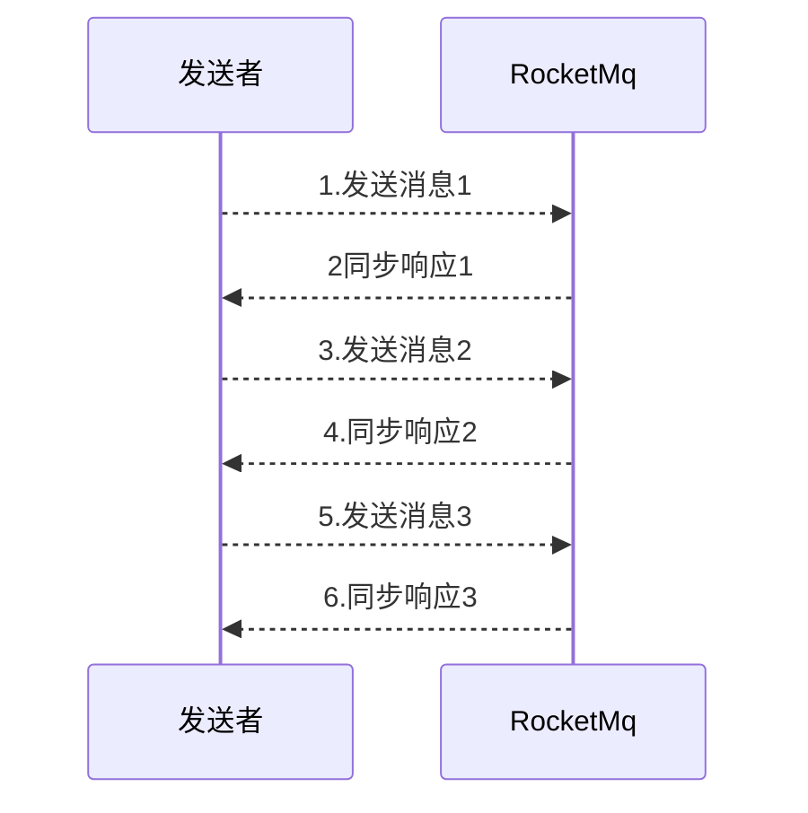
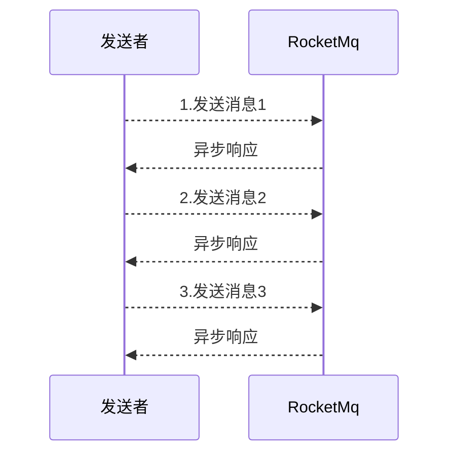
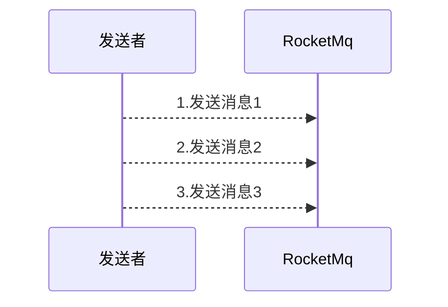

# 1. RocketMq概述

> 笔记来源: [尚硅谷Mq视频](https://www.bilibili.com/video/BV1cf4y157sz)
>
> https://www.bilibili.com/video/BV1cf4y157sz/?p=90&spm_id_from=pageDriver&vd_source=d9d3eb78433e98d94cd75ddf5ac0382b

## 1. Mq概述

### 1. Mq简介

MQ，Message Queue，是一种提供消息队列服务的中间件，也称为消息中间件，是一套提供了消息生产、存储、消费全过程API的软件系统。消息即数据。一般消息的体量不会很大。

### 2. Mq用途

1. 限流削峰

MQ可以将系统的超量请求暂存其中，以便系统后期可以慢慢进行处理，从而避免了请求的丢失或系统被压垮。


2. 异步解耦

上游系统对下游系统的调用若为同步调用，则会大大降低系统的吞吐量与并发度，且系统耦合度太高。而异步调用则会解决这些问题。所以两层之间若要实现由同步到异步的转化，一般性做法就是，在这两层间添加一个MQ层。


3. 数据收集

分布式系统会产生海量级数据流，如：业务日志、监控数据、用户行为等。针对这些数据流进行实时或批量采集汇总，然后对这些数据流进行大数据分析，这是当前互联网平台的必备技术。通过MQ完成此类数据收集是最好的选择。

### 3. 常见Mq产品

1. ActiveMq

ActiveMQ是使用Java语言开发一款MQ产品。早期很多公司与项目中都在使用。但现在的社区活跃度已经很低。现在的项目中已经很少使用了。[博主本人整理的ActiveMq笔记](https://blog.csdn.net/qq_42059717/article/details/120351292)

2. RabbitMq

RabbitMQ是使用ErLang语言开发的一款MQ产品。其吞吐量较Kafka与RocketMQ要低，且由于其不是Java语言开发，所以公司内部对其实现定制化开发难度较大。

3. Kafka

Kafka是使用Scala/Java语言开发的一款MQ产品。其最大的特点就是高吞吐率，常用于大数据领域的实时计算、日志采集等场景。其没有遵循任何常见的MQ协议，而是使用自研协议。对于Spring Cloud Netflix，其仅支持RabbitMQ与Kafka。

4. RocketMq

RocketMQ是使用Java语言开发的一款MQ产品。经过数年阿里双11的考验，性能与稳定性非常高。其没有遵循任何常见的MQ协议，而是使用自研协议。对于Spring Cloud Alibaba，其支持RabbitMQ、 Kafka，但提倡使用RocketMQ。

### 4. Mq常见协议

1. JMS

JMS，Java Messaging Service（Java消息服务）。是Java平台上有关MOM（Message Oriented Middleware，面向消息的中间件 PO/OO/AO）的技术规范，它便于消息系统中的Java应用程序进行消息交换，并且通过提供标准的产生、发送、接收消息的接口，简化企业应用的开发。ActiveMQ是该协议的典型实现。

2. STOMP、AMQP、MQTT [详见连接](https://blog.csdn.net/qq_42059717/article/details/120351292?spm=1001.2014.3001.5502#:~:text=3.-,%E5%85%B6%E4%BB%96%E4%B8%8D%E9%87%8D%E8%A6%81%E7%9A%84%E5%8D%8F%E8%AE%AE,-AMQP)

## 2. RocketMq概述

### 1. 发展历程

2007年，阿里开始五彩石项目，Notify作为项目中交易核心消息流转系统，应运而生。Notify系统是RocketMQ的雏形。2010年，B2B大规模使用ActiveMQ作为阿里的消息内核。阿里急需一个具有海量堆积能力的消息系统。

2011年初，Kafka开源。淘宝中间件团队在对Kafka进行了深入研究后，开发了一款新的MQ，MetaQ。2012年，MetaQ发展到了v3.0版本，在它基础上进行了进一步的抽象，形成了RocketMQ，然后就将其进行了开源。

2015年，阿里在RocketMQ的基础上，又推出了一款专门针对阿里云上用户的消息系统Aliware MQ。

2016年双十一，RocketMQ承载了万亿级消息的流转，跨越了一个新的里程碑。11⽉28⽇，阿⾥巴巴向 Apache 软件基⾦会捐赠 RocketMQ，成为 Apache 孵化项⽬。

2017 年 9 ⽉ 25 ⽇，Apache 宣布 RocketMQ孵化成为 Apache 顶级项⽬（TLP ），成为国内⾸个互联⽹中间件在 Apache 上的顶级项⽬。

# 2. RocketMq的安装与启动

## 1. 基本概念

### 1 消息（Message）

消息是指，消息系统所传输信息的物理载体，生产和消费数据的最小单位，每条消息必须属于一个主题。

### 2 主题(Topic)

Topic表示一类消息的集合，每个主题包含若干条消息，每条消息只能属于一个主题，是RocketMQ进行消息订阅的基本单位。 topic:message 1:n message:topic 1:1

一个生产者可以同时发送多种Topic的消息；而一个消费者只对某种特定的Topic感兴趣，即只可以订阅和消费一种Topic的消息。 producer:topic 1:n consumer:topic 1:1

### 3 标签（Tag）

为消息设置的标签，用于同一主题下区分不同类型的消息。来自同一业务单元的消息，可以根据不同业务目的在同一主题下设置不同标签。标签能够有效地保持代码的清晰度和连贯性，并优化RocketMQ提供的查询系统。消费者可以根据Tag实现对不同子主题的不同消费逻辑，实现更好的扩展性。

Topic是消息的一级分类，Tag是消息的二级分类。

### **4** 队列（Queue)

存储消息的物理实体。一个Topic中可以包含多个Queue，每个Queue中存放的就是该Topic的消息。一个Topic的Queue也被称为一个Topic中消息的分区（Partition）。

一个Topic的Queue中的消息只能被一个消费者组中的一个消费者消费。一个Queue中的消息不允许同一个消费者组中的多个消费者同时消费。

### **5** 消息标识（MessageId/Key）

RocketMQ中每个消息拥有唯一的MessageId，且可以携带具有业务标识的Key，以方便对消息的查询。不过需要注意的是，MessageId有两个：在生产者send()消息时会自动生成一个MessageId（msgId)，

当消息到达Broker后，Broker也会自动生成一个MessageId(offsetMsgId)。msgId、offsetMsgId与key都称为消息标识。

- msgId：由producer端生成，其生成规则为：

  	producerIp + 进程pid + MessageClientIDSetter类的ClassLoader的hashCode +
  	
  	当前时间 + AutomicInteger自增计数器

- offsetMsgId：由broker端生成，其生成规则为：brokerIp + 物理分区的offset（Queue中的偏移量）

- key：由用户指定的业务相关的唯一标识

## 2. 系统架构


### 1. Producer

> 消息生产者，负责生产消息。Producer通过MQ的负载均衡模块选择相应的Broker集群邦队列进行消息投递，投递的过程支持快速失败并且低延迟。
> 		RocketMO中的消息生产者都是以生产者组(Producer Group)的形式出现的。生产者组是同一类生产者的集合，这类Producer发送相同Topic类型的消息。

### 2. Consumer

> 消息消费者，负责消费消息。一个消息消费者会从Broker服务器中获取到消息，并对消息进行相关业务处理。
>
> RocketMQ中的消息消费者都是以消费者组（Consumer Group）的形式出现的。消费者组是同一类消费者的集合，这类Consumer消费的是同一Topic类型的消息。消费者组使得在消息消费方面，实现负载均衡（将一个Topic中的不同的Queue平均分配给同一个Consumer Group的不同的Consumer，注意，并不是将消息负载均衡）和容错（一个Consmer挂了，该Consumer Group中的其它Consumer可以接着消费原Consumer消费的Queue）的目标变得非常容易。
>
> 
>
> 消费者组中Consumer的数量应该小于等于订阅Topic的Queue数量。如果超出Queue数量，则多出的Consumer将不能消费消息。
>
> 
>
> 不过，一个Topic类型的消息可以被多个消费者组同时消费。
>
> 1. 消费者组只能消费一个*Topic*的消息，不能同时消费多个*Topic*消息
>
> 2. 一个消费者组中的消费者必须订阅完全相同的*Topic*

### 3. Name Server

#### 1. 功能介绍

NameServer是一个Broker与Topic路由的注册中心，支持Broker的动态注册与发现。RocketMQ的思想来自于Kafka，而Kafka是依赖了Zookeeper的。所以，在RocketMQ的早期版本，即在MetaQ v1.0与v2.0版本中，也是依赖于Zookeeper的。从MetaQ v3.0，即RocketMQ开始去掉了Zookeeper依赖，使用了自己的NameServer。主要包括两个功能：

- Broker管理：接受Broker集群的注册信息并且保存下来作为路由信息的基本数据；提供心跳检测机制，检查Broker是否还存活。

- 路由信息管理：每个NameServer中都保存着Broker集群的整个路由信息和用于客户端查询的队列信息。Producer和Conumser通过NameServer可以获取整个Broker集群的路由信息，从而进行消息的投递和消费。

#### 2. 路由注册

NameServer通常也是以集群的方式部署，不过，NameServer是无状态的，即NameServer集群中的各个节点间是无差异的，各节点间相互不进行信息通讯。那各节点中的数据是如何进行数据同步的呢？在Broker节点启动时，轮询NameServer列表，与每个NameServer节点建立长连接，发起注册请求。在NameServer内部维护着⼀个Broker列表，用来动态存储Broker的信息。

优点：*NameServer*集群搭建简单，扩容简单。

缺点：对于*Broker*，必须明确指出所有*NameServer*地址。否则未指出的将不会去注册。也正因为如此，*NameServer*并不能随便扩容。因为，若*Broker*不重新配置，新增的*NameServer*对于Broker*来说是不可见的，其不会向这个*NameServer*进行注册。

Broker节点为了证明自己是活着的，为了维护与NameServer间的长连接，会将最新的信息以心跳包的方式上报给NameServer，每30秒发送一次心跳。心跳包中包含 BrokerId、Broker地址(IP+Port)、Broker名称、Broker所属集群名称等等。NameServer在接收到心跳包后，会更新心跳时间戳，记录这个Broker的最新存活时间。

#### 3. 路由剔除

由于Broker关机、宕机或网络抖动等原因，NameServer没有收到Broker的心跳，NameServer可能会将其从Broker列表中剔除。NameServer中有⼀个定时任务，每隔10秒就会扫描⼀次Broker表，查看每一个Broker的最新心跳时间戳距离当前时间是否超过120秒，如果超过，则会判定Broker失效，然后将其从Broker列表中剔除。

> 扩展：对于*RocketMQ*日常运维工作，例如*Broker*升级，需要停掉*Broker*的工作。*OP*需要怎么做？
>
> OP需要将*Broker*的读写权限禁掉。一旦*client(Consumer*或*Producer)*向*broker*发送请求，都会收到*broker*的*NO_PERMISSION*响应，然后*client*会进行对其它*Broker*的重试。
>
> 当*OP*观察到这个*Broker*没有流量后，再关闭它，实现*Broker*从*NameServer*的移除。
>
> *OP*：运维工程师
>
> *SRE*：*Site Reliability Engineer*，现场可靠性工程师

#### 4. 路由发现

RocketMQ的路由发现采用的是Pull模型。当Topic路由信息出现变化时，NameServer不会主动推送给客户端，而是客户端定时拉取主题最新的路由。默认客户端每30秒会拉取一次最新的路由。

>  扩展：
>
>  1. *Push*模型：推送模型。其实时性较好，是一个*“*发布*-*订阅*”*模型，需要维护一个长连接。而长连接的维护是需要资源成本的。该模型适合于的场景： **实时性要求较高** 或**Client数量不多，Server数据变化较频繁**
>
>  2. Pull模型：拉取模型。存在的问题是，实时性较差。
>
>  3. Long Polling*模型：长轮询模型。其是对*Push*与*Pull*模型的整合，充分利用了这两种模型的优势，屏蔽了它们的劣势。


#### 5. 客户端NameServer选择策略

这里的客户端指的是*Producer*与*Consumer*

客户端在配置时必须要写上NameServer集群的地址，那么客户端到底连接的是哪个NameServer节点呢？客户端首先会生产一个随机数，然后再与NameServer节点数量取模，此时得到的就是所要连接的节点索引，然后就会进行连接。如果连接失败，则会采用round-robin策略，逐个尝试着去连接其它节点。

首先采用的是随机策略进行的选择，失败后采用的是轮询策略。

> 扩展：*Zookeeper Client*是如何选择*Zookeeper Server*的？
>
> 简单来说就是，经过两次*Shufæ e*，然后选择第一台*Zookeeper Server*。
>
> 详细说就是，将配置文件中的*zk server*地址进行第一次*shufæ e*，然后随机选择一个。这个选择出的一般都是一个*hostname*。然后获取到该*hostname*对应的所有*ip*，再对这些*ip*进行第二次shuffle，从*shufæ e*过的结果中取第一个*server*地址进行连接。

### 4. Broker

#### 1. 功能介绍

Broker充当着消息中转角色，负责存储消息、转发消息。Broker在RocketMQ系统中负责接收并存储从生产者发送来的消息，同时为消费者的拉取请求作准备。Broker同时也存储着消息相关的元数据，包括消费者组消费进度偏移offset、主题、队列等。

>  Kafka 0.8版本之后，*offset*是存放在*Broker*中的，之前版本是存放在*Zookeeper*中的。

#### 2. 模块构成


Remoting Module：整个Broker的实体，负责处理来自clients端的请求。而这个Broker实体则由以下模块构成。

Client Manager：客户端管理器。负责接收、解析客户端(Producer/Consumer)请求，管理客户端。例如，维护Consumer的Topic订阅信息

Store Service：存储服务。提供方便简单的API接口，处理消息存储到物理硬盘和消息查询功能。

HA Service：高可用服务，提供Master Broker 和 Slave Broker之间的数据同步功能。

Index Service：索引服务。根据特定的Message key，对投递到Broker的消息进行索引服务，同时也提供根据Message Key对消息进行快速查询的功能。

#### 3. 集群部署


为了增强Broker性能与吞吐量，Broker一般都是以集群形式出现的。各集群节点中可能存放着相同Topic的不同Queue。不过，这里有个问题，如果某Broker节点宕机，如何保证数据不丢失呢？其解决方案是，将每个Broker集群节点进行横向扩展，即将Broker节点再建为一个HA集群，解决单点问题。

Broker节点集群是一个主从集群，即集群中具有Master与Slave两种角色。Master负责处理读写操作请求，Slave负责对Master中的数据进行备份。当Master挂掉了，Slave则会自动切换为Master去工作。所以这个Broker集群是主备集群。一个Master可以包含多个Slave，但一个Slave只能隶属于一个Master。Master与Slave 的对应关系是通过指定相同的BrokerName、不同的BrokerId 来确定的。BrokerId为0表示Master，非0表示Slave。每个Broker与NameServer集群中的所有节点建立长连接，定时注册Topic信息到所有NameServer。

### **5** 工作流程

#### 1. 具体流程

1. 启动NameServer，NameServer启动后开始监听端口，等待Broker、Producer、Consumer连接。

2. 启动Broker时，Broker会与所有的NameServer建立并保持长连接，然后每30秒向NameServer定时发送心跳包。

3. 发送消息前，可以先创建Topic，创建Topic时需要指定该Topic要存储在哪些Broker上，当然，在创建Topic时也会将Topic与Broker的关系写入到NameServer中。不过，这步是可选的，也可以在发送消息时自动创建Topic。

4. Producer发送消息，启动时先跟NameServer集群中的其中一台建立长连接，并从NameServer中获取路由信息，即当前发送的Topic消息的Queue与Broker的地址（IP+Port）的映射关系。然后根据算法策略从队选择一个Queue，与队列所在的Broker建立长连接从而向Broker发消息。当然，在获取到路由信息后，Producer会首先将路由信息缓存到本地，再每30秒从NameServer更新一次路由信息。

5. Consumer跟Producer类似，跟其中一台NameServer建立长连接，获取其所订阅Topic的路由信息，然后根据算法策略从路由信息中获取到其所要消费的Queue，然后直接跟Broker建立长连接，开始消费其中的消息。Consumer在获取到路由信息后，同样也会每30秒从NameServer更新一次路由信息。不过不同于Producer的是，Consumer还会向Broker发送心跳，以确保Broker的存活状态。

#### 2. Topic的创建模式

手动创建Topic时，有两种模式：

- 集群模式：该模式下创建的Topic在该集群中，所有Broker中的Queue数量是相同的。

- Broker模式：该模式下创建的Topic在该集群中，每个Broker中的Queue数量可以不同。

自动创建Topic时，默认采用的是Broker模式，会为每个Broker默认创建4个Queue。

#### 3. 读/写队列

从物理上来讲，读/写队列是同一个队列。所以，不存在读/写队列数据同步问题。读/写队列是逻辑上进行区分的概念。一般情况下，读/写队列数量是相同的。例如，创建Topic时设置的写队列数量为8，读队列数量为4，此时系统会创建8个Queue，分别是0 1 2 34 5 6 7。Producer会将消息写入到这8个队列，但Consumer只会消费0 1 2 3这4个队列中的消息，4 5 67中的消息是不会被消费到的。

再如，创建Topic时设置的写队列数量为4，读队列数量为8，此时系统会创建8个Queue，分别是0 1 2 34 5 6 7。Producer会将消息写入到0 1 2 3 这4个队列，但Consumer只会消费0 1 2 3 4 5 6 7这8个队列中的消息，但是4 5 6 7中是没有消息的。此时假设Consumer Group中包含两个Consuer，Consumer1消费0 1 2 3，而Consumer2消费4 5 6 7。但实际情况是，Consumer2是没有消息可消费的。

也就是说，当读/写队列数量设置不同时，总是有问题的。那么，为什么要这样设计呢？

其这样设计的目的是为了，方便Topic的Queue的缩容。

例如，原来创建的Topic中包含16个Queue，如何能够使其Queue缩容为8个，还不会丢失消息？可以动态修改写队列数量为8，读队列数量不变。此时新的消息只能写入到前8个队列，而消费都消费的却是16个队列中的数据。当发现后8个Queue中的消息消费完毕后，就可以再将读队列数量动态设置为8。整个缩容过程，没有丢失任何消息。

perm用于设置对当前创建Topic的操作权限：2表示只写，4表示只读，6表示读写。

# 3. 安装与启动

## 1. 准备工作

1. 需要一个JDK1.8  64为版本的
2. 下载RocketMq安装包[RocketMq4.8.0](https://archive.apache.org/dist/rocketmq/4.8.0/rocketmq-all-4.8.0-bin-release.zip)

3. 上传到服务器

```shell
scp rocketmq-all-4.8.0-bin-release.zip root@ip:/opt
```

4. 解压

```shell
unzip rocketmq-all-4.8.0-bin-release.zip -d rocketmq
```

## 2. 修改启动配置

1. 修改启动配置runserver，启动的配置是4G

```shell
# windows 打开bin下的runserver.cmd
# 修改第29行，windows下默认2G
# 默认 set "JAVA_OPT=%JAVA_OPT% -server -Xms2g -Xmx2g -Xmn1g -XX:MetaspaceSize=128m -XX:MaxMetaspaceSize=320m"
set "JAVA_OPT=%JAVA_OPT% -server -Xms256m -Xmx256m -Xmn256m -XX:MetaspaceSize=128m -XX:MaxMetaspaceSize=320m"
# linux 打开bin下的runserver.sh
# 修改 82行 linux下默认4G
# 默认JAVA_OPT="${JAVA_OPT} -server -Xms4g -Xmx4g -Xmn2g -XX:MetaspaceSize=128m -XX:MaxMetaspaceSize=320m"
JAVA_OPT="${JAVA_OPT} -server -Xms256m -Xmx256m -Xmn256m -XX:MetaspaceSize=128m -XX:MaxMetaspaceSize=320m"
```

2. 修改runbroker配置，同样是改成这么大

## 3. 启动

1. 启动NameServer

```shell
# linux 使用nohup启动命令窗口关闭也不会停止
nohup sh bin/mqnamesrv &
# window 
cd rocketmq/bin
# 启动命令
mqnamesrv.cmd
# 启动成功
Java HotSpot(TM) 64-Bit Server VM warning: Using the DefNew young collector with the CMS collector is deprecated and will likely be removed in a future release
Java HotSpot(TM) 64-Bit Server VM warning: UseCMSCompactAtFullCollection is deprecated and will likely be removed in a future release.
The Name Server boot success. serializeType=JSON
# 查询是否成功,启动一个新的窗口
cd rocketmq && jps
# 启动输出
18132 NamesrvStartup
2396 Jps
```

2. 启动broker

```shell
# linux
nohup sh bin/mqbroker -n localhost:9876 &
# windows
mqbroker.cmd -n localhost:9876
# 启动成功提示
The broker[eleven, 192.168.0.100:10911] boot success. serializeType=JSON and name server is localhost:9876
```

3. 关闭

```shell
# 都是使用mqshutdown关闭
mqshutdown broker
mqshutdown namesrv
```

4. 如果jps不提示信息

```shell
# 安装应用
yum list *openjdk-devel*  
# 安装相关依赖
yum install java-1.8.0-openjdk-devel.x86_64
```
## 4. 发送接受消息

1. 发送消息

```shell
# linux 下添加环境变量
export NAMESRV_ADDR=localhost:9876
# windows 下就创建个环境变量 NAMESRV_ADDR localhost:9876
# linux 启动生产者
# sh bin/tools.sh org.apache.rocketmq.example.quickstart.Producer
# windows
# tools.cmd org.apache.rocketmq.example.quickstart.Producer
```
2. 生产消息如下

```text
SendResult [sendStatus=SEND_OK, msgId=7F00000117B729453F44384C9B3E03E7, offsetMsgId=C0A8218100002A9F00000000000F79E7, messageQueue=MessageQueue [topic=TopicTest, brokerName=localhost.localdomain, queueId=2], queueOffset=1249]
[NettyClientSelector_1] INFO  RocketmqRemoting - closeChannel: close the connection to remote address[127.0.0.1:9876] result: true
[NettyClientSelector_1] INFO  RocketmqRemoting - closeChannel: close the connection to remote address[192.168.33.129:10911] result: true
```


2. 接受消息
- linux启动生产者
  sh bin/tools.sh org.apache.rocketmq.example.quickstart.Consumer

-  windows
   tools.cmd org.apache.rocketmq.example.quickstart.Consumer
-  消费如下
> ConsumeMessageThread_8 Receive New Messages: [MessageExt [brokerName=localhost.localdomain, queueId=2, storeSize=203, queueOffset=959, sysFlag=0, bornTimestamp=1689085171782, bornHost=/192.168.33.129:35814, storeTimestamp=1689085171782, storeHost=/192.168.33.129:10911, msgId=C0A8218100002A9F00000000000BE27D, commitLogOffset=778877, bodyCRC=1562656166, reconsumeTimes=0, preparedTransactionOffset=0, toString()=Message{topic='TopicTest', flag=0, properties={MIN_OFFSET=0, MAX_OFFSET=1000, CONSUME_START_TIME=1689085189877, UNIQ_KEY=7F00000116F929453F443849F8460347, CLUSTER=DefaultCluster, WAIT=true, TAGS=TagA}, body=[72, 101, 108, 108, 111, 32, 82, 111, 99, 107, 101, 116, 77, 81, 32, 56, 51, 57], transactionId='null'}]]


3. 如果提示连接失败的话

```shell
# linux 下添加环境变量
export NAMESRV_ADDR=localhost:9876
# 关闭mqbroker
mqshutdown broker
# 重启
mqbroker.cmd -n localhost:9876 -c ../conf/broker.conf
```

## 5. 下载可视化页面

### 1. 下载源码

1. 下载地址 https://github.com/apache/rocketmq-externals/releases，下载console的那个
2. 直接访问 https://codeload.github.com/apache/rocketmq-externals/zip/refs/tags/rocketmq-console-1.0.0 这个地址下载也行

### 2. 修改配置

1. 找到`src/main/resources/application.properties`

```properties
# 随便找个不常用的就行了
server.port=7999
rocketmq.config.namesrvAddr=localhost:9876
```

2. 添加依赖

> *JAXB*，*Java Architechture for Xml Binding*，用于*XML*绑定的*Java*技术，是一个业界标准，是一项可以根据*XML Schema*生成*Java*类的技术。

```xml
<!-- 找到pom.xml -->
<dependencies>
    <dependency>
        <groupId>javax.xml.bind</groupId>
        <artifactId>jaxb-api</artifactId>
        <version>2.3.0</version>
    </dependency>
    <dependency>
        <groupId>com.sun.xml.bind</groupId>
        <artifactId>jaxb-impl</artifactId>
        <version>2.3.0</version>
    </dependency>
    <dependency>
        <groupId>com.sun.xml.bind</groupId>
        <artifactId>jaxb-core</artifactId>
        <version>2.3.0</version>
    </dependency>
    <dependency>
        <groupId>javax.activation</groupId>
        <artifactId>activation</artifactId>
        <version>1.1.1</version>
    </dependency> 
</dependencies>

```

### 3. 打包

```shell
# 执行maven命令打包
mvn clean package -Dmaven.test.skip=true
# 打开打包好的项目
cd target
# 运行代码
# java -jar rocketmq-console-ng-1.0.0.jar && start chrome http://localhost:7999
```

> 这是啥玩意，老在这一行搁着给我报错
>

### 4. 错误集锦

1. Caused by: org.apache.rocketmq.remoting.exception.RemotingConnectException: connect to [null] failed

> 不要犹豫，直接打包一下发到linux上吧，我已经被这个问题折磨了两天了

```shell
# 进入rocketmq-console目录
mvn clean package -Dmaven.test.skip=true
# 上传到centos
cd target&& scp rocketmq-console-ng-1.0.0.jar root@192.168.33.128:/opt/software/
# 启动
nohup java -jar rocketmq-console-ng-1.0.0.jar > console.log & 
```

2. 连接不上centos

```shell
# 安装iptables
yum install iptables-services
# 修改配置文件
vim /etc/sysconfig/iptables
# 按i进入编辑模式找到下列内容
-A INPUT -m state --state NEW -m tcp -p tcp --dport 22 -j ACCEPT
#在该行下面添加
-A INPUT -m state --state NEW -m tcp -p tcp --dport 9876 -j ACCEPT
-A INPUT -m state --state NEW -m tcp -p tcp --dport 7999 -j ACCEPT
# 或者直接找到22那一行按yyp复制一行，改为80即可
# 想复制多行需要 yynp dd是删除当前行 yy3p就是复制三行
#按 esc退出编辑模式 :wq保存退出
:wq! 
#最后重启防火墙使配置生效
systemctl restart iptables.service
#设置防火墙开机启动
systemctl enable iptables.service 
```

# 4. 集群搭建理论

## 1. 数据复制与刷盘策略

1. 复制策略

> 复制策略是Broker的Master与Slave之间的数据同步方式,**异步复制策略会降低系统的写入延迟，RT变小，提高了系统的吞吐量**
>
> - 同步复制：消息写入master后，master会等待slave同步数据成功后才向producer返回成功ACK
>
> - 异步复制：消息写入master后，master立即向producer返回成功ACK，无需等待slave同步数据成功

2. 刷盘策略

> 刷盘策略指的是broker中消息的落盘方式，即消息发送到broker内存后消息持久化到磁盘的方式。分为
>
> - 同步刷盘：当消息持久化到broker的磁盘后才算是消息写入成功。
>
> - 异步刷盘：当消息写入到broker的内存后即表示消息写入成功，无需等待消息持久化到磁盘。
>
> **<font color=blue>刷盘带来的问题</font>**
>
> - 异步刷盘策略会降低系统的写入延迟，*RT*变小，提高了系统的吞吐量
> - 消息写入到*Broker*的内存，一般是写入到了*PageCache*
> - 对于异步 刷盘策略，消息会写入到*PageCache*后立即返回成功*ACK*。但并不会立即做落盘操作，而是当*PageCache*到达一定量时会自动进行落盘。

## 2.Broker集群模式

> 根据Broker集群中各个节点间关系的不同，Broker集群可以分为以下几类：

### 1. 单Master

> 只有一个broker（其本质上就不能称为集群）。这种方式也只能是在测试时使用，生产环境下不能使用，因为存在单点问题。

### 2. 多Master

> broker集群仅由多个master构成，不存在Slave。同一Topic的各个Queue会平均分布在各个master节点上。

- 优点： 配置简单，单个Master宕机或重启维护对应用无影响，在磁盘配置为RAID10时，即使机器宕机不可恢复情况下，由于RAID10磁盘非常可靠，消息也不会丢（异步刷盘丢失少量消息，同步刷盘一条不丢），性能最高；
- 缺点：单台机器宕机期间，这台机器上未被消费的消息在机器恢复之前不可订阅（不可消费），消息实时性会受到影响。

**<font color=red>以上优点的前提是，这些*Master*都配置了*RAID*磁盘阵列。如果没有配置，一旦出现某*Master*宕机，则会发生大量消息丢失的情况。</font>**

### 3. 多Master多Salve模式 异步复制

broker集群由多个master构成，每个master又配置了多个slave（在配置了RAID磁盘阵列的情况下，一个master一般配置一个slave即可）。master与slave的关系是主备关系，即master负责处理消息的读写请求，而slave仅负责消息的备份与master宕机后的角色切换。

异步复制即前面所讲的复制策略中的异步复制策略，即消息写入master成功后，master立即向producer返回成功ACK，无需等待slave同步数据成功。

该模式的最大特点之一是，当master宕机后slave能够自动切换为master。不过由于slave从master的同步具有短暂的延迟（毫秒级），所以当master宕机后，这种异步复制方式可能会存在少量消息的丢失问题。

*Slave*从*Master*同步的延迟越短，其可能丢失的消息就越少

对于*Master*的*RAID*磁盘阵列，若使用的也是异步复制策略，同样也存在延迟问题，同样也可能会丢失消息。但*RAID*阵列的秘诀是微秒级的（因为是由硬盘支持的），所以其丢失的数据量会更少

### 4. 多Master多Salve模式 同步双写

该模式是多Master多Slave模式的同步复制实现。所谓同步双写，指的是消息写入master成功后，master会等待slave同步数据成功后才向producer返回成功ACK，即master与slave都要写入成功后才会返回成功ACK，也即双写。该模式与异步复制模式相比，优点是消息的安全性更高，不存在消息丢失的情况。但单个消息的RT略高，从而导致性能要略低（大约低10%）。

该模式存在一个大的问题：对于目前的版本，Master宕机后，Slave不会自动切换到Master。

### 5. 最佳实践

一般会为Master配置RAID10磁盘阵列，然后再为其配置一个Slave。即利用了RAID10磁盘阵列的高效、安全性，又解决了可能会影响订阅的问题。

- *RAID*磁盘阵列的效率要高于*Master-Slave*集群。因为*RAID*是硬件支持的。也正因为如此，所以*RAID*阵列的搭建成本较高。

- 多*Master+RAID*阵列，与多*Master*多*Slave*集群的区别
  - 多*Master+RAID*阵列，其仅仅可以保证数据不丢失，即不影响消息写入，但其可能会影响到消息的订阅。但其执行效率要远高于多Master多Slave集群
  - 多*Master*多*Slave*集群，其不仅可以保证数据不丢失，也不会影响消息写入。其运行效率要低于多Master+RAID阵列

## 3. 磁盘阵列RAID

### 1. RAID历史

1988 年美国加州大学伯克利分校的 D. A. Patterson 教授等首次在论文 “A Case of Redundant Array of Inexpensive Disks” 中提出了 RAID 概念 ，即廉价冗余磁盘阵列（

Redundant Array of InexpensiveDisks ）。由于当时大容量磁盘比较昂贵， RAID 的基本思想是将多个容量较小、相对廉价的磁盘进行有机组合，从而以较低的成本获得与昂贵大容量磁盘相当的容量、性能、可靠性。随着磁盘成本和价格的不断降低， “廉价” 已经毫无意义。因此， RAID 咨询委员会（ RAID Advisory Board, RAB ）决定用 独立 ” 替代 “ 廉价 ” ，于时 RAID 变成了独立磁盘冗余阵列（ Redundant Array of Independent Disks ）。但这仅仅是名称的变化，实质内容没有改变

### 2. RAID 等级

RAID 这种设计思想很快被业界接纳， RAID 技术作为高性能、高可靠的存储技术，得到了非常广泛的应用。 RAID 主要利用镜像、数据条带和数据校验三种技术来获取高性能、可靠性、容错能力和扩展性，根据对这三种技术的使用策略和组合架构，可以把 RAID 分为不同的等级，以满足不同数据应用的需求。

D. A. Patterson 等的论文中定义了 RAID0 ~ RAID6 原始 RAID 等级。随后存储厂商又不断推出 RAID7、 RAID10、RAID01 、 RAID50 、 RAID53 、 RAID100 等 RAID 等级，但这些并无统一的标准。目前业界与学术界公认的标准是 RAID0 ~ RAID6 ，而在实际应用领域中使用最多的 RAID 等级是 RAID0 、RAID1 、 RAID3 、 RAID5 、 RAID6 和 RAID10。RAID 每一个等级代表一种实现方法和技术，等级之间并无高低之分。在实际应用中，应当根据用户的数据应用特点，综合考虑可用性、性能和成本来选择合适的 RAID 等级，以及具体的实现方式。

### 3. 关键技术

#### 1. 镜像技术

镜像技术是一种冗余技术，为磁盘提供数据备份功能，防止磁盘发生故障而造成数据丢失。对于 RAID而言，采用镜像技术最典型地的用法就是，同时在磁盘阵列中产生两个完全相同的数据副本，并且分布在两个不同的磁盘上。镜像提供了完全的数据冗余能力，当一个数据副本失效不可用时，外部系统仍可正常访问另一副本，不会对应用系统运行和性能产生影响。而且，镜像不需要额外的计算和校验，故障修复非常快，直接复制即可。镜像技术可以从多个副本进行并发读取数据，提供更高的读 I/O 性能，但不能并行写数据，写多个副本通常会导致一定的 I/O 性能下降。

镜像技术提供了非常高的数据安全性，其代价也是非常昂贵的，需要至少双倍的存储空间。高成本限制了镜像的广泛应用，主要应用于至关重要的数据保护，这种场合下的数据丢失可能会造成非常巨大的损失。

#### 2. 数据条带技术

数据条带化技术是一种自动将 I/O操作负载均衡到多个物理磁盘上的技术。更具体地说就是，将一块连续的数据分成很多小部分并把它们分别存储到不同磁盘上。这就能使多个进程可以并发访问数据的多个不同部分，从而获得最大程度上的 I/O 并行能力，极大地提升性能。

#### 3. 数据校验技术

数据校验技术是指， RAID 要在写入数据的同时进行校验计算，并将得到的校验数据存储在 RAID 成员磁盘中。校验数据可以集中保存在某个磁盘或分散存储在多个不同磁盘中。当其中一部分数据出错时，就可以对剩余数据和校验数据进行反校验计算重建丢失的数据。

数据校验技术相对于镜像技术的优势在于节省大量开销，但由于每次数据读写都要进行大量的校验运算，对计算机的运算速度要求很高，且必须使用硬件 RAID 控制器。在数据重建恢复方面，检验技术比镜像技术复杂得多且慢得多。

### 4. RAID分类

从实现角度看， RAID 主要分为软 RAID、硬 RAID 以及混合 RAID 三种。

- 软 RAID

所有功能均有操作系统和 CPU 来完成，没有独立的 RAID 控制处理芯片和 I/O 处理芯片，效率自然最低。

- 硬 RAID

配备了专门的 RAID 控制处理芯片和 I/O 处理芯片以及阵列缓冲，不占用 CPU 资源。效率很高，但成本也很高。

- 混合 RAID

具备 RAID 控制处理芯片，但没有专门的I/O 处理芯片，需要 CPU 和驱动程序来完成。性能和成本在软RAID 和硬 RAID 之间。

### 5. RAID等级

#### 1. JBOD

JBOD ，Just a Bunch of Disks，磁盘簇。表示一个没有控制软件提供协调控制的磁盘集合，这是 RAID区别与 JBOD 的主要因素。 JBOD 将多个物理磁盘串联起来，提供一个巨大的逻辑磁盘。

JBOD 的数据存放机制是由第一块磁盘开始按顺序往后存储，当前磁盘存储空间用完后，再依次往后面的磁盘存储数据。 JBOD 存储性能完全等同于单块磁盘，而且也不提供数据安全保护。

JBOD 常指磁盘柜，而不论其是否提供 RAID 功能。不过，JBOD并非官方术语，官方称为Spanning。

其只是简单提供一种扩展存储空间的机制，*JBOD*可用存储容量等于所有成员磁盘的存储空间之和

#### 2. RAID0

RAID0 是一种简单的、无数据校验的数据条带化技术。实际上不是一种真正的 RAID ，因为它并不提供任何形式的冗余策略。 RAID0 将所在磁盘条带化后组成大容量的存储空间，将数据分散存储在所有磁盘中，以独立访问方式实现多块磁盘的并读访问。

理论上讲，一个由 n 块磁盘组成的 RAID0 ，它的读写性能是单个磁盘性能的 n 倍，但由于总线带宽等多种因素的限制，实际的性能提升低于理论值。由于可以并发执行 I/O 操作，总线带宽得到充分利用。再加上不需要进行数据校验，RAID0 的性能在所有 RAID 等级中是最高的。

RAID0 具有低成本、高读写性能、 100% 的高存储空间利用率等优点，但是它不提供数据冗余保护，一旦数据损坏，将无法恢复。

应用场景：对数据的顺序读写要求不高，对数据的安全性和可靠性要求不高，但对系统性能要求很高的场景。

> ***RAID0*与*JBOD*相同点：**
>
> - 存储容量：都是成员磁盘容量总和
>
> - 磁盘利用率，都是*100%*，即都没有做任何的数据冗余备份
>
> ***RAID0*与*JBOD*不同点：**
>
> - *JBOD*：数据是顺序存放的，一个磁盘存满后才会开始存放到下一个磁盘
>
> - *RAID*：各个磁盘中的数据写入是并行的，是通过数据条带技术写入的。其读写性能是*JBOD*的*n*倍

#### 3. RAID 1

RAID1 就是一种镜像技术，它将数据完全一致地分别写到工作磁盘和镜像磁盘，它的磁盘空间利用率为 50% 。 RAID1 在数据写入时，响应时间会有所影响，但是读数据的时候没有影响。 RAID1 提供了最佳的数据保护，一旦工作磁盘发生故障，系统将自动切换到镜像磁盘，不会影响使用。

RAID1是为了增强数据安全性使两块磁盘数据呈现完全镜像，从而达到安全性好、技术简单、管理方便。 RAID1 拥有完全容错的能力，但实现成本高。

应用场景：对顺序读写性能要求较高，或对数据安全性要求较高的场景。

#### 4. RAID10

RAID10是一个RAID1与RAID0的组合体，所以它继承了RAID0的快速和RAID1的安全。**简单来说就是，先做条带，再做镜像。发即将进来的数据先分散到不同的磁盘，再将磁盘中的数据做镜像**

#### 5. RAID01

RAID01是一个RAID0与RAID1的组合体，所以它继承了RAID0的快速和RAID1的安全。

简单来说就是，先做镜像再做条带。即将进来的数据先做镜像，再将镜像数据写入到与之前数据不同的磁盘，即再做条带。

*RAID10*要比*RAID01*的容错率再高，所以生产环境下一般是不使用*RAID01*的。

# 5. 集群搭建实践

## 1. 集群架构

这里要搭建一个双主双从异步复制的Broker集群。为了方便，这里使用了两台主机来完成集群的搭建。这两台主机的功能与broker角色分配如下表。

**<font color=red>注意这种方式在正式的生产环境并不可以使用，否则挂一个就全挂了</font>**

`/etc/sysconfig/network-scripts/ifcfg-ens33`

| 序号 | IP             | 功能               | BROKER角色     |
| ---- | -------------- | ------------------ | -------------- |
| 1    | 192.168.33.129 | namerserver+broker | master1+slave2 |
| 2    | 192.168.33.130 | namerserver+broker | master2+slave1 |

## 2. 修改配置信息

> 进入到自己的rocketmq安装目录中

 ```shell
 cd /opt/software/rocketmq
 cd conf
 ```
> 在这个配置文件夹下边有三种配置模式，是rocketmq官方给配置好的
>
> - 2m-2s-async：两主两从异步复制
> - 2m-2s-sync: 两主两从同步复制
> - 2m-noslave: 两主

1. 选择2m-2s-async

```shell
# 进入2m-2s-async
cd 2m-2s-async
# 文件列表
# a 主服务器
broker-a.properties
# a从服务器
broker-a-s.properties
# b主服务器
broker-b.properties
# b从服务器
broker-b-s.properties
```

2. 编辑broker-a.properties主服务器，添加第17行

```properties
# 指定整个broker集群的名称，或者说是RocketMQ集群的名称
brokerClusterName=DefaultCluster
# 指定master-slave集群的名称。一个RocketMQ集群可以包含多个master-slave集群
brokerName=broker-a
# master的brokerId为0
brokerId=0
# 指定删除消息存储过期文件的时间为凌晨4点
deleteWhen=04
# 指定未发生更新的消息存储文件的保留时长为48小时，48小时后过期，将会被删除
fileReservedTime=48
# 指定当前broker为异步复制master
brokerRole=ASYNC_MASTER
# 指定刷盘策略为异步刷盘
flushDiskType=ASYNC_FLUSH
# 指定Name Server的地址
# 添加这一行就行了
namesrvAddr=192.168.33.129:9876;192.168.33.130:9876
```

3. 修改broker-b-s.properties，添加第11-20行

```properties
brokerClusterName=DefaultCluster
# 指定这是另外一个master-slave集群
brokerName=broker-b
# slave的brokerId为非0
brokerId=1
deleteWhen=04
fileReservedTime=48
# 指定当前broker为slave
brokerRole=SLAVE
flushDiskType=ASYNC_FLUSH
namesrvAddr=192.168.33.129:9876;192.168.33.130:9876
# 指定Broker对外提供服务的端口，即Broker与producer与consumer通信的端口。默认10911。由于当前主机同时充当着master1与slave2，而前面的master1使用的是默认端口。这里需要将这两个端口加以区分，以区分出master1与slave2
listenPort=11911
# 指定消息存储相关的路径。默认路径为~/store目录。由于当前主机同时充当着master1与slave2，master1使用的是默认路径，这里就需要再指定一个不同路径
storePathRootDir=~/store-s
storePathCommitLog=~/store-s/commitlog
storePathConsumeQueue=~/store-s/consumequeue
storePathIndex=~/store-s/index
storeCheckpoint=~/store-s/checkpoint
abortFile=~/store-s/abort
```

## 3. 其他配置

> 自己看这配置就行了

```properties
#指定整个broker集群的名称，或者说是RocketMQ集群的名称
brokerClusterName=rocket-MS
#指定master-slave集群的名称。一个RocketMQ集群可以包含多个master-slave集群
brokerName=broker-a
#0 表示 Master，>0 表示 Slave
brokerId=0
#nameServer地址，分号分割
namesrvAddr=nameserver1:9876;nameserver2:9876
#默认为新建Topic所创建的队列数
defaultTopicQueueNums=4
#是否允许 Broker 自动创建Topic，建议生产环境中关闭
autoCreateTopicEnable=true
#是否允许 Broker 自动创建订阅组，建议生产环境中关闭
autoCreateSubscriptionGroup=true
#Broker对外提供服务的端口，即Broker与producer与consumer通信的端口
listenPort=10911
#HA高可用监听端口，即Master与Slave间通信的端口，默认值为listenPort+1
haListenPort=10912
#指定删除消息存储过期文件的时间为凌晨4点
deleteWhen=04
#指定未发生更新的消息存储文件的保留时长为48小时，48小时后过期，将会被删除
fileReservedTime=48
#指定commitLog目录中每个文件的大小，默认1G
mapedFileSizeCommitLog=1073741824
#指定ConsumeQueue的每个Topic的每个Queue文件中可以存放的消息数量，默认30w条
mapedFileSizeConsumeQueue=300000
#在清除过期文件时，如果该文件被其他线程所占用（引用数大于0，比如读取消息），此时会阻止此次删除任务，同时在第一次试图删除该文件时记录当前时间戳。该属性则表示从第一次拒绝删除后开始计时，该文件最多可以保留的时长。在此时间内若引用数仍不为0，则删除仍会被拒绝。不过时间到后，文件将被强制删除
destroyMapedFileIntervalForcibly=120000
#指定commitlog、consumequeue所在磁盘分区的最大使用率，超过该值，则需立即清除过期文件
diskMaxUsedSpaceRatio=88
#指定store目录的路径，默认在当前用户主目录中
storePathRootDir=/usr/local/rocketmq-all-4.5.0/store
#commitLog目录路径
storePathCommitLog=/usr/local/rocketmq-all-4.5.0/store/commitlog
#consumeueue目录路径
storePathConsumeQueue=/usr/local/rocketmq-all-4.5.0/store/consumequeue
#index目录路径
storePathIndex=/usr/local/rocketmq-all-4.5.0/store/index
#checkpoint文件路径
storeCheckpoint=/usr/local/rocketmq-all-4.5.0/store/checkpoint
#abort文件路径
abortFile=/usr/local/rocketmq-all-4.5.0/store/abort
#指定消息的最大大小
maxMessageSize=65536
#Broker的角色
# - ASYNC_MASTER 异步复制Master
# - SYNC_MASTER 同步双写Master
# - SLAVE
brokerRole=SYNC_MASTER
#刷盘策略
# - ASYNC_FLUSH 异步刷盘
# - SYNC_FLUSH 同步刷盘
flushDiskType=SYNC_FLUSH
#发消息线程池数量
sendMessageThreadPoolNums=128
#拉消息线程池数量
pullMessageThreadPoolNums=128
#强制指定本机IP，需要根据每台机器进行修改。官方介绍可为空，系统默认自动识别，但多网卡时IP地址可能读取错误
brokerIP1=192.168.3.105
```

## 4. 修改第二台主机的配置信息

1. 修改broker-a-s.properties,在最后添加下边的信息

```properties
namesrvAddr=192.168.33.129:9876;192.168.33.130:9876
# 指定Broker对外提供服务的端口，即Broker与producer与consumer通信的端口。默认10911。由于当前主机同时充当着master1与slave2，而前面的master1使用的是默认端口。这里需要将这两个端口加以区分，以区分出master1与slave2
listenPort=11911
# 指定消息存储相关的路径。默认路径为~/store目录。由于当前主机同时充当着master1与slave2，master1使用的是默认路径，这里就需要再指定一个不同路径
storePathRootDir=~/store-s
storePathCommitLog=~/store-s/commitlog
storePathConsumeQueue=~/store-s/consumequeue
storePathIndex=~/store-s/index
storeCheckpoint=~/store-s/checkpoint
abortFile=~/store-s/abort
```

2. 修改broker-b.properties

```properties
# 在最后添加上namesrvAddr
namesrvAddr=192.168.33.129:9876;192.168.33.130:9876
```

## 5. 启动服务器

1. 启动nameserver

```shell
# 与原来的启动方式完全相同
nohup sh bin/mqnamesrv > logs/namesrv.log &
# 查询日志
tail -100f logs/namesrv.log
# 出现boot success即可
```

2. 启动两个master

```shell
# 启动第一台
nohup sh bin/mqbroker -c conf/2m-2s-async/broker-a.properties > logs/broker-a-master.log &
# 启动第二台
nohup sh bin/mqbroker -c conf/2m-2s-async/broker-b.properties > logs/broker-b-master.log &
```

3. 启动两个slave

```shell
# 启动第一台
nohup sh bin/mqbroker -c conf/2m-2s-async/broker-b-s.properties > logs/broker-b-slave.log &
# 启动第二台
nohup sh bin/mqbroker -c conf/2m-2s-async/broker-a-s.properties > logs/broker-a-slave.log &
```

4. rocketmq-console

```properties
# 修改配置文件中的namesrvAddr
rocketmq.config.namesrvAddr=192.168.33.128:9876;192.168.33.129:9876
```

## 6. mqadmin命令

> 在mq解压目录的bin目录下有一个mqadmin命令，该命令是一个运维指令，用于对mq的主题，集群，broker 等信息进行管理。[github文档地址](https://github.com/apache/rocketmq/blob/master/docs/cn/operation.md )、[Gitee文档地址](

# 6. RocketMq工作原理

## 1. 消息的生产

### 1. 消息的生产过程

Producer可以将消息写入到某Broker中的某Queue中，其经历了如下过程：

- Producer发送消息之前，会先向NameServer发出获取消息Topic的路由信息的请求

- NameServer返回该Topic的路由表及Broker列表

- Producer根据代码中指定的Queue选择策略，从Queue列表中选出一个队列，用于后续存储消息

- Produer对消息做一些特殊处理，例如，消息本身超过4M，则会对其进行压缩

- Producer向选择出的Queue所在的Broker发出RPC请求，将消息发送到选择出的Queue

> **路由表：**实际是一个*Map*，*key*为*Topic*名称，*value*是一个*QueueData*实例列表。*QueueData*并不是一个*Queue*对应一个*QueueData*，而是一个*Broker*中该*Topic*的所有*Queue*对应一个QueueData*。即，只要涉及到该*Topic*的*Broker*，一个*Broker*对应一个*QueueData*。*QueueData*中包含*brokerName*。简单来说，路由表的*key*为*Topic*名称，*value*则为所有涉及该*Topic*的
>
> **BrokerName列表**:Broker*列表：其实际也是一个*Map*。*key*为*brokerName*，*value*为*BrokerData*。一个*Broker*对应一个*BrokerData*实例，对吗？不对。一套*brokerName*名称相同的*Master-Slave*小集群对应一个*BrokerData*。*BrokerData*中包含*brokerName*及一个*map*。该*map*的*key*为*brokerId*，*value*为该broker*对应的地址。*brokerId*为*0*表示该*broker*为*Master*，非*0*表示*Slave*。

### 2. Queue选择算法

对于无序消息，其Queue选择算法(消息投递算法)，常见有两种

1. 轮询算法

> 默认选择算法，该算法保证了每个Queue可以均匀的获取到消息
>
> **<font color=blue>存在问题，如果某些broker上的queue投递延迟比较严重，会导致producer缓存队列中出现较大的消息挤压，影响消息的投递性能</font>**

2. 最小投递延迟算法

> 该算法会统计每次消息投递的时间延迟，然后根据统计出来的结果将消息投递到时间延迟最小的queue，如果延迟相同的话则采用轮询算法投递消息
>
> **<font color=blue>存在的问题是消息分布不均匀</font>**

## 2. 消息的存储

- abort：该文件在Broker启动后会自动创建，正常关闭Broker，该文件会自动消失。若在没有启动

- Broker的情况下，发现这个文件是存在的，则说明之前Broker的关闭是非正常关闭。

- checkpoint：其中存储着commitlog、consumequeue、index文件的最后刷盘时间戳

- commitlog：其中存放着commitlog文件，而消息是写在commitlog文件中的

- config：存放着Broker运行期间的一些配置数据

- consumequeue：其中存放着consumequeue文件，队列就存放在这个目录中

- index：其中存放着消息索引文件indexFile

- lock：运行期间使用到的全局资源锁

### 1. commitlog

> 说明：在很多资料中*commitlog*目录中的文件简单就称为*commitlog*文件。但在源码中，该文件被命名为*mappedFile*。

1. 目录与文件

commitlog目录中存放着很多的mappedFile文件，当前Broker中的所有消息都是落盘到这些mappedFile文件中的。mappedFile文件大小为1G（小于等于1G），文件名由20位十进制数构成，表示当前文件的第一条消息的起始位移偏移量。

>  第一个文件名一定是*20*位*0*构成的。因为第一个文件的第一条消息的偏移量*commitlog offset*为*0*
>
>  当第一个文件放满时，则会自动生成第二个文件继续存放消息。假设第一个文件大小是*1073741820*字节（1G = 1073741824*字节），则第二个文件名就是*00000000001073741824*。
>
>  以此类推，第*n*个文件名应该是前*n-1*个文件大小之和。
>
>  一个*Broker*中所有*mappedFile*文件的*commitlog offset*是连续的


需要注意的是，一个Broker中仅包含一个commitlog目录，所有的mappedFile文件都是存放在该目录中的。即无论当前Broker中存放着多少Topic的消息，这些消息都是被顺序写入到了mappedFile文件中的。也就是说，这些消息在Broker中存放时并没有被按照Topic进行分类存放。

> *mappedFile*文件是顺序读写的文件，所有其访问效率很高
>
> 无论是*SSD*磁盘还是*SATA*磁盘，通常情况下，顺序存取效率都会高于随机存取。

2. 消息单元

mappedFile文件内容由一个个的消息单元构成。每个消息单元中包含消息总长度MsgLen、消息的物理位置physicalOffset、消息体内容Body、消息体长度BodyLength、消息主题Topic、Topic长度TopicLength、消息生产者BornHost、消息发送时间戳BornTimestamp、消息所在的队列QueueId、消息在Queue中存储的偏移量QueueOffset等近20余项消息相关属性。

> mappedFile文件内容由一个个的消息单元构成。每个消息单元中包含消息总长度MsgLen、消息的物理位置physicalOffset、消息体内容Body、消息体长度BodyLength、消息主题Topic、Topic长度TopicLength、消息生产者BornHost、消息发送时间戳BornTimestamp、消息所在的队列QueueId、消息在Queue中存储的偏移量QueueOffset等近20余项消息相关属性。

### 2. consumequeue

1. 目录与文件

为了提高效率，会为每个Topic在~/store/consumequeue中创建一个目录，目录名为Topic名称。在该Topic目录下，会再为每个该Topic的Queue建立一个目录，目录名为queueId。每个目录中存放着若干consumequeue文件，consumequeue文件是commitlog的索引文件，可以根据consumequeue定位到具体的消息。

consumequeue文件名也由20位数字构成，表示当前文件的第一个索引条目的起始位移偏移量。与mappedFile文件名不同的是，其后续文件名是固定的。因为consumequeue文件大小是固定不变的。

2. 索引条目

每个consumequeue文件可以包含30w个索引条目，每个索引条目包含了三个消息重要属性：消息在mappedFile文件中的偏移量CommitLog Offset、消息长度、消息Tag的hashcode值。这三个属性占20个字节，所以每个文件的大小是固定的30w * 20字节。

> 一个*consumequeue*文件中所有消息的*Topic*一定是相同的。但每条消息的*Tag*可能是不同的。

### 3. 对文件的读写

1. 消息写入

一条消息进入到Broker后经历了以下几个过程才最终被持久化。

> 1. Broker根据queueId，获取到该消息对应索引条目要在consumequeue目录中的写入偏移量，即QueueOffset
> 2. 将queueId、queueOffset等数据，与消息一起封装为消息单元
> 3. 将消息单元写入到commitlog
> 4. 同时，形成消息索引条目
> 5. 将消息索引条目分发到相应的consumequeue

2. 消息拉取

当consumer拉取消息的时候会经历下面几个步骤

> 1. Consumer获取到其要消费消息所在Queue的消费偏移量offset，计算出其要消费消息的消息offset,消费*offset*即消费进度，*consumer*对某个*Queue*的消费*offset*，即消费到了该*Queue*的第几条消息,消息*offset =* 消费*offset + 1*
> 2. Consumer向Broker发送拉取请求，其中会包含其要拉取消息Queue、消息offset及消息Tag。
> 3. Broker计算在该consumequeue中的queueOffset。
> 4. 从该queueOffset处开始向后查找第一个指定Tag的索引条目。
> 5. 解析该索引条目的前8个字节，即可定位到该消息在commitlog中的commitlog offset
> 6. 从对应commitlog offset中读取消息单元，并发送给Consumer

3. 性能提升

RocketMQ中，无论是消息本身还是消息索引，都是存储在磁盘上的。其不会影响消息的消费吗？当然不会。其实RocketMQ的性能在目前的MQ产品中性能是非常高的。因为系统通过一系列相关机制大大提升了性能。首先，RocketMQ对文件的读写操作是通过mmap零拷贝进行的，将对文件的操作转化为直接对内存地址进行操作，从而极大地提高了文件的读写效率。

其次，consumequeue中的数据是顺序存放的，还引入了PageCache的预读取机制，使得对consumequeue文件的读取几乎接近于内存读取，即使在有消息堆积情况下也不会影响性能。*PageCache*机制，页缓存机制，是*OS*对文件的缓存机制，用于加速对文件的读写操作。一般来说，程序对文件进行顺序读写的速度几乎接近于内存读写速度，主要原因是由于*OS*使用*PageCache*机制对读写访问操作进行性能优化，将一部分的内存用作*PageCache*。

写操作：*OS*会先将数据写入到*PageCache*中，随后会以异步方式由*pdæ ush*（*page dirty æ ush)*内核线程将*Cache*中的数据刷盘到物理磁盘

读操作：若用户要读取数据，其首先会从*PageCache*中读取，若没有命中，则*OS*在从物理磁盘上加载该数据到*PageCache*的同时，也会顺序对其相邻数据块中的数据进行预读取。

RocketMQ中可能会影响性能的是对commitlog文件的读取。因为对commitlog文件来说，读取消息时会产生大量的随机访问，而随机访问会严重影响性能。不过，如果选择合适的系统IO调度算法，比如设置调度算法为Deadline（采用SSD固态硬盘的话），随机读的性能也会有所提升。

### 4. 与Kafka对比

RocketMQ的很多思想来源于Kafka，其中commitlog与consumequeue就是。

RocketMQ中的commitlog目录与consumequeue的结合就类似于Kafka中的partition分区目录。mappedFile文件就类似于Kafka中的segment段。

*Kafka*中的*Topic*的消息被分割为一个或多个*partition*。*partition*是一个物理概念，对应到系统上就是*topic*目录下的一个或多个目录。每个*partition*中包含的文件称为*segment*，是具体存放消息的文件。

*Kafka*中消息存放的目录结构是：*topic*目录下有*partition*目录，*partition*目录下有*segment*文件 Kafka中没有二级分类标签*Tag*这个概念*Kafka*中无需索引文件。因为生产者是将消息直接写在了*partition*中的，消费者也是直接从partition中读取数据的

## 3. indexFile

除了通过通常的指定Topic进行消息消费外，RocketMQ还提供了根据key进行消息查询的功能。该查询是通过store目录中的index子目录中的indexFile进行索引实现的快速查询。当然，这个indexFile中的索引数据是在包含了key的消息被发送到Broker时写入的。如果消息中没有包含key，则不会写入。

### 1. 索引条目结构

> 每个Broker中会包含一组indexFile，每个indexFile都是以一个时间戳命名的（这个indexFile被创建时的时间戳）。每个indexFile文件由三部分构成：indexHeader，slots槽位，indexes索引数据。每个indexFile文件中包含500w个slot槽。而每个slot槽又可能会挂载很多的index索引单元。

- beginTimestamp：该indexFile中第一条消息的存储时间

- endTimestamp：该indexFile中最后一条消息存储时间

- beginPhyoffset：该indexFile中第一条消息在commitlog中的偏移量commitlog offset

- endPhyoffset：该indexFile中最后一条消息在commitlog中的偏移量commitlog offset

- hashSlotCount：已经填充有index的slot数量（并不是每个slot槽下都挂载有index索引单元，这里统计的是所有挂载了index索引单元的slot槽的数量）

- indexCount：该indexFile中包含的索引单元个数（统计出当前indexFile中所有slot槽下挂载的所有index索引单元的数量之和）

key的hash值 % 500w的结果即为slot槽位，然后将该slot值修改为该index索引单元的indexNo，根据这个indexNo可以计算出该index单元在indexFile中的位置。不过，该取模结果的重复率是很高的，为了解决该问题，在每个index索引单元中增加了preIndexNo，用于指定该slot中当前index索引单元的前一个index索引单元。而slot中始终存放的是其下最新的index索引单元的indexNo，这样的话，只要找到了slot就可以找到其最新的index索引单元，而通过这个index索引单元就可以找到其之前的所有index索引单元。

*indexNo*是一个在*indexFile*中的流水号，从*0*开始依次递增。即在一个*indexFile*中所有*indexNo*是以此递增的。*indexNo*在*index*索引单元中是没有体现的，其是通过*indexes*中依次数出来的。

index索引单元默写20个字节，其中存放着以下四个属性：

- keyHash(4字节)：消息中指定的业务key的hash值

- phyOffset(8字节)：当前key对应的消息在commitlog中的偏移量commitlog offset

- timeDiff(4字节)：当前key对应消息的存储时间与当前indexFile创建时间的时间差

- preIndexNo(4字节)：当前slot下当前index索引单元的前一个index索引单元的indexNo

### 2. indexFile的创建

indexFile的文件名为当前文件被创建时的时间戳。这个时间戳有什么用处呢？

根据业务key进行查询时，查询条件除了key之外，还需要指定一个要查询的时间戳，表示要查询不大于该时间戳的最新的消息，即查询指定时间戳之前存储的最新消息。这个时间戳文件名可以简化查询，提高查询效率。具体后面会详细讲解。

indexFile文件是何时创建的？其创建的条件（时机）有两个：

- 当第一条带key的消息发送来后，系统发现没有indexFile，此时会创建第一个indexFile文件

- 当一个indexFile中挂载的index索引单元数量超出2000w个时，会创建新的indexFile。当带key的消息发送到来后，系统会找到最新的indexFile，并从其indexHeader的最后4字节中读取到indexCount。若indexCount >= 2000w时，会创建新的indexFile。

由此可以推算出，一个*indexFile*的最大大小是：*(40 + 500w \* 4 + 2000w \* 20)*字节

### 3. 查询流程

当消费者通过业务key来查询相应的消息时，其需要经过一个相对较复杂的查询流程。不过，在分析查询流程之前，首先要清楚几个定位计算式子：

```shell
计算指定消息key的slot槽位序号：
slot槽位序号 = key的hash % 500w

计算槽位序号为n的slot在indexFile中的起始位置：
slot(n)位置 = 40 + (n - 1) * 4

计算indexNo为m的index在indexFile中的位置：
index(m)位置 = 40 + 500w * 4 + (m - 1) * 20
```


*40*为*indexFile*中*indexHeader*的字节数

*500w \* 4* 是所有*slots*所占的字节数


## 4. 消息的消费

消费者从Broker中获取消息的方式有两种：pull拉取方式和push推动方式。消费者组对于消息消费的模式又分为两种：集群消费Clustering和广播消费Broadcasting。

### 1. 获取消费类型

#### 1. 拉取式消费

>  Consumer主动从Broker中拉取消息，主动权由Consumer控制。一旦获取了批量消息，就会启动消费过程。不过，该方式的实时性较弱，即Broker中有了新的消息时消费者并不能及时发现并消费。

#### 2. 推送式消费

> 该模式下Broker收到数据后会主动推送给Consumer。该获取方式一般实时性较高。该获取方式是典型的**<font color=blue>发布-订阅</font>**模式，即Consumer向其关联的Queue注册了监听器，一旦发现有新的消息到来就会触发回调的执行，回调方法是Consumer去Queue中拉取消息。而这些都是基于Consumer与Broker间的长连接的。长连接的维护是需要消耗系统资源的。

#### 3. 对比

- pull：需要应用去实现对关联Queue的遍历，实时性差；但便于应用控制消息的拉取

- push：封装了对关联Queue的遍历，实时性强，但会占用较多的系统资源

### 2. 消费模式

#### 1. 广播消费

> 广播消费模式下，相同Consumer Group的每个Consumer实例都接收同一个Topic的全量消息。即每条消息都会被发送到Consumer Group中的每个Consumer。

#### 2. 集群消费

> 集群消费模式下，相同Consumer Group的每个Consumer实例平均分摊同一个Topic的消息。即每条消息只会被发送到Consumer Group中的某个Consumer。

#### 3.消费进度保存

- 广播模式：消费进度保存在consumer端。因为广播模式下consumer group中每个consumer都会消费所有消息，但它们的消费进度是不同。所以consumer各自保存各自的消费进度。

- 集群模式：消费进度保存在broker中。consumer group中的所有consumer共同消费同一个Topic中的消息，同一条消息只会被消费一次。消费进度会参与到了消费的负载均衡中，故消费进度是需要共享的。

```shell
cd ~ && cd store/config
cat consumerOffset.json
```

### 3. Rebalance机制

> Rebalance机制讨论的前提是: 集群消费

#### 1. 什么是Rebalance

> Rebalance即再均衡，指的是，将⼀个Topic下的多个Queue在同⼀个Consumer Group中的多个Consumer间进行重新分配的过程。
>
> Rebalance机制的本意是为了提升消息的并行消费能力。例如，⼀个Topic下5个队列，在只有1个消费者的情况下，这个消费者将负责消费这5个队列的消息。如果此时我们增加⼀个消费者，那么就可以给其中⼀个消费者分配2个队列，给另⼀个分配3个队列，从而提升消息的并行消费能力。

#### 2. Rebalance限制

> 由于⼀个队列最多分配给⼀个消费者，因此当某个消费者组下的消费者实例数量大于队列的数量时，多余的消费者实例将分配不到任何队列。

#### 3. Rebalance危害

<font color=red>消费暂停</font>：在只有一个Consumer时，其负责消费所有队列；在新增了一个Consumer后会触发Rebalance的发生。此时原Consumer就需要暂停部分队列的消费，等到这些队列分配给新的Consumer后，这些暂停消费的队列才能继续被消费。

<font color=red>消费重复</font>：Consumer 在消费新分配给自己的队列时，必须接着之前Consumer 提交的消费进度的offset继续消费。然而默认情况下，offset是异步提交的，这个异步性导致提交到Broker的offset与Consumer实际消费的消息并不一致。这个不一致的差值就是可能会重复消费的消息。

> 同步提交：*consumer*提交了其消费完毕的一批消息的*offset*给*broker*后，需要等待*broker*的成功*ACK*。当收到*ACK*后，*consumer*才会继续获取并消费下一批消息。在等待*ACK*期间，*consumer*是阻塞的。
>
> 异步提交：*consumer*提交了其消费完毕的一批消息的*offset*给*broker*后，不需要等待*broker*的成功*ACK*。*consumer*可以直接获取并消费下一批消息。
>
> 对于一次性读取消息的数量，需要根据具体业务场景选择一个相对均衡的是很有必要的。因为数量过大，系统性能提升了，但产生重复消费的消息数量可能会增加；数量过小，系统性能会下降，但被重复消费的消息数量可能会减少

<font color=red>消费突刺</font>：由于Rebalance可能导致重复消费，如果需要重复消费的消息过多，或者因为Rebalance暂停时间过长从而导致积压了部分消息。那么有可能会导致在Rebalance结束之后瞬间需要消费很多消息。

#### 4. Rebalance产生原因

导致Rebalance产生的原因，一般有两个

1. 消费者订阅的Topic的Queue数量发生变化

> - Broker扩容或缩容
> - Broker升级运维
> - Broker与NamerServer之间的网络异常
> - Queue扩容或缩容

2. 消费者组中的消费者数量发生变化

> - Consumer Group扩容或缩容
> - Consumer升级运维
> - Consumer与NameServer网络异常

#### 5. Rebalance过程

在Broker中维护着多个Map集合，这些集合中动态存放着当前Topic中Queue的信息、Consumer Group中Consumer实例的信息。一旦发现消费者所订阅的Queue数量发生变化，或消费者组中消费者的数量发生变化，立即向Consumer Group中的每个实例发出Rebalance通知。

> TopicConfigManager：*key*是*topic*名称，*value*是TopicConfig。TopicConfig中维护着该*Topic*中所有*Queue*的数据。
>
> *ConsumerManager*：*key*是*Consumser Group Id*，*value*是*ConsumerGroupInfo*。
>
> *ConsumerGroupInfo*中维护着该*Group*中所有*Consumer*实例数据。
>
> *ConsumerOffsetManager*：*key*为Topic与订阅该Topic的Group的组合,即topic@group，value*是一个内层*Map*。内层*Map*的*key*为*QueueId*，内层*Map*的*value*为该*Queue*的消费进度*offset*。

Consumer实例在接收到通知后会采用Queue分配算法自己获取到相应的Queue，即由Consumer实例自主进行Rebalance。

#### 6. 与Kafka对比

在Kafka中，一旦发现出现了Rebalance条件，Broker会调用Group Coordinator来完成Rebalance。Coordinator是Broker中的一个进程。Coordinator会在Consumer Group中选出一个Group Leader。由这个Leader根据自己本身组情况完成Partition分区的再分配。这个再分配结果会上报给Coordinator，并由Coordinator同步给Group中的所有Consumer实例。

Kafka中的Rebalance是由Consumer Leader完成的。而RocketMQ中的Rebalance是由每个Consumer自身完成的，Group中不存在Leader。

### 4. Queue分配算法

一个Topic中的Queue只能由Consumer Group中的一个Consumer进行消费，而一个Consumer可以同时消费多个Queue中的消息。那么Queue与Consumer间的配对关系是如何确定的，即Queue要分配给哪个Consumer进行消费，也是有算法策略的。常见的有四种策略。这些策略是通过在创建Consumer时的构造器传进去的。

#### 1. 平均分配策略


该算法是要根据<font color=blue>avg = QueueCount / ConsumerCount</font> 的计算结果进行分配的。如果能够整除，则按顺序将avg个Queue逐个分配Consumer；如果不能整除，则将多余出的Queue按照Consumer顺序逐个分配。

该算法即，先计算好每个*Consumer*应该分得几个*Queue*，然后再依次将这些数量的*Queue*逐个分配个*Consumer*。

#### 2. 环形平均策略


环形平均算法是指，根据消费者的顺序，依次在由queue队列组成的环形图中逐个分配。该算法不用事先计算每个*Consumer*需要分配几个*Queue*，直接一个一个分即可。

#### 3. 一致性Hash策略


该算法会将consumer的hash值作为Node节点存放到hash环上，然后将queue的hash值也放到hash环上，通过顺时针方向，距离queue最近的那个consumer就是该queue要分配的consumer。**<font color=red>该算法存在的问题：分配不均。</font>**

#### 4. 同机房策略


该算法会根据queue的部署机房位置和consumer的位置，过滤出当前consumer相同机房的queue。然后按照平均分配策略或环形平均策略对同机房queue进行分配。如果没有同机房queue，则按照平均分配策略或环形平均策略对所有queue进行分配。

#### 5. 对比

一致性hash算法存在的问题：

两种平均分配策略的分配效率较高，一致性hash策略的较低。因为一致性hash算法较复杂。另外，一致性hash策略分配的结果也很大可能上存在不平均的情况。

一致性hash算法存在的意义：

其可以有效减少由于消费者组扩容或缩容所带来的大量的Rebalance。


### 5. 至少一次原则

RocketMQ有一个原则：每条消息必须要被成功消费一次。

那么什么是成功消费呢？Consumer在消费完消息后会向其消费进度记录器提交其消费消息的offset，offset被成功记录到记录器中，那么这条消费就被成功消费了。

**什么是消费进度记录器？**

> 对于广播消费模式来说，*Consumer*本身就是消费进度记录器。
>
> 对于集群消费模式来说，*Broker*是消费进度记录器。

## 5. 订阅关系的一致性

订阅关系的一致性指的是，同一个消费者组（Group ID相同）下所有Consumer实例所订阅的Topic与Tag及对消息的处理逻辑必须完全一致。否则，消息消费的逻辑就会混乱，甚至导致消息丢失。

### 1. 正确订阅关系

多个消费者组订阅了多个Topic，并且每个消费者组里的多个消费者实例的订阅关系保持了一致。


### 2. 错误订阅关系

一个消费者组订阅了多个Topic，但是该消费者组里的多个Consumer实例的订阅关系并没有保持一致。


#### 1. 订阅了不同Topic

该例中的错误在于，同一个消费者组中的两个Consumer实例订阅了不同的Topic。

- Consumer实例1-1：（订阅了topic为jodie_test_A，tag为所有的消息）

```java
Properties properties = new Properties();
properties.put(PropertyKeyConst.GROUP_ID, "GID_jodie_test_1");
Consumer consumer = ONSFactory.createConsumer(properties);
consumer.subscribe("jodie_test_A", "*", new MessageListener() {
    public Action consume(Message message, ConsumeContext context) {
        System.out.println(message.getMsgID());
        return Action.CommitMessage;
    }
});
```

- Consumer实例1-2：（订阅了topic为jodie_test_B，tag为所有的消息）

```java
Properties properties = new Properties();
properties.put(PropertyKeyConst.GROUP_ID, "GID_jodie_test_1");
Consumer consumer = ONSFactory.createConsumer(properties);
consumer.subscribe("jodie_test_B", "*", new MessageListener() {
    public Action consume(Message message, ConsumeContext context) {
        System.out.println(message.getMsgID());
        return Action.CommitMessage;
    }
});
```

#### 2. 订阅了不同Tag

该例中的错误在于，同一个消费者组中的两个Consumer订阅了相同Topic的不同Tag。

- Consumer实例2-1：（订阅了topic为jodie_test_A，tag为TagA的消息）

```java
Properties properties = new Properties();
properties.put(PropertyKeyConst.GROUP_ID, "GID_jodie_test_2");
Consumer consumer = ONSFactory.createConsumer(properties);
consumer.subscribe("jodie_test_A", "TagA", new MessageListener() {
    public Action consume(Message message, ConsumeContext context) {
        System.out.println(message.getMsgID());
        return Action.CommitMessage;
    }
});
```

- Consumer实例2-2：（订阅了topic为jodie_test_A，tag为所有的消息）

```java
Properties properties = new Properties();
properties.put(PropertyKeyConst.GROUP_ID, "GID_jodie_test_2");
Consumer consumer = ONSFactory.createConsumer(properties);
consumer.subscribe("jodie_test_A", "*", new MessageListener() {
    public Action consume(Message message, ConsumeContext context) {
        System.out.println(message.getMsgID());
        return Action.CommitMessage;
    }
});
```

#### 3. 订阅了不同数量的Topic

该例中的错误在于，同一个消费者组中的两个Consumer订阅了不同数量的Topic。

- Consumer实例3-1：（该Consumer订阅了两个Topic）

```java
Properties properties = new Properties();
properties.put(PropertyKeyConst.GROUP_ID, "GID_jodie_test_3");
Consumer consumer = ONSFactory.createConsumer(properties);
consumer.subscribe("jodie_test_A", "TagA", new MessageListener() {
    public Action consume(Message message, ConsumeContext context) {
        System.out.println(message.getMsgID());
        return Action.CommitMessage;
    }
});
consumer.subscribe("jodie_test_B", "TagB", new MessageListener() {
    public Action consume(Message message, ConsumeContext context) {
        System.out.println(message.getMsgID());
        return Action.CommitMessage;
    }
});
```

- Consumer实例3-2：（该Consumer订阅了一个Topic）

```java
Properties properties = new Properties();
properties.put(PropertyKeyConst.GROUP_ID, "GID_jodie_test_3");
Consumer consumer = ONSFactory.createConsumer(properties);
consumer.subscribe("jodie_test_A", "TagB", new MessageListener() {
    public Action consume(Message message, ConsumeContext context) {
        System.out.println(message.getMsgID());
        return Action.CommitMessage;
    }
});
```

## 6. offset管理

> 这里的offset指的是consumer的消费进度offset

消费进度offset是用来记录每个Queue的不同消费组的消费进度的。根据消费进度记录器的不同，可以分为两种模式：本地模式和远程模式。

### 1. 本地管理模式

当消费模式为广播消息时，offset使用本地模式存储。因为每条消息会被所有的消费者消费，每个消费者管理自己的消费进度，各个消费者之间不存在消费进度的交集。

Consumer在广播消费模式下offset相关数据以json格式持久化到Consumer本地磁盘文件中，<font color=red>默认文件路径在当前与用户主目录下的 `.rocketmq_offset/${clientId}/group/Offset.json`</font>其中`${clientId}`喂当前消费者ID，默认喂ip@DWFAULT; group为消费者组名称

### 2. 远程管理模式

当消费模式为集群消费时，offset使用远程模式管理。因为所有Cosnumer?实例对消息采用的是均衡消费，所有Consumer共享Queue的消费进度。

Consumer在集群消费模式下offset相关数据以json的形式持久化到Broker磁盘文件中，文件路径为当前用户主目录下的`store/config/consumerOffset.json`。

Broker启动时会加载这个文件，并写入到一个双层Map。外层map的key为topic@group,value为内层map。内层map的key为queueld,value为offset。当发生Rebalance时，新的Consumer会从该Map中获取到相应的数据来继续消费。

### 3. offset用途

消费者是如何从最开始持续消费消息的？消费者要消费的第一条消息的起始位置是用户自己通过`consumer.setConsumeFromWhere()`方法指定的。

在Consumer启动后，其要消费的第一条消息的起始位置常用的有三种，这三种位置可以通过枚举类型常量设置。这个枚举类型为`ConsumeFromWhere`。

```java
public enum ConsumerFormWhere {
    CONSUME_FROM_LAST_OFFSET,
    @Deprecated
    CONSUME_FROM_LAST_OFFSET_AND_FROM_MIN_WHEN_BOOT_FIRST,
    @Deprecated
    CONSUME_FROM_MIN_OFFSET,
    @Deprecated
    CONSUME_FROM_MAX_OFFSET,
    CONSUME_FROM_FIRST_OFFSET,
    CONSUME_FROM_TIMESTAMP,
}
```

| 序号 | 枚举                      | 描述                              |
| ---- | ------------------------- | --------------------------------- |
| 1    | CONSUME_FROM_LAST_OFFSET  | 从queue的当前最后一条消息开始消费 |
| 2    | CONSUME_FROM_FIRST_OFFSET | 从queue的第一条消息开始消费       |
| 3    | CONSUME_FROM_TIMESTAMP    | 从指定的具体时间戳开始消费        |

```java
// 指定时间戳消费
consumer.setConsumerTimestamp("20230725213800")
```

当消费完一批消息后，Consumer会提交其消费进度offset给Broker,Broker在收到消费进度后会将其更新到那个双层Map及consumerOffset.json文件中，然后向该Consumeri进行ACK,而ACK内容中包含三项数据：当前消费队列的最小`offset(minOffset)`、最大`offset(maxOffset)`、及下次消费的起始`offset (nextBeginOffset).`

### 4. 重试队列

当rocketMO对消息的消费出现异常时，会将发生异常的消息的offset提交到Brokert中的重试队列。系统在发生消息消费异常时会为当前的Topic@group创建一个重试队列，该队列以%RETRY%开头，到达重试时间后进行消费重试。

```shell
cat consumerOffset.json
```

### 5. offset的同步提交与异步提交

集群消费模式下，Consumeri消费完消息后会向Broker提交消费进度offset,其提交方式分为两种：

1. 同步提交：消费者在消费完一批消息后会向broker提交这些消息的offset,然后等待broker的成功响应。若在等待超时之前收到了成功响应。则继续读取下一批消息进行消费(从ACK中获取nextBeginOffset)。若没有收到响应，则会重新提交，直到获取到响应。而在这个等待过程中，消费者是阻塞的。其严重影响了消费者的吞吐量。
2. 异步提交：消费者在消费完一批消息后向broker提交offset,但无需等待Brokert的成功响应，可以继续读取并消费下一批消息。这种方式增加了消费者的吞吐量。但需要注意，broker在收到提交的offset后，还是会向消费者进行响应的。

##  7. 消息幂等

### 1. 什么是消费幂等

> 幂等:若某操作执行多次与执行一次对系统产生的影响是相同的，则称该操作是幂等的。

当出现消费者对某条消息重复消费的情况时，重复消费的结果与消费一次的结果是相同的，并且多次消费并未对业会系品何负面影响，那么这个消费过程就是消费幂等的。

在互联网应用中，尤其在网络不稳定的情况下，消息很有可能会出现重复发送或重复消费。如果重复的消息可能会影响业务处理，那么就应该对消息做幂等处理。

### 2. 重复消费的场景分析

> 一般重复小份的情况有三种

#### 1. 发送时消息重复

当一条消息已被成功发送到Broker并完成持久化，此时出现了网络闪断，从而导致Broker对Producer应答失败。如果此时Producer意识到消息发送失败并尝试再次发送消息，此时Broker中就可能会出现两条内容相同并且Message ID也相同的消息，那么后续Consumer就一定会消费两次该消息。

#### 2. 消费时消息重复

消息已投递到Consumer并完成业务处理，当Consumer给Broker反馈应答时网络闪断，Broker没有接收到消费成功响应。为了保证消息至少被消费一次的原则，Broker将在网络恢复后再次尝试投递之前已被处理过的消息，此时消费者就会收到与之前外理过的内容相同，Message D也相同的消息

#### 3. Rebalance时消息重复

当Consumer Group中的Consumer数量发生变化时，或其订阅的Topic的Oueue数量发生变化时，会触发Rebalance，此时Consumer可能会收到曾经被消费过的消息。

### 3. 通用解决方案

#### 1. 两要素

幂等解决方案的设计中涉及到两项要素: 幂等令牌，与唯一性处理。只要充分利用好这两要素，就可以设计出好的幂等解决方案。

1. 幂等令牌: 是生产者和消费者两者中的既定协议，通常指具备唯一业务标识的字符串。订单号，流水号等，一般有Producer随着消息一同发送过来。
2. 唯一性处理: 服务端通过采用一定的算法策略，保证同一个业务逻辑不会被重复执行成功多次，即便是多次支付操作，也只会执行成功一次。

#### 2. 解决方案

对于常见的系统，幂等性操作的通用性解决方案是

1. 首先通过缓存去重。在缓存中如果已经存在了某幂等令牌，则说明本次操作是重复性操作;若缓存没有命中，则进入下一步。

2. 在唯一性处理之前，先在数据库中查询幂等令牌作为索引的数据是否存在。若存在，则说明本次操作为重复性操作;若不存在，则进入下一步。

3. 在同一事务中完成三项操作:唯一性处理后，将幂等令牌写入到缓存，并将幂等令牌作为唯一索引的数据写入到DB中。

> 第一步已经判断过是否是重复性操作了。
>
> 能够进入第二步说明已经不是重复操作了。**<font color=red>这一步是否有效？</font>**
>
> **<font color=blue>一般缓存中的数据都是具有有效期的，缓存中的数据一单过期，就会发生缓存穿透，使请求直接到达DBMS</font>**

#### 3. 支付场景举例


1. 当支付请求到达后，首先在Redis缓存中却获取key为<font color=blue>支付流水号</font>的缓存value。若value不空，则说明本次支付是重复操作，业务系统直接返回调用侧重复支付标识; 若value为空，则进入下一步操作
2. 到DBMS中根据<font color=blue>支付流水号</font>查询是否存在相应实例。若存在，则说明本次支付是重复操作，业务系统直接返回调用侧重复支付标识;若不存在，则说明本次操作是首次操作，进入下一步完成唯一性处理
3. 在分布式事务中完成三项操作:
- 完成支付任务
- 将当前支付流水号作为key，任意字符串作为value，通过set(key, value,expireTime)将数据写入到Redis缓存
- 将当前支付流水号作为主键，与其它相关数据共同写入到DBMS

### 4. 消费幂等的实现

消费幂等的解决方案很简单: 为消息指定不会重复的唯一标识。因为Message ID有可能出现重复的情况所以真正安全的幂等处理，不建议以Message ID作为处理依据。最好的方式是以业务唯一标识作为幂等处理的关键依据，而业务的唯一标识可以通过消息Key设置。

以支付场景为例，可以将消息的Key设置为订单号，作为幂等处理的依据。具体代码示例如下

```java
Message message = new Message();
message.setKey("ORDERID_100");
SendResult result = producer.send(message);
```

消费者收到消息时可以根据消息的Key即订单号来实现消费幂等

```java
consumer.registerMessageListener(new MessageListenerConcurrently() {
    @Override
    public ConsumerConcurrentlyStatus consumeMessage(List<MessageExt> msgs, ConsumeConcurrentlyContext context) {
        for(MessageExt msg: msgs) {
            String key = msg.getKeys();
            // 根据业务唯一表示Key的幂等处理
            // todo 
        }
        return ConsumerConcurrentlyStatus.CONSUME_SUCCESS;
    }
})
```

> **<font color=red>RocketMq能够保证消息不丢失，但是不能保证消息不重复</font>**

## 8.  消息堆积和消息延迟

### 1. 概念

消息处理流程中，如果Consumer的消费速度跟不上Producer的发送速度，MQ中未处理的消息会越来越多，这部分消息就被称为<font color=blue>堆积消息</font>。消息出现堆积进而会造成消息的消费延迟。以下场景需要重点关注消息堆积和消费延迟问题:

- 业务系统上下游能力不匹配造成的持续堆积，且无法自行恢复
- 业务系统对消息的消费实时性要求较高，即使是短暂的堆积造成的消息延迟也无法接受

### 2. 产生原因分析


Consumer使用长轮询Pull模式消费消息时，分为以下两个阶段

#### 1. 拉取消息

Consumer通过长轮询Pull模式批量拉取的方式从服务端获取消息，将拉取到的消息缓存到本地缓冲队列中。对于拉取式消费，在内网环境下会有很高的吞吐量，所以这一阶段一般不会成为消息堆积的瓶颈。

> 一个单线程单分区的低规格主机(Consumer，408G)，其可达到几万的TPS。如果是多个分区多个线程，则可以轻松达到几十万的TPS。

#### 2. 消费消息

Consumer将本地缓存的消息提交到消费线程中，使用业务消费逻辑对消息进行处理，处理完毕后获取到一个结果。这是真正的消息消费过程。此时Consumer的消费能力就完全依赖于消息的消费耗时和消费并发度了。如果由于业务处理逻辑复杂等原因，导致处理单条消息的耗时较长，则整体的消息吞吐量肯定不会高，此时就会导致Consumer本地缓冲队列达到上限，停止从服务端拉取消息。

#### 3. 结论

消息堆积的主要瓶颈在于客户端的消费能力，而消费能力由<font color=blue>消费耗时和消费并发度</font>决定。<font color=red>优先解决消费耗时在考虑并发问题</font>

### 3. 消费耗时

影响消息处理时长的主要因素是代码逻辑。而代码逻辑中可能会影响处理时长代码主要有两种类型<font color=blue>CPU内部计算型代码和外部I/0操作型代码</font>。
通常情况下代码中如果没有复杂的递归和循环的话，内部计算耗时相对外部I/0操作来说几乎可以忽略.所以外部IO型代码是影响消息处理时长的主要症结所在

> 外部IO操作性代码
>
> - 读写外部数据库
> - 读写外部缓存
> - 下游系统调用， 如Dubbo的RPC远程调用， HTTPClient调用等等
>
> <font color=blue>提前梳理每个调用操作的预期好事，判断消费逻辑之中的IO操作号是是否合理</font>，**通常消失堆积是由于服务异常或者是达到了数据库的限制**
>
> 服务异常： 不仅仅是500这种，还有网络带宽问题等

### 4. 消费并发度

一般情况下，消费者端的消费并发度由单节点线程数和节点数量共同决定，其值为 **单节点线程数\*节点数量*。不过，通常需要优先调整单节点的线程数，若单机硬件资源达到了上限，则需要通过横向扩展来提高消费并发度。

> 单节点线程数：即单个Consumer所包含的线程数
>
> 节点数量：即Consumer Group中的Consumer数量

对于普通消息，延时消息和事务消息 并发计算都是 **<font color=blue>单节点线程数\*节点数量</font>**，但是对于顺序消息则是不同的，顺序消息的消费并发度取决于 **<font color=blue>Topic的Queue分区数量</font>**

> 1. 全局顺序消息: 该类型消息的Topic只有一个Queue分区。其可以保证该Topic的所有消息被顺序消费。为了保证这个全局顺序性，Consumer Group中在同一时刻只能有一个Consumer的一个线程进行消费。所以其并发度为1。
> 2. 分区顺序消息: 该类型消息的Topic有多Queue分区。其仅可以保证该Topic的每个Queue分区中的消息被顺序消费，不能保证整个Topic中消息的顺序消费。为了保证这个分区顺序性，每个Queue分区中的消息在Consumer Group中的同一时刻只能有一个Consumer的一个线程进行消费即，在同一时刻最多会出现多个Queue分有多Consumer的多个线程并行消费。所以其并发度为Topic的分区数量。

### 5. 单机线程数计算

对于一台主机中的线程池中的线程数的设置需要谨慎，不能盲目的直接调大线程数量，摄者过大的线程数反而会带来大量的线程切换的开销，理想环境下单节点的最有线程数计算模型为 C \* (T1 + T2) / T1

- C: CPU内核数量
- T1： CPU内部逻辑计算耗时
- T2：外部IO计算耗时

<font color=red>注意：该计算出来的数值是理想装填下的理想数值，在生产环境中不建议直接使用，而是根据当前环境，先设置一个比改制小的数值然后看压测效果，然后在逐步调大直到到达最佳性能</font>

### 6. 如何避免

为了避免在业务使用时出现非预期的消息堆积和消费延迟问题，需要在前期设计阶段对整个业务逻辑进行完善的排查和梳理。其中最重要的就是<font color=blue>梳理消息的消费耗时</font>和<font color=blue>设置消息消费的并发度。</font>
#### 1.梳理消息的消费耗时
通过压测获取消息的消费耗时，并对耗时较高的操作的代码逻辑进行分析。梳理消息的消费耗时需要关注以下信息:

- 消息消费逻辑的计算复杂度是否过高，代码是否存在无限循环和递归等缺陷。
- 消息消费逻辑中的I/0操作是否是必须的，能否用本地缓存等方案规避.
- 消费逻辑中的复杂耗时的操作是否可以做异步化处理。如果可以，是否会造成逻辑错乱

#### 2.设置消费并发度
对于消息消费并发度的计算，可以通过以下两步实施:

- 逐步调大单个Consumer节点的线程数，并观测节点的系统指标，得到单个节点最优的消费线程数和消息吞吐量。
- 根据上下游链路的流量峰值计算出需要设置的节点数

## 9. 消息的清理

消息被消费过后会被清理掉吗? 不会的。

消息是被顺序存储在commitlog文件的，且消息大小不定长，所以消息的清理是不可能以消息为单位进行清理的，而是以commitlog文件为单位进行清理的。否则会极具下降清理效率，并实现逻辑复杂。

commitlog文件存在一个过期时间，默认为72小时，即三天。除了用户手动清理外，在以下情况下也会被自动清理，无论文件中的消息是否被消费过:

- 文件过期，且到达<font color=blue>清理时间点 (默认为凌晨4点)后</font>，自动清理过期文件
- 文件过期，且磁盘空间占用率已达过期<font color=blue>清理警戒线默认75%</font>)后，无论是否达到清理时间点，都会自动清理过期文件
- 磁盘占用率达到<font color=blue>清理警戒线(默认85%)</font>后，开始按照设定好的规则清理文件，无论是否过期。默认会从最老的文件开始清理
- 磁盘占用率达到<font color=blue>系统危险警戒线 </font>(默认90%) 后，Broker将拒绝消息写入

> 需要注意以下几点
>
> 1. 对于RocketMO系统来说，删除个1G大小的文件，是一个压力巨大的IO作。在删除过程中，系统性能会骤然下降。所以，其默认清理时间点为凌晨4点，访问量最小的时间。也正因如果，我们要保障磁盘空间的空闲率，不要使用系统出现在其他时间点删除commitlog文件的情况。
> 2. 官方建议RocketMq服务的Linux文件采用ext4，因为对于文件删除操作ext4要比ext3性能好

# 7. RocketMq的应用

## 1. 普通消息

### 1. 消息发送分类

Producer对于消息发送的方式有很多种，不同的方式可能会产生不同的系统效果

#### 1.1 同步发送消息

同步发送消息是指，Producer发送一条消息后，会收到Mq返回的ACK之后才下发下一条消息，该方式的<font color=red>消息可靠性最高，但是消息发送的效率太低</font>。



#### 1.2 异步发送消息

异步发送消息是指，Producer发出消息后无需等待MO返回ACK，直接发送下一条消息。该方式的消息可靠性可以得到保障，消息发送效率也可以。




#### 1.3单向发送消息

单向发送消息是指，Producer仅仅负责发送消息，不等待不处理Mq的ACK，该发送方式是Mq也不返回ACK，<font color=red>效率最高，可靠性较差</font>



#### 1.4 对比

| 序号 | 方式         | ACK  | 消息效率 | 消息可靠性 |
| ---- | ------------ | ---- | -------- | ---------- |
| 1    | 同步发送消息 | 是   | 低       | 高         |
| 2    | 异步发送消息 | 否   | 高       | 中         |
| 3    | 单向发送消息 | 否   | 高       | 低         |

### 2. 代码举例

#### 2.1 导入依赖

> 创建一个Maven的Java工程 rocketmq-test

添加以下依赖

```xml
<properties>
    <project.build.sourceEncoding>UTF-8</project.build.sourceEncoding>
    <maven.compiler.source>1.8</maven.compiler.source>
    <maven.compiler.target>1.8</maven.compiler.target>
</properties>
<dependencies>
    <!-- 注意这里需要和线上的mq的版本一致 -->
    <dependency>
        <groupId>org.apache.rocketmq</groupId>
        <artifactId>rocketmq-client</artifactId>
        <version>4.8.0</version>
    </dependency>
</dependencies>
```

#### 2.2 同步发送消息

```java
package net.lesscoding.general;

import org.apache.rocketmq.client.exception.MQBrokerException;
import org.apache.rocketmq.client.exception.MQClientException;
import org.apache.rocketmq.client.producer.DefaultMQProducer;
import org.apache.rocketmq.client.producer.SendResult;
import org.apache.rocketmq.common.message.Message;
import org.apache.rocketmq.remoting.exception.RemotingException;

/**
 * @author eleven
 * @date 2023/10/8 20:57
 * @apiNote
 */
public class SyncProducer {
    public static void main(String[] args) throws MQClientException, MQBrokerException, RemotingException, InterruptedException {
        // - 创建消息生产者Producer，并指定生产者组名
        DefaultMQProducer producer = new DefaultMQProducer("group1");
        // - 指定nameServer地址
        producer.setNamesrvAddr("192.168.33.129:9876");
        // 超时时间
        producer.setSendMsgTimeout(1000000);
        // 发送失败重试三次
        producer.setRetryTimesWhenSendFailed(3);
        // - 启动producer
        producer.start();

        for (int i = 0; i < 10; i++) {
            byte[] body = ("Hi," + i).getBytes();
            Message message = new Message("TopicTest", "someTag", body);
            SendResult sendResult = producer.send(message);
            System.out.println(sendResult);
        }
        // - 关闭生产者Producer
        producer.shutdown();
    }
}

```

#### 2.3 异步发送消息

```java
package net.lesscoding.general;

import org.apache.rocketmq.client.producer.DefaultMQProducer;
import org.apache.rocketmq.client.producer.SendCallback;
import org.apache.rocketmq.client.producer.SendResult;
import org.apache.rocketmq.common.message.Message;

import java.util.concurrent.TimeUnit;

/**
 * @author eleven
 * @date 2023/9/5 22:29
 * @apiNote 异步消息发送者
 */
public class AsyncProducer {
    public static void main(String[] args) throws Exception {
        // - 创建消息生产者Producer，并指定生产者组名
        DefaultMQProducer producer = new DefaultMQProducer("group1");
        // - 指定nameServer地址
        producer.setNamesrvAddr("192.168.33.129:9876");
        // 超时时间
        producer.setSendMsgTimeout(5000);
        // 发送失败重试三次 默认为两次
        producer.setRetryTimesWhenSendFailed(3);
        // - 启动producer
        producer.start();

        for (int i = 0; i < 10; i++) {
            byte[] body = ("Hi," + i).getBytes();
            Message message = new Message("TopicTest", "someTag", body);
            /**
             * firewall-cmd --zone=public --add-port=8080/tcp --permanent
             * systemctl restart firewalld
             */
            // - 发送异步消息
            producer.send(message, new SendCallback() {
                /**
                 * 发送成功回调函数
                 * @param sendResult
                 */
                @Override
                public void onSuccess(SendResult sendResult) {
                    System.out.println("发送结果：" + sendResult);
                }

                /**
                 * 发送失败回调函数
                 * @param throwable
                 */
                @Override
                public void onException(Throwable throwable) {
                    System.out.println("发送出现异常: " + throwable);
                }
            });

            TimeUnit.SECONDS.sleep(1);
        }

        // - 关闭生产者Producer
        producer.shutdown();
    }
}
```

运行结果

```text
SendResult [sendStatus=SEND_OK, msgId=7F000001791018B4AAC2288020960009, offsetMsgId=C0A8218100002A9F000000000012B088, messageQueue=MessageQueue [topic=TopicTest, brokerName=broker-a, queueId=2], queueOffset=1508]
发送结果：SendResult [sendStatus=SEND_OK, msgId=7F000001791018B4AAC2288020960009, offsetMsgId=C0A8218100002A9F000000000012B148, messageQueue=MessageQueue [topic=TopicTest, brokerName=broker-a, queueId=0], queueOffset=1510]
```

#### 2.4 单向发送消息

```java
package net.lesscoding.general;

import org.apache.rocketmq.client.exception.MQClientException;
import org.apache.rocketmq.client.producer.DefaultMQProducer;
import org.apache.rocketmq.common.message.Message;
import org.apache.rocketmq.remoting.exception.RemotingException;

/**
 * @author eleven
 * @date 2023/10/10 22:28
 * @apiNote 单向消息发送示例
 */
public class OnewayProducer {
    public static void main(String[] args) throws RemotingException, InterruptedException, MQClientException {
        DefaultMQProducer producer = new DefaultMQProducer("pg");
        producer.setNamesrvAddr("192.168.33.129:9876");
        producer.start();
        Message msg = null;
        for (int i = 0; i < 10; i++) {
            byte[] body = String.format("Hi, %d", i).getBytes();
            msg = new Message("someTopic", "someTage", body);
            // 单向发送
            producer.sendOneway(msg);
        }
        producer.shutdown();
        System.out.println("producer shutdown");
    }
}

```

#### 2.5 错误


1. org.apache.rocketmq.client.exception.MQClientException: No route info of this topic, TopicTest

> 解决办法参考： https://blog.csdn.net/he_xin2009/article/details/124311150
>
> ```shell
> jps -l
> # 查询到broker的pid直接结束
> kill -9 [BrokerPid]
> # 重新启动broker
> nohup sh bin/mqbroker -n localhost:9876 > logs/broker.log &
> ```

2. Exception in thread "main" org.apache.rocketmq.remoting.exception.RemotingTooMuchRequestException: sendDefaultImpl call timeout

> 加大超时时间
>
> ```java
> producer.setSendMsgTimeout(1000000);
> ```

3. Caused by: org.apache.rocketmq.remoting.exception.RemotingConnectException: connect to 192.168.33.129:10911 failed

> 一种是没有配置。
>
> ```shell
> cd conf
> vim broker.conf 
> # 添加一下内容
> namesrvAddr=192.168.33.129:9876
> brokerIP1=192.168.33.129
> # 将broker杀死 使用下边的命令重启
> nohup sh bin/mqbroker -n localhost:9876 -c conf/broker.conf >logs/broker.log & 
> ```
>
> 一种是没有开放端口
>
> ```shell
> firewall-cmd --zone=public --add-port=10911/tcp --permanent
> systemctl restart firewalld
> ```
>

#### 2.6 消费者消费消息

```java
package net.lesscoding.consumer;

import org.apache.rocketmq.client.consumer.DefaultLitePullConsumer;
import org.apache.rocketmq.client.consumer.DefaultMQPushConsumer;
import org.apache.rocketmq.client.consumer.listener.ConsumeConcurrentlyContext;
import org.apache.rocketmq.client.consumer.listener.ConsumeConcurrentlyStatus;
import org.apache.rocketmq.client.consumer.listener.MessageListenerConcurrently;
import org.apache.rocketmq.client.exception.MQClientException;
import org.apache.rocketmq.common.consumer.ConsumeFromWhere;
import org.apache.rocketmq.common.message.MessageExt;
import org.apache.rocketmq.common.protocol.heartbeat.MessageModel;

import java.util.List;

/**
 * @author eleven
 * @date 2023/10/10 22:35
 * @apiNote 消费者
 */
public class SomeSonConsumer {
    public static void main(String[] args) throws MQClientException {
        // 定义一个pull消费者
        DefaultLitePullConsumer consumer = new DefaultLitePullConsumer("cg");
        // 定义一个push消费者
        DefaultMQPushConsumer pushConsumer = new DefaultMQPushConsumer("cg");
        // 指定nameserver
        pushConsumer.setNamesrvAddr("192.168.33.129:9876");
        // 指定从第一条消息开始消费
        pushConsumer.setConsumeFromWhere(ConsumeFromWhere.CONSUME_FROM_FIRST_OFFSET);
        // 指定topic和tag
        pushConsumer.subscribe("someTopic","*");
        // 采用广播模式消费，默认为集群
        pushConsumer.setMessageModel(MessageModel.BROADCASTING);
        // 注册消息监听器
        pushConsumer.registerMessageListener(new MessageListenerConcurrently() {
            /**
             * 一单broker中有了其订阅的消息就会触发该方法的执行
             * 其返回值为当前consumer消费的状态
             * @param msgList                       消息列表
             * @param consumeConcurrentlyContext
             * @return
             */
            @Override
            public ConsumeConcurrentlyStatus consumeMessage(List<MessageExt> msgList, ConsumeConcurrentlyContext consumeConcurrentlyContext) {
                for (MessageExt msg : msgList) {
                    System.out.println(msg);
                }
                return ConsumeConcurrentlyStatus.CONSUME_SUCCESS;
            }
        });
        pushConsumer.start();
        System.out.println("Consumer Started");
    }
}
```

## 2. 顺序消息

### 1. 什么是顺序消息

顺序消息指的是，严格按照消息的发送顺序进行消费的消息。

默认情况下生产者会把消息以Round Robin轮询方式发送到不同的Queue分区队列; 而消费消息时会从多个Oueue上拉取消息，这种情况下的发送和消费是不能保证顺序的。如果将消息仅发送到同一个Queue中，消费时也只从这个Oueue上拉取消息，就严格保证了消息的顺序性。

### 2. 为什么需要顺序消息

例如，现在有TOPIC `ORDER_STATUS`，其下有4个Queue队列，该Topic中的不同消息用于描述当前订单的不同状态。假设订单有状态: `未支付、已支付、发货中、发货成功、发货失败`。

根据以上订单状态，生产者从时序上可以生成如下几个消息:

`订单T0000001:未支付 --> 订单T0000001:已支付 -->订单T0000001:发货中 --> 订单T0000001:发货失败`

消息发送到MQ中之后，Queue的选择如果采用轮询策略，消息在MQ的存储可能如下


这种情况下，我们希望Consumer消费消息的顺序和我们发送是一致的，然而上述MO的投递和消费方式我们无法保证顺序是正确的。对于顺序异常的消息，Consumer即使设置有一定的状态容错，也不能完全处理好这么多种随机出现组合情况.


### 3. 有序性分类

根据有序范围的不同，RocketMO可以严格地保证两种消息的有序性: **<font color=red>分区有序</font>**和**<font color=red>全局有序</font>**

#### 3.1 全局有序


当发送和消费参与的Queue只有一个时所保证的有序是整个Topic中消息的顺序，称为`全局有序`。

在创建topic指定Queue的数量，有三种方式

1. 在代码中创建Producer时，可以指定其自动创建的Topic的Queue数量
2. 在RocketMO可视化控制台中手动创建Topic时指定Queue数量
3. 使用mqadmin命令手动创建Topic时指定Queue的数量

#### 3.2 分区有序


如果有多个Queue参与，其仅可保证在该Queue分区队列上的消息顺序，则称为`分区有序`


==如何实现Queue的选择?==

在定义Producer时我们可以指定消息队列选择器，而这个选择器是我们自己实现了`MessageQueueSelector`接口的

在定义选择器的选择算法时，一般需要使用选key。这个选key可以是消息key,但无论谁做选择key，都不能重复，都是唯一的。

一般性的选择算法是，让选key与该Topic所包含的Queue的数量取模，其结果即为选择出的Queue的Queueld.

<font color=red>取模算法存在一个问题: 不同选key与Queue数量取模结果可能会是相同的</font>，即不同选择key的消息可能会出现在相同的queue，一个consumer可能会消费到不同选择key的消息。

==如何解决?==

一般性的作法是，从消息中获取到选key，对其进行判断。若是当前Consumer需要消费的消息，则直接消费，否则，什么也不做。这种做法要求选key要能够随着消息一起被Consumer获取到。此时使用消息key作为选key是比较好的做法。

==新的问题==

不属于那Consumer的消息被拉取走了，那么应该消费该消息的Consumer是否还能再消费该消息呢?

同一Queue中的消息不可能被同一个Group中的不同Consumer同时消费。所以，消费一个Queue的不同选择key的消息的Consumer一定属于不同的Group。而不同的Group中的Consumer间的消赛是相互隔离的，互不影响

### 4. 代码举例

```java
package net.lesscoding.producer;

import net.lesscoding.common.Const;
import org.apache.rocketmq.client.producer.DefaultMQProducer;
import org.apache.rocketmq.client.producer.MessageQueueSelector;
import org.apache.rocketmq.client.producer.SendResult;
import org.apache.rocketmq.common.message.Message;
import org.apache.rocketmq.common.message.MessageQueue;

import java.util.List;

/**
 * @author eleven
 * @date 2023/10/16 22:00
 * @apiNote 顺序消息生产者
 */
public class OrderProducer {
    public static void main(String[] args) throws Exception {
        DefaultMQProducer producer = new DefaultMQProducer("pg");
        producer.setNamesrvAddr(Const.NAME_SRV_ADDR);
        // 全局设置queue的数量
        producer.setDefaultTopicQueueNums(1);
        producer.start();
        Message msg = null;
        for (int orderId = 0; orderId < 100; orderId++) {
            byte[] body = String.format("Hi, %d", orderId).getBytes();
            msg = new Message("TopicA", "TagA", body);
            // 将orderId作为消息key
            msg.setKeys(String.valueOf(orderId));
            // send() 的第三个参数值会传递给选择器的select()的第三个参数
            // 这个send为同步发送
            SendResult sendResult = producer.send(msg, new MessageQueueSelector() {
                /**
                 * 具体的选择算法在该方法之中定义
                 * @param list
                 * @param message
                 * @param arg
                 * @return
                 */
                @Override
                public MessageQueue select(List<MessageQueue> list, Message message, Object arg) {
                    // 以下使用arg作为选择key的算法
                    // int index = Integer.valueOf(arg.toString()) % list.size();
                    // 以下使用message的keys选择
                    String keys = message.getKeys();
                    Integer id = Integer.parseInt(keys);
                    int index = id % list.size();
                    return list.get(index);
                }
            }, orderId);

            System.out.println(sendResult);
        }
        producer.shutdown();
    }
}
```

## 3. 延时消息

### 1. 什么是延时消息

当消息写入到Broker后，在指定的时长后才可被消费处理的消息，称为延时消息。

采用RocketMQ的延时消息可以实现定时任务的功能，而无需使用定时器。典型的应用场景是，电商交易中超时未支付关闭订单的场景，12306平台订票超时未支付取消订票的场景。

> 在电商平台中，订单创建时会发送一条延迟消息。这条消息将会在30分钟投递给后台业务系统(Consumer)，后台业务系统收到该消息后会判断对应的订单是否已经完成支付。如果未完成则取消订单，将商品再次放回到库存
>
> 在12306平台中，车票预订成功后就会发送一条延迟消息。这条消息将会在45分钟后投递给后台业务系统(Consumer)，后台业务系统收到该消息后会判断对应的订单是否已经完成支付。如果未完成，则取消预订，将车票再次放回到库存如果完成支付，则忽略。

### 2. 延时等级

延时消息的延迟时长不支持随意时长的延迟，是通过特定的延迟等级来指定的。延时等级定义在RocketMQ服务端的`MessageStoreconfig`类中的如下变量中:


即，若指定的延时等级为3，则表示延迟时长为10s，即延迟等级是从1开始计数的。

当然，如果需要自定义的延时等级，可以通过在broker加载的配置中新增如下配置(例如下面增加了1天这个等级1d)。配置文件在RocketMQ安装目录下的conf目录中。

```shell
messageDelayLevel = 1s 5s 10s 30s 1m 2m 3m 4m 5m 6m 7m 8m 9m 10m 20m 30m 1h 2h 1d
```

### 3. 延时消息实现原理


#### 3.1 修改消息

Producer将消息发送到Broker后，Broker会首先将消息写入到commitlog文件，然后需要将其分发到相应的consumequeue。不过，在分发之前，系统会先判断消息中是否带有延时等级。若没有，则直接正常分发;若有则需要经历一个复杂的过程

- 修改消息的Topic为SCHEDULE TOPIC XXXX
- 根据延时等级，在consumequeue目录中SCHEDULE TOPIC XXXX主题下创建出相应的queueId目录与consumequeue文件 (如果没有这些目录与文件的话)。

> 延迟等级delayLevel与queueId的对应关系为queueId = delayLevel-1
>
> 需要注意，在创建queueld目录时并不是一次性地将所有延迟等级对应的目录全部创建完毕，而是用到哪个延迟等级创建哪个目录


- 修改消息索引单元内容。索引单元中的Message Tag HashCode部分原本存放的是消息的Tag的Hash值。现修改为消息的投递时间。投递时间是指该消息被重新修改为原Topic后再次被写入到commitlog中的时间。`投递时间 = 消息存储时间+延时等级时间`。消息存储时间指的是消息被发送到Broker时的时间戳
- 将消息索引写入到SCHEDULE TOPIC XXXX主题下相应的consumequeue中

> SCHEDULE_TOPIC_XXXX目灵中各个延时等级Queue中的消息是如何排序的?
>
> 是按照消息投递时间排序的。一个Broker中同一等级的所有延时消息会被写入到consumequeue目录中SCHEDULE_TOPIC _XXXX目录下相Queue中。即一个Queue中消息投递时间的延迟等级时间是相同的。那么投递时闻就取决于于<font color=blue>消息存储时间</font>了，即按照消息被发送到Broker的时间进行排序的

#### 3.2 投递延时消息

Broker内部有一个延迟消息服务类，其会消费SCHEDULE TOPIC XXXX中的消息，即按照每条消息的投递时间，将延时消息投递到目标Topic中。不过，在投递之前会从commitlog中将原来写入的消息再次读出，并将其原来的延时等级设置为0，即原消息变为了一条不延迟的普通消息。然后再次将消息投递到目标Topic中。

> ScheuleMessageService在Broker启动时，会创建并启动一个定时器Ti mer，用于执行相应的定时任务。系统会根据延时等级的个数，定义相应数量的TimerTask，每个TimerTask负责一个延迟等级消息的消费与投递。每个TimerTask都会检测相应Queue队列的第一条消息是否到期.若第一条消息未到期，则后面的所有消息更不会到期(消息是按照投递时间排序的)，若第一条消息到期了，则将该消息投递到目标Topic，即消费该消息。

#### 3.3 将消息重新写到commitLog中

延迟消息服务类将延迟消息再次发送给了commitlog，并再次形成新的消息索引条目，分发到相应Queue.

> 这其实就是一次普通消息发送。只不过这次的消息Prducer是延迟消息服务类ScheuleMessageService。

### 4. 代码举例

```java
package net.lesscoding.producer;

import net.lesscoding.common.Const;
import org.apache.rocketmq.client.producer.DefaultMQProducer;
import org.apache.rocketmq.client.producer.SendResult;
import org.apache.rocketmq.common.message.Message;

import java.text.SimpleDateFormat;
import java.util.Date;

/**
 * @author eleven
 * @date 2023/10/18 22:37
 * @apiNote 延迟发送
 */
public class DelayProducer {
    public static void main(String[] args) throws Exception {
        DefaultMQProducer producer = new DefaultMQProducer("pg");
        producer.setNamesrvAddr(Const.NAME_SRV_ADDR);
        producer.start();
        Message msg = null;
        for (int i = 0; i < 10; i++) {
            byte[] data = String.format("Hi, %d", i).getBytes();
            msg = new Message("TopicB", "someTag", data);
            // 指定消息延迟登记为3 即延迟10s
            msg.setDelayTimeLevel(3);
            SendResult send = producer.send(msg);
            // 输出消息发送的时间
            System.out.println(new SimpleDateFormat("mm:ss").format(new Date()));
            System.out.println(send);
        }
        producer.shutdown();
    }
}
```

## 4. 事务消息

### 1. 问题引入

1. 工行系统发送一个给B增款1万元的同步消息M给Broker
2. 消息被Broker成功接收后，向工行系统发送成功ACK
3. 工行系统收到成功ACK后从用户A中扣款1万元
4. 建行系统从Broker中获取到消息M
5. 建行系统消费消息M，即向用户B中增加1万元

> 这其中存在问题，如果第三步中的扣款操作失败，但是消息已经发送成功了，对于Mq来说，只要消息写入之后，这个消息就可以被消费者消费。
>
> 就会导致数据不一致的问题。

### 2. 解决思路

让1、2、3存在原子性，如果有一步失败则全部都回滚，使用<font color=blue>事务消息</font>，使用<font color=blue>分布式事务</font>解决。相应的概念可以参考Spring Cloud Seata。


事务处理的流程

1. 事务管理器TM想事务协调器TC发起指令，开启全局事务

2. 工行系统发送一个给B存款1万的事务消息M给TC

3. TC会向Broker发送半事务消息`prepareHalf`，将消息M预提交到Broker。此时的建行系统是看不到Broker中的消息M的

4. Broker会将预提交执行结果Report给TC。

5. 如果预提交失败，则TC会向TM发送消息M提交失败的响应，全局事务结束;如果预提交成功，TC会调用工行系统的回调操作，去完成工行用户A的预扣款1万元的操作

6. 工行系统会向TC发送预扣款执行结果，即本地事务的执行状态

7. TC收到预扣款执行结果后，会将结果上报给TM。

   > 存在三种结果
   >
   > COMMIT_MESSAGE: 本地事务执行成功
   >
   > ROLLBACK_MESSAGE：本地事务执行失败
   >
   > UNKONW： 不确定，表示需要进行回查以确定本地事务的执行结果

8. TM会根据上报结果向TC发出不同的确认指令

   - 若预扣款成功(本地事务状态为COMMITMESSAGE)，则TM向TC发送GlobalCommit指令

   - 若预扣款失败(本地事务状态为ROLLBACK MESSAGE)，则TM向TC发送GlobalRollback指令

   - 若未知状态(本地事务状态为UNKNOWN)，则会触发工行系统的本地事务状态回查操作。回查操作会将回查结果，即`COMMIT_MESSAGE`或`ROLLBACK_MESSAGE` Report给TC。TC将结果上报给TM，TM会再向TC发送最终确认指令`GlobalCommit`或`Global Rollback`

9. TC在接收到指令后回向Broker和工行系统发出确认指令

	> TC接受的若是Global Commit指令，则向Broker与工行系统发送Branch Commit执行，此时Broker中的消息M才可以被建行系统看到，此时工行系统用户A的扣款操作才真正被确认。
	>
	> 
	>
	> TC接受到的若是Global Rollback执行，则向Broker与工行系统发送Branch Rollback指令，此时Broker中的消息M江北撤销，工行用户A中的扣款操作被回滚。
	

以上方案就是为了确保`消息投递`和`扣款操作`能够在一个事务中，要成功都成功，有一个失败则全部回滚

### 3 基础

#### 1. 分布式事务

对于分布式事务，通俗地说就是，一次操作由若干分支操作组成，这些分支操作分属不同应用，分布在不同服务器上。分布式事务需要保证这些分支操作要么全部成功，要么全部失败。分布式事务与普通事务样，就是为了保证操作结果的一致性。

#### 2. 事务消息

RocketMO提供了类似X/0pen XA的分布式事务功能，通过事务消息能达到分布式事务的最终一致。XA是一种分布式事务解决方案，一种分布式事务处理模式。

#### 3. 半事务消息

暂不能投递的消息，发送方已经成功地将消息发送到了Broker，但是Broker未收到最终确认指令，此时该消息被标记成“暂不能投递”状态，即不能被消费者看到。处于该种状态下的消息即半事务消息。

#### 4. 本地事务状态

Producer回调操作执行的结果为本地事务状态，其会发送给TC，而TC会再发送给TM。TM会根据TC发送来的本地事务状态来决定全局事务确认指令。

#### 5. 消息回查


消息回查，即重新查询本地事务的执行状态，本里就是重新到DB中查询预扣款操作是否执行成功。

> <font color=red>注意：</font>消息回查不是重新执行回调操作，回调操作时进行预扣操作，而消息回查则是查看预扣款操作执行的结果
>
> 引发消息回查的原因常见的有两个
>
> 1. 回调操作返回UNKOWN
> 2. TC没有收到TM的最终全局事务确认指令

#### 6. RocketMq中的消息回查设置

关于消息回查，有三个常见的属性设置，他们在Broker中加载的配置文件贺总的配置如下

- transactionTimeout=20, 指定TM在20秒内应将最终确认状态发送给TC，否则引发消息回查，默认为60S
- transactionCheckMax=5, 指定最多回查5次，超过后将丢弃消息并记录错误日志，默认15次
- transactionCheckInterval=10，指定设置的多次消息回查的时间间隔为10s，默认为60s 

### 4. XA模式介绍

#### 1. XA协议

XA(Unix Transaction)是一种分布式事务解决方案，一种分布式事务处理模式，是基于XA协议的。XA协议由Tuxedo (Transaction for Unix has been Extended for Distributed Operation,分布式操作扩展之后的Unix事务系统)首先提出的，并交给X/0pen组织，作为资源管理器与事务管理器的接口标准。

XA模式中有三个重要组件:TC、TM、RM。

#### 2. TC

Transaction Coordinator，事务协调者。维护全局和分支事务的状态，驱动全局事务提交或回滚。

> 在RocketMq中Broker充当着TC的角色

#### 3. TM

Transaction Manager，事务管理器。定义全局事务的范围:开始全局事务、提交或回滚全局事务。它实际是全局事务的发起者。

> RocketMq中的事务消息由Producer充当TM

#### 4. RM

Resource Manager，资源管理器。管理分支事务处理的资源，与TC交谈以注册分支事务和报告分支事务的状态，并驱动分支事务提交或回滚。

> RocketMq中事务消息的Producer以及Broker都是RM

### 5. RM


XA模式是一个典型的2PC，其执行原理如下

1. TM向TC发起指令，开启一个全局事务。
2. 根据业务要求，各个RM会逐个向TC注册分支事务，然后TC会逐个向RM发出预执行指令。
3. 各个RM在接收到指令后会在进行本地事务预执行。
4. RM将预执行结果Report给TC。当然，这个结果可能是成功，也可能是失败

5. TC在接收到各个RM的Report后会将汇总结果上报给TM，根据汇总结果TM会向TC发出确认指令。

  - 若所有的结果都是成功响应，则向TC发送Global Commit指令
  - 只要有结果是失败响应，则向TC发送Global Rollback指令
6. TC在接收到指令后再次向RM发送确认指令

	> 事务消息方案并不是一个典型的XA模式，因为XA模式中的分支事务是异步的，而事务消息方案中的消息预提交与预扣款操作间是同步的

### 6. 注意

- 事务消息不支持延时消息

- 对于事务消息要做好幂等性检查，因为事务消息可能不止一次被消费（因为存在回滚后在提交的情况）

  

### 7. 代码举例
