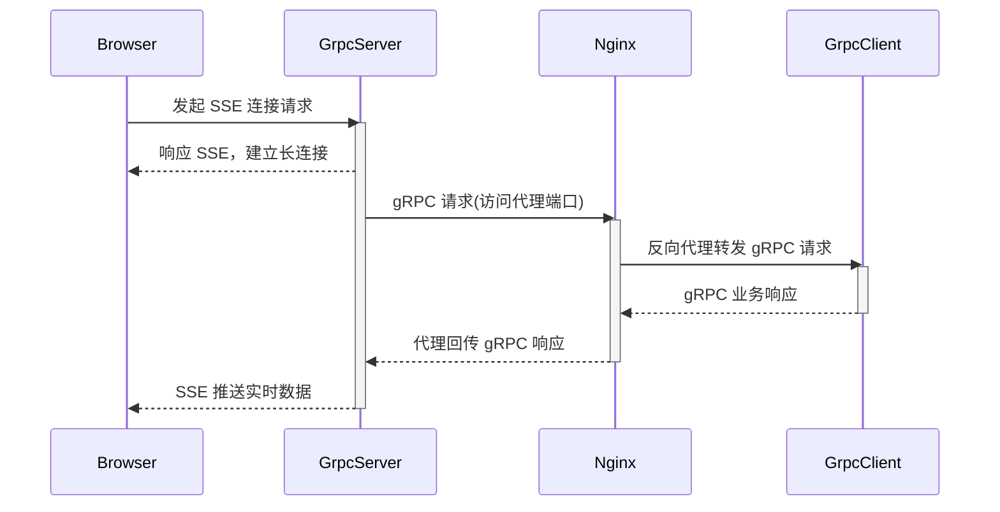

:::tip
记录一下使用Grpc连接还有Sse往前端推流的一些错误过程
:::

# 1. 主要的流程



> 最开始的时候浏览器和GrpcServer之间的Sse使用的是`spring-boot-start-web`里边的`SseEmitter`做的，然后这个东西需要自己处理`completed` 然后还没有 获取这个是否结束状态的方法，跟我这种grpc异步调用的情况非常不兼容，可能某一个吧sse完成了之后，grpc收到连接之后就会报错
>
> **<font color=red>java.lang.IllegalStateException: ResponseBodyEmitter has already completed</font>**，即便是try-catch了依旧会把server和client之间的grpc干掉。具体原因不知道为啥。
>
> 最终还是换成了`spring-boot-starter-webflux`，这个天生就有管理的，如果sse流已经被关闭了，消息会直接丢弃，不会报错，然后也有背压控制之类的

# 2. proto

## 1. protobuf简介

> grpc底层用的netty，使用protobuf的话比较方便，压缩之后也比较小，适合这种rpc的情况。
>
> 首先在`src/main`文件夹下创建`proto`文件夹，然后创建一个`command.proto`文件

```protobuf
syntax = "proto3";

package net.lesscoding.grpc;
// 生成代码的包路径
option java_package = "net.lesscoding.grpc.protocol";
// 生成的java代码类型
option java_outer_classname = "CommandProto";
option java_multiple_files = true;

// 客户端上报消息
message ReportMessage {
  string clientId = 1;    // 客户端ID
  string content = 2;     // 上报内容
  int64 timestamp = 3;    // 时间戳
}

// 服务端下发指令
message CommandMessage {
  string clientId = 1;    // 目标客户端ID
  string command = 2;     // 指令内容
  int64 timestamp = 3;    // 时间戳
}

// 双向流服务
service BidirectionalService {
  // 双向流式通信
  rpc BidirectionalStream(stream ReportMessage) returns (stream CommandMessage);
}
```

## 2. maven配置

> 创建好之后要先`mvn clean package`一下，让`maven`把`grpc`的代码生成一下，不然会找不到类

```xml
<properties>
    <java.version>1.8</java.version>
    <grpc.version>1.62.2</grpc.version>
    <grpc.spring.boot.version>2.15.0.RELEASE</grpc.spring.boot.version>
    <protobuf.version>3.25.3</protobuf.version>
</properties>
<dependencies>
    <dependency>
         <groupId>net.devh</groupId>
         <artifactId>grpc-server-spring-boot-starter</artifactId>
         <version>${grpc.spring.boot.version}</version>
    </dependency>
</dependencies>
<build>
    <!-- Protobuf 编译插件 -->
    <extensions>
        <extension>
            <groupId>kr.motd.maven</groupId>
            <artifactId>os-maven-plugin</artifactId>
            <version>1.7.0</version>
        </extension>
    </extensions>
    <plugins>
        <plugin>
            <groupId>org.xolstice.maven.plugins</groupId>
            <artifactId>protobuf-maven-plugin</artifactId>
            <version>0.6.1</version>
            <configuration>
                <protocArtifact>com.google.protobuf:protoc:${protobuf.version}:exe:${os.detected.classifier}</protocArtifact>
                <pluginId>grpc-java</pluginId>
                <pluginArtifact>io.grpc:protoc-gen-grpc-java:${grpc.version}:exe:${os.detected.classifier}</pluginArtifact>
            </configuration>
            <executions>
                <execution>
                    <goals>
                        <goal>compile</goal>
                        <goal>compile-custom</goal>
                    </goals>
                </execution>
            </executions>
        </plugin>
        <plugin>
            <groupId>org.springframework.boot</groupId>
            <artifactId>spring-boot-maven-plugin</artifactId>
            <version>2.3.5.RELEASE</version>
        </plugin>
    </plugins>
</build>
```

