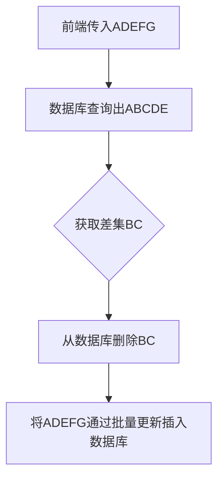

# 1. 应用场景
> 比方说我现在有一个商品，这个商品可以上传图片用来展示，之前已经上传过5张图片 ABCDE，现在其中BC这两张图片不想要了要换成FG，这个时候就可以使用这个工具类进行更新。
>
> 在最后一步，可以不管ADE直接只管新增的数据


# 2. 工具类实现

## 1. 创建实体类

```java
@Data
public class NovelTest extends Model<NovelTest> {

    @TableId(type = IdType.AUTO)
    private Integer id;

    private String name;

    private LocalDateTime createTime;

    private String extra;
}
```

## 2. 实现批量更新方法（Mysql）

> 我这里用了mybatisPlus，这个自带了一个根据ids删除数据的方法，所以就不用自己写了

```xml
<update id="updateBatch">
    insert into novel_test
    (id, name, create_time, extra)
    values
    <foreach collection="list" item="item" index="index" separator=",">
        (#{item.id}, #{item.name}, #{item.createTime}, #{item.extra})
    </foreach>
    on duplicate key update
    id=values(id),
    name = values(name),
    create_time = values(create_time),
    extra = values(extra)
</update>
```
## 3. 工具类实现
``` java
package net.lesscoding.utils;

import cn.hutool.core.collection.CollUtil;
import org.springframework.stereotype.Component;

import java.util.List;
import java.util.Objects;
import java.util.function.Consumer;
import java.util.function.Function;
import java.util.stream.Collectors;

/**
 * @author eleven
 * @date 2025/1/9 15:40
 * @apiNote
 */
@Component
public class UpdateUtil<T> {

    /**
     * 获取主键集合
     *
     * @param list     数据集合
     * @param idGetter 获取主键的方法
     * @return 主键集合
     */
    public static <T> List<?> idList(List<T> list, Function<T, ?> idGetter) {
        return list.stream()
                .filter(item -> Objects.nonNull(idGetter.apply(item)))
                .map(idGetter)
                .collect(Collectors.toList());
    }

    /**
     * <pre>
     *     增量更新，匹配前端数据和数据库数据，
     *     1. 找到数据库中存在但是前端未传入的数据， 通过 deleteBatchFunction 批量删除
     *     2. 找到前端没有的id的数据， 通过 newDataAction 进行处理
     *     3. 剩下的就是需要更新的数据， 通过 updateBatchFunction 批量更新
     * </pre>
     *
     * @param list                前端传入的数据
     * @param dbList              数据库查询的数据
     * @param idGetter            获取主键的方法, 用来判断数据库数据是否要进行删除 eg. TestEntity::getId
     * @param deleteBatchFunction 批量删除的方法   eg. delIds -> baseMapper.deleteByIds(delIds);
     * @param newDataAction       前端没有的id数据的处理方法 eg. item -> item.setCreateTime(LocalDateTime.now()); 传入null则不进行处理
     * @param updateBatchFunction 批量更新的方法 eg. updateList -> baseMapper.updateBatch(updateList);
     */
    @SuppressWarnings("unchecked")
    public static <T> int delNotExistsBeforeInsert(
            List<T> list, List<T> dbList,
            Function<T, ?> idGetter,
            BatchFunction deleteBatchFunction,
            Consumer<? super T> newDataAction,
            BatchFunction<T> updateBatchFunction) {
        // 获取前端传入的数据的id集合
        List<?> paramIds = idList(list, idGetter);
        // 找到前端删除了但是数据库还存在记录的数据id
        List<?> delList = dbList.stream()
                .filter(item -> !paramIds.contains(idGetter.apply(item)))
                .map(idGetter)
                .collect(Collectors.toList());
        // 定义数据库受影响的行数最为返回值        
        int effect = 0;
        // 如果存在被删除的记录就执行删除方法
        if (CollUtil.isNotEmpty(delList)) {
            // 此方法会把delList传给调用方的参数上
            effect += deleteBatchFunction.doBatchFunction(delList);
        }
        // 获取前端没有id的数据，也就是要新增的数据
        List<T> newDataList = list.stream()
                .filter(item -> Objects.isNull(idGetter.apply(item)))
                .collect(Collectors.toList());
        // 如果新增数据不为空，且传入了操作逻辑就循环处理
        if (CollUtil.isNotEmpty(newDataList) && Objects.nonNull(newDataAction)) {
            newDataList.forEach(newDataAction);
        }
        // 将数据传递给更新的Function，如果只想要对新增数据处理的话，这里把list换成newDataList就行了
        effect += updateBatchFunction.doBatchFunction(list);
        return effect;
    }

    /**
     * 批量处理接口
     * @param <T>     数据类型
     */
    @FunctionalInterface
    public interface BatchFunction<T> {
        int doBatchFunction(List<T> list);
    }
}
```

## 4. 具体使用
```java
@PostMapping("/test")
private Result test(@RequestBody List<NovelTest> list) {
    // 批量新增、更新、删除
    int effect = UpdateUtil.delNotExistsBeforeInsert(
            // 前端传入的数据
            list,
            // 数据库查询的数据
            testMapper.selectList(null),
            // 获取主键的方法
            NovelTest::getId,
            // 根据id删除的方法
            delIds -> testMapper.deleteByIds(delIds),
            // 前端没有的id数据的处理方法
            item -> {
                item.setCreateTime(LocalDateTime.now());
                item.setExtra("测试一些要新增时插入的操作" + RandomUtil.randomString(RandomUtil.BASE_CHAR, 4));
            },
            // 批量更新的方法
            updateList -> testMapper.updateBatch(updateList)
    );
    return Result.success(effect);
}
```
