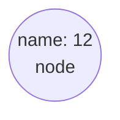
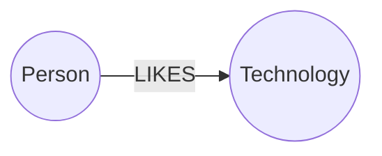
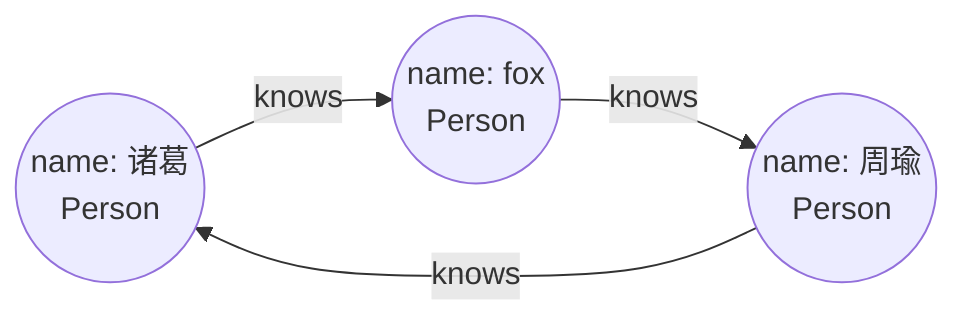

:::tip
Neo4j 图数据库，[Neo4j教程](https://www.bilibili.com/video/BV12i421h7K8?spm_id_from=333.788.player.switch&vd_source=d9d3eb78433e98d94cd75ddf5ac0382b&p=11)，[官网](https://neo4j.com/)
:::

# 1. 简介

## 1. 什么是图数据库

>  随着社交、电商、金融、零售、物联网等行业的快速发展，现实社会织起了了一张庞大而复杂的关系网，传统数据库很难处理关系运算。大数据行业需要处理的数据之间的关系随数据量呈几何级数增长，急需一种支持海量复杂数据关系运算的数据库，图数据库应运而生。
>
>  世界上很多著名的公司都在使用图数据库，比如:

- **社交领域**: Facebook,Twitter，Linkedin 用它来管理社交关系，实现好友推荐

-  零售领域: eBay，沃尔玛使用它实现商品实时推荐，给买家更好的购物体验

- **金融领域**: 摩根大通，花旗和瑞银等银行在用图数据库做风控处理

- **汽车制造领域**: 沃尔沃，戴姆勒和丰田等顶级汽车制造商依靠图数据库推动创新制造解决方案

- **电信领域**: Verizon, Orange 和AT&T等电信公司依靠图数据库来管理网络，控制访问并支持客户360

- 酒店领域: 万豪和雅高酒店等顶级酒店公司依使用图数据库来管理复杂且快速变化的库存

  **图数据库并非指存储图片的数据库，而是以图数据结构存储和查询数据。**
  <font color=red>图数据库是基于图论实现的一种NoSQL数据库，其数据存储结构和数据查询方式都是以图论为基础的，图数据库主要用于存储更多的连接接数据。</font>

> 图论(**Graph theory**)是数学的一个分支，它以图为研究对象。
>
> 图论中的图是由若干给定的点以及链接两点的线所构成的图形，这种图形通常用来描述某些事务之间的某种特定关系，用点代表事物，用连接两点的线表示响应的两个事物的关系。

如果应用程序中包含大连的结构化，半结构化，和非结构化的连接数据额，在关系型数据库中表示这种非结构化的连接数据并不容日，而且检索起来会非常的费劲，

图数据库对于这种数据存储起来就比较方便，它将每个配置文件作为节点存储在内部，与之相邻的节点通过关系互相连接，检索和遍历起来更快

### 1. 关系查询对比

> 在数据关系中心，图形数据库在查询速度方面非常高效，即使对于深度和复杂的查询也是如此。在关系型数据库和图数据库(Neo4)之间进行了实验:在一个社交网络里找到最大深度为5的朋友的朋友，他们的数据集包括100万人，每人约有50个朋友。

| 深度 | Mysql耗时 s | Neo4j耗时s | 返回记录数 |
| ---- | ----------- | ---------- | ---------- |
| 2    | 0.016       | 0.01       | 2500       |
| 3    | 30.267      | 0.168      | 110,000    |
| 4    | 1543.505    | 1.359      | 600,000    |

### 2. 对比关系型数据库

| 关系型数据库 RDBMS | 图数据库   |
| ------------------ | ---------- |
| 表                 | 图         |
| 行                 | 节点       |
| 列和数据           | 属性和数据 |
| 约束               | 关系       |

### 3. 对比其他的NoSql

| 分类         | 数据模型         | 优势                                                     | 劣势                                             | 产品                      |
| ------------ | ---------------- | -------------------------------------------------------- | ------------------------------------------------ | ------------------------- |
| 键值数据库   | 哈希表           | 查找速度快                                               | 数据无结构化，通常只存储字符串或者二进制数据     | Redis                     |
| 列存储数据库 | 列式数据存储     | 查找速度快<br/>支持分布横向扩展<br/>数据压缩率高         | 功能相对首先                                     | HBase                     |
| 文档型数据库 | 键值对扩展       | 数据结构要求不严格<br/>表结构可变<br/>不需要预定义表结构 | 查询性能不高，缺乏统一的查询语法                 | MongoDB<br/>ElasticSearch |
| 图数据库     | 节点和关系组成图 | 利用图结构相关算法（最短路径，节点度关系查找）           | 可能需要对整个图进行计算，不利于图数据分布式存储 | Neo4j<br/>janusGraph      |

## 2. 什么是 neo4j

>  [Neo4j](https://neo4j.com/)是一个开源的NoSQL图形数据库，2003年开始开发，使用scala和java语言，2007年开始发布。
>
> 1. 提供原生的图数据存储，检索和处理;
> 2. 采用属性图模型(Property graph model)，极大的完善和丰富图数据模型;
> 3. 专属查询语言Cypher，直观，高效;

**Neo4j的特性**

- SQL就像简单的查询语言Neo4j CQL
- 遵循属性图数据模型
- 通过使用Apache Lucence支持索引
- 支持UNIQUE约束
- 包含一个用于执行CQL命令的UI:Neo4j Brower/ Neo4j Desktop
- 支持完整的ACID(原子性，一致性，隔离性和持久性)规则
- 采用原生图形库与本地GPE(图形处理引擎)
- 支持查询的数据导出到SON和XLS格式
- 提供了RESTAPI，可以被任何编程语言(如ava，Spring，Scala等)访问
- 提供了可以通过任何UIMVC框架(如NodeJS)访问的java脚本
- 支持两种java API: Cypher API和 Native Java API开发java应用程序

**Neo4j优点**

- 容易表示链接的数据
- 检索 遍历 导航 更多的连接数据非常容易
- 容易表示半结构化的数据
- Neo4j CQL查询语言容易学习

## 3. Neo4j数据模型

### 1. 图论基础

> 图是一组节点和连接这些节点的关系，图形以属性的形式将数据存储在节点和关系里，属性是用来表示数据的键值对。

在图论中，我们可以用一个带有圆的节点，节点之间的关系用一个箭头标记表示


我们可以使用节点添加一些属性



可以用连线来表示两者之间的关系




### 2. 属性图模型

> Neo4j图数据库遵循属性图模型来存储和管理其数据。

属性图模型具有一下的规则

- 表示节点，关系和属性中吧的数据
- 节点和关系都包含属性
- 关系连接节点
- 属性是键值对
- 节点用圆圈表示，关系用方向键表示
- 关系具有方向，单向和双向
- 每个关系包含 **<font color=red>开始节点</font>** 或 **<font color=red>从节点</font>**和**<font color=red>从节点</font>**或者**<font color=red>结束节点</font>**

> 在属性图数据模型中，关系应该是定向的。如果我们尝试创建没有方向的关系，那么它将抛出一个错误消息。在Neo4j中，关系也应该是有方向性的。如果我们尝试创建没有方向的关系，那么Neo4j会抛出一个错误消息，“关系应该是方向性的"。
>
> Neo4j图数据库将其所有数据存储在节点和关系中，我们不需要任何额外的RDBMS数据库或NoSQL数据库来存储Neo4)数据库数据，它以图的形式存储数据。Neo4j使用本机GPE(图形处理引擎)来使用它的本机图存储格式。

图数据库数据模型的主要构建块是**<font color=blue>节点、关系和属性</font>**

<script setup>
import SimpleProfile from '../../components/neo4j/simpleProfile.vue'
import QiZha from '../../components/neo4j/qizha.vue'     
</script>

<SimpleProfile/>

> 这里我们使用圆圈表示节点。使用箭头表示关系，关系是有方向性的。我们可以用Properties(键值对)来表示Node的数据。在这个例子中，我们在Node的Circle中表示了每个Node的ld属性。

## 4. Neo4j的构建元素

### 1. 节点

> 节点(Node)是图数据库中的一个基本元素，用来表示一个实体记录，就像关系数据库中的一条记录一样。在Neo4j中节点可以包含多个属性(Property)和多个标签(Label)。

- 节点是主要的数据元素
- 节点通过**关系**连接到其他节点
- 节点可以具有一个或者过个属性，即存储为键值对的属性
- 节点以后一个或多个**标签**，用于描述其在图表中的作用

### 2. 属性

> 属性(Property)是用于描述图节点和关系的键值对。其中Key是一个字符串，值可以通过使用任何Neo4数据类型来表示

- 属性是命名值，其中名称(或键)是字符串
- 属性可以被索引和约束
- 可以从多个属性创建复合索引

### 3. 关系

> 关系(Relationship)同样是图数据库的基本元素。当数据库中已经存在节点后，需要将节点连接起来构成图。关系就是用来连接两个节点，关系也称为图论的边(Edge)，其始端和末端都必须是节点，关系不能指向空也不能从空发起。关系和节点一样可以包含多个属性，但关系只能有一个类型(Type)。

- 关系连接两个节点

- 关系是方向性的

- 节点可以有多个甚至递归的关系

- 关系可以有一个或多个属性(即存储为键/值对的属性)


> 基于方向性，Neo4j关系被分为两种主要类型: 单向关系 和 双向关系

### 4. 标签

> 标签(Label)将一个公共名称与一组节点或关系相关联，节点或关系可以包含一个或多个标签。我们可以为现有节点或关系创建新标签，我们可以从现有节点或关系中删除标签。

- 标签用于将节点分组
- 一个节点可以具有多个标签
- 对标签进行索引以加速在图中查找节点
- 本机标签索引针对速度进行了优化

### 5. Neo4j Browser

> 一旦安装了Neo4j，就可以通过其提供的 `WebUI` 访问[localhost:7474/browser](localhost:7474/browser)

## 5. 使用场景

- 欺诈检测

<QiZha />

- 实时推荐引擎
- 知识图谱
- 反洗钱
- 主数据管理
- 供应链管理
- 增强网络和IT运维管理能力
- 数据谱系
- 身份和访问管理
- 材料清单
- 社交网络
- ...

# 2. 环境搭建

## 1. docker安装

> 直接创建`docker-compose.yml`然后执行命令就可以了

```yml
services:
  neo4j:
    image: neo4j:5-community
    container_name: neo4j
    restart: always
    ports:
      - "7474:7474"   # Web 管理界面端口 Http
      - "7473:7473"   # web 管理页面 Https
      - "7687:7687"   # Bolt 协议端口（程序连接用）
    environment:
      # 初始用户名/密码，首次登录会强制修改
      NEO4J_AUTH: neo4j/neo4j123
      # 内存配置，根据你的机器调整
      NEO4J_dbms_memory_heap_max__size: 1G
      NEO4J_dbms_memory_pagecache_size: 512M
      # 启用 APOC 插件（强烈推荐，做图查询很方便）
      NEO4J_apoc_export_file_enabled: "true"
      NEO4J_apoc_import_file_enabled: "true"
      NEO4J_apoc_import_file_use__url__enabled: "true"
      NEO4J_dbms_security_procedures_unrestricted: apoc.*
    volumes:
      # 数据持久化，会在当前目录生成这些文件夹
      - ./neo4j/data:/data
      - ./neo4j/logs:/logs
      - ./neo4j/import:/import
      - ./neo4j/plugins:/plugins
    healthcheck:
      test: ["CMD-SHELL", "wget --no-verbose --tries=1 --spider http://localhost:7474 || exit 1"]
      interval: 10s
      timeout: 10s
      retries: 5
```

## 2. 安装 Neo4j Community Server

> [下载地址 https://neo4j.com/deployment-center/](https://neo4j.com/deployment-center/)

# 3. Neo4j-CQL使用

## 1. CQL简介

> Neo4j的Cypher语言是为处理图形数据而构建的，CQL代表Cypher查询语言。像oracle数据库具有查询语言SQL，Neo4具有CQL作为查询语言。

| CQL命令  | 用法                         |
| -------- | ---------------------------- |
| CREATE   | 创建节点，关系和属性         |
| MATCH    | 检索有关节点，关系和属性数据 |
| RETURN   | 返回查询结果                 |
| WHERE    | 提供条件过滤检索数据         |
| DELETE   | 删除节点和关系               |
| REMOVE   | 删除节点和关系的属性         |
| ORDER BY | 排序检索的数据               |
| SET      | 添加或更新标签               |



使用cypher语言来描述关系

> `(fox)`表示一个节点 
>
> `[:knows]`表示一个关系

```cypher
(fox)<-[:knows]-(周瑜)-[:knows]->(诸葛)-[:knows]->(fox)
```

```cypher
MATCH (fox:Person), (周瑜:Person), (诸葛:Person)
WHERE (周瑜)-[:knows]->(fox)
  AND (周瑜)-[:knows]->(诸葛)
  AND (诸葛)-[:knows]->(fox)
```

## 2. 常见命令

### 1. LOCD CSV命令

> 从csv加载节点和关系到neo4j中，需要注意的是需要把文件放到`import`目录下才行,当然也能够使用绝对路径，只不过需要一些配置，修改`neo4j.conf`
>
> ```ini
> # 允许读取本地任意file://路径
> dbms.security.allow_csv_import_from_file_urls=true
> # 可选：取消import目录限制（空值=无限制）
> dbms.directories.import=
> ```

```cypher
LOAD CSV FROM "file:///xiyouji_relationships.csv" AS line
create (:xiyouRelation {from:line[1],relation:line[3],to:line[0]})
```

> 这个命令是没有表头的，可以用下标来设置节点和关系

| 参数            | 描述                                                         |
| --------------- | ------------------------------------------------------------ |
| LOAD CSV        | 导入csv的关键字，Cypher专属数据导入语句。<br/>读取外部csv文本文件，按照都好自动切分每行单元格<br/>适用于批量初始化图数据库，导入业务关系数据 |
| WITH HEADERS    | 第一行是表头                                                 |
| WITHOUR HEADERS | 没有表头                                                     |
| FROM 'filePath' | 指定要读取的的文件地址<br/>协议有`file://`和`https://`       |
| AS line         | 起个别名，后边好用                                           |
| create          | 创建关系                                                     |
| :xiyouRelation  | 节点名称                                                     |
| from            | 从节点                                                       |
| relation        | 关系                                                         |
| to              | 结束节点                                                     |

> 如果是下边这种带代表头的，就不能使用下标了，要用表头才行，如果表头有特殊符号则需要用到**`** 来转义才行

```cypher
LOAD CSV WITH HEADERS FROM "file:///xiyouji_relationships.csv" AS line
CREATE (:xiyouRelation {
    from: line.`:START_ID`,
    to: line.`:END_ID`,
    relation: line.`:TYPE`
});
```

> 删除所有的西游记关系

```cypher
MATCH (n:xiyouRelation) DETACH DELETE n;
```

```cypher
// 查询name等于高翠兰的节点
MATCH (n:Person {name: '高翠兰'}) return n,elementId(n)
// 用where是一样的                                                  
MATCH (n :Person) where n.name = '猪八戒' return n.name, elementId(n)                                                  
```

### 2. CREATE 

> Create语句用来创建数据模型

#### 1. 创建节点

```cypher
// 创建简单节点
create (n)
// 创建多个节点
create (n),(m)
// 创建带标签和属性的节点并返回节点
create (n:Person {name: '如来'}) return n        
```

#### 2. 创建关系

> Neo4j图数据库遵循属性图模型来存储和管理数据。
>
> 根据属性图模型，关系应该是定向的，否则Neo4j将会抛出一个错误信息。
>
> 基础方向性，Neo4j的关系氛围两种主要类型**<font color=red>单向关系</font>**和**<font color=red>双向关系</font>**
>
> **<font color=red>创建关系的时候如果是有特殊符号或者是中文，需要用 反引号 `包裹住</font>**

```cypher
// 使用新节点创建关系
create (n:person {name: '杨戬'})-[r:`师傅`]->(m:person {name:'玉鼎真人'})return type(r)
```

```cypher
// 使用已知节点创建带属性的关系
match(n:person {name: '沙僧'}),(m:person {name: '唐僧'})
create (n)-[r:`师傅` {relation: '师傅'}]->(m) return r                                     
```

```cypher
// 检索关系节点的详细信息
match (n:person)-[r]-(m:person) return n,m
```

```cypher
CREATE 
  (n:person {name: '沙僧'})-[r1:`师兄弟` {relation: '师兄弟'}]->(m：person {name: '孙悟空'}),
  (m)-[r2:`师兄弟` {relation: '师兄弟'}]->(n)
RETURN r1,r2
```

#### 3. 创建全新路径

```cypher
create p=(:person{name: '蛟魔王'})-[:义兄]->(:person{name:'牛魔王'})<-[:义兄]-(:person{name:'鹏魔王'})-[:结义兄弟]->(:person {name:'孙悟空'})-[:徒弟]->(:person{name: '唐僧'}) return p
```

```cypher
// 查询蛟魔王和沙僧之间的关系，10层关系以内的
MATCH path=(A:person{name:"蛟魔王"})-[*1..10]-(B:person{name:"沙僧"})
RETURN path
```

```cypher
MATCH (oldTang:person) WHERE elementId(oldTang)=75
DETACH DELETE oldTang;
```

> 使用`MATCH MERGE`创建关系，如果有关系则不操作，没有则创建，不会创建重复关系

```cypher
// 一次性匹配所有人物节点
MATCH 
    (ts:person{name:"唐僧"}),
    (wk:person{name:"孙悟空"}),
    (wn:person{name:"猪八戒"}),
    (wj:person{name:"沙僧"}),
    (blm:person{name:"白龙马"})

// 1. 构建【师傅】单向关系：唐僧 → 所有徒弟
MERGE (ts)-[:师傅]->(wk)
MERGE (ts)-[:师傅]->(wn)
MERGE (ts)-[:师傅]->(wj)
MERGE (ts)-[:师傅]->(blm)

// 2. 构建【师兄弟】无向互相关系：悟空、八戒、沙僧两两为师兄弟
MERGE (wk)-[:师兄弟]-(wn)
MERGE (wk)-[:师兄弟]-(wj)
MERGE (wn)-[:师兄弟]-(wj)

// 可选返回结果，查看构建好的节点和关系
RETURN ts, wk, wn, wj, blm
```


### 3. MATCH 查询

> 这个命令只要用于以下两个场景。
>
> 1. 从数据库中获取有关节点和属性的数据
> 2. 从数据库中获取有关节点，关系和属性的数据

1. 简单查询

```cypher
// 查询Person的前25的节点
MATCH (n: Person) return n LIMIT 25
```

2. 精确查询，模糊查询

> **<font color=red>CONTAINS /= ~</font>**无法走索引，大量数据需要全文检索
>
> **<font color=blue>STARTS WITH</font>**能够使用字符串索引

```cypher
// 查询name等于孙悟空的数据
MATCH (n: Person {name: '孙悟空'}) return n
MATCH (n: Person) WHERE n.name = '孙悟空' return n
// 查询name包含悟空的节点
MATCH (n: Person) WHERE n.name CONTAINS '悟空' return n
// 查询name以孙开头的节点
MATCH (n: Person) WHERE n.name STARTS WITH '孙' return n
// 查询name以空结尾的节点
MATCH (n: Person) WHERE n.name ENDS WITH '空' return n
```

3. 正则模糊查询

```cypher
// 查询name包含悟空的节点
MATCH (n: Person) WHERE n.name =~ '.*悟空.*' return n
// 查询name以孙开头的节点
MATCH (n: Person) WHERE n.name =~ '孙.*' return n
// 查询name以空结尾的节点(忽略大小写)
MATCH (n: Person) WHERE toLower(n.name) =~  '.*空' return n
```

| 解释                                       | SQL                 | CQL                      | CQL正则               |
| ------------------------------------------ | ------------------- | ------------------------ | --------------------- |
| 包含A                                      | `name LIKE '%A%'`   | `n.name CONTAINS 'A'`    | `n.name =~ '.*A.*'`   |
| 以A开头                                    | `name LIKE 'A%'`    | `n.name STARTS WITH 'A'` | `n.name =~ 'A.*'`     |
| 以A结尾                                    | `name LIKE '%A'`    | `n.name ENDS WITH 'A'`   | `n.name =~ '.*A'`     |
| 任意前缀 + A + 任意单个字符 + B + 任意后缀 | `name LIKE '%A_B%'` |                          | `n.name =~ '.*A.B.*'` |

### 4. RETURN 返回

1. 返回节点的某个属性 `n.name`
2. 返回节点的所有属性 `n`
3. 返回节点和关联关系的属性

```cypher
MATCH (n: Person) RETURN elementId(n),n.name,n.relation
```

### 5. WHERE语句

> 详见 #MATCH 查询

### 6. DELETE删除

1. 删除节点

> 这种情况如果节点有关系的话会提示报错，有关系不能删除

```cypher
MATCH (n:Person) DELETE n 
```

2. 强制删除

```cypher
MATCH (n:Person) DETACH DELETE n
```

| 关键字          | 描述                   |
| --------------- | ---------------------- |
| DELETE          | 删除，不级联删除       |
| NODETACH DELETE | 同DELETE               |
| DETACH DELETE   | 级联删除，关系也会删除 |

### 7. REMOVE删除

> 用来删除节点或关系的标签和属性，与SET是一对对立的关系

```cypher
// 删除属性
MATCH (n:role {name: 'fox'}) remove n.age return n
// 创建节点
CREATE (m:role:person{name:'firefox'})
// 删除标签
MATCH (m:role:person{name:'firefox'}) remove m:person resturn m                       
```

### 8. SET

> 给节点或者关系添加新属性，或者更新属性

```cypher
MATCH (n:Browser {name:'firefox'}) set n.version=111 return n
```

### 9. ADD LABELS

> 添加标签

```cypher
MATCH (b:Browser{name:'firefox',version:111})
ADD LABELS b:Software:Client:App
```

### 10. ORDER BY

> 排序字段，跟SQL的是一样的，默认是升序，降序用DESC就行

```cypher
MATCH (n: Order) RETURN n ORDER BY n.amount DESC
```

### 11. UNION

> 和SQL一起，可以将两个子句的结果合并成一组成果

- UNION 不返回重复的行
- UNION ALL 返回重复的行

### 12. LIMIT 和 SKIP

> 跳过一些结果和返回限制条数，有点类似与stream流里边的skip和limit

```cypher
MATCH (n:Person) WHERE age > 18 SKIP 10 LIMIT 10
```

### 13. IS NULL / IS NOT NULL

```cypher
MATCH (n:Menu) WHERE n.parent is null SKIP 10 LIMIT 10
```

### 14. IN 

```cypher
MATCH (n:Menu) WHERE n.name in ['用户管理', '权限管理']
```

### 15. INDEX索引

> Neo4jSQL支持节点或关系属性上的索引，以提高应用程序的性能。
> 我们可以为具有相同标签名称的所有节点的属性创建索引。
> 我们可以在MATCH或WHERE或IN运算符上使用这些索引列来改进CQL Command的执行。

#### 1. 节点索引

1. 单属性普通索引（节点）

```cypher
create index idx_user_name FOR (n:User) ON (n.name)
```

2. 复合索引

```cy
CREATE INDEX idx_user_name_age FOR (n:User) ON (n.name, n.age);
```

3. 唯一索引

```cypher
CREATE CONSTRAINT unique_user_name FOR (n:User) REQUIRE n.name IS UNIQUE;
```

4. 全文检索索引（模糊，分词使用）

```cypher
CREATE FULLTEXT INDEX ft_user_title 
FOR (n:User) ON EACH [n.name, n.desc];
```

#### 2. 关系索引

1. 关系单属性索引

```cypher
// 关系类型FRIEND，属性createTime
CREATE INDEX idx_rel_friend_time FOR ()-[r:FRIEND]-() ON (r.createTime);
```

2. 关系复合索引

```cypher
CREATE INDEX idx_rel_friend_time_level FOR ()-[r:FRIEND]-() ON (r.createTime, r.level);
```

3. 关系全文索引

```cy
CREATE FULLTEXT INDEX ft_rel_comment 
FOR ()-[r:COMMENT]-() ON EACH [r.content];
```

#### 3. 看所有索引 / 约束

```cypher
SHOW INDEXES;
SHOW CONSTRAINTS;
```

#### 4. 删除索引

```cypher
DROP INDEX idx_user_name;
DROP INDEX idx_rel_friend_time;
```

#### 5. 删除约束

```cypher
DROP CONSTRAINT unique_user_name;
// 不指定名称、按定义删除（5.x 兼容）
DROP CONSTRAINT FOR (n:User) REQUIRE n.phone IS UNIQUE;
```

## 3. 常用函数

### 1. 字符串函数

| 函数      | 描述                 |
| --------- | -------------------- |
| UPPER     | 将所有字母转为大写   |
| LOWER     | 将所有字母转换成小写 |
| SUBSTRING | 截取字符串           |
| REPLACE   | 替换字符串           |

```cypher
MATCH (e) RETURN eemenId(e),e.name.substring(e.nae. 0, 2)
```

### 2. AGGREGATION聚合

| 函数  | 描述            |
| ----- | --------------- |
| COUNT | 返回MATCH的行数 |
| MAX   | 返回最大值      |
| MIN   | 最小值          |
| SUM   | 所有行的和      |
| AVG   | 平均值          |

### 3. 关系函数

| 函数      | 描述           |
| --------- | -------------- |
| STARTNODE | 关系的开始节点 |
| ENDNODE   | 关系的结束节点 |
| ELEMENTID | 关系的id       |
| TYPE      | 关系的type     |

# 4. Neo4j-admin

## 1. 数据库备份

> 对Neo4j数据进行备份，还原，迁移时，需要先关闭neo4j

```shell
cd %NEO$J_HOME%/bin
# 关闭neo4j 一定要先执行 Neo4j install-service 才可以执行下边的命令
neo4j stop
# 备份
neo4j-admin dummp --database=graph.db --to=/neo4j/backup/graph_backup.dump
```

## 2. 数据库恢复

> 同样的也需要关闭数据库

```shell
neo4j-admin load --from=/neo4j/backup/graph_backup.dump --database=graph.db --force
neo4j start
```

# 5. 使用CQL构建关系图谱

| id   | name         |
| ---- | ------------ |
| 1    | 唐僧         |
| 2    | 孙悟空       |
| 3    | 猪八戒       |
| 4    | 沙僧         |
| 5    | 白龙马       |
| 6    | 玉皇大帝     |
| 7    | 王母娘娘     |
| 8    | 太上老君     |
| 9    | 太白金星     |
| 10   | 托塔天王李靖 |
| 11   | 哪吒         |
| 12   | 二郎神杨戬   |
| 13   | 四大天王     |
| 14   | 增长天王     |
| 15   | 广目天王     |
| 16   | 多闻天王     |
| 17   | 持国天王     |
| 18   | 巨灵神       |
| 19   | 千里眼       |

```cypher
LOAD CSV WITH HEADERS FROM from 'file:///西游角色.csv' as row
CREATE (n: JueSe {id: row.id, name: row.name})
```

| fromId | fromName   | toId | toName   | relation |
| ------ | ---------- | ---- | -------- | -------- |
| 2      | 孙悟空     | 1    | 唐僧     | 师徒     |
| 3      | 猪八戒     | 1    | 唐僧     | 师徒     |
| 4      | 沙僧       | 1    | 唐僧     | 师徒     |
| 5      | 白龙马     | 1    | 唐僧     | 师徒     |
| 2      | 孙悟空     | 3    | 猪八戒   | 师兄弟   |
| 2      | 孙悟空     | 4    | 沙僧     | 师兄弟   |
| 3      | 猪八戒     | 4    | 沙僧     | 师兄弟   |
| 405    | 须菩提祖师 | 2    | 孙悟空   | 师徒     |
| 153    | 菩提祖师   | 2    | 孙悟空   | 师徒     |
| 1      | 唐僧       | 642  | 金蝉子   | 转世     |
| 642    | 金蝉子     | 104  | 如来佛祖 | 师徒     |
| 3      | 猪八戒     | 48   | 天蓬元帅 | 转世     |
| 4      | 沙僧       | 47   | 卷帘大将 | 转世     |

```cypher
LOAD CSV WITH HEADERS FROM from 'file:///西游关系.csv' as row
CREATE (n: Guanxi {formId: row.formId, formName: row.formName,toId:row.toId,toName:row.toName,relation:row.relation})
```

> 创建关系图谱

1. 不使用apoc插件

```cypher
MATCH (f:JueSe),(r:Guanxi),(t:JueSe)
where f.id=r.fromId and r.toId=t.id
create (f)-[:关系{relation:r.relation}]->(t)                            
```

2. 使用apoc插件,这样可以用来动态生成关系标签

```cypher
MATCH (f:JueSe),(r:Guanxi),(t:JueSe) 
WHERE f.id = r.fromId AND r.toId = t.id 
CALL apoc.create.relationship(f, r.relation, {}, t) YIELD rel RETURN rel
```

# 6. 安装APOC插件

> APOC（Awesome Procedures on Cypher）是 Neo4j 官方提供的扩展存储过程库，提供了大量 Cypher 原生不具备的功能。
>
> 1. 支持从 Excel、JSON、XML 导入导出，以及 HTTP 远程请求
> 2. 动态创建关系标签（原生只支持静态标签）
> 3. 批量导入大文件，支持分块导入避免内存溢出
> 4. 图算法、数据生成、文本处理等工具函数

## 1. 前置：放开 APOC 权限

> 无论哪种安装方式，jar 放入 plugins 目录后，**必须**在 `neo4j.conf` 中添加以下配置并重启，否则执行 APOC 过程会报 `ProcedureNotFound`。

```ini
# 允许 APOC 所有存储过程
dbms.security.procedures.unrestricted=apoc.*
# 显式允许列表（可选，与上行任选其一或同时使用）
dbms.security.procedures.allowlist=apoc.*
```

## 2. 验证安装

在 Neo4j Browser 中执行，返回版本号即安装成功：

```cypher
RETURN apoc.version()
```

也可查看已注册的 APOC 过程列表：

```cypher
CALL apoc.help('apoc')
```

## 3. 各安装方式详解

### 3.1 裸机安装（Neo4j Community Server）

1. 查看 Neo4j 版本：

```cypher
CALL dbms.components() YIELD versions RETURN versions;
```

2. 从 [APOC GitHub Releases](https://github.com/neo4j/apoc/releases) 下载**版本号匹配**的 jar 包。例如 Neo4j 5.26.x → 下载 `apoc-5.26.x-core.jar`

3. 将 jar 放入 Neo4j 安装目录的 `plugins` 文件夹：

```
C:\Program Files\Neo4j\neo4j-community-5.26.x\plugins\
```

4. 修改 `conf/neo4j.conf`，添加权限配置（见第 1 节）。

5. 重启 Neo4j 服务，执行 `RETURN apoc.version()` 验证。

### 3.2 Docker 安装（推荐）

**方式一：环境变量自动下载（最简单）**

在 `docker-compose.yml` 中添加 `NEO4J_PLUGINS` 环境变量，容器启动时自动从官方源下载匹配版本的 APOC：

```yml
environment:
  NEO4J_AUTH: neo4j/neo4j123
  NEO4J_PLUGINS: '["apoc"]'
  NEO4J_dbms_security_procedures_unrestricted: apoc.*
volumes:
  - ./neo4j/plugins:/plugins
```

重新创建容器即可：

```bash
docker-compose up -d
```

> 容器重建后 `plugins` 目录会自动出现 `apoc.jar`，无需手动下载。

**方式二：手动挂载 jar**

如果网络受限，可手动下载 jar 到宿主机挂载目录 `./neo4j/plugins/`，然后重启容器：

```bash
# 下载匹配版本的 apoc-core.jar 放入 plugins 目录
wget https://github.com/neo4j/apoc/releases/download/5.26.x/apoc-5.26.x-core.jar
mv apoc-5.26.x-core.jar ./neo4j/plugins/

# 重启
docker-compose restart
```

**排查**：验证 jar 是否在容器中生效：

```bash
docker exec neo4j ls -la /plugins/
```

```yml
services:
  neo4j:
    image: neo4j:5-community
    container_name: neo4j
    restart: always
    ports:
      - "7474:7474"   # Web 管理界面端口
      - "7687:7687"   # Bolt 协议端口（程序连接用）
    environment:
      # 初始用户名/密码，首次登录会强制修改
      NEO4J_AUTH: neo4j/neo4j123
      # 内存配置，根据你的机器调整
      NEO4J_dbms_memory_heap_max__size: 1G
      NEO4J_dbms_memory_pagecache_size: 512M
      # 启用 APOC 插件（强烈推荐，做图查询很方便）
      NEO4J_PLUGINS: '["apoc"]'
      NEO4J_apoc_export_file_enabled: "true"
      NEO4J_apoc_import_file_enabled: "true"
      NEO4J_apoc_import_file_use__url_enabled: "true"
      NEO4J_dbms_security_procedures_unrestricted: apoc.*
    volumes:
      # 数据持久化，会在当前目录生成这些文件夹
      - ./neo4j/data:/data
      - ./neo4j/logs:/logs
      - ./neo4j/import:/import
      - ./neo4j/plugins:/plugins
    healthcheck:
      test: ["CMD-SHELL", "wget --no-verbose --tries=1 --spider http://localhost:7474 || exit 1"]
      interval: 10s
      timeout: 10s
      retries: 5

```


### 3.3 Neo4j Desktop 2 安装

1. 打开 Desktop，选中 Project 中的数据库实例
2. 点击实例右侧 `...` → **Manage**
3. 切换到 **Plugins** 标签页
4. 在列表中找到 **APOC**，点击右侧 **Install** 按钮
5. 切换到 **Settings** 标签页，搜索 `procedures.unrestricted`，取消注释并设为 `apoc.*`
6. 点击右上角 **Apply**，然后 **Restart** 数据库

> Desktop 中的插件仅对当前 Desktop 管理的实例生效，与 Docker / 裸机安装的 Neo4j 互不影响。

## 4. 常见问题

| 现象 | 原因 | 解决 |
|------|------|------|
| `ProcedureNotFound` | `neo4j.conf` 未放开 APOC 权限 | 添加 `dbms.security.procedures.unrestricted=apoc.*` 并重启 |
| 权限配置后仍然报错 | plugins 目录中没有 APOC jar 或版本不匹配 | 检查 jar 是否存在，版本号是否与 Neo4j 一致（大版本如 5.x 必须对齐） |
| Desktop 装了 APOC 但 Docker 里调用报错 | Desktop 和 Docker 是两个独立实例，插件互不相通 | 按 3.2 节单独给 Docker 实例安装 |
| `apoc.version()` 返回正常但部分过程不可用 | APOC 某些子模块需要单独的 jar（如 apoc-mongodb） | 下载对应的扩展 jar 一并放入 plugins |

# X. 练习

## 1. 创建一个机房，两个机柜，给他们创建关系

1. 先创建节点，然后创建关系

```cy
create (sr:ServerRoom{name:'崂山机房', id: 'S001'}),(r1:Rack{name:'一号机柜',id: 'R001'}),(r2:Rack{name:'二号机柜',id:'R002'})
```

```cypher
MATCH (s:ServerRoom{id:'S001'}),(r1:Rack{id:'R001'}),(r2:Rack{id:'R002'})
MERGE (s)-[:管理]->(r1)    
MERGE (s)-[:管理]->(r2)                                                              
```

2. 使用create一次性创建节点和关系

```cypher
CREATE
(sr:ServerRoom{name:'崂山机房', id:'S001'})-[:管理]->(r1:Rack{name:'一号机柜', id:'R001'}),
(sr)-[:管理]->(r2:Rack{name:'二号机柜', id:'R002'})
```
