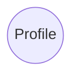
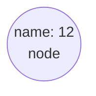
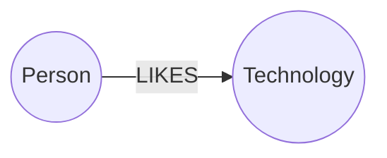

:::tip
Neo4j 图数据库，[Neo4j教程](https://www.bilibili.com/video/BV12i421h7K8?p=8)，[官网](https://neo4j.com/)
:::

# 1. 简介

## 1. 什么是图数据库

>  随着社交、电商、金融、零售、物联网等行业的快速发展，现实社会织起了了一张庞大而复杂的关系网，传统数据库很难处理关系运算。大数据行业需要处理的数据之间的关系随数据量呈几何级数增长，急需一种支持海量复杂数据关系运算的数据库，图数据库应运而生。
>
>  世界上很多著名的公司都在使用图数据库，比如:

- **社交领域**: Facebook,Twitter，Linkedin 用它来管理社交关系，实现好友推荐

-  零售领域: eBay，沃尔玛使用它实现商品实时推荐，给买家更好的购物体验

- **金融领域**: 摩根大通，花旗和瑞银等银行在用图数据库做风控处理

- **汽车制造领域**: 沃尔沃，戴姆勒和丰田等顶级汽车制造商依靠图数据库推动创新制造解决方案

- **电信领域**: Verizon, Orange 和AT&T等电信公司依靠图数据库来管理网络，控制访问并支持客户360

- 酒店领域: 万豪和雅高酒店等顶级酒店公司依使用图数据库来管理复杂且快速变化的库存

  **图数据库并非指存储图片的数据库，而是以图数据结构存储和查询数据。**
  <font color=red>图数据库是基于图论实现的一种NoSQL数据库，其数据存储结构和数据查询方式都是以图论为基础的，图数据库主要用于存储更多的连接接数据。</font>

> 图论(**Graph theory**)是数学的一个分支，它以图为研究对象。
>
> 图论中的图是由若干给定的点以及链接两点的线所构成的图形，这种图形通常用来描述某些事务之间的某种特定关系，用点代表事物，用连接两点的线表示响应的两个事物的关系。

如果应用程序中包含大连的结构化，半结构化，和非结构化的连接数据额，在关系型数据库中表示这种非结构化的连接数据并不容日，而且检索起来会非常的费劲，

图数据库对于这种数据存储起来就比较方便，它将每个配置文件作为节点存储在内部，与之相邻的节点通过关系互相连接，检索和遍历起来更快

### 1. 关系查询对比

> 在数据关系中心，图形数据库在查询速度方面非常高效，即使对于深度和复杂的查询也是如此。在关系型数据库和图数据库(Neo4)之间进行了实验:在一个社交网络里找到最大深度为5的朋友的朋友，他们的数据集包括100万人，每人约有50个朋友。

| 深度 | Mysql耗时 s | Neo4j耗时s | 返回记录数 |
| ---- | ----------- | ---------- | ---------- |
| 2    | 0.016       | 0.01       | 2500       |
| 3    | 30.267      | 0.168      | 110,000    |
| 4    | 1543.505    | 1.359      | 600,000    |

### 2. 对比关系型数据库

| 关系型数据库 RDBMS | 图数据库   |
| ------------------ | ---------- |
| 表                 | 图         |
| 行                 | 节点       |
| 列和数据           | 属性和数据 |
| 约束               | 关系       |

### 3. 对比其他的NoSql

| 分类         | 数据模型         | 优势                                                     | 劣势                                             | 产品                      |
| ------------ | ---------------- | -------------------------------------------------------- | ------------------------------------------------ | ------------------------- |
| 键值数据库   | 哈希表           | 查找速度快                                               | 数据无结构化，通常只存储字符串或者二进制数据     | Redis                     |
| 列存储数据库 | 列式数据存储     | 查找速度快<br/>支持分布横向扩展<br/>数据压缩率高         | 功能相对首先                                     | HBase                     |
| 文档型数据库 | 键值对扩展       | 数据结构要求不严格<br/>表结构可变<br/>不需要预定义表结构 | 查询性能不高，缺乏统一的查询语法                 | MongoDB<br/>ElasticSearch |
| 图数据库     | 节点和关系组成图 | 利用图结构相关算法（最短路径，节点度关系查找）           | 可能需要对整个图进行计算，不利于图数据分布式存储 | Neo4j<br/>janusGraph      |

## 2. 什么是 neo4j

>  [Neo4j](https://neo4j.com/)是一个开源的NoSQL图形数据库，2003年开始开发，使用scala和java语言，2007年开始发布。
>
> 1. 提供原生的图数据存储，检索和处理;
> 2. 采用属性图模型(Property graph model)，极大的完善和丰富图数据模型;
> 3. 专属查询语言Cypher，直观，高效;

**Neo4j的特性**

- SQL就像简单的查询语言Neo4j CQL
- 遵循属性图数据模型
- 通过使用Apache Lucence支持索引
- 支持UNIQUE约束
- 包含一个用于执行CQL命令的UI:Neo4j Brower/ Neo4j Desktop
- 支持完整的ACID(原子性，一致性，隔离性和持久性)规则
- 采用原生图形库与本地GPE(图形处理引擎)
- 支持查询的数据导出到SON和XLS格式
- 提供了RESTAPI，可以被任何编程语言(如ava，Spring，Scala等)访问
- 提供了可以通过任何UIMVC框架(如NodeJS)访问的java脚本
- 支持两种java API: Cypher API和 Native Java API开发java应用程序

**Neo4j优点**

- 容易表示链接的数据
- 检索 遍历 导航 更多的连接数据非常容易
- 容易表示半结构化的数据
- Neo4j CQL查询语言容易学习

## 3. Neo4j数据模型

### 1. 图论基础

> 图是一组节点和连接这些节点的关系，图形以属性的形式将数据存储在节点和关系里，属性是用来表示数据的键值对。

在图论中，我们可以用一个带有圆的节点，节点之间的关系用一个箭头标记表示



我们可以使用节点添加一些属性



可以用连线来表示两者之间的关系




### 2. 属性图模型

> Neo4j图数据库遵循属性图模型来存储和管理其数据。

属性图模型具有一下的规则

- 表示节点，关系和属性中吧的数据
- 节点和关系都包含属性
- 关系连接节点
- 属性是键值对
- 节点用圆圈表示，关系用方向键表示
- 关系具有方向，单向和双向
- 每个关系包含 **<font color=red>开始节点</font>** 或 **<font color=red>从节点</font>**和**<font color=red>从节点</font>**或者**<font color=red>结束节点</font>**

> 在属性图数据模型中，关系应该是定向的。如果我们尝试创建没有方向的关系，那么它将抛出一个错误消息。在Neo4j中，关系也应该是有方向性的。如果我们尝试创建没有方向的关系，那么Neo4j会抛出一个错误消息，“关系应该是方向性的"。
>
> Neo4j图数据库将其所有数据存储在节点和关系中，我们不需要任何额外的RDBMS数据库或NoSQL数据库来存储Neo4)数据库数据，它以图的形式存储数据。Neo4j使用本机GPE(图形处理引擎)来使用它的本机图存储格式。

图数据库数据模型的主要构建块是**<font color=blue>节点、关系和属性</font>**

<script setup>
import SimpleProfile from '../../components/neo4j/simpleProfile.vue'
import QiZha from '../../components/neo4j/qizha.vue'     
</script>

<SimpleProfile/>

> 这里我们使用圆圈表示节点。使用箭头表示关系，关系是有方向性的。我们可以用Properties(键值对)来表示Node的数据。在这个例子中，我们在Node的Circle中表示了每个Node的ld属性。

## 4. Neo4j的构建元素

### 1. 节点

> 节点(Node)是图数据库中的一个基本元素，用来表示一个实体记录，就像关系数据库中的一条记录一样。在Neo4j中节点可以包含多个属性(Property)和多个标签(Label)。

- 节点是主要的数据元素
- 节点通过**关系**连接到其他节点
- 节点可以具有一个或者过个属性，即存储为键值对的属性
- 节点以后一个或多个**标签**，用于描述其在图表中的作用

### 2. 属性

> 属性(Property)是用于描述图节点和关系的键值对。其中Key是一个字符串，值可以通过使用任何Neo4数据类型来表示

- 属性是命名值，其中名称(或键)是字符串
- 属性可以被索引和约束
- 可以从多个属性创建复合索引

### 3. 关系

> 关系(Relationship)同样是图数据库的基本元素。当数据库中已经存在节点后，需要将节点连接起来构成图。关系就是用来连接两个节点，关系也称为图论的边(Edge)，其始端和末端都必须是节点，关系不能指向空也不能从空发起。关系和节点一样可以包含多个属性，但关系只能有一个类型(Type)。

- 关系连接两个节点

- 关系是方向性的

- 节点可以有多个甚至递归的关系

- 关系可以有一个或多个属性(即存储为键/值对的属性)


> 基于方向性，Neo4j关系被分为两种主要类型: 单向关系 和 双向关系

### 4. 标签

> 标签(Label)将一个公共名称与一组节点或关系相关联，节点或关系可以包含一个或多个标签。我们可以为现有节点或关系创建新标签，我们可以从现有节点或关系中删除标签。

- 标签用于将节点分组
- 一个节点可以具有多个标签
- 对标签进行索引以加速在图中查找节点
- 本机标签索引针对速度进行了优化

### 5. Neo4j Browser

> 一旦安装了Neo4j，就可以通过其提供的 `WebUI` 访问[localhost:7474/browser](http://localhost:7474/browser)

## 5. 使用场景

- 欺诈检测

<QiZha />

- 实时推荐引擎
- 知识图谱
- 反洗钱
- 主数据管理
- 供应链管理
- 增强网络和IT运维管理能力
- 数据谱系
- 身份和访问管理
- 材料清单
- 社交网络
- ...

# 2. 环境搭建

## 1. docker安装

> 直接创建`docker-compose.yml`然后执行命令就可以了

```yml
services:
  neo4j:
    image: neo4j:5-community
    container_name: neo4j
    restart: always
    ports:
      - "7474:7474"   # Web 管理界面端口 Http
      - "7473:7473"   # web 管理页面 Https
      - "7687:7687"   # Bolt 协议端口（程序连接用）
    environment:
      # 初始用户名/密码，首次登录会强制修改
      NEO4J_AUTH: neo4j/neo4j123
      # 内存配置，根据你的机器调整
      NEO4J_dbms_memory_heap_max__size: 1G
      NEO4J_dbms_memory_pagecache_size: 512M
      # 启用 APOC 插件（强烈推荐，做图查询很方便）
      NEO4J_apoc_export_file_enabled: "true"
      NEO4J_apoc_import_file_enabled: "true"
      NEO4J_apoc_import_file_use__url__enabled: "true"
      NEO4J_dbms_security_procedures_unrestricted: apoc.*
    volumes:
      # 数据持久化，会在当前目录生成这些文件夹
      - ./neo4j/data:/data
      - ./neo4j/logs:/logs
      - ./neo4j/import:/import
      - ./neo4j/plugins:/plugins
    healthcheck:
      test: ["CMD-SHELL", "wget --no-verbose --tries=1 --spider http://localhost:7474 || exit 1"]
      interval: 10s
      timeout: 10s
      retries: 5
```

## 2. 安装 Neo4j Community Server

> [下载地址 https://neo4j.com/deployment-center/](https://neo4j.com/deployment-center/)
