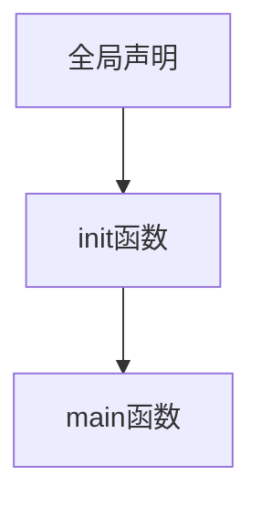
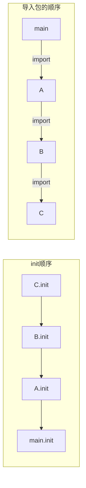

>
golang,还没开始学，等我看完php的 [it营golang视频教程 35/84](https://www.bilibili.com/video/BV1Rm421N7Jy/?spm_id_from=333.1391.0.0&p=38&vd_source=d9d3eb78433e98d94cd75ddf5ac0382b)
# 1. 下载安装及简单示例

> [下载地址](https://go.dev/dl), 安装完成之后可以通过`go version` 查看环境是否安装成功，也可以通过
`go env`查看当前的go 环境
> 配置完环境之后可以写下列的示例代码看看是否能够运转成功

## 1. 测试代码

> 使用 GoLand 编译运行代码，查看输出结果，当然Vscode或者是 `go run main.go`也可以

```go
package main

import (
	"fmt"
)

func main() {
	fmt.Println("hello world")
	// 多个参数换行输出
	fmt.Print("A","b","C")
	// 输出格式符
	a := 10
	b := true
	fmt.Print("a = %v b = %v",a,b)
}
```

# 2. 变量定义

> 在 go语言中 定义变量有两种方式，一种是使用`var` 关键字，另一种是使用:= 操作符
>
> <font color=red>注意, 在 go语言中 定义变量必须要使用，否则会报错</font>

| 序号 | 方式        | 示例              |
|----|-----------|-----------------|
| 1  | `var` 关键字 | `var a = "aaa"` |
| 2  | := 操作符    | `a := "aaa"`    |

1. 常规变量定义

```go
func main() {
	var a = "aaa"
	var b int = 3
	c := false
	// 定义了一个变量d，值为true，但是不使用，运行就会报错
	d := true
	fmt.Println(a,b,c)
}
```

2. 同时定义多个变量

```go
func main() {
	var (
		username string
		age  int
		sex  string
	)
	username = "张三"
	age = 18
	sex = "男"
	fmt.Printf("username = %v, age = %v, sex = %v\n", username, age, sex)
	
	// 直接赋值可以不用写类型
	var (
		mail = "2496290990@qq.com"
		domain = "qq.com"
	)
	fmt.Println(mail, domain)
}
```

3. 短变量定义 `:=`操作符

> 短变量声明只能在函数内部使用，只能用来做局部变量，不能用来定义全局变量

```go
func main() {
	a := "aaa"
	fmt.Println(a)
	// 同时定义多个变量
	d, e, f := 10, 20, 30
	fmt.Printf("%v * %v - %v = %v\n", d, e, f, d*e-f)·
}
```

4. 通过 `%T` 查看变量类型

```go
func main() {
	a := 10
	fmt.Printf("%T\n", a)
}
`````

5. 匿名变量

> 匿名变量可以用下划线 `_` 来表示，表示不使用这个变量

```go
func main() {
	_, a := 10
	fmt.Println(a)
}
```

6. 方法定义及返回值

```go
/**
 * 通过第二个括号里定义返回值类型 
 * @Description: 获取用户信息
 * @return: string, int, string
 */
func getUserInfo() (string, int, string) {
	return "张三", 10, "男"
}
func main() {
    var username, age, sex  = getUserInfo()
}
```

7. 常量的定义

```go
const  PI = 3.1415926
// 同时声明多个常量，如果省略了值则表示和上边一行一样
const (
    n1 = 100
    n2
    n3
)

```

> 当常量 const 和 iota同时使用时，iota 会自动递增，

```go 
const (
    a = iota //0
    b  //1
    c  //2
    // 可以使用 `_`跳过当前的 iota 值，继续下一个 iota
    _
    d  //4
)
```

# 3. 基本数据类型

## 1. 整型

> 在go中整型分为两大类
>
> 有符号整型 `int8 int16 int32 int64`
>
> 无符号整型 `uint8 uint16 uint32 uint64 `

| 类型     | 占用字节 | 对比Java | 范围                                         | 范围                                  |
|--------|------|--------|--------------------------------------------|-------------------------------------|
| int8   | 1    | byte   | [-128,127]                                 | [-2<sup>7</sup>,2<sup>7</sup> -1]   |
| int16  | 2    | short  | [-32768,32767]                             | [-2<sup>15</sup>,2<sup>15</sup> -1] |
| int32  | 4    | int    | [-2147483648,2147483647]                   | [-2<sup>31</sup>,2<sup>31</sup> -1] |
| int64  | 8    | long   | [-9223372036854775808,9223372036854775807] | [-2<sup>63</sup>,2<sup>63</sup> -1] |
| uint8  | 1    |        | [0,255]                                    | [0,2<sup>8</sup> -1]                |
| uint16 | 2    |        | [0,65535]                                  | [0,2<sup>16</sup> -1]               |
| uint32 | 4    |        | [0,4294967295]                             | [0,2<sup>32</sup> -1]               |
| uint64 | 8    |        | [0,18446744073709551615]                   | [0,2<sup>64</sup> -1]               |

```go
// int 类型
var num = 10
fmt.Printf("num = %v, %T\n", num, num)
// int8 类型
var b int8 = 100
// 通过 unsafe.Sizeof 查看变量占用的字节数
fmt.Printf("b = %v, %T\n", b, unsafe.Sizeof(b))
// uint8(0-255)
// int8 int 16 ...
var a1 int16 = 100
var a2 int32 = 200
// int不同长度直接转换
fmt.Printf("a1 = %v, a2 = %v\n", a1, int16(a2))
```

格式化输出

| 序号 | 格式化符 | 说明        |
|----|------|-----------|
| 1  | %v   | 默认格式化输出   |
| 2  | %T   | 输出变量类型    |
| 3  | %d   | 输出整数      |
| 4  | %f   | 输出浮点数     |
| 5  | %s   | 输出字符串     |
| 6  | %c   | 输出字符      |
| 7  | %d   | 输出十进制整数   |
| 8  | %b   | 输出二进制数    |
| 9  | %o   | 输出八进制数    |
| 10 | %x   | 输出十六进制数   |
| 11 | %X   | 输出十六进制数大写 |

## 2. 浮点型

> 跟Java中的 double float应该是一样的，<font color=red>在Golang中默认的是float64</font>

| 类型      | 占用字节 | 对比Java | 范围 | 范围 |
|---------|------|--------|----|----|
| float32 | 4    | float  |    |    |
| float64 | 8    | double |    |    |

```go
func main() {
	var a float32 = 3.1415926
	fmt.Printf("val: %v --%f, type: %T, size: %v\n", a, a, a, unsafe.Sizeof(a))
    var a2 float64 = 3.1415926
	fmt.Printf("val: %v --%f, type: %T, size: %v\n", a2, a2, a2,unsafe.Sizeof(a2))
}
```

> golang中科学计数法表示浮点类型

```go
// 这一点还是比较不错的
a3 := 1e-3
fmt.Printf("val: %v --%f, type: %T, size: %v\n", a3, a3, a3,unsafe.Sizeof(a3))
// val: 0.001 --0.001000, type: float64, size: 8
```

> 解决golang中的float精度丢失问题，需要使用到第三方库，从go 1.6之后需要有两步操作
>
> ```shell
> # 初始化项目目录
> go mod init golang_demo
> # 下载对应的包
> go get github.com/shopspring/decimal
> ```
>

```go
package main

import (
	"fmt"
	"github.com/shopspring/decimal"
)

func main() {
	m1 := 8.2
	m2 := 3.8
	// 原始运算：8.2 - 3.8 = 4.3999999999999995
	fmt.Printf("原始运算：%v - %v = %v\n", m1, m2, m1-m2)
	m3 := decimal.NewFromFloat(m2).Sub(decimal.NewFromFloat(m1))
	// decimal运算：-4.4
	fmt.Printf("decimal运算：%v\n", m3.String())
}
```

## 3. bool

1. 只有true和false两个值,默认是false
2. bool不能参与任何数值运算
3. bool不能直接和int等数字类型强制转换

```go
var flag bool = true
if flag {
    fmt.Print("false")
}
```

## 4. string

> 就是一个字符串没什么好说的,<font color=red>unsafe.SizeOf无法查看string类型的长度，需要用len方法</font>

| 方法     | 示例                                  | 描述                  |
|--------|-------------------------------------|---------------------|
| 字符串长度  | len(str)                            | 获取字符串的字节长度，中文占用三个字节 |
| 拼接字符串  | + <br/>fmt.Sprintf                  |                     |
| 分割字符串  | strings.Split(str6)                 | 返回的是一个切片，跟数组还有一些不一样 |
| 是否包含   | strings.contains                    |                     |
| 前缀判断   | strings.HasPrefix                   |                     |
| 后缀判断   | strings.HasSuffix                   |                     |
| 判断子串位置 | strings.Index()                     |                     |
|        | strings.LastIndex()                 |                     |
| join操作 | strings.Join([]string , sep string) | 把切片变成数组             |

```go
package main

import (
	"fmt"
	"strings"
)

func main() {
	str1 := "Hello"
	str2 := "世界"
	// 字节长度 5 6
	fmt.Printf("%s 长度 %v %s 长度 %v\n", str1, len(str1), str2, len(str2))
	// 拼接字符串
	str3 := str1 + str2
	fmt.Println(str3)
	// 通过格式化输出拼接字符串
	str4 := fmt.Sprintf("%v %v", str1, str2)
	fmt.Println(str4)
	// 反引号换行 所有的转移字符无效
	str5 := `123
			\n4567`
	fmt.Println(str5)
	// 字符串分割，string.Split 需要引入包
	str6 := "123-456-789"
	arr := strings.Split(str6, "-")
	// [123-456-789] 类型是 []string 切片是可以动态扩容的 数组是写死长度的 如果是[3]string 就是固定长度的数组
	fmt.Printf("%s 类型是 %T\n", arr, arr)
	str7 := strings.Join(arr, "::")
	fmt.Println(str7)
    // 剩下的方法自己看就行了，跟java一样的
}

```

## 5. byte和rune 字符类型

> golang中的字符有两种情况。
>
> 1. uint8类型或者是 byte类型 代表了ASCII中的一个字符
> 2. rune类型，代表一个UTF8字符，实际上是一个int32类型
>
> 在处理中文，日文或者其他服了字符的时候需要用到rune类型，

```go
func main() {
	a := 'a'
	b := 'b'
	// 97 int32
	fmt.Printf("val: %v, type: %T\n", a, a)
	fmt.Printf("val: %v, type: %T\n", b, b)
	var char rune = '中'
	fmt.Printf("val: %v, type: %T\n", char, char)
	str := "this"
	fmt.Printf("值:%v 原样输出%c 类型:%T", str[2], str[2], str[2])
	s := "hello 世界！golang不好玩"
	for _, v := range s {
		fmt.Printf("%v(%c)\n", v, v)
	}
}
```

> 修改字符串需要先把字符串转换成切片在更改，全是英文可以用`[]byte`,有特殊字符可以用`[]rune`直接用后边的更通用一些。

```go
arr := []rune(s)
for i := 0; i < len(arr); i++ {
    arr[i] = arr[i] - 0x0A
}
fmt.Println(string(arr))
```

## 6. 基本数据类型转换

> 数字类型之间的转换，低位转换成高位，否则可能会溢出

```go
func main() {
	var a int8 = 20
	var b int16 = 40
	print(int16(a) + b)
}
```

> 其他类型转换成string类型有两种方式

1. 使用fmt.Sprintf转换

```go
i := 20
f := 3.141592653589793
// 1. 使用 fmt.Sprintf 转换为字符串
str := fmt.Sprintf("%d", i)
fmt.Printf("val: %v, type: %T\n", str, str)
```

2. 通过 strconv进行转换

> 有`FomatInt`、`FormatFloat`、`FormatBool`等方法

```go
/**
 * param1: int64 类型的整数
 * param2: 转换之后的进制
 */
str1 := strconv.FormatInt(int64(i), 16)
fmt.Printf("val: %v, type: %T\n", str1, str1)
```

```go
/**
* param1: float64 类型的浮点数
* param2: 格式化类型
* 'f' (-ddd.ddd)
* 'b' (-dddp±dd) 指数为2进制
* 'e' (-ddde±dd) 指数为10进制
* 'E' (-dddE±ddd) 指数为10进制
* 'g'(指数很大时用'e'否则'f')
* 'G'(指数很大时用'E'否则'F')
* param3: 小数位数
* param4: 转换之后的进制
*/
str2 := strconv.FormatFloat(f, 'f', 2, 64)
```

3. 字符类型转其他类型

> `strconv.ParseInt `、`strconv.ParseFloat`等方法

```go
// 第二个是error不需要的话可以用匿名变量
numI, _ := strconv.ParseInt(str1, 10, 64)
fmt.Printf("val: %v, type: %T\n", numI, numI)
```

# 4. 运算符

## 1. 算数运算符

> <font color=red>在go中++和--这种自增自减的属于独立的语句，并不是运算符，而且++ --只能用在后边，不能放在变量前边</font>

```go
i := 0
// 这两种都是会错误的
a = i++
a = i--
// 这两种会直接提示找不到符号
++a
--a
// 这种是可以的
i++
// 1
print(i)
```

| 运算符 | 描述    |
|-----|-------|
| +   | 加     |
| -   | 减     |
| *   | 乘     |
| /   | 除 取整数 |
| %   | 取余    |

## 2. 关系运算符

| 符号 | 描述   |
|----|------|
| == | 等于   |
| != | 不等于  |
| >  | 大于   |
| >= | 大于等于 |
| <  | 小于   |
| <= | 小于等于 |

## 3. 逻辑运算符

| 符号   | 描述 |
|------|----|
| &&   | 与  |
| \|\| | 或  |
| !    | 非  |

## 4. 位运算符

| 符号  | 描述   |
|-----|------|
| &   | 按位与  |
| \|  | 按位或  |
| ^   | 按位异或 |
| ~   | 按位取反 |
| \>> | 按位右移 |
| <<  | 按位左移 |

## 5. 赋值运算符

| 符号  | 描述      |
|-----|---------|
| =   | 直接赋值    |
| +=  | 相加后赋值   |
| -=  | 相减后赋值   |
| *=  | 相乘后赋值   |
| /=  | 相除后赋值   |
| %=  | 取余后赋值   |
| ^=  | 按位异或后赋值 |
| \|= | 按位或后赋值  |
| &=  | 按位与后赋值  |
| <<= | 按位左移后赋值 |
| >>= | 按位右移后赋值 |
| ~=  | 按位取反后赋值 |

# 5. 流程控制

## 1. if else

> 这玩意都是一样的没啥好说的，就是表达式带不带括号都可以

```go
age := 18
if age < 14 {
    
} else if age >=14 && age <= 18 {
    
} else {
    
}
```

## 2. for

> 普通for循环

```go
for i := 1; i<= 10; i++ {
    
}
```

> for range循环遍历数组，切片，字符串，map channel等

```go
str3 := "Hello 青岛"
for index, val := range str3 {
    fmt.Printf("index: %d, val: %c, type: %T\n", index, val, val)
}
```

> 在for循环中可以用break跳出循环体，用continue跳过当前循环，没有while和do...while

## 3. switch case

```go
extra := ".html"
switch extra {
    case ".html":
    	fmt.Println("html")
    case ".css":
    	fmt.Println("css")
    default:
    	fmt.Println("default")
}
```

# 6. Array和切片

> 数组定义之后长度是不可变的，切片的长度是可变的。

## 1. Array

```go
// 第一种初始化方法
var a [3]int
a[0] = 1
a[1] = 2
a[3] = 3
// 第二种初始化方法
var v  = [2]int{0,1}
// 第三种，根据初始化的个数推断数组长度
var arr3 = [...]int{1,2,3,4,5,6,7}
// 第四种，通过下标创建好值
arr := [...]int{0:1, 1:10, 2: 20, 5:50}
```

> 多维数组的时候只有最外层可以自动推导长度

```go
arr1 := [1][2]string {
    {"北京", "上海"}
}
arr2 := [...][2]string {
    {"北京", "上海"},
    {"广州", "深圳"},
    {"....", "...."}
}
```

## 2. slice

> 切片相当于是Java中的List，但是实现逻辑有些微的不同。当做list用就行了，<font color=red>切片声明之后，默认值是nil</font>
>
> **<font color=red>切片的扩容策略，如果就切片的长度小于1024新的就是旧的2倍，如果超过1024则是增加原来的1/4</font>**

```go
// 定义切片
var arr2 []string
fmt.Printf("arr2: %v\n %T\n", arr2, arr2)
fmt.Printf(arr2 == nil) //true
// 使用 append方法往切片中添加值
var arr2 []string
str := "Hello"
str2 := "World"
arr2 = append(arr2, str, str2)
```

> 基于数组定义切片，这里的`a[:]`值得注意一下，它其实`:`前后是有两个`index`可以选择的，范围是`[formIndex, toIndex)`

```go
a := [3]int{0,1,2,3,4,5,6}
// a[:] 表示获取数组里的所有值
b := a[:]
// 从下标1-3
c := a[1:4]
// 从下标2到所有的
d := a[2:]
// 下标3之前的
f := a[:3]
```
> 使用make来定义一个切片，`make([]T,初始化长度，容量)`

```go
// 创建一个字符串数组，长度为3，容量为5
arr1 := make([]string, 3, 5)
arr1[0] = "hello"
arr1[1] = "world"
arr1[2] = "!"

println(arr1[0])
// 长度3 容量5
fmt.Printf("len: %v cap: %v", len(arr1), cap(arr1))
str := "Hello"
str2 := "World"
arr1 = append(arr1, str, str2)
arr2 := []string{"nodeJs", "java"}
// 还可以用append合并两个切片
arr1 = append(arr1, arr2...)
```

> 复制切片的值

```go
sliceA := []int{1, 2, 3, 4}
sliceB := make([]int, 4)
copy(sliceB, sliceA)
```

> 从切片中删除元素,<font color=red>由于go中没有原生的删除切片元素的方法，可以用切片本省的特性来删除元素</font>

```go
sliceC := []int{0, 1, 2, 3, 4, 5, 6, 7, 8, 9}
// 删除下标为2 的元素  就是用数组分割加上apeend方法
sliceC = append(sliceC[:2], sliceC[3:]...)
// 使用slices类库 删除下标为2-3的元素 左闭右开
slices.Delete(sliceC, 2, 3)
```

## 3. 排序

> 除了常规的冒泡排序等，也有工具类可以使用

```go
func main() {
	// 生成 int float64 string 类型的随机数每个数组15个元素
	intList := []int{1, 2, 3, 4, 5, 6, 7, 8, 9, 10, 1, 0, 12, 3, 45}
	float64List := []float64{1.0, 2.0, 3.0, 4.0, 5.0, 6.0, 7.0, 8.0, 9.0, 10.0, 1.0, 0.0, 12.0, 3.0, 45.0}
	strList := []string{"a", "A", "c", "m", "C", "t", "y"}
	sort.Ints(intList)
	sort.Float64s(float64List)
	sort.Strings(strList)
	// 打印排序后的数组
	fmt.Printf("%v\n", intList)
	fmt.Printf("%v\n", float64List)
	fmt.Printf("%v\n", strList)
    // 倒序 其他的也是类似
    sort.Sort(sort.Reverse(sort.IntSlice(intList)))
	sort.Sort(sort.Reverse(sort.Float64Slice(float64List)))
	sort.Sort(sort.Reverse(sort.StringSlice(strList)))
}
```

# 7. map

1. 通过`var mapName = make(map[keyType]valType)`定义map

```go
var userinfo = make(map[string]string)
userinfo["name"] = "张三"
userinfo["age"] = "18"
fmt.Printf("%v\n", userinfo)
```

2. 声明map的时候填充元素

```go
// 声明的时候填充元素
var userinfo2 = map[string]any{
    "username": "张三",
    "age":      18,
    "sex":      "male",
    "email":    "zhangsan@example.com",
    "phone":    "13800000000",
}
// 简化写法 
user := map[string]any{}
fmt.Printf("%v\n", userinfo2)
```

3. 修改map的元素数据直接按照key赋值就完事了

```go
userinfo2["age"] = 28
```

4. 根据key获取value

> 如果有这个key的话，ok的值就是true 第一个变量就是value的值，不包含这个key返回nil

```go

age, ok := userinfo2["age"]
fmt.Printf("age: %v, hasKey: %v\n", age, ok)
```

5. 删除map里边的key

```go
delete(userinfo2, "age")
fmt.Printf("%v\n", userinfo2)
```

6. 循环遍历map

```go
for k, v := range userinfo2 {
    fmt.Printf("key: %v, value: %v\n", k, v)
}
```

7. 统计单词出现的次数

> 这个相较于java还是简单了一点的

```go
str := "how do you do it"
strSlice := strings.Split(str, "")
letterMap := make(map[string]int)
for _, v := range strSlice {
    letterMap[v]++
}
fmt.Printf("%v\n", letterMap)
```

# 8. 函数

## 1. 定义函数

```go
func name(param type)(resultType) {
    // method implements
}
// 如果两个参数的类型一样，可以简写
func addNum(a, b int) int {
	return a + b
}
```

## 2. 可变参数

> 也是通过`...`表示，只不是加在了类型前边

```go
func numsSum(nums ...int) int {
	sum := 0
	for _, v := range nums {
		sum += v
	}
	return sum
}
```

## 3. 同时返回多个类型

```go
func calc(x,y int)(int,int,int,int) {
    sum := x + y
    sub := x - y 
    multi := x * y
    div := x / y
    return sum, sub, multi, div
}
```

## 4. 函数类型

> 可以通过type关键字定义一个函数类型，具体格式如下。这个语句定义了一个`calculation`类型,它是一种函数类型，接收两个int参数，返回一个int类型，<font color=red>有点类似于java的FunctionalInterface或者是接口</font>
>
> ```go
> type calculation func (int, int) int
> ```

```go
// 定义一个calc类型函数
type calc func(int, int) int

func add(a, b int) int {
	return a + b
}

func sub(a, b int) int {
	return a - b
}


func main() {
	var c calc = add
	fmt.Printf("c的类型是: %T\n", c)
}
```

> 可以用来做回调函数，这样比较方便

```go
/**
 * 计算两个数的结果
 * @param a 第一个数
 * @param b 第二个数
 * @param cb 计算函数
 */
func calcR(a, b int, cb calc) int {
	return cb(a, b)
}
func main() {
    sum := calcR(1 , 2, add)
	sub := calcR(1 , 2, sub)
	fmt.Println(sum)
	fmt.Println(sub)
}
```

> 当然也可以写一个匿名函数

```go
mul := calcR(3, 4, func(x, y int) int {
    return x * y
})
fmt.Println(mul)
```

## 5. 函数作为返回值

```go
func do(str string) calc {
	switch str {
		case "+":
			return add
		case "-":
			return sub
		case "*":
			return func(x, y int) int {
				return x * y
			}
		case "/":
			return func(x, y int) int {
				return x / y
			}
		case "%":
			return func(x, y int) int {
				return x % y
			}
		default:
			return nil
	}
}
```

## 6. 匿名函数

```go
// 匿名自执行函数 通过后边的括号传值
fun (x,y int) {
    return x +y
}(10,20)

// 递归
func factorial(n int) int {
	if n <= 1 {
		return 1 // 递归终止条件
	}
	return n * factorial(n-1) // 核心公式：n! = n * (n-1)!
}
```

## 7. 闭包

> 全局变量：常驻内存，污染全局
>
> 局部变量，不常驻内存，不污染全局，但是其他方法访问不到
>
> 闭包：常驻内存，其他函数能访问到还不会被污染
>
> 1、闭包是指有权访问另一个函数作用域中的变量的函数。
> 2、创建闭包的常见的方式就是在一个函数内部创建另一个函数，通过另一个函数访问这个函数的局部变量
>
> **注意：由于闭包里作用域返回的局部变量资源不会被立刻销毁回收，所以可能会占用更多的内存。过度使用闭包会导致性能下降，建议在非常有必要的时候才使用闭包。**

```go
// 闭包的写法就是函数里嵌套另外一个函数 这个不管怎么调用都是返回11
func adder1() func() int {
    var i = 10
    return func () int {
        retutn i + 1
    }
}
func adder2() func(y int) int {
    var i = 10
    return func () int {
        i += y
        retutn i
    }
}

func main() {
    var fn = adder1()
    fmt.Println(fn()) //11
    fmt.Println(fn()) //11
    fmt.Println(fn()) //11
    var fn2 = adder2()
    fmt.Println(fn2(1)) //11
    fmt.Println(fn2(2)) //13
    fmt.Println(fn2(3)) //16  
}
```

## 8. defer

> Go语言中的defer语句会将其后面跟随的语句进行延迟处理。在defer归属的函数即将返回时，将延迟处理的语句按defer定义的逆序进行执行，也就是说，先被defer的语句最后被执行，最后被defer的语句，最先被执行。感觉用的不多，先不写了

## 9. panic和recover

> 使用panic抛出一个异常，recover来捕获异常，类似于try catch，recover只能放在defer中使用

```go
func fn1(x, y float64) float64 {
	defer func() {
		err := recover()
		if err != nil {
			fmt.Println(err)
		}
	}()
	if y == 0 {
		panic("分母不能为0")
	}
	return x / y
}
```

# 9. 日期类型

## 1. time包

```go
timeObj := time.Now()
fmt.Println(timeObj)
fmt.Println(timeObj.Year())
fmt.Println(timeObj.Month())
fmt.Println(timeObj.Day())
fmt.Println(timeObj.Hour())
fmt.Println(timeObj.Minute())
fmt.Println(timeObj.Second())
fmt.Println(timeObj.Weekday())
fmt.Println(timeObj.UnixMilli())
```

> 格式化输出日期,<font color=red>这太特立独行了bro 为啥不用`yyyy-MM-dd HH:mm:ss`</font>,`2006-01-02 03:04:05`这个日期就是go诞生的日子，

| 格式化字符串 | 含义     |
| ------------ | -------- |
| 2006         | 年       |
| 01           | 月       |
| 02           | 日       |
| 03           | 12小时制 |
| 15           | 24小时制 |
| 05           | 分       |
| 06           | 秒       |
| .000         | 毫秒     |

```go
timeObj.Format("2006-01-02 03:04:05")
```

> 日期字符串转换成时间戳

```go
timeStr := "2026-12-31 21.59.09.789"
formatter := "2006-01-02 15.04.05.000"
parseTime, _ := time.ParseInLocation(formatter, timeStr, time.Local)
fmt.Printf("%v", parseTime.Unix())
```

## 2. 时间操作函数

1. Add，制定时间添加时间

```go
// func (t Time) Add(d Duration) Time
// 求一个小时后的时间
timeObj := time.Now()
timeObj = timeObj.Add(time.Hour)
```

2. Sub之类的，用的时候现查就行了

## 3. 定时器

1. 通过time.NewTicker创建定时器

```go
ticker := time.NewTicker(2 * time.Second)
n := 0
for i := range ticker.C {
    fmt.Println(i)
    n++
    if n > 10 {
        ticker.Stop()
        return
    }
}
```

2. 通过time.Sleep来实践定时器

```go
for {
    time.Sleep(time.Second)
    fmt.Prinfln("每隔一秒执行一次任务")
}
```

# 10. 指针

> 通过`%p`输出指针地址，`&name`获取指针地址，每一个变量都有自己的内存地址。

```go
a := 10
fmt.Printf("a的值 %v, 类型 %T 指针地址 %p", a, a, &a)
p := &a 
// *p获取内存地址的值
fmt.Println("内存地址 %p, 值 %v", p, *p)
```

> 通过new或者make来创建一个指针变量。
>
> 1. <font color=red>两者都是用来做内存分配的</font>
> 2. <font color=red>make只能用于slice,map,以及channel的初始化，返回的还是这个三个引用类型本身</font>
> 3. new用于类型的内存分配，并且内存对应的值为类型默认值，返回的是执行类型的指针

```go
// 分配空间
var b = new(int)
// 给b赋值
*b = 100
fmt.Printf("val:%v,type: %T pointerVal: %v\n", b, b, *b)

```

# 11. 结构体

## 1. 定义结构体

> Golang中没有**类**的概念，Golang中的结构体和其他语言中的类有点相似。和其他面向对象语言中的类相比，<font color=red>Golang中的结构体具有更高的扩展性和灵活性。</font>
>
> Golang中的基础数据类型可以表示一些事物的基本属性，但是当我们想表达一个事物的全部或部分属性时，这时候再用单一的基本数据类型就无法满足需求了，Golang提供了一种自定义数据类型，可以封装多个基本数据类型，这种数据类型叫结构体，英文名称struct。也就是我们可以通过struct来定义自己的类型了。

```go
// 首字母大写表示是公有的，小写是私有的
type User struct {
	Name string
	Age  int
	Sex  string
	Mail string
	Address string
	Phone string
	Password string
}
```

> 关于初始化呢一共有四种方式

1. `var name Type`

```go
var user User
user.Mail = "10001@qq.com"
```

2. 通过new创建

```go
user := new(User)
user.Name = "张三"
```

3. 通过指针创建，三种方式都是可以的

```go
user := &User{}
user.Sex = "男"

user2 := &User{
    Name: "王麻子",
    Age: 19
}

user3 := &User{
    "王麻子",
    18,
    "男",
    "10010@qq.com"
}
```

4. 通过键值对创建

```go
// 通过键值对初始化需要加逗号
user := User{
    Name: "李四",
}
```

## 2. 定义结构体方法

> 与java不同，这个是写在外边的，有点像是kotlin的DSL
>
> ```go
> // 结构类似于这样
> func (t Type)funcName() returnType{}
> ```
>
> **只要修改结构体（Set）：必须用指针 \*p**
>
> **只读（Get）：用值或指针都行 **
>
> **同一个结构体，统一用一种就很规范**

```go
type Person struct {
	Name string
	Age  int
	Sex  string
}

func (p Person) ToString() string {
	return "Name: " + p.Name + ", Age: " + strconv.Itoa(p.Age) + ", Sex: " + p.Sex
}

/**
 * 需要需要类型的值的时候需要用 指针类型接收
 * 设置姓名和年龄
 * @param name 姓名
 * @param age 年龄
 */
func (p *Person) SetName(name string, age int) {
	p.Name = name
	p.Age = age
}


func main() {
	p := Person{
		Name: "张三",
		Age:  18,
		Sex:  "男",
	}
	println(p.ToString())
}
```

> 下边是kotlin的DSL写法，两者的都是保证结构体不臃肿，可以给任意的类添加方法。

```kotlin
data class Person(
	val name: String,
    val age: Int,
    val sex: String
)

func Person.ToString(): String{
    return "Name:$name,Age:$age,Sex:$sex"
}
```

## 3. 匿名字段

> 结构体允许成员字段在声明的时候没有字段名只有类型，这种就是匿名字段

```go
// 每一个类型只能有一个
type UserInfo struct {
	string
	int
}
u := UserInfo{
    "张三",
    20,
}
println(u.string, u.int)
```

> 如果是嵌套结构体，切内层结构体是一个匿名字段，就会有字段提升

```go
type Person struct{
    Address
}
Type Address struct {
    Addr string
}
p := Person{}
p.Addr = "青岛市"
```

## 4. 通过匿名结构体实现组合

> 在一个结构体中添加另外一个匿名结构体，可以借用匿名结构体的方法，也称之为组合，在Go中没有继承和多态

```go
type Animal struct {
}

type Cat struct {
	Name string
	Animal
}

func (c Cat) Say() {
	println("我是" + c.Name)
}

func (a Animal) Eat(food string) {
	println("我正在吃" + food)
}

func main() {
	c := Cat{
		Name: "七月一",
	}
	c.Say()
	c.Eat("鱼")
}

```

# 12. Json序列化，反序列化

> 通过json包类实现序列化和反序列化

## 1. 序列化

```go
type Student struct {
	Name  string
	Age   int
	Sex   string
	Class string
}

func main() {
	s1 := Student{
		"李四",
		16,
		"男",
		"理科33班",
	}
	// 打印结构体的字段值
	fmt.Printf("%#v\n", s1)
	// 将结构体转换为JSON字符串
	// 这里返回的是一个byte类型的切片，需要用string函数转换为字符串
	jsonStr, _ := json.Marshal(s1)
	fmt.Printf("%s\n", string(jsonStr))
}
```

## 2. 反序列化

```go
str := `{"Name":"李四","Age":16,"Sex":"男","Class":"理科33班"}`
var s2 Student
err := json.Unmarshal([]byte(str), &s2)
if err != nil {
    return
}
```

## 3. 结构体标签

> 可以指定序列化反序列化的字段名字，

```go
type Student struct {
    Name  string `json:"name"`
	Age   int
	Sex   string
	Class string
}
// 这个序列化之后Name就会变成name
```

# 13. go mod

## 1. 包的定义

> 包(`package`)是多个Go源码的集合，是一种高级的代码复用方案，Go语言为我们提供了很多内置包，如 `fmt、strconv、strings、sort、errors、time、encoding/json、os、io `等。
> **Golang中的包可以分为三种:1、系统内置包 2、自定义包3、第三方包**
> **系统内置包:**Golang语言给我们提供的内置包，引入后可以直接使用，如fmt、strconv、strings、sort、errors、time、 encoding/json、 os、io 等。
> **自定义包:**开发者自己写的包
> **第三方包:**属于自定义包的一种，需要下载安装到本地后才可以使用，如前面使用的的`github.com/shopspring/decimal`包解决float 精度丢失问题。

## 2. 包管理工具 go mod

> 在Golang1.11版本之前如果我们要自定义包的话必须把项目放在GOPATH目录。Go1.11版本之后无需手动配置环境变量，使用`go mod` 管理项目，也不需要非得把项目放到GOPATH指定目录下，你可以在你磁盘的任何位置新建一个项目，Go1.13以后可以彻底不要GOPATH了。

### 1. 初始化项目

> 实际项目开发中我们首先要在我们项目目录中用gomod命令生成一个go.mod文件管理我们项目的依赖。

```shell
go mod init go_project_demo
```

```text
myProject
│  .gitignore
│  go.mod
│  main.go
│      
└─calc
        calc.go
```

### 2. 导入包

#### 1. 正常导包

```go
package main

// 引入自己的包
import "go_project_demo/calc"

func main() {
	sum := calc.Add(1, 2)
	sub := calc.Sub(1, 2)
	println(sum)
	println(sub)
}
```

#### 2. 包别名

>  如果觉得包名太长了，可以自定义别名

```go
import (
	cc "demo/calc"
)
func main() {
    cc.Add(1,2)
}
```

#### 3. 匿名导包

> 如果导入包之后不使用，可以用`_`设置别名

```go
import _ "demo/calc"
```

### 3. init()函数

> Go语言程序执行时导入包语句会自动触发包内部`init()`函数的调用。需要注意的是`init()`函数没有参数也没有返回值。`init()`函数在程序运行时自动被调用执行，不能在代码中主动调用它。
> 包初始化执行的顺序如下图所示:

```go
package main
import "fmt"
var x int8 = 10
const pi = 3.14
func init() {
    fmt.Println(x)
}
func main() {
    fmt.Println("Hello")
}
```




> 如果有多个引入的话，初始化是反着来的



##  3. 使用第三方包

> 可以在[http://pkg.go.dev/](http://pkg.go.dev)中查看常见的golang的第三方包

1. 初始化项目

```shell
go mod init otherDdemo
```

2. 引入其他项目第三方库

```shell
import "github.com/shopspring/decimal"
import "github.com/tidwall/gjson"
```

3. 下载依赖包

```shell
go mod tidy
```

# 14. 接口

## 1. 定义接口

> 接口就是一种行为的抽象，用来定义行为规范，只进行定义不实现，由具体的对象来实现。

```go
type UsbInterface interface {
	Connect(string, string) (net.Conn, error)
	Close() error
	Transform(data []byte) ([]byte, error)
}
```

```go
type UsbMouse struct {
	Name string
	Mac  string
}

func (usb *UsbMouse) Connect(mac string, ip string) (net.Conn, error) {
	fmt.Printf("Connecting to %s at %s:%s\n", usb.Name, ip, usb.Mac)
	return net.Dial("udp", ip+":"+usb.Mac)
}
func (usb *UsbMouse) Close() error {
	fmt.Printf("Closing connection to %s\n", usb.Name)
	return nil
}
func (usb *UsbMouse) Transform(data []byte) ([]byte, error) {
	fmt.Printf("%sTransforming data to %s\n", usb.Name, data)
	return data, nil
}
```

## 2. 空接口

> 在go中空接口可以不定义任何方法，<font color=blue>这样也就没有任何约束，因此任何类型的变量都可以实现空接口，空接口也可以用来表示任意类型</font>，类似于java中的Object 和Ts中的Any类型

```go
var map = make(map[string]interface{})
map["username"]="张三"
map["age"]=18
// 从golang1.18之后可以用any代替空接口
vap map2 = make(map[string]any)
```

## 3. 类型断言 

> 一个接口的值(简称接口值)是由一个具体类型和具体类型的值两部分组成的。这两部分分别称为接口的动态类型和动态值。
> 如果我们想要判断空接口中值的类型，那么这个时候就可以使用类型断言，其语法格式:
>
> <font color=red>类似于instanceof</font>

```go
// x表示类型为interface{}或any的变量 
// T表示断言x可能得类型 也就是泛型
x.(T)

var a any
a = "123"
val, ok = a.(string)
if ok {
    println("a是string类型，值是 %s",a)
} else {
    println("断言失败")
}
```

```java
// Java 16以后得instanceof 就和这个类型断言很类似了
Object obj = "Hello";
if (obj instanceof String str) {
    System.out.println("str的值是 " + str)
}
```

