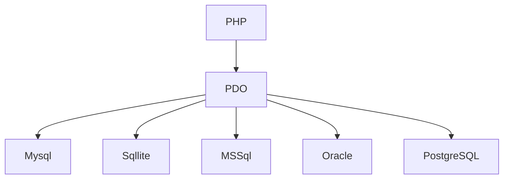

::: tip
闲来无事，学一学金角大王的PHP8
[PHP笔记目录](/language/php/)
:::

# 1. 基础概念

> php + html的情况下，php代码需要写在`<?php ?>`代码块里

## 1. 输出内容

> `echo`开发时使用，`var_dump`测试时使用

```php
echo '123456';
print true;
```

## 2. 声明变量

> 和java差不多，开头不能用数字之类的。

```php
$str = '测试php变量';
echo $str;
```

## 3. 标量数据类型

| 类型    | 描述                  |
| ------- | --------------------- |
| Boolean | true false 没啥好说的 |
| Integer | 整数                  |
| Float   | 浮点数 小数           |
| String  | 字符串                |

```php
$x = true;
echo $x;
var_dump($x);
```

## 4. 复合数据类型

| 类型     | 描述   |
| -------- | ------ |
| array    | 数组   |
| object   | 对象   |
| callable | 可调用 |
| iterable | 迭代器 |

1. array

```php
$arr = array();
$arr2 = [123, 456];
$arr3 = array(123, 456)    
```

```php
// 这种类似别名的用法，是没有下标的，只能用别名获取。
$arr4 = array(
	"test" => 0,
    1,
    2
);
echo $arr4["test"];
echo $arr4[0];
echo $arr4[1];
// 打印数组所有数据
print_r($arr4);
```

```php
// 连接符 . 类似java里边的 + 吧，可以吧字符串连起来
echo "test" . $arr4["test"] . "aaa";
```

循环数组

```php
 $arr4 = array(
    "zhangsan",
	"test" => "lisi",
    "wangwu",
    2
);
foreach($arr4 as $v) {
    echo $v;
    echo '<hr />';
}
foreach($arr4 as $k => $v) {
    echo $k. "==>" . $v;
    echo '<hr />';
}
```


### 5. 特殊数据类型

| 类型     | 描述 |
| -------- | ---- |
| NULL     | 空值 |
| resource | 资源 |


# 2. 基本语法

## 1. 条件判断

### 1. 三元运算符

> 和java一样用法

```php
$flag = true;
echo $flag ? 'true' : 'false';
```

### 2. if

> `if`, `elseif`, `else`

```php
$ouYang = '';
$mieJue = '';
$xiMen = '西内大官人';
if ($ouYang) {
    echo '我是欧阳克';
} elseif ($mieJue) {
    echo '我是灭绝师太';
} elseif ($xiMen) {
    echo '我是西门大官人';
} else {
    echo "不知道自己是谁";
}
```

### 3.  switch case

```php
$str = '';
switch ($str) {
    case '欧阳克':
        echo '我是欧阳克';
        break;
    case '灭绝师太':
        echo '我是灭绝师太';
        break;
    default:
        echo '不知道我是谁';
        break;
}
```

### 4. match

> 和switch相似，但是有以下几点区别
>
> 1. Match是一个表达式，结果可以用变量接收或者返回
> 2. Match分支仅支持单行表达式，不需要中断
> 3. 匹配时进行严格比较

```php
echo match($str) {
    "欧阳克" => "欧阳克",
    "灭绝石台" => "灭绝师太",
    default => "不知道我是谁"
};
```

## 2. 函数

### 1. String相关

| 描述       | php函数           | java方法          |
| ---------- | ----------------- | ----------------- |
| 转化成小写 | strtolower(str)   | str.toLowerCase() |
| 转换成大写 | strtoupper(str)   | str.toUpperCase() |
| 分割       | explode(‘,’, str) | str.split(‘,’)    |

```php
$str1 = 'ABC';
echo strtolower($str1);
$str2 = 'abc';
echo strtoupper($str2);
$str3 = 'ABC,abc';
print_r(explode(',', $str3));
```

### 2. 数组相关

| 描述                   | php函数                |
| ---------------------- | ---------------------- |
| 数量                   | count($arr)            |
| 合并为字符串           | implode(‘,’, $arr)     |
| 是否存在元素           | in_array(‘test’, $arr) |
| 获取并删除最后一个元素 | array_pop($arr)        |

### 3. 自定义函数

> 在函数内使用全局变量需要加上 `global`关键字

```java
$num3 = 100;
function addNums($num1, $num2): int {
    global $num3;
    return $num1 + $num2 + $num3;
}

echo addNums(500, 100);
```

### 4. 可选参数

```php
function addNums($a, $b=0, $c=0,$d=0) :void {
    echo $a;
    echo '<hr />';
    echo $b;
    echo '<hr />';
    echo $c;
    echo '<hr />';
    echo $d;
    echo '<hr />';
}

addNums(1,2,3,4);
// PHP8 可选参数， 可以指定参数的顺序
addNums(1,2,d: 3,c: 4);
```

## 3. 循环

### 1. while

```php
$a = 0;
while ($a <= 10) {
    $a++;
    echo $a;
    echo "<hr />";
}
```

### 2. do while

```php
$a = 0;
do {
    $a++;
    echo $a;
    echo "<hr />";
} while ($a <= 10);

```

### 3. for

```php
$a = 0;
for($i = 0; $i < 10; $i++){
    $a += $i;
    echo $a;
    echo "<hr>";
}
```

## 4. JIT编译器

> JIT(Just-ln-Time)即时编译器是 PHP 8.0 中最重要的新功能之一，可以极大地提高性能。
>
> JIT 编译器将作为扩展集成到 php中 opcache 扩展 用于运行时将某些操作码直接转换为从 cpu 指令。 仅在启用opcache 的情况下，JIT 才有效

### 1. Opcache扩展

> 0pcache 通过将 PHP脚本预编译的字节码存储到共享内存中来提升 PHP的性能， 存储预编译字节码的好处就是: 省去了每次加载和解析 PHP 脚本的开销。

### 2. Opcache开启

```ini
# zai php\php-8.2.9-nts\php.ini中修改
zend_extension=opchache
```

### 3. Opcache配置

```ini
;Determines if Zend OPCache is enabled
opcache.enable=1
; Determines if Zend OpCache is enabled for the CLI version of PHP
opcache.enable_cli=0
;The OPcache shared memory storage size.
opcache.memory_consumption=128
;The amount of memory for interned strings in Mbytes.
opcache.interned_strings_buffer=8
;The maximum number of keys(scripts)in the OPcache hash table.
;Only numbers between 200 and 1000000 are allowed.
opcache.max_accelerated_files=10000
```

### 4. JIT配置

```ini
opcache.jit=tracing
opcache.jit_buffer_size=100M
```

### 5. 测试代码

```php
var_dump(opcache_get_status()['jit']);
echo '<hr>';
$start = microtime(true);

$total = 0;
for ($i = 0; $i < 10000000; $i++) {
    $total += $i;
}
$end = microtime(true);
$time = floor(($end - $start) * 1000);
echo "Count". $i . " Total: $total" . " TimeUse ". $time ." ms";
```

# 3. 操作mysql

> PHP 数据对象(PDO)扩展为PHP访问数据库定义了一个轻量级的一致接口PDO 提供了一个数据访问抽象层，这意味着，不管使用哪种数据库，都可以用相同的函数(方法)来查询和获取数据



```php
$pdo = new PDO('mysql:host=localhost;dbname=phpstud', 'root', 'dream');
//var_dump($pdo);
//echo '<hr>';
$stmt = $pdo->prepare('SELECT * FROM tb_article');
$stmt->execute();
$arr = $stmt->fetchAll(PDO::FETCH_ASSOC);
var_dump($arr);
```

# 4. 超全局变量

> 超级全局变量在PHP 4.1.0之后被启用,是PHP系统中自带的变量，在一个脚本的全部作用域中都可用

| 变量      | 描述                                                   |
| --------- | ------------------------------------------------------ |
| $_GET     | 收集get表单的值                                        |
| $_POST    | 收集post表单的值                                       |
| $_REQUEST | 包含 `$_GET`,`$_POST`,`$_COOKIE`                       |
| $_COOKIE  | 用户cookie                                             |
| $_SESSION | 用户会话                                               |
| $_FILES   | formdata文件                                           |
| $_SERVER  | 服务器执行环境信息                                     |
| $_ENV     | 环境变量                                               |
| $GLOBAL   | get post  cookie files都输出<br>自己设置的变量也会输出 |

## 1. $_GET

```php+HTML
<?php
    var_dump($_GET["name"]);
?>
<html>
<head>
    <meta charset="utf-8">
    <title> PHP中文网</title></head>
<body>
<form action="" method="post">
    讲师:<input type="text" name="name">
    学校:<input type="text" name="school">
    <input type="submit" value="提交">
</form>
</body>
</html>
```

## 2. $_POST

```php+HTML
<?php
    var_dump($_POST);
?>
<html>
<head>
    <meta charset="utf-8">
    <title> PHP中文网</title></head>
<body>
<form action="" method="post">
    讲师:<input type="text" name="name">
    学校:<input type="text" name="school">
    <input type="submit" value="提交">
</form>
</body>
</html>
```

# 5. 类和对象

## 1. 类

```php
class Teacher{
    public $name;
    public $age;
    function __construct($name, $age){
        $this->name = $name;
        $this->age = $age;
    }
    function testFun(){
        return "testFun";
    }
}
$ouYang = new Teacher("Yang", 18);
echo $ouYang->testFun();
```

## 2. 继承封装多态？

## 3. 进阶

> 嗯，和java差不多吧

### 1. 静态成员

```php
class Teacher{
    public $name;
    public $age;
    
    public static $language = "PHP";

    function __construct($name, $age){
        $this->name = $name;
        $this->age = $age;
    }

    function testFun(){
        return "testFun";
    }
}

$ouYang = new Teacher("Yang", 18);
echo $ouYang->testFun();
echo $ouYang::$language;
echo Teacher::$language;
```

### 2. 抽象类

```php
abstract class Teacher{}
```

### 3. 接口

```php
interface Teacher{}
```

### 4 接口常量

```php
// 定义常量
define('Driver', "com.mysql.cj.jdbc.Driver");
interface file {
    // 也是定义常量
    const HOST = "localhost";
    const PORT = "3306";
}
```

### 5. 一些特殊的关键字

- this -> 访问本类
- parent访问父类
- self 访问本类静态属性或者方法

## 4. 命名空间

> namespace

```php
namespace one {
    function on {}
}
// 这两种方式不能混用
namespace two;
function tw{}
```

### 1. 子命名空间

```php
namespace one\two {}
```

### 2. 使用命名空间

```php
require 'xxx.php';
use one\tow as oneTwo;
```

## 5. PHP8新特性

### 1. 类提升

```php
class Teacher {
    // 直接省略类属性了属于是
    public function __construct(public int|string $name, public $age){

    }
}
var_dump(new Teacher('John', 'Doe'));
var_dump(new Teacher(1, 'Doe'));
```

### 2. 联合类型

```php
class Teacher {
    // 直接省略类属性了属于是
    public function __construct(public mixed $name, public $age){

    }
}
var_dump(new Teacher('John', 'Doe'));
var_dump(new Teacher(1, 'Doe'));
```

# 6. 常用函数

## 1. 时间日期

```php
$mytime = getdate();
echo "年 :" . $mytime['year'] . "<br>";
echo "月: " . $mytime['mon'] . "<br > ";
echo "日:" . $mytime['mday'] . "<br>";
echo "时:" . $mytime['hours'] . "<br>";
echo "分:" . $mytime['minutes'] . "<br > ";
echo "秒 :" . $mytime['seconds'] . "<br > ";
echo "一个小时中的第几钟 :" . $mytime['minutes'] . "<br > ";
echo "这是一分钟的第几秒 :" . $mytime['seconds'] . "<br>";
echo "星期名称 :" . $mytime['weekday'] . "<br > ";
echo "月份名称 :" . $mytime['month'] . "<br>";
echo "时间戳" . $mytime[0] . "<br >";
```

```php
$timeStr = date('Y-m-d H:i:s')
```

## 2. 文件操作

| 函数              | 描述                       | 示例                                             |
| ----------------- | -------------------------- | ------------------------------------------------ |
| readfile          | 读取文件                   | `readfile('2.txt')`                              |
| file_get_contents | 获取文件内容，包括远程文件 | `file_get_contents(‘http://baidu.com/logo.png’)` |
| file_put_contents | 保存文件                   | `file_put_contents(file_name, contents)`         |
| scandir           | 扫描目录                   |                                                  |
| filetype          | 文件类型                   |                                                  |

```php
// 当前文件地址
echo __FILE__;
// 文件目录
echo dirname(__FILE__);
// 扫描目录内容
$dir = scandir(dirname(__FILE__));
foreach ($dir as $key => $value) {
    echo $key . $value;
    echo "<br>";
}
```

## 3. 系统函数

```php
var_dump(exec("dir"));
echo '<br/>';
var_dump(system("ipconfig"));
```

# 7. 错误日志处理

```php
# 也可以直接改php.ini
ini_set('display_errors', 0);
```

